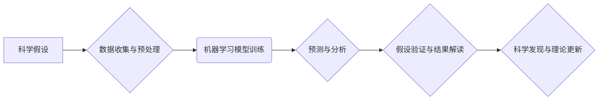

>人工智能，科学研究，假设验证，机器学习，深度学习，数据分析，科学发现

## 1. 背景介绍

科学研究的核心是探索未知，验证假设，并不断推翻和完善现有理论。传统科学研究往往依赖于人类的经验、观察和推理，这一过程耗时且容易受到主观因素的影响。随着人工智能技术的飞速发展，特别是深度学习算法的突破，AI开始在科学研究领域展现出巨大的潜力，为加速假设验证过程提供了新的工具和方法。

AI辅助科学研究的应用场景广泛，涵盖物理学、化学、生物学、医学等多个领域。例如，在药物研发领域，AI可以帮助科学家筛选潜在的药物候选物，并预测其疗效和安全性；在材料科学领域，AI可以辅助设计新型材料，并预测其性能；在天文物理学领域，AI可以帮助分析天文观测数据，发现新的天体和宇宙现象。

## 2. 核心概念与联系

**2.1 核心概念**

* **科学假设:** 科学假设是指关于自然现象或规律的推测，需要通过实验或观察进行验证。
* **假设验证:** 通过收集数据、进行分析和推理，来判断科学假设是否成立的过程。
* **人工智能 (AI):** 人工智能是指模拟人类智能行为的计算机系统，包括学习、推理、决策等能力。
* **机器学习 (ML):** 机器学习是人工智能的一个分支，旨在通过算法训练模型，使模型能够从数据中学习并做出预测。
* **深度学习 (DL):** 深度学习是机器学习的一个子领域，利用多层神经网络来模拟人类大脑的学习过程，能够处理复杂的数据模式。

**2.2 联系**

AI辅助科学研究的核心是利用机器学习和深度学习算法，从海量数据中提取有价值的信息，并帮助科学家验证科学假设。

**2.3 流程图**



## 3. 核心算法原理 & 具体操作步骤

**3.1 算法原理概述**

AI辅助科学研究常用的算法包括：

* **监督学习:** 利用标记数据训练模型，预测未知数据类别或值。
* **无监督学习:** 从未标记数据中发现模式和结构。
* **强化学习:** 通过试错学习，使模型在特定环境中获得最大奖励。

**3.2 算法步骤详解**

1. **数据收集与预处理:** 收集与研究问题相关的原始数据，并进行清洗、转换、特征提取等预处理操作，以使数据适合模型训练。
2. **模型选择与训练:** 根据研究问题和数据特点，选择合适的机器学习算法，并利用训练数据训练模型。
3. **模型评估与优化:** 使用测试数据评估模型性能，并通过调整模型参数或算法结构进行优化。
4. **预测与分析:** 将训练好的模型应用于新的数据，进行预测或分析，并根据结果进行解释和解读。
5. **假设验证与结果解读:** 将模型预测结果与科学假设进行比较，并结合其他证据进行综合分析，判断假设是否成立。

**3.3 算法优缺点**

* **优点:**

    * 自动化数据分析，提高效率。
    * 发现隐藏模式，提供新的见解。
    * 处理海量数据，扩展研究范围。

* **缺点:**

    * 依赖高质量数据，数据偏差会影响结果。
    * 模型解释性不足，难以理解决策过程。
    * 需要专业知识进行模型选择和训练。

**3.4 算法应用领域**

* **药物研发:** 预测药物活性、筛选候选药物、模拟药物作用机制。
* **材料科学:** 设计新型材料、预测材料性能、优化材料结构。
* **生物学:** 分析基因组数据、预测蛋白质结构、研究生物网络。
* **天文物理学:** 分析天文观测数据、发现新的天体、研究宇宙演化。

## 4. 数学模型和公式 & 详细讲解 & 举例说明

**4.1 数学模型构建**

在AI辅助科学研究中，常用的数学模型包括：

* **线性回归模型:** 用于预测连续变量，假设数据之间存在线性关系。
* **逻辑回归模型:** 用于预测分类变量，假设数据之间存在非线性关系。
* **支持向量机 (SVM):** 用于分类和回归，通过寻找最佳超平面将数据分开。
* **神经网络模型:** 用于处理复杂数据模式，通过多层神经元进行非线性映射。

**4.2 公式推导过程**

例如，线性回归模型的目标是找到一条直线，使得预测值与真实值之间的误差最小。

假设我们有n个样本数据，每个样本包含一个输入特征x和一个输出特征y。线性回归模型的假设函数为：

$$y = w_0 + w_1x$$

其中，$w_0$和$w_1$是模型参数，需要通过训练数据进行估计。

模型的目标是最小化预测值与真实值之间的平方误差，即：

$$J(w_0, w_1) = \frac{1}{n}\sum_{i=1}^{n}(y_i - (w_0 + w_1x_i))^2$$

通过梯度下降算法，可以迭代更新模型参数，使得误差函数最小化。

**4.3 案例分析与讲解**

例如，在药物研发领域，可以使用线性回归模型预测药物的活性。

假设我们收集了n个药物的结构信息和活性数据，其中每个药物的结构信息可以用一个向量表示，活性数据是一个连续值。

我们可以使用线性回归模型训练一个模型，将药物的结构信息作为输入，预测其活性。

通过训练好的模型，我们可以预测新的药物的活性，并筛选出具有高活性的候选药物。

## 5. 项目实践：代码实例和详细解释说明

**5.1 开发环境搭建**

* 操作系统: Ubuntu 20.04
* Python 版本: 3.8
* 必要的库: numpy, pandas, scikit-learn, matplotlib

**5.2 源代码详细实现**

```python
import numpy as np
from sklearn.linear_model import LinearRegression
from sklearn.model_selection import train_test_split
import matplotlib.pyplot as plt

# 准备数据
X = np.array([[1], [2], [3], [4], [5]])  # 输入特征
y = np.array([2, 4, 5, 4, 5])  # 输出特征

# 将数据分成训练集和测试集
X_train, X_test, y_train, y_test = train_test_split(X, y, test_size=0.2, random_state=42)

# 创建线性回归模型
model = LinearRegression()

# 训练模型
model.fit(X_train, y_train)

# 预测测试集数据
y_pred = model.predict(X_test)

# 绘制预测结果
plt.scatter(X_test, y_test, color='blue', label='真实值')
plt.plot(X_test, y_pred, color='red', label='预测值')
plt.xlabel('输入特征')
plt.ylabel('输出特征')
plt.legend()
plt.show()

# 打印模型参数
print('模型参数:', model.coef_, model.intercept_)
```

**5.3 代码解读与分析**

* 首先，我们准备了输入特征和输出特征的数据。
* 然后，我们将数据分成训练集和测试集，用于训练和评估模型。
* 创建了线性回归模型，并使用训练数据进行训练。
* 训练好的模型用于预测测试集数据，并绘制了预测结果和真实值的对比图。
* 最后，打印了模型的参数，包括斜率和截距。

**5.4 运行结果展示**

运行代码后，会生成一个图表，展示预测值和真实值的对比。

## 6. 实际应用场景

**6.1 药物研发**

AI可以帮助科学家筛选潜在的药物候选物，并预测其疗效和安全性。例如，DeepMind的AlphaFold模型可以预测蛋白质结构，这对于药物设计至关重要。

**6.2 材料科学**

AI可以辅助设计新型材料，并预测其性能。例如，IBM使用AI开发了一种新型电池材料，其能量密度比传统电池高出50%。

**6.3 生物学**

AI可以分析基因组数据，预测蛋白质结构，研究生物网络。例如，Google DeepMind的AlphaFold2模型可以预测蛋白质结构，这对于理解疾病机制和开发新药至关重要。

**6.4 未来应用展望**

AI在科学研究领域的应用前景广阔，未来将更加深入地融入各个学科，加速科学发现和技术创新。

## 7. 工具和资源推荐

**7.1 学习资源推荐**

* **在线课程:** Coursera, edX, Udacity
* **书籍:** "Deep Learning" by Ian Goodfellow, "Hands-On Machine Learning with Scikit-Learn, Keras & TensorFlow" by Aurélien Géron
* **博客:** Towards Data Science, Machine Learning Mastery

**7.2 开发工具推荐**

* **Python:** 广泛用于机器学习和深度学习开发
* **Scikit-learn:** Python机器学习库
* **TensorFlow:** Google开发的深度学习框架
* **PyTorch:** Facebook开发的深度学习框架

**7.3 相关论文推荐**

* "Attention Is All You Need" by Vaswani et al.
* "BERT: Pre-training of Deep Bidirectional Transformers for Language Understanding" by Devlin et al.
* "AlphaFold: A solution to a 50-year-old grand challenge in biology" by Jumper et al.

## 8. 总结：未来发展趋势与挑战

**8.1 研究成果总结**

AI辅助科学研究取得了显著进展，在药物研发、材料科学、生物学等领域展现出巨大的潜力。

**8.2 未来发展趋势**

* **模型更加强大:** 深度学习模型将更加强大，能够处理更加复杂的数据模式。
* **解释性更强:** 研究者将更加关注模型的解释性，以便更好地理解模型的决策过程。
* **跨学科融合:** AI将与其他学科更加融合，例如生物学、化学、物理学等。

**8.3 面临的挑战**

* **数据质量:** AI模型依赖高质量数据，数据偏差会影响模型性能。
* **模型解释性:** 许多深度学习模型的决策过程难以解释，这限制了其在科学研究中的应用。
* **伦理问题:** AI在科学研究中的应用也面临着伦理问题，例如数据隐私、算法偏见等。

**8.4 研究展望**

未来，AI辅助科学研究将继续发展，为人类探索未知世界提供新的工具和方法。


## 9. 附录：常见问题与解答

**9.1 如何选择合适的AI算法？**

选择合适的AI算法取决于研究问题和数据特点。例如，对于分类问题，可以使用逻辑回归或支持向量机；对于回归问题，可以使用线性回归或神经网络。

**9.2 如何处理数据偏差？**

数据偏差会影响模型性能，可以通过数据清洗、特征工程等方法来处理数据偏差。

**9.3 如何解释AI模型的决策过程？**

一些研究者正在开发新的方法来解释AI模型的决策过程，例如可解释机器学习 (XAI)。


作者：禅与计算机程序设计艺术 / Zen and the Art of Computer Programming 
<end_of_turn>