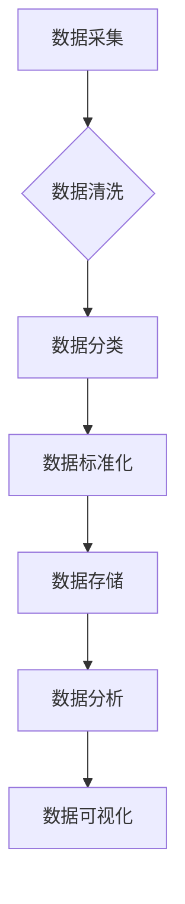

> 数据治理、人工智能、机器学习、数据质量、数据安全、数据可信

## 1. 背景介绍

在当今数据爆炸的时代，企业面临着海量数据的存储、管理和利用的挑战。传统的数据治理方法难以有效应对数据规模的增长和复杂性，企业亟需寻求新的解决方案。人工智能（AI）技术的快速发展为企业数据治理提供了新的机遇。

AI驱动的企业数据治理方案利用人工智能技术，自动识别、分类、清洗、标准化和管理数据，提高数据质量、安全性、可信度和可利用性。这种方案能够帮助企业更好地利用数据，实现数据价值最大化。

## 2. 核心概念与联系

**2.1 数据治理概述**

数据治理是指企业对数据生命周期的各个阶段进行规划、管理和控制，以确保数据的质量、安全性、一致性和可用性。

**2.2 人工智能概述**

人工智能是指模拟人类智能行为的计算机系统。人工智能技术包括机器学习、深度学习、自然语言处理等。

**2.3 AI驱动的企业数据治理方案**

AI驱动的企业数据治理方案利用人工智能技术，自动识别、分类、清洗、标准化和管理数据，提高数据质量、安全性、可信度和可利用性。

**2.4 核心架构**



**2.5 核心概念联系**

数据治理是企业数据管理的整体框架，而人工智能技术是实现数据治理目标的重要手段。AI驱动的企业数据治理方案将数据治理的各个环节与人工智能技术相结合，实现数据治理的自动化、智能化和高效化。

## 3. 核心算法原理 & 具体操作步骤

**3.1 算法原理概述**

AI驱动的企业数据治理方案通常采用以下核心算法：

* **机器学习算法:** 用于数据分类、聚类、预测等任务。
* **深度学习算法:** 用于处理复杂的数据模式，例如图像识别、自然语言处理等。
* **规则引擎:** 用于根据预定义的规则进行数据清洗和标准化。

**3.2 算法步骤详解**

1. **数据采集:** 从各种数据源收集数据。
2. **数据预处理:** 对数据进行清洗、转换和格式化。
3. **特征工程:** 从原始数据中提取特征，用于训练机器学习模型。
4. **模型训练:** 使用机器学习算法训练模型，学习数据模式。
5. **模型评估:** 评估模型的性能，并进行调优。
6. **模型部署:** 将训练好的模型部署到生产环境中，用于数据治理任务。

**3.3 算法优缺点**

* **优点:** 自动化、智能化、高效化、可扩展性强。
* **缺点:** 需要大量的数据进行训练，模型的解释性较差，容易受到数据偏差的影响。

**3.4 算法应用领域**

* 数据质量管理
* 数据安全管理
* 数据隐私保护
* 数据合规性管理
* 数据可信度管理

## 4. 数学模型和公式 & 详细讲解 & 举例说明

**4.1 数学模型构建**

假设我们有一个包含n个样本的数据集D，每个样本包含m个特征。我们可以使用以下数学模型来表示数据点之间的相似度：

$$
similarity(x_i, x_j) = \frac{1}{1 + ||x_i - x_j||^2}
$$

其中，$x_i$和$x_j$分别表示两个数据点，$||x_i - x_j||^2$表示两个数据点之间的欧氏距离平方。

**4.2 公式推导过程**

该公式基于欧氏距离的平方，将距离平方反推到相似度上。距离越小，相似度越高。

**4.3 案例分析与讲解**

例如，我们有一个包含用户购买历史的电商数据集。我们可以使用上述公式计算用户之间的相似度，并根据相似度进行用户画像分析、推荐系统等应用。

## 5. 项目实践：代码实例和详细解释说明

**5.1 开发环境搭建**

* Python 3.x
* Jupyter Notebook
* scikit-learn
* pandas

**5.2 源代码详细实现**

```python
from sklearn.metrics.pairwise import cosine_similarity
import pandas as pd

# 加载数据
data = pd.read_csv('user_purchase_history.csv')

# 提取特征
user_features = data[['age', 'gender', 'income', 'purchase_frequency']]

# 计算用户之间的余弦相似度
similarity_matrix = cosine_similarity(user_features)

# 打印相似度矩阵
print(similarity_matrix)
```

**5.3 代码解读与分析**

* 使用 scikit-learn 库的 `cosine_similarity` 函数计算用户之间的余弦相似度。
* 使用 pandas 库读取用户购买历史数据。
* 提取用户特征，例如年龄、性别、收入和购买频率。

**5.4 运行结果展示**

运行代码后，将输出一个用户之间的相似度矩阵。矩阵中的每个元素表示两个用户之间的相似度。

## 6. 实际应用场景

**6.1 数据质量管理**

AI驱动的企业数据治理方案可以自动识别和修复数据中的错误、缺失和重复数据，提高数据质量。

**6.2 数据安全管理**

AI驱动的企业数据治理方案可以识别和阻止数据泄露和恶意攻击，保障数据安全。

**6.3 数据隐私保护**

AI驱动的企业数据治理方案可以对敏感数据进行脱敏处理，保护用户隐私。

**6.4 未来应用展望**

* 数据治理自动化程度更高
* 数据治理更加智能化和个性化
* 数据治理与其他业务系统更加融合

## 7. 工具和资源推荐

**7.1 学习资源推荐**

* 《数据治理》
* 《人工智能》
* 在线课程：Coursera、edX

**7.2 开发工具推荐**

* Apache Spark
* Hadoop
* TensorFlow

**7.3 相关论文推荐**

* "AI-Powered Data Governance: A Survey"
* "Towards an AI-Driven Data Governance Framework"

## 8. 总结：未来发展趋势与挑战

**8.1 研究成果总结**

AI驱动的企业数据治理方案已经取得了一定的成果，能够有效提高数据质量、安全性、可信度和可利用性。

**8.2 未来发展趋势**

* 数据治理自动化程度更高
* 数据治理更加智能化和个性化
* 数据治理与其他业务系统更加融合

**8.3 面临的挑战**

* 数据质量问题
* 数据安全问题
* 模型解释性问题

**8.4 研究展望**

未来研究将重点关注以下方面：

* 开发更智能、更有效的AI算法
* 构建更完善的数据治理框架
* 解决数据治理中的伦理问题

## 9. 附录：常见问题与解答

**9.1 如何选择合适的AI算法？**

选择合适的AI算法取决于具体的业务需求和数据特点。

**9.2 如何保证数据安全？**

可以使用加密、脱敏等技术保障数据安全。

**9.3 如何解释AI模型的决策结果？**

可以使用可解释AI技术解释模型的决策结果。


作者：禅与计算机程序设计艺术 / Zen and the Art of Computer Programming 
<end_of_turn>