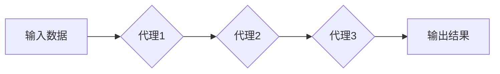

> Agentic Workflow, 工作流自动化,  印钞机类比,  智能化,  流程引擎,  可扩展性,  可维护性

## 1. 背景介绍

在当今数字化时代，企业和组织面临着日益复杂的业务流程和不断增长的数据处理需求。传统的流程管理方式难以满足这些需求，因此，高效、灵活、可扩展的自动化工作流解决方案成为企业数字化转型的重要驱动力。

Agentic Workflow 作为一种新兴的工作流自动化技术，以其强大的智能化能力和可定制性，正在逐渐成为企业流程管理的热门选择。它将工作流视为一系列独立的、可交互的“代理”，每个代理都负责执行特定的任务，并根据预定义的规则和条件进行决策。这种代理驱动的架构，使得 Agentic Workflow 能够实现高度的自动化、灵活性以及可扩展性。

## 2. 核心概念与联系

### 2.1  Agentic Workflow

Agentic Workflow 是一种基于代理的自动化工作流系统，它将工作流分解成一系列独立的代理，每个代理负责执行特定的任务。这些代理之间通过消息传递和事件触发进行交互，共同完成整个工作流。

### 2.2  印钞机类比

为了更好地理解 Agentic Workflow 的工作原理，我们可以将其类比于印钞机。

* **印钞机：** 代表整个工作流系统。
* **钞票：** 代表工作流中的数据或任务。
* **印钞机部件：** 代表 Agentic Workflow 中的代理，每个部件负责特定的任务，例如：
    * **纸张进纸器：** 负责接收和处理输入数据。
    * **印版：** 负责根据预定义的规则和条件对数据进行处理。
    * **钞票计数器：** 负责统计完成的任务数量。
    * **钞票输出器：** 负责将处理后的数据输出。

**Mermaid 流程图**



### 2.3  联系分析

通过印钞机类比，我们可以看到 Agentic Workflow 的核心特点：

* **模块化：** 每个代理就像印钞机的部件，可以独立开发和维护。
* **自动化：** 代理之间通过消息传递和事件触发进行交互，实现自动化的工作流执行。
* **可扩展性：** 可以根据需要添加新的代理，扩展工作流的功能。
* **可维护性：** 由于代理的独立性，可以方便地修改或替换单个代理，降低系统维护成本。

## 3. 核心算法原理 & 具体操作步骤

### 3.1  算法原理概述

Agentic Workflow 的核心算法是基于代理的事件驱动模型。每个代理都维护一个状态机，根据接收到的事件触发相应的状态转换，并执行相应的任务。

### 3.2  算法步骤详解

1. **代理注册：**  代理需要向工作流引擎注册，并提供其功能描述、状态机定义以及事件处理逻辑。
2. **事件触发：** 当工作流引擎接收到事件时，会根据事件类型和代理的注册信息，选择相应的代理进行处理。
3. **状态转换：** 代理根据接收到的事件，根据其状态机定义进行状态转换，并执行相应的任务。
4. **消息传递：** 代理之间可以通过消息传递进行交互，传递数据或触发事件。
5. **工作流完成：** 当所有代理完成其任务，工作流引擎会判定工作流完成。

### 3.3  算法优缺点

**优点：**

* **灵活性和可扩展性：** 可以根据需要添加新的代理，扩展工作流的功能。
* **可维护性：** 由于代理的独立性，可以方便地修改或替换单个代理，降低系统维护成本。
* **并发处理：** 代理可以并行执行，提高工作流的效率。

**缺点：**

* **复杂性：** 设计和维护复杂的代理系统可能比较困难。
* **调试难度：** 由于代理之间的交互复杂，调试代理系统可能比较困难。

### 3.4  算法应用领域

Agentic Workflow 广泛应用于以下领域：

* **业务流程自动化：** 自动化销售、采购、财务等业务流程。
* **数据处理：** 自动化数据采集、清洗、转换等数据处理任务。
* **任务调度：** 自动化任务调度和执行。
* **人工智能应用：** 在人工智能应用中，Agentic Workflow 可以用于构建智能代理，实现自动化决策和执行。

## 4. 数学模型和公式 & 详细讲解 & 举例说明

### 4.1  数学模型构建

Agentic Workflow 可以用状态机模型来描述。每个代理的状态机由以下几个部分组成：

* **状态集：** 代理可以处于的各种状态。
* **事件集：** 可以触发代理状态转换的事件。
* **状态转换函数：** 根据事件和当前状态，确定代理的下一个状态。
* **动作函数：** 在每个状态下，代理可以执行的动作。

### 4.2  公式推导过程

状态转换函数可以表示为：

```latex
next_state = state_transition_function(current_state, event)
```

其中：

* `next_state` 是代理的下一个状态。
* `current_state` 是代理当前的状态。
* `event` 是触发状态转换的事件。

### 4.3  案例分析与讲解

例如，一个简单的代理负责处理订单。它的状态机可能包含以下状态：

* **待处理：** 订单刚提交，等待处理。
* **处理中：** 订单正在处理中。
* **已完成：** 订单已处理完成。

当收到“提交订单”事件时，代理的状态会从“待处理”变为“处理中”。当处理完成时，代理的状态会从“处理中”变为“已完成”。

## 5. 项目实践：代码实例和详细解释说明

### 5.1  开发环境搭建

* **操作系统：** Linux/macOS/Windows
* **编程语言：** Python
* **框架：** Flask/Django
* **数据库：** MySQL/PostgreSQL

### 5.2  源代码详细实现

```python
class OrderAgent:
    def __init__(self):
        self.state = "待处理"

    def handle_event(self, event):
        if event == "提交订单":
            self.state = "处理中"
            print(f"订单已提交，正在处理...")
        elif event == "处理完成":
            self.state = "已完成"
            print(f"订单已处理完成。")

# 创建代理实例
order_agent = OrderAgent()

# 模拟事件触发
order_agent.handle_event("提交订单")
order_agent.handle_event("处理完成")
```

### 5.3  代码解读与分析

* `OrderAgent` 类代表一个订单代理。
* `__init__` 方法初始化代理的状态为“待处理”。
* `handle_event` 方法处理事件，根据事件类型更新代理的状态并执行相应的动作。
* 代码示例演示了如何创建代理实例，并模拟事件触发，更新代理的状态。

### 5.4  运行结果展示

```
订单已提交，正在处理...
订单已处理完成。
```

## 6. 实际应用场景

Agentic Workflow 在实际应用场景中具有广泛的应用前景。

### 6.1  电商平台订单处理

电商平台可以利用 Agentic Workflow 自动化订单处理流程，包括订单接收、库存扣减、物流配送、售后服务等环节。

### 6.2  金融机构交易处理

金融机构可以利用 Agentic Workflow 自动化交易处理流程，包括交易接收、风险控制、资金划转、交易记录等环节。

### 6.3  医疗机构病历管理

医疗机构可以利用 Agentic Workflow 自动化病历管理流程，包括病历录入、病历审核、病历归档、病历查询等环节。

### 6.4  未来应用展望

随着人工智能技术的不断发展，Agentic Workflow 将能够实现更智能化的自动化，例如：

* **智能决策：** 代理可以根据历史数据和规则，自动做出决策。
* **自适应调整：** 代理可以根据环境变化，自动调整工作流程。
* **协同工作：** 多个代理可以协同工作，完成更复杂的任务。

## 7. 工具和资源推荐

### 7.1  学习资源推荐

* **书籍：**
    * 《Workflow Patterns》
    * 《Designing Data-Intensive Applications》
* **在线课程：**
    * Coursera: Workflow Automation
    * Udemy: Building Microservices with Python

### 7.2  开发工具推荐

* **工作流引擎：**
    * Apache Airflow
    * Camunda
    * Activiti
* **消息队列：**
    * RabbitMQ
    * Kafka
* **数据库：**
    * MySQL
    * PostgreSQL

### 7.3  相关论文推荐

* **Agentic Workflow: A New Paradigm for Workflow Automation**
* **Towards Intelligent Workflow Automation: A Survey**

## 8. 总结：未来发展趋势与挑战

### 8.1  研究成果总结

Agentic Workflow 作为一种新兴的工作流自动化技术，具有强大的智能化能力和可定制性，为企业数字化转型提供了新的解决方案。

### 8.2  未来发展趋势

* **更智能化的代理：** 代理将更加智能化，能够自动学习和适应环境变化。
* **更强大的协同能力：** 代理之间将更加协同工作，完成更复杂的任务。
* **更广泛的应用场景：** Agentic Workflow 将应用于更多领域，例如医疗、教育、金融等。

### 8.3  面临的挑战

* **复杂性：** 设计和维护复杂的代理系统可能比较困难。
* **安全性：** 代理系统需要保证数据安全和系统稳定性。
* **可解释性：** 智能代理的决策过程需要更加透明和可解释。

### 8.4  研究展望

未来，我们将继续研究 Agentic Workflow 的理论基础和应用实践，探索更智能、更安全、更可解释的代理系统，推动 Agentic Workflow 技术的快速发展和应用推广。

## 9. 附录：常见问题与解答

### 9.1  什么是 Agentic Workflow？

Agentic Workflow 是一种基于代理的自动化工作流系统，它将工作流分解成一系列独立的代理，每个代理负责执行特定的任务。

### 9.2  Agentic Workflow 的优势是什么？

Agentic Workflow 的优势包括：

* 灵活性和可扩展性
* 可维护性
* 并发处理

### 9.3  Agentic Workflow 的应用场景有哪些？

Agentic Workflow 广泛应用于以下领域：

* 业务流程自动化
* 数据处理
* 任务调度
* 人工智能应用

### 9.4  如何学习 Agentic Workflow？

您可以通过以下方式学习 Agentic Workflow：

* 阅读相关书籍和论文
* 参加在线课程
* 尝试使用开源工作流引擎

作者：禅与计算机程序设计艺术 / Zen and the Art of Computer Programming


<end_of_turn>