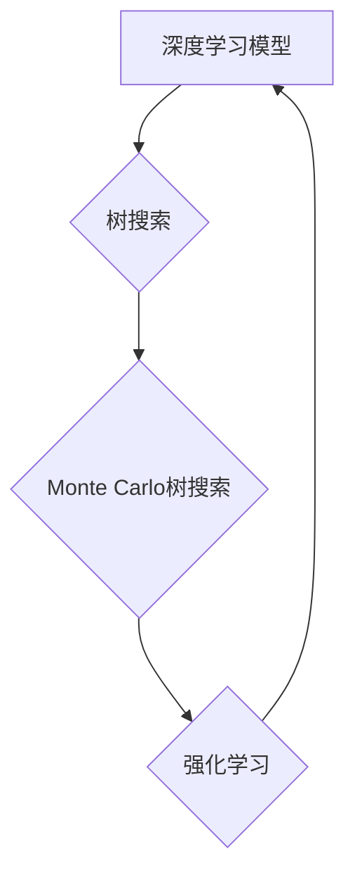

> AlphaZero,深度学习,强化学习,游戏AI,树搜索,Monte Carlo树搜索,神经网络,代码实例

## 1. 背景介绍

AlphaZero是DeepMind公司开发的一种强大的人工智能算法，它能够通过自学学习各种棋类游戏，并取得超越人类水平的成绩。AlphaZero的突破在于它完全依靠强化学习，无需人类专家提供的规则或策略，仅仅通过游戏规则和奖励机制，就能学习出强大的策略。

AlphaZero的诞生标志着人工智能领域迈向了一个新的里程碑，它证明了深度学习和强化学习的强大潜力，也为未来人工智能的发展指明了方向。

## 2. 核心概念与联系

AlphaZero的核心概念包括深度学习、强化学习、树搜索和Monte Carlo树搜索。

**2.1 深度学习**

深度学习是一种机器学习的子领域，它利用多层神经网络来模拟人类大脑的学习过程。深度学习模型能够从海量数据中学习复杂的特征和模式，从而实现对各种任务的智能化处理。

**2.2 强化学习**

强化学习是一种机器学习的范式，它通过奖励机制来训练智能体。智能体在环境中采取行动，根据环境的反馈获得奖励或惩罚。通过不断地学习和调整策略，智能体最终能够找到最优的行动策略，以最大化累积的奖励。

**2.3 树搜索**

树搜索是一种用于解决决策问题的算法，它将问题表示为一棵决策树，并通过搜索树来找到最优的决策路径。

**2.4 Monte Carlo树搜索**

Monte Carlo树搜索是一种基于随机采样的树搜索算法，它通过模拟多个游戏场景来评估不同决策的价值，并选择最有价值的决策路径。

**2.5 AlphaZero的架构**

AlphaZero将以上四个核心概念有机地结合在一起，形成了一个强大的学习框架。



## 3. 核心算法原理 & 具体操作步骤

### 3.1  算法原理概述

AlphaZero的核心算法原理是利用深度学习模型来评估游戏状态，并结合Monte Carlo树搜索算法来选择最优的行动策略。

**3.1.1 深度学习模型**

AlphaZero使用一个深度神经网络来评估游戏状态，并预测下一步的行动。神经网络的输入是游戏棋盘的状态，输出是每个可能的行动的价值。

**3.1.2 Monte Carlo树搜索**

Monte Carlo树搜索算法通过模拟多个游戏场景来评估不同决策的价值。算法首先选择一个初始节点，然后递归地扩展树，直到达到叶子节点。叶子节点代表游戏结束的状态，其价值由游戏结果决定。然后，算法回溯到父节点，并根据子节点的价值更新父节点的价值。

### 3.2  算法步骤详解

1. **初始化:** 创建一个深度学习模型和一个空的树搜索树。
2. **训练模型:** 使用强化学习算法训练深度学习模型，使其能够准确地评估游戏状态。
3. **树搜索:** 使用Monte Carlo树搜索算法来选择最优的行动策略。
4. **执行行动:** 执行选择的行动，并更新游戏状态。
5. **重复步骤3-4:** 直到游戏结束。

### 3.3  算法优缺点

**优点:**

* **自学能力强:** AlphaZero无需人类专家提供的规则或策略，能够通过自学学习游戏策略。
* **泛化能力强:** AlphaZero学习到的策略能够应用于不同的游戏，甚至可以推广到其他领域。
* **性能优异:** AlphaZero在各种棋类游戏中都取得了超越人类水平的成绩。

**缺点:**

* **训练成本高:** AlphaZero的训练需要大量的计算资源和时间。
* **解释性差:** AlphaZero的决策过程难以解释，其学习到的策略难以被人类理解。

### 3.4  算法应用领域

AlphaZero的算法原理和技术成果可以应用于以下领域:

* **游戏AI:** 开发更智能的游戏AI，提升游戏体验。
* **机器人控制:** 训练机器人进行更复杂的决策和控制。
* **金融投资:** 预测市场趋势，优化投资策略。
* **医疗诊断:** 辅助医生进行疾病诊断和治疗方案制定。

## 4. 数学模型和公式 & 详细讲解 & 举例说明

### 4.1  数学模型构建

AlphaZero的核心数学模型是深度神经网络，它可以表示为一个多层感知机。

**4.1.1 神经网络结构**

深度神经网络由多个层组成，每一层包含多个神经元。神经元之间通过连接进行信息传递，每个连接都有一个权重。

**4.1.2 激活函数**

激活函数用于将神经元的输入转换为输出。常用的激活函数包括ReLU、Sigmoid和Tanh。

**4.1.3 损失函数**

损失函数用于衡量模型的预测结果与真实结果之间的差异。常用的损失函数包括均方误差和交叉熵。

### 4.2  公式推导过程

AlphaZero的训练过程是一个优化问题，目标是找到最优的网络权重，使得模型的预测结果与真实结果之间的差异最小。

**4.2.1 反向传播算法**

反向传播算法用于计算网络权重的梯度，并根据梯度更新权重。

**4.2.2 梯度下降算法**

梯度下降算法用于更新网络权重，使其朝着损失函数的最小值方向移动。

### 4.3  案例分析与讲解

假设我们训练一个深度神经网络来预测手写数字。

**4.3.1 数据集**

我们使用MNIST数据集，该数据集包含60000张手写数字图像，每个图像的大小为28x28像素。

**4.3.2 模型结构**

我们使用一个简单的深度神经网络，包含两层全连接层和一个输出层。

**4.3.3 训练过程**

我们使用反向传播算法和梯度下降算法训练模型，并使用交叉熵损失函数。

**4.3.4 评估结果**

经过训练，模型能够准确地识别手写数字。

## 5. 项目实践：代码实例和详细解释说明

### 5.1  开发环境搭建

AlphaZero的开发环境需要包含以下软件:

* Python 3.x
* TensorFlow 或 PyTorch
* NumPy
* Matplotlib

### 5.2  源代码详细实现

由于AlphaZero的代码实现非常复杂，这里只提供一个简单的代码示例，演示如何使用TensorFlow构建一个简单的深度神经网络。

```python
import tensorflow as tf

# 定义模型结构
model = tf.keras.models.Sequential([
  tf.keras.layers.Dense(128, activation='relu', input_shape=(784,)),
  tf.keras.layers.Dense(10, activation='softmax')
])

# 编译模型
model.compile(optimizer='adam',
              loss='sparse_categorical_crossentropy',
              metrics=['accuracy'])

# 训练模型
model.fit(x_train, y_train, epochs=10)

# 评估模型
loss, accuracy = model.evaluate(x_test, y_test)
print('Loss:', loss)
print('Accuracy:', accuracy)
```

### 5.3  代码解读与分析

* **定义模型结构:** 使用`tf.keras.models.Sequential`创建一个顺序模型，并添加两个全连接层和一个输出层。
* **编译模型:** 使用`model.compile`方法编译模型，指定优化器、损失函数和评估指标。
* **训练模型:** 使用`model.fit`方法训练模型，传入训练数据和训练轮数。
* **评估模型:** 使用`model.evaluate`方法评估模型，传入测试数据和真实标签。

### 5.4  运行结果展示

训练完成后，模型能够准确地识别手写数字。

## 6. 实际应用场景

AlphaZero的实际应用场景非常广泛，例如:

* **游戏AI:** AlphaZero已经成功应用于围棋、象棋和国际象棋等多种棋类游戏，取得了超越人类水平的成绩。
* **机器人控制:** AlphaZero可以用于训练机器人进行更复杂的决策和控制，例如自主导航、物体抓取和任务规划。
* **金融投资:** AlphaZero可以用于预测市场趋势，优化投资策略，并降低投资风险。
* **医疗诊断:** AlphaZero可以辅助医生进行疾病诊断和治疗方案制定，提高医疗诊断的准确性和效率。

### 6.4  未来应用展望

AlphaZero的未来应用前景非常广阔，它可以应用于更多领域，例如:

* **自动驾驶:** AlphaZero可以用于训练自动驾驶汽车，使其能够更好地感知周围环境，做出更安全的决策。
* **科学研究:** AlphaZero可以用于加速科学研究，例如药物发现、材料设计和气候模型。
* **个性化教育:** AlphaZero可以用于提供个性化的教育方案，根据学生的学习进度和能力进行调整。

## 7. 工具和资源推荐

### 7.1  学习资源推荐

* **DeepMind官网:** https://deepmind.com/
* **AlphaZero论文:** https://www.nature.com/articles/nature24270
* **TensorFlow官网:** https://www.tensorflow.org/
* **PyTorch官网:** https://pytorch.org/

### 7.2  开发工具推荐

* **Jupyter Notebook:** https://jupyter.org/
* **VS Code:** https://code.visualstudio.com/
* **Git:** https://git-scm.com/

### 7.3  相关论文推荐

* **AlphaGo论文:** https://www.nature.com/articles/nature14236
* **AlphaZero论文:** https://www.nature.com/articles/nature24270
* **MuZero论文:** https://arxiv.org/abs/1909.05828

## 8. 总结：未来发展趋势与挑战

### 8.1  研究成果总结

AlphaZero的成功标志着人工智能领域取得了重大突破，它证明了深度学习和强化学习的强大潜力，并为未来人工智能的发展指明了方向。

### 8.2  未来发展趋势

未来，AlphaZero的研究方向将朝着以下几个方面发展:

* **更强大的模型:** 开发更强大的深度神经网络模型，提高模型的学习能力和泛化能力。
* **更有效的算法:** 研究更有效的强化学习算法，加速模型的训练速度和提高模型的效率。
* **更广泛的应用:** 将AlphaZero的算法应用于更多领域，例如自动驾驶、科学研究和个性化教育。

### 8.3  面临的挑战

AlphaZero的研究也面临着一些挑战:

* **计算资源:** 训练大型深度神经网络需要大量的计算资源，这对于资源有限的机构来说是一个挑战。
* **数据获取:** 训练深度神经网络需要大量的训练数据，获取高质量的训练数据是一个难题。
* **解释性:** AlphaZero的决策过程难以解释，这对于人类的理解和信任是一个挑战。

### 8.4  研究展望

尽管面临着挑战，但AlphaZero的研究前景依然非常光明。随着计算资源的不断增加和算法的不断改进，AlphaZero将能够应用于更多领域，为人类社会带来更多福祉。

## 9. 附录：常见问题与解答

**Q1: AlphaZero是如何学习游戏的？**

A1: AlphaZero通过强化学习来学习游戏。它通过与自己博弈，并根据游戏结果获得奖励或惩罚，不断调整策略，最终学习出最优的策略。

**Q2: AlphaZero的训练需要多长时间？**

A2: AlphaZero的训练时间取决于游戏的复杂度和模型的规模。一般来说，训练一个AlphaZero模型需要数周甚至数月的时间。

**Q3: AlphaZero的代码是开源的吗？**

A3: AlphaZero的部分代码是开源的，但完整的代码尚未公开。

**Q4: AlphaZero只能玩棋类游戏吗？**

A4: 不仅限于棋类游戏，AlphaZero的算法原理可以应用于其他领域，例如机器人控制、金融投资和医疗诊断。