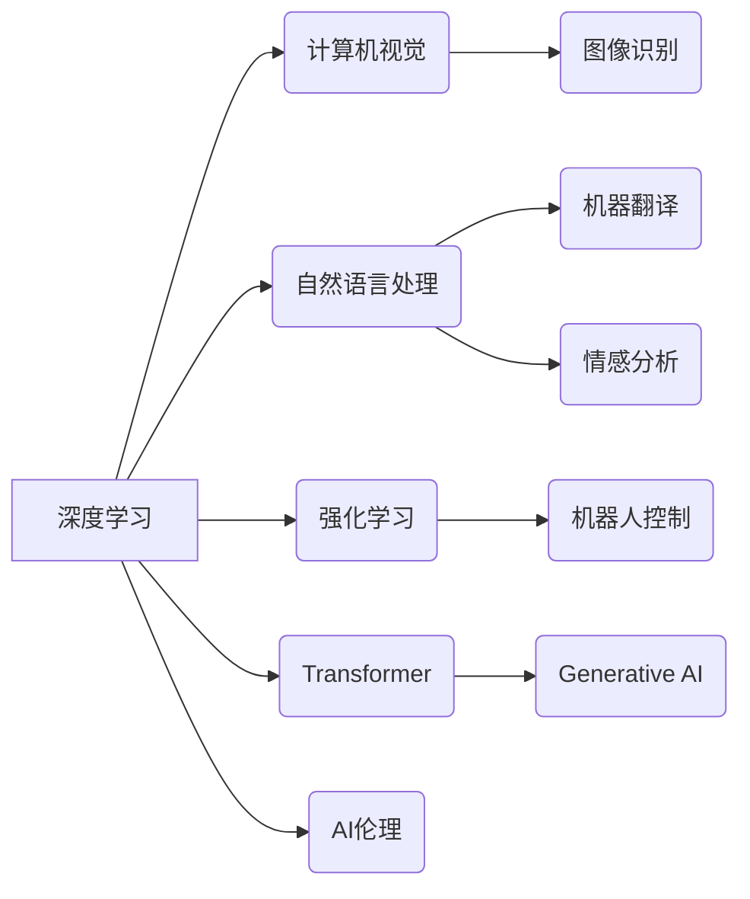

> 人工智能，深度学习，计算机视觉，自然语言处理，强化学习，Transformer，Generative AI，AI伦理

## 1. 背景介绍

人工智能（AI）正以惊人的速度发展，深刻地改变着我们生活的方方面面。从自动驾驶汽车到智能语音助手，从医疗诊断到金融交易，AI技术的应用日益广泛。作为AI领域的领军人物，Andrej Karpathy 始终走在技术前沿，他的研究和洞察力为我们理解和展望AI的未来提供了宝贵的指引。

Andrej Karpathy 是一位享誉世界的计算机科学家，斯坦福大学博士，曾任特斯拉自动驾驶团队负责人，现任OpenAI研究员。他以其在深度学习、计算机视觉和自然语言处理领域的杰出贡献而闻名。他的研究成果不仅推动了AI技术的进步，也深刻影响了我们对人工智能的认知和理解。

## 2. 核心概念与联系

**2.1 深度学习**

深度学习是人工智能领域的一个重要分支，它利用多层神经网络来模拟人类大脑的学习过程。通过对大量数据进行训练，深度学习模型能够自动提取特征，并进行复杂的模式识别和预测。

**2.2 计算机视觉**

计算机视觉是让计算机“看”世界的一种技术，它旨在使计算机能够理解和解释图像和视频信息。深度学习在计算机视觉领域取得了突破性的进展，例如图像识别、物体检测、图像分割等。

**2.3 自然语言处理**

自然语言处理（NLP）是让计算机“理解”人类语言的技术，它旨在使计算机能够理解、生成和处理自然语言文本。深度学习在NLP领域也取得了显著的成果，例如机器翻译、文本摘要、情感分析等。

**2.4 强化学习**

强化学习是一种基于奖励机制的机器学习方法，它通过不断与环境交互，学习最优的策略来获得最大奖励。强化学习在机器人控制、游戏 AI 等领域具有广泛的应用前景。

**2.5 Transformer**

Transformer是一种新型的深度学习架构，它能够有效地处理序列数据，例如文本和语音。Transformer的出现标志着NLP领域取得了新的突破，例如BERT、GPT-3 等模型都基于Transformer架构。

**2.6 Generative AI**

Generative AI是指能够生成新内容的AI模型，例如文本、图像、音频等。Generative AI在艺术创作、内容生成、药物研发等领域具有巨大的潜力。

**2.7 AI伦理**

随着AI技术的快速发展，AI伦理问题也日益受到关注。如何确保AI技术安全、公平、透明，以及如何避免AI技术带来的潜在风险，是需要认真思考和解决的重大问题。

**2.8  核心概念联系图**



## 3. 核心算法原理 & 具体操作步骤

**3.1 算法原理概述**

深度学习算法的核心是多层神经网络。神经网络由多个层组成，每一层都包含多个神经元。神经元之间通过连接进行信息传递，每个连接都有一个权重。通过对大量数据进行训练，神经网络能够自动调整权重，从而学习到数据的特征和模式。

**3.2 算法步骤详解**

1. **数据预处理:** 将原始数据转换为深度学习模型可以理解的格式。
2. **网络结构设计:** 根据任务需求设计神经网络的结构，包括层数、神经元数量、激活函数等。
3. **参数初始化:** 为神经网络的参数（权重和偏置）进行随机初始化。
4. **前向传播:** 将输入数据通过神经网络进行传递，计算输出结果。
5. **损失函数计算:** 计算模型输出与真实值的差异，即损失值。
6. **反向传播:** 根据损失值，反向传播误差信号，更新神经网络的参数。
7. **迭代训练:** 重复步骤4-6，直到模型性能达到预期的水平。

**3.3 算法优缺点**

**优点:**

* 能够自动提取特征，无需人工特征工程。
* 能够处理大规模数据，学习复杂模式。
* 在图像识别、自然语言处理等领域取得了突破性进展。

**缺点:**

* 训练时间长，需要大量计算资源。
* 对数据质量要求高，容易受到噪声数据的影响。
* 模型解释性差，难以理解模型的决策过程。

**3.4 算法应用领域**

* 计算机视觉：图像识别、物体检测、图像分割、人脸识别等。
* 自然语言处理：机器翻译、文本摘要、情感分析、聊天机器人等。
* 强化学习：机器人控制、游戏 AI、自动驾驶等。
* 其他领域：医疗诊断、金融预测、推荐系统等。

## 4. 数学模型和公式 & 详细讲解 & 举例说明

**4.1 数学模型构建**

深度学习模型通常使用神经网络来表示，神经网络可以看作是一个复杂的函数映射。

假设输入数据为 x，输出为 y，神经网络可以表示为：

$$
y = f(W * x + b)
$$

其中：

* W 是权重矩阵，
* b 是偏置向量，
* f 是激活函数。

**4.2 公式推导过程**

深度学习模型的训练过程是通过优化损失函数来实现的。损失函数衡量模型预测结果与真实值的差异。常用的损失函数包括均方误差（MSE）、交叉熵损失等。

优化算法，例如梯度下降法，用于更新模型参数，使得损失函数最小化。梯度下降法的核心思想是沿着梯度方向更新参数，从而逐渐逼近损失函数的最小值。

**4.3 案例分析与讲解**

**举例说明：**

假设我们训练一个简单的线性回归模型，用于预测房价。输入特征包括房屋面积和房间数量，输出为房价。

我们可以使用均方误差损失函数来衡量模型预测结果与真实房价的差异。

$$
Loss = \frac{1}{n} \sum_{i=1}^{n} (y_i - \hat{y}_i)^2
$$

其中：

* n 是样本数量，
* $y_i$ 是真实房价，
* $\hat{y}_i$ 是模型预测的房价。

通过梯度下降法，我们可以更新模型参数（权重和偏置），使得损失函数最小化。

## 5. 项目实践：代码实例和详细解释说明

**5.1 开发环境搭建**

* Python 3.x
* TensorFlow 或 PyTorch 深度学习框架
* Jupyter Notebook 或 VS Code 代码编辑器

**5.2 源代码详细实现**

```python
import tensorflow as tf

# 定义模型
model = tf.keras.models.Sequential([
    tf.keras.layers.Dense(64, activation='relu', input_shape=(2,)),
    tf.keras.layers.Dense(1)
])

# 编译模型
model.compile(optimizer='adam', loss='mse')

# 训练模型
model.fit(X_train, y_train, epochs=10)

# 评估模型
loss = model.evaluate(X_test, y_test)
```

**5.3 代码解读与分析**

* 首先，我们使用 TensorFlow 库定义了一个简单的线性回归模型。模型包含两层全连接神经元，第一层有 64 个神经元，第二层只有一个神经元（用于预测房价）。
* 然后，我们使用 Adam 优化器和均方误差损失函数编译模型。
* 接着，我们使用训练数据训练模型 10 个 epochs。
* 最后，我们使用测试数据评估模型的性能，并打印损失值。

**5.4 运行结果展示**

训练完成后，我们可以使用测试数据预测房价，并与真实房价进行比较。

## 6. 实际应用场景

**6.1 医疗诊断**

深度学习可以用于分析医学图像，例如 X 光片、CT 扫描和 MRI 图像，帮助医生诊断疾病。

**6.2 金融预测**

深度学习可以用于预测股票价格、信用风险和欺诈行为等。

**6.3 自动驾驶**

深度学习是自动驾驶汽车的关键技术之一，它可以帮助汽车识别道路、交通信号和行人等。

**6.4 未来应用展望**

随着AI技术的不断发展，其应用场景将更加广泛，例如：

* 个性化教育
* 智能家居
* 医疗保健
* 科学研究

## 7. 工具和资源推荐

**7.1 学习资源推荐**

* **书籍:**
    * 深度学习 (Deep Learning) - Ian Goodfellow, Yoshua Bengio, Aaron Courville
    * 构建深度学习模型 (Hands-On Machine Learning with Scikit-Learn, Keras & TensorFlow) - Aurélien Géron
* **在线课程:**
    * Coursera: 深度学习 Specialization
    * Udacity: 深度学习 Nanodegree
    * fast.ai: 深度学习课程

**7.2 开发工具推荐**

* TensorFlow
* PyTorch
* Keras

**7.3 相关论文推荐**

* ImageNet Classification with Deep Convolutional Neural Networks (AlexNet)
* Attention Is All You Need (Transformer)
* BERT: Pre-training of Deep Bidirectional Transformers for Language Understanding

## 8. 总结：未来发展趋势与挑战

**8.1 研究成果总结**

近年来，深度学习取得了令人瞩目的成就，在计算机视觉、自然语言处理等领域取得了突破性进展。

**8.2 未来发展趋势**

* **模型规模和效率:** 继续追求更大规模、更高效的深度学习模型。
* **数据增强和合成:** 开发新的数据增强和合成技术，以解决数据稀缺问题。
* **可解释性:** 研究深度学习模型的决策过程，提高模型的可解释性。
* **联邦学习:** 研究联邦学习等隐私保护技术，保障数据安全。

**8.3 面临的挑战**

* **数据偏见:** 深度学习模型容易受到训练数据中的偏见影响。
* **安全性和可靠性:** 深度学习模型可能存在安全漏洞和可靠性问题。
* **伦理问题:** 深度学习技术的应用可能引发伦理问题，例如算法歧视和隐私泄露。

**8.4 研究展望**

未来，深度学习研究将继续朝着更安全、更可靠、更可解释的方向发展。同时，我们需要加强对深度学习伦理问题的研究和探讨，确保AI技术造福人类。

## 9. 附录：常见问题与解答

**9.1 什么是深度学习？**

深度学习是一种机器学习方法，它利用多层神经网络来模拟人类大脑的学习过程。

**9.2 深度学习有哪些应用场景？**

深度学习的应用场景非常广泛，例如图像识别、自然语言处理、语音识别、机器翻译等。

**9.3 如何学习深度学习？**

有很多学习深度学习的资源，例如书籍、在线课程和开源代码。

**9.4 深度学习有哪些挑战？**

深度学习面临着数据偏见、安全性和可靠性、伦理问题等挑战。


作者：禅与计算机程序设计艺术 / Zen and the Art of Computer Programming 
<end_of_turn>