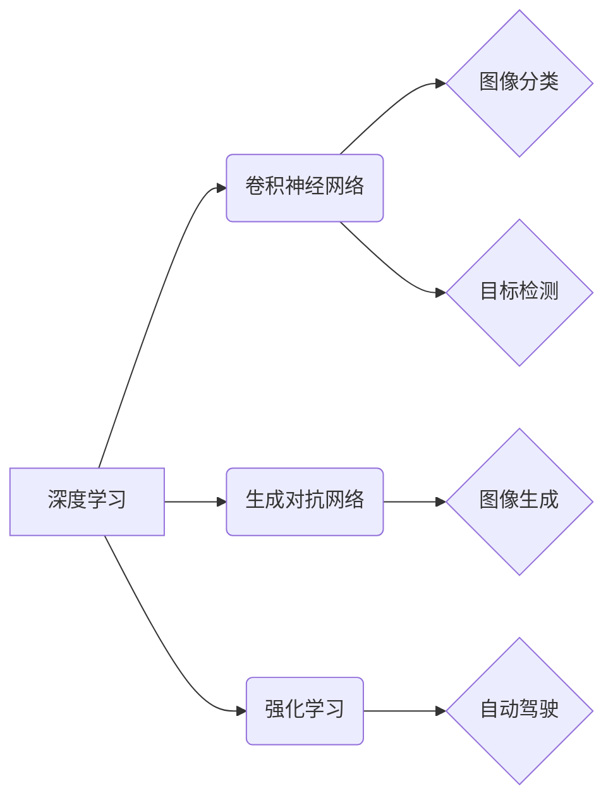

> 深度学习，计算机视觉，自动驾驶，人工智能，Andrej Karpathy，特斯拉，OpenAI

## 1. 背景介绍

Andrej Karpathy，一位享誉全球的计算机科学家，他的名字与深度学习、计算机视觉和自动驾驶技术息息相关。他曾是特斯拉自动驾驶团队的负责人，也是OpenAI的首席科学家，在人工智能领域做出了卓越贡献。

Karpathy的职业生涯充满了传奇色彩。他从斯坦福大学获得博士学位，并在加州大学伯克利分校担任助理教授。他的研究成果发表在顶级学术期刊上，并获得了广泛的认可。

2015年，Karpathy加入特斯拉，成为自动驾驶团队的核心成员。他领导团队开发了特斯拉 Autopilot 系统的核心算法，推动了自动驾驶技术的进步。

2016年，Karpathy加入OpenAI，成为首席科学家。在OpenAI，他致力于开发通用人工智能，并领导了多个关键项目，例如GPT-3语言模型。

## 2. 核心概念与联系

Karpathy的研究主要集中在深度学习和计算机视觉领域。他开发了许多创新算法，例如：

* **卷积神经网络（CNN）:** CNN是一种专门用于处理图像数据的深度学习算法，能够自动学习图像特征，并用于图像分类、目标检测等任务。
* **生成对抗网络（GAN）:** GAN是一种由两个神经网络组成的对抗性学习框架，能够生成逼真的图像、文本和音频数据。
* **强化学习（RL）:** RL是一种机器学习算法，通过奖励机制训练智能体，使其在特定环境中做出最优决策。

这些算法在自动驾驶、图像识别、自然语言处理等领域取得了突破性进展。

**核心概念与联系流程图:**



## 3. 核心算法原理 & 具体操作步骤

### 3.1  算法原理概述

**卷积神经网络（CNN）**

CNN是一种专门用于处理图像数据的深度学习算法。它由多个卷积层、池化层和全连接层组成。

* **卷积层:** 卷积层使用卷积核对图像进行卷积运算，提取图像特征。
* **池化层:** 池化层对卷积层的输出进行降维，减少计算量并提高鲁棒性。
* **全连接层:** 全连接层将池化层的输出进行分类或回归。

**生成对抗网络（GAN）**

GAN由两个神经网络组成：生成器和鉴别器。

* **生成器:** 生成器负责生成新的数据，例如图像、文本或音频。
* **鉴别器:** 鉴别器负责判断数据是否为真实数据或生成数据。

生成器和鉴别器之间进行对抗性训练，生成器试图生成逼真的数据，而鉴别器试图区分真实数据和生成数据。

**强化学习（RL）**

RL是一种机器学习算法，通过奖励机制训练智能体，使其在特定环境中做出最优决策。

* **智能体:** 智能体是学习和决策的实体。
* **环境:** 环境是智能体所处的外部世界。
* **状态:** 状态描述了环境的当前情况。
* **动作:** 动作是智能体在环境中执行的操作。
* **奖励:** 奖励是智能体执行动作后的反馈信号。

智能体通过不断与环境交互，学习如何选择最优动作，以获得最大的奖励。

### 3.2  算法步骤详解

**CNN**

1. 将图像输入到卷积层。
2. 使用卷积核对图像进行卷积运算，提取图像特征。
3. 对卷积层的输出进行池化操作，减少计算量并提高鲁棒性。
4. 将池化层的输出传递到全连接层。
5. 全连接层对数据进行分类或回归。

**GAN**

1. 生成器生成新的数据。
2. 鉴别器判断数据是否为真实数据或生成数据。
3. 根据鉴别器的反馈，生成器更新其参数，生成更逼真的数据。
4. 鉴别器也根据生成器的输出更新其参数，提高其区分真实数据和生成数据的能力。
5. 重复步骤1-4，直到生成器能够生成逼真的数据。

**RL**

1. 智能体观察环境的状态。
2. 智能体选择一个动作。
3. 环境根据动作的变化，给出新的状态和奖励。
4. 智能体根据奖励更新其策略，选择更优的动作。
5. 重复步骤1-4，直到智能体学会了在环境中做出最优决策。

### 3.3  算法优缺点

**CNN**

* **优点:** 能够自动学习图像特征，准确率高，应用广泛。
* **缺点:** 计算量大，训练时间长，对数据量要求高。

**GAN**

* **优点:** 可以生成逼真的数据，应用于图像合成、文本生成等领域。
* **缺点:** 训练过程不稳定，容易出现模式崩溃问题。

**RL**

* **优点:** 可以解决复杂决策问题，能够学习适应动态环境。
* **缺点:** 训练过程复杂，需要大量的奖励信号，容易陷入局部最优。

### 3.4  算法应用领域

**CNN**

* 图像分类
* 目标检测
* 图像分割
* 人脸识别

**GAN**

* 图像合成
* 文本生成
* 音频生成
* 数据增强

**RL**

* 自动驾驶
* 游戏人工智能
* 医疗诊断
* 金融交易

## 4. 数学模型和公式 & 详细讲解 & 举例说明

### 4.1  数学模型构建

**CNN**

CNN的数学模型主要基于卷积运算和池化运算。

* **卷积运算:**

$$
y_{i,j} = \sum_{m=0}^{M-1} \sum_{n=0}^{N-1} x_{i+m,j+n} * w_{m,n} + b
$$

其中：

* $y_{i,j}$ 是卷积层的输出值。
* $x_{i+m,j+n}$ 是输入图像的像素值。
* $w_{m,n}$ 是卷积核的权重值。
* $b$ 是偏置项。

* **池化运算:**

$$
y_{i,j} = \max(x_{i,j}, x_{i+1,j}, x_{i,j+1}, x_{i+1,j+1})
$$

其中：

* $y_{i,j}$ 是池化层的输出值。
* $x_{i,j}$ 是卷积层的输出值。

**GAN**

GAN的数学模型主要基于生成器和鉴别器的对抗性训练。

* **生成器:**

$$
G(z)
$$

其中：

* $G$ 是生成器网络。
* $z$ 是随机噪声向量。

* **鉴别器:**

$$
D(x)
$$

其中：

* $D$ 是鉴别器网络。
* $x$ 是输入数据。

**RL**

RL的数学模型主要基于价值函数和策略函数。

* **价值函数:**

$$
V(s) = E[\sum_{t=0}^{\infty} \gamma^t r_{t+1}|s_t = s]
$$

其中：

* $V(s)$ 是状态 $s$ 的价值函数。
* $r_{t+1}$ 是时间步 $t+1$ 的奖励。
* $\gamma$ 是折扣因子。

* **策略函数:**

$$
\pi(a|s)
$$

其中：

* $\pi(a|s)$ 是在状态 $s$ 下选择动作 $a$ 的概率。

### 4.2  公式推导过程

**CNN**

卷积运算和池化运算的公式推导过程可以参考相关深度学习教材。

**GAN**

GAN的训练目标是最大化鉴别器的准确率，同时最小化生成器的损失函数。

* **鉴别器损失函数:**

$$
L_D = -E_{x \sim p_{data}(x)}[\log D(x)] - E_{z \sim p_z(z)}[\log(1-D(G(z)))]
$$

* **生成器损失函数:**

$$
L_G = -E_{z \sim p_z(z)}[\log D(G(z))]
$$

**RL**

RL的价值函数和策略函数的推导过程可以参考相关强化学习教材。

### 4.3  案例分析与讲解

**CNN**

在图像分类任务中，CNN可以自动学习图像特征，例如边缘、纹理和形状。通过训练CNN模型，可以实现对不同类别图像的准确分类。

**GAN**

在图像合成任务中，GAN可以生成逼真的图像，例如人脸、风景和物体。通过训练GAN模型，可以生成高质量的合成图像，用于艺术创作、游戏开发和医学图像合成等领域。

**RL**

在自动驾驶任务中，RL可以训练智能体学习驾驶技能。通过奖励机制，智能体可以学习如何控制车辆，避开障碍物，并安全到达目的地。

## 5. 项目实践：代码实例和详细解释说明

### 5.1  开发环境搭建

* **操作系统:** Ubuntu 20.04
* **编程语言:** Python 3.8
* **深度学习框架:** TensorFlow 2.0

### 5.2  源代码详细实现

```python
# CNN模型代码示例

import tensorflow as tf

# 定义CNN模型
model = tf.keras.models.Sequential([
    tf.keras.layers.Conv2D(32, (3, 3), activation='relu', input_shape=(28, 28, 1)),
    tf.keras.layers.MaxPooling2D((2, 2)),
    tf.keras.layers.Conv2D(64, (3, 3), activation='relu'),
    tf.keras.layers.MaxPooling2D((2, 2)),
    tf.keras.layers.Flatten(),
    tf.keras.layers.Dense(10, activation='softmax')
])

# 编译模型
model.compile(optimizer='adam',
              loss='sparse_categorical_crossentropy',
              metrics=['accuracy'])

# 训练模型
model.fit(x_train, y_train, epochs=5)

# 评估模型
loss, accuracy = model.evaluate(x_test, y_test)
print('Test loss:', loss)
print('Test accuracy:', accuracy)
```

### 5.3  代码解读与分析

* **定义CNN模型:** 使用TensorFlow的`keras`模块定义CNN模型，包括卷积层、池化层和全连接层。
* **编译模型:** 使用`adam`优化器、`sparse_categorical_crossentropy`损失函数和`accuracy`指标编译模型。
* **训练模型:** 使用训练数据`x_train`和标签`y_train`训练模型，设置训练轮数为5。
* **评估模型:** 使用测试数据`x_test`和标签`y_test`评估模型的性能，输出测试损失和准确率。

### 5.4  运行结果展示

训练完成后，模型可以用于对新的图像进行分类。

## 6. 实际应用场景

**自动驾驶:**

* **目标检测:** CNN可以检测道路上的车辆、行人、交通信号灯等物体。
* **路径规划:** RL可以训练智能体学习规划最优驾驶路径。
* **车道保持:** CNN和RL可以结合使用，实现车辆在车道内行驶的稳定性。

**图像识别:**

* **人脸识别:** CNN可以识别和验证人脸图像。
* **物体识别:** CNN可以识别图像中的各种物体，例如动物、植物和工具。
* **图像分类:** CNN可以将图像分类到不同的类别，