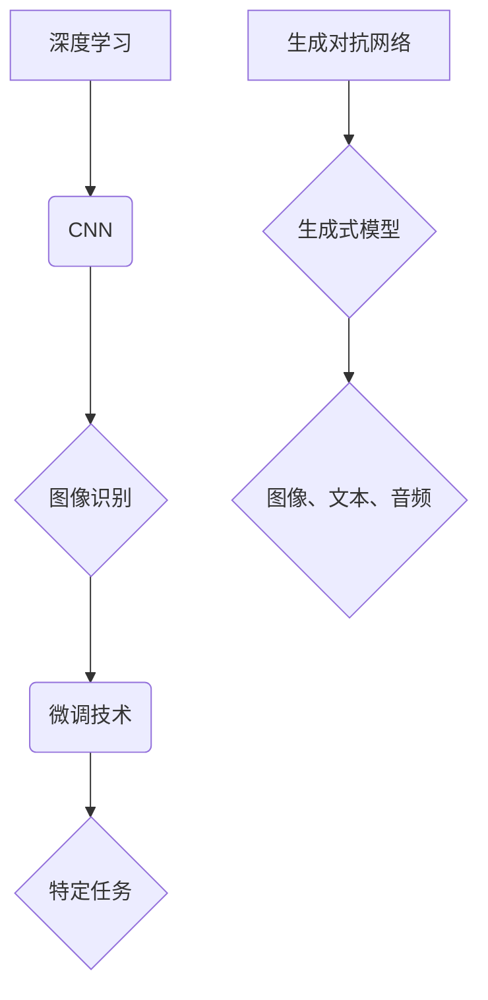

> 计算模型、深度学习、人工智能、自然语言处理、计算机视觉、机器学习、数据科学

## 1. 背景介绍

在信息爆炸的时代，计算正以惊人的速度发展，深刻地改变着我们的生活。从智能手机到自动驾驶，从医疗诊断到金融交易，计算的力量无处不在。而推动这一切进步的，正是不断涌现的计算模型和算法。

Andrej Karpathy，一位享誉全球的计算机科学家，正是这个领域最耀眼的明星之一。他不仅是一位杰出的研究者，也是一位优秀的工程师和作家。他的作品深刻地影响了人工智能的未来发展方向，并为我们提供了洞察计算世界奥秘的宝贵视角。

## 2. 核心概念与联系

Karpathy 的研究主要集中在深度学习和计算机视觉领域。他提出了许多 groundbreaking 的算法和模型，例如：

* **ImageNet 挑战赛的突破:** Karpathy 在 2012 年的 ImageNet 挑战赛中，带领团队使用深度卷积神经网络 (CNN) 实现了图像识别任务的重大突破，标志着深度学习时代的到来。
* **微调技术:** 他提出了微调技术，通过在预训练模型上进行少量数据训练，可以有效地提高模型在特定任务上的性能。
* **生成对抗网络 (GAN):** Karpathy 对 GAN 的研究也做出了重要贡献，推动了生成式模型的发展，使其能够生成逼真的图像、文本和音频。

这些核心概念相互关联，共同构成了 Karpathy 研究体系的基石。



## 3. 核心算法原理 & 具体操作步骤

### 3.1  算法原理概述

Karpathy 的研究成果主要基于深度学习算法，特别是卷积神经网络 (CNN)。CNN 是一种专门用于处理图像数据的网络结构，它能够自动学习图像特征，并进行分类、识别等任务。

### 3.2  算法步骤详解

1. **数据预处理:** 将图像数据转换为适合 CNN 处理的格式，例如调整大小、归一化等。
2. **卷积层:** 使用卷积核对图像进行卷积运算，提取图像特征。
3. **池化层:** 对卷积层的输出进行池化操作，减少数据维度，提高计算效率。
4. **全连接层:** 将池化层的输出连接到全连接层，进行分类或回归任务。
5. **损失函数:** 使用损失函数衡量模型预测结果与真实值的差异。
6. **反向传播:** 使用反向传播算法更新模型参数，降低损失函数值。

### 3.3  算法优缺点

**优点:**

* 能够自动学习图像特征，无需人工设计特征。
* 性能优异，在图像识别、物体检测等任务中取得了突破性进展。

**缺点:**

* 训练数据量大，需要大量的标注数据。
* 计算资源消耗大，训练时间长。

### 3.4  算法应用领域

CNN 广泛应用于图像识别、物体检测、图像分割、人脸识别、医疗诊断等领域。

## 4. 数学模型和公式 & 详细讲解 & 举例说明

### 4.1  数学模型构建

CNN 的数学模型主要基于线性变换和非线性激活函数。

* **线性变换:** 卷积层和全连接层使用矩阵乘法进行线性变换，将输入数据映射到输出空间。
* **非线性激活函数:** 激活函数引入非线性因素，使模型能够学习更复杂的特征。常用的激活函数包括 ReLU、Sigmoid 和 Tanh。

### 4.2  公式推导过程

* **卷积运算:**

$$
y_{i,j} = \sum_{m=0}^{M-1} \sum_{n=0}^{N-1} x_{i+m,j+n} * w_{m,n}
$$

其中，$x_{i,j}$ 是输入图像的像素值，$w_{m,n}$ 是卷积核的权重，$y_{i,j}$ 是卷积层的输出值。

* **池化运算:**

$$
y_{i,j} = \max(x_{i,j}, x_{i+1,j}, x_{i,j+1}, x_{i+1,j+1})
$$

其中，$x_{i,j}$ 是池化区域内的像素值，$y_{i,j}$ 是池化层的输出值。

### 4.3  案例分析与讲解

以图像识别为例，CNN 可以学习到图像的边缘、纹理、形状等特征，并将其用于分类不同类型的物体。

## 5. 项目实践：代码实例和详细解释说明

### 5.1  开发环境搭建

使用 Python 语言和 TensorFlow 或 PyTorch 深度学习框架进行开发。

### 5.2  源代码详细实现

```python
import tensorflow as tf

# 定义 CNN 模型
model = tf.keras.models.Sequential([
    tf.keras.layers.Conv2D(32, (3, 3), activation='relu', input_shape=(28, 28, 1)),
    tf.keras.layers.MaxPooling2D((2, 2)),
    tf.keras.layers.Conv2D(64, (3, 3), activation='relu'),
    tf.keras.layers.MaxPooling2D((2, 2)),
    tf.keras.layers.Flatten(),
    tf.keras.layers.Dense(10, activation='softmax')
])

# 编译模型
model.compile(optimizer='adam',
              loss='sparse_categorical_crossentropy',
              metrics=['accuracy'])

# 训练模型
model.fit(x_train, y_train, epochs=5)

# 评估模型
loss, accuracy = model.evaluate(x_test, y_test)
print('Test loss:', loss)
print('Test accuracy:', accuracy)
```

### 5.3  代码解读与分析

* **定义 CNN 模型:** 使用 TensorFlow 的 Keras API 定义 CNN 模型，包括卷积层、池化层、全连接层等。
* **编译模型:** 使用 Adam 优化器、交叉熵损失函数和准确率指标编译模型。
* **训练模型:** 使用训练数据训练模型，设置训练轮数。
* **评估模型:** 使用测试数据评估模型的性能，输出测试损失和准确率。

### 5.4  运行结果展示

训练完成后，模型能够对图像进行分类，并输出相应的类别概率。

## 6. 实际应用场景

### 6.1  图像识别

* **自动驾驶:** 识别道路、交通信号灯、行人等物体，辅助车辆驾驶。
* **医疗诊断:** 识别病灶、肿瘤等异常区域，辅助医生诊断疾病。
* **安防监控:** 识别嫌疑人、违规行为等，提高安防效率。

### 6.2  物体检测

* **无人零售:** 识别商品、计算库存，实现无人售货。
* **智能制造:** 检测产品缺陷、识别零件，提高生产效率。
* **机器人视觉:** 帮助机器人识别周围环境、抓取物体。

### 6.3  图像分割

* **医学影像分析:** 将医学影像分割成不同的器官或组织，辅助医生进行诊断和治疗。
* **遥感图像分析:** 将遥感图像分割成不同的地物类型，用于土地利用规划和环境监测。
* **自动驾驶:** 将道路分割成车道、人行道等区域，辅助车辆规划路径。

### 6.4  未来应用展望

随着计算能力的不断提升和算法的不断发展，CNN 将在更多领域得到应用，例如：

* **生成式模型:** 生成逼真的图像、视频、音频等内容。
* **自然语言处理:** 理解和生成人类语言，用于机器翻译、聊天机器人等应用。
* **科学研究:** 辅助科学家进行数据分析、模型构建和实验设计。

## 7. 工具和资源推荐

### 7.1  学习资源推荐

* **书籍:**
    * Deep Learning by Ian Goodfellow, Yoshua Bengio, and Aaron Courville
    * Hands-On Machine Learning with Scikit-Learn, Keras & TensorFlow by Aurélien Géron
* **在线课程:**
    * Deep Learning Specialization by Andrew Ng (Coursera)
    * Fast.ai
* **博客和网站:**
    * Andrej Karpathy's Blog: https://karpathy.github.io/
    * TensorFlow Blog: https://blog.tensorflow.org/
    * PyTorch Blog: https://pytorch.org/blog/

### 7.2  开发工具推荐

* **Python:** 
* **TensorFlow:** https://www.tensorflow.org/
* **PyTorch:** https://pytorch.org/
* **Keras:** https://keras.io/

### 7.3  相关论文推荐

* ImageNet Classification with Deep Convolutional Neural Networks by Alex Krizhevsky, Ilya Sutskever, and Geoffrey E. Hinton
* Generative Adversarial Networks by Ian Goodfellow, Jean Pouget-Abadie, Mehdi Mirza, Bing Xu, David Warde-Farley, Sherjil Ozair, Aaron Courville, and Yoshua Bengio

## 8. 总结：未来发展趋势与挑战

### 8.1  研究成果总结

Karpathy 的研究成果对深度学习和人工智能的发展做出了重要贡献，推动了计算机视觉、自然语言处理等领域的进步。

### 8.2  未来发展趋势

* **模型规模和效率:** 继续追求更大规模、更高效的深度学习模型，以提高模型性能和应用范围。
* **数据增强和泛化能力:** 研究新的数据增强技术和模型训练方法，提高模型的泛化能力，使其能够更好地适应不同的应用场景。
* **解释性和可解释性:** 研究深度学习模型的内部机制，提高模型的解释性和可解释性，使其能够更好地被人类理解和信任。

### 8.3  面临的挑战

* **数据获取和标注:** 深度学习模型需要大量的标注数据，数据获取和标注成本高昂。
* **计算资源:** 训练大型深度学习模型需要大量的计算资源，成本高昂。
* **伦理和社会影响:** 深度学习技术的应用可能带来伦理和社会问题，需要谨慎考虑和应对。

### 8.4  研究展望

未来，深度学习研究将继续朝着更强大、更智能、更安全的方向发展，为人类社会带来更多福祉。

## 9. 附录：常见问题与解答

* **什么是卷积神经网络 (CNN)?**

CNN 是一种专门用于处理图像数据的深度学习网络结构，它能够自动学习图像特征，并进行分类、识别等任务。

* **如何训练 CNN 模型?**

训练 CNN 模型需要使用大量的标注数据，并使用反向传播算法更新模型参数，降低损失函数值。

* **CNN 模型有哪些应用场景?**

CNN 广泛应用于图像识别、物体检测、图像分割、人脸识别、医疗诊断等领域。


作者：禅与计算机程序设计艺术 / Zen and the Art of Computer Programming 
<end_of_turn>