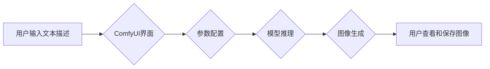

> ComfyUI, Stable Diffusion, AI图像生成, 可视化操作, 工作流设计, 扩散模型

## 1. 背景介绍

近年来，人工智能领域取得了令人瞩目的进展，其中生成式模型尤为引人注目。作为一种强大的文本到图像生成模型，Stable Diffusion 凭借其开源、易于部署和高生成质量的特点，迅速成为研究和应用的热点。然而，Stable Diffusion 的原版代码主要以命令行方式运行，对于非技术人员或缺乏编程经验的用户来说，操作较为复杂。

为了降低使用门槛，并提供更直观、易于操作的体验，ComfyUI 应运而生。ComfyUI 是一款基于 Stable Diffusion 的可视化操作界面，它通过图形化界面和拖放操作，使得用户能够轻松地配置和控制图像生成过程，无需编写任何代码。

## 2. 核心概念与联系

ComfyUI 的核心概念是将 Stable Diffusion 的复杂参数和操作流程，通过可视化界面进行抽象和封装，并提供用户友好的交互方式。

**ComfyUI 工作流程:**

**核心概念:**

* **文本描述:** 用户输入想要生成的图像的文本描述，称为“Prompt”。
* **参数配置:** ComfyUI 提供了丰富的参数配置选项，用户可以根据需要调整图像的风格、分辨率、细节程度等方面。
* **模型推理:** ComfyUI 将用户输入的文本描述和参数配置，传递给 Stable Diffusion 模型进行推理，生成图像。
* **图像生成:** Stable Diffusion 模型根据推理结果，生成最终的图像。
* **用户交互:** ComfyUI 提供了多种交互方式，例如拖放、滑块调整、按钮点击等，方便用户进行参数配置和图像预览。

## 3. 核心算法原理 & 具体操作步骤

### 3.1  算法原理概述

Stable Diffusion 是一种基于扩散模型的文本到图像生成模型。其核心原理是通过逐步添加噪声，将图像转换为纯噪声，然后反向学习，将纯噪声转换为图像。

**扩散模型的工作原理:**

1. **前向过程 (添加噪声):** 将图像逐步添加噪声，直到变成纯噪声。
2. **反向过程 (去除噪声):** 学习一个生成器网络，从纯噪声中逐步去除噪声，最终生成图像。

### 3.2  算法步骤详解

1. **训练阶段:**

* 使用大量图像数据和对应的文本描述，训练生成器网络和判别器网络。
* 生成器网络学习从纯噪声中生成图像。
* 判别器网络学习区分真实图像和生成器生成的图像。

2. **生成阶段:**

* 将用户输入的文本描述转换为图像嵌入向量。
* 将纯噪声作为输入，传递给生成器网络。
* 生成器网络根据图像嵌入向量和噪声，逐步去除噪声，生成图像。

### 3.3  算法优缺点

**优点:**

* 生成图像质量高，细节丰富。
* 可生成多种风格的图像。
* 模型开源，易于部署和修改。

**缺点:**

* 训练过程耗时和资源消耗大。
* 生成图像可能存在一些噪点或不自然的地方。

### 3.4  算法应用领域

* **图像生成:** 生成艺术作品、产品设计、场景设计等。
* **图像编辑:** 修复图像、添加元素、改变图像风格等。
* **文本到图像:** 根据文本描述生成图像。
* **人工智能辅助创作:** 帮助艺术家、设计师等进行创作。

## 4. 数学模型和公式 & 详细讲解 & 举例说明

### 4.1  数学模型构建

Stable Diffusion 模型主要由两个网络组成：生成器网络 (Generator) 和判别器网络 (Discriminator)。

* **生成器网络:** 负责从纯噪声中生成图像。
* **判别器网络:** 负责区分真实图像和生成器生成的图像。

### 4.2  公式推导过程

Stable Diffusion 模型的训练过程基于最小二乘法和变分自编码器 (VAE) 的思想。

* **损失函数:**

$$
L = L_{GAN} + L_{VAE}
$$

其中:

* $L_{GAN}$ 是生成对抗网络 (GAN) 的损失函数，用于训练生成器网络和判别器网络。
* $L_{VAE}$ 是变分自编码器的损失函数，用于学习图像的潜在表示。

### 4.3  案例分析与讲解

假设我们想要生成一张“一只可爱的猫”的图像。

1. 用户输入文本描述“一只可爱的猫”。
2. ComfyUI 将文本描述转换为图像嵌入向量。
3. 生成器网络接收纯噪声和图像嵌入向量作为输入，并逐步去除噪声，生成图像。
4. 判别器网络判断生成的图像是否真实。
5. 根据判别器的反馈，生成器网络不断调整参数，优化图像生成结果。

## 5. 项目实践：代码实例和详细解释说明

### 5.1  开发环境搭建

ComfyUI 的开发环境主要包括 Python、PyTorch 和相关库。

* **Python:** 作为 ComfyUI 的编程语言。
* **PyTorch:** 用于构建和训练深度学习模型。
* **相关库:** 例如 NumPy、Pillow、Transformers 等。

### 5.2  源代码详细实现

ComfyUI 的源代码主要包含以下部分:

* **用户界面:** 使用 PyQT 或其他 GUI 库构建用户界面。
* **参数配置:** 定义和管理 ComfyUI 的各种参数配置选项。
* **模型加载:** 加载 Stable Diffusion 模型和权重文件。
* **图像生成:** 调用 Stable Diffusion 模型进行图像生成。
* **图像显示:** 显示生成的图像并提供保存功能。

### 5.3  代码解读与分析

ComfyUI 的代码实现主要围绕着用户界面、参数配置、模型加载、图像生成和图像显示等功能模块展开。

* **用户界面:** 提供了文本输入框、参数滑块、按钮等控件，方便用户进行交互。
* **参数配置:** 定义了各种参数配置选项，例如图像分辨率、风格、细节程度等。
* **模型加载:** 使用 PyTorch 加载 Stable Diffusion 模型和权重文件。
* **图像生成:** 调用 Stable Diffusion 模型进行图像生成，并根据用户配置调整参数。
* **图像显示:** 使用 Pillow 库显示生成的图像，并提供保存功能。

### 5.4  运行结果展示

ComfyUI 可以生成高质量的图像，并根据用户配置调整图像风格、分辨率、细节程度等方面。

## 6. 实际应用场景

### 6.1  艺术创作

ComfyUI 可以帮助艺术家生成各种风格的艺术作品，例如抽象画、风景画、人物肖像等。

### 6.2  产品设计

ComfyUI 可以帮助设计师快速生成产品原型，例如手机、家具、服装等。

### 6.3  游戏开发

ComfyUI 可以帮助游戏开发者生成游戏场景、角色、道具等。

### 6.4  未来应用展望

ComfyUI 的未来应用前景广阔，例如：

* **个性化图像生成:** 根据用户的喜好和需求，生成个性化的图像。
* **虚拟现实和增强现实:** 在虚拟现实和增强现实场景中使用 ComfyUI 生成图像。
* **教育和培训:** 使用 ComfyUI 进行图像识别、图像分类等教育和培训。

## 7. 工具和资源推荐

### 7.1  学习资源推荐

* **Stable Diffusion 官方文档:** https://stability.ai/blog/stable-diffusion-v1-release
* **ComfyUI 官方文档:** https://github.com/AUTOMATIC1111/stable-diffusion-webui
* **PyTorch 官方文档:** https://pytorch.org/docs/stable/index.html

### 7.2  开发工具推荐

* **PyCharm:** Python 开发环境。
* **VS Code:** 代码编辑器。
* **Git:** 版本控制系统。

### 7.3  相关论文推荐

* **Diffusion Models Beat GANs on Image Synthesis:** https://arxiv.org/abs/2006.11239
* **High-Resolution Image Synthesis with Latent Diffusion Models:** https://arxiv.org/abs/2112.10752

## 8. 总结：未来发展趋势与挑战

### 8.1  研究成果总结

ComfyUI 为 Stable Diffusion 的应用提供了更直观、易于操作的界面，降低了使用门槛，促进了 Stable Diffusion 的普及和应用。

### 8.2  未来发展趋势

* **更强大的模型:** 研究更强大的扩散模型，提高图像生成质量和多样性。
* **更丰富的功能:** 添加更多功能，例如图像编辑、视频生成等。
* **更智能的交互:** 使用自然语言处理技术，实现更智能的交互方式。

### 8.3  面临的挑战

* **模型训练成本:** 训练大型扩散模型需要大量的计算资源和时间。
* **数据安全:** 扩散模型的训练需要大量图像数据，如何保证数据安全是一个重要问题。
* **伦理问题:** 扩散模型可以生成逼真的图像，如何防止其被用于恶意目的，例如生成虚假信息，是一个需要认真考虑的伦理问题。

### 8.4  研究展望

未来，ComfyUI 将继续发展，成为更强大、更智能、更易于使用的图像生成工具，为人们的生活和工作带来更多便利。

## 9. 附录：常见问题与解答

**Q1: 如何安装 ComfyUI？**

**A1:** 请参考 ComfyUI 官方文档中的安装说明。

**Q2: 如何配置 ComfyUI 的参数？**

**A2:** ComfyUI 提供了丰富的参数配置选项，用户可以通过界面进行调整。

**Q3: 如何保存生成的图像？**

**A3:** ComfyUI 提供了保存生成的图像的功能，用户可以将图像保存到本地文件系统。

作者：禅与计算机程序设计艺术 / Zen and the Art of Computer Programming 
<end_of_turn>