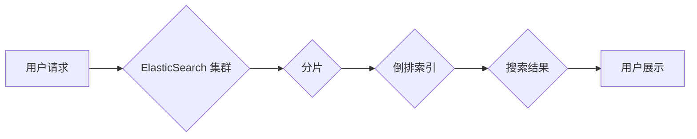

ElasticSearch, 搜索引擎, NoSQL, 分布式, 索引, 查询, 存储, 性能优化

## 1. 背景介绍

在当今数据爆炸的时代，高效地存储、检索和分析海量数据成为了企业和研究机构面临的重大挑战。传统的关系型数据库在处理海量数据时存在效率低下、扩展困难等问题。为了解决这些问题，NoSQL数据库应运而生，其中ElasticSearch作为一款开源、分布式、基于RESTful API的搜索和分析引擎，凭借其强大的搜索能力、灵活的数据模型和高性能的特点，在海量数据处理领域得到了广泛应用。

ElasticSearch的核心思想是将数据存储在分片化的索引中，并使用倒排索引技术实现快速搜索。它支持多种数据类型，包括文本、数字、日期、地理位置等，并提供丰富的查询语法和分析功能，能够满足各种数据分析需求。

## 2. 核心概念与联系

ElasticSearch的核心概念包括：

* **索引 (Index):** 类似于数据库表，用于存储数据。每个索引包含多个分片。
* **分片 (Shard):** 将索引数据分割成多个独立的部分，用于提高数据处理效率和容错能力。
* **副本 (Replica):** 每个分片可以有多个副本，用于数据备份和高可用性。
* **倒排索引 (Inverted Index):** 将文档中的关键词映射到包含该关键词的文档列表，实现快速搜索。
* **映射 (Mapping):** 定义了每个文档的结构和数据类型。

**ElasticSearch 架构流程图:**



## 3. 核心算法原理 & 具体操作步骤

### 3.1  算法原理概述

ElasticSearch的核心算法包括倒排索引、分片、副本、数据分发等。

* **倒排索引:** 
ElasticSearch使用倒排索引技术实现快速搜索。倒排索引将文档中的关键词映射到包含该关键词的文档列表，从而可以快速定位包含特定关键词的文档。

* **分片:** 
将索引数据分片化可以提高数据处理效率和容错能力。每个分片可以独立运行，并可以分布在不同的节点上，从而可以提高数据处理吞吐量和容错能力。

* **副本:** 
每个分片可以有多个副本，用于数据备份和高可用性。如果一个节点发生故障，则可以从其他节点的副本中恢复数据。

### 3.2  算法步骤详解

1. **数据导入:** 将数据导入ElasticSearch索引。
2. **数据分片:** 将数据分片化，并分配到不同的节点上。
3. **倒排索引构建:** 构建倒排索引，将文档中的关键词映射到包含该关键词的文档列表。
4. **查询:** 用户提交查询请求，ElasticSearch根据倒排索引快速定位包含特定关键词的文档。
5. **结果返回:** ElasticSearch返回包含特定关键词的文档列表。

### 3.3  算法优缺点

**优点:**

* **高性能:** 倒排索引技术和分片机制可以实现快速搜索和高吞吐量。
* **高可用性:** 副本机制可以保证数据的高可用性。
* **灵活的数据模型:** 支持多种数据类型和结构。
* **丰富的查询功能:** 提供丰富的查询语法和分析功能。

**缺点:**

* **复杂性:** ElasticSearch的架构和算法相对复杂，需要一定的学习成本。
* **资源消耗:** ElasticSearch需要消耗一定的硬件资源，例如内存和磁盘空间。

### 3.4  算法应用领域

ElasticSearch广泛应用于以下领域:

* **搜索引擎:** 用于构建企业级搜索引擎，例如网站搜索、产品搜索等。
* **日志分析:** 用于收集和分析日志数据，例如系统日志、应用程序日志等。
* **监控和告警:** 用于监控系统性能和应用程序状态，并触发告警。
* **数据分析:** 用于分析海量数据，例如用户行为分析、市场趋势分析等。

## 4. 数学模型和公式 & 详细讲解 & 举例说明

### 4.1  数学模型构建

ElasticSearch的搜索算法可以抽象为一个数学模型，其中：

* **文档集合:** D = {d1, d2, ..., dn}，其中di表示第i个文档。
* **查询词:** q，表示用户输入的查询词。
* **倒排索引:** I(q)，表示包含查询词q的文档列表。

### 4.2  公式推导过程

ElasticSearch的搜索结果可以根据以下公式计算：

```
Score(di, q) = tf(di, q) * idf(q)
```

其中：

* **Score(di, q):** 文档di对查询q的得分。
* **tf(di, q):** 文档di中查询词q的词频。
* **idf(q):** 查询词q在整个文档集合中的逆向文档频率。

### 4.3  案例分析与讲解

假设有一个文档集合D，包含以下三个文档：

* d1: "ElasticSearch is a powerful search engine."
* d2: "ElasticSearch is used for log analysis."
* d3: "ElasticSearch is a distributed database."

用户输入查询词"ElasticSearch"，则：

* I("ElasticSearch") = {d1, d2, d3}
* tf(d1, "ElasticSearch") = 1
* tf(d2, "ElasticSearch") = 1
* tf(d3, "ElasticSearch") = 1
* idf("ElasticSearch") = log(3/3) = 0

因此，每个文档对查询词"ElasticSearch"的得分都是：

* Score(d1, "ElasticSearch") = 1 * 0 = 0
* Score(d2, "ElasticSearch") = 1 * 0 = 0
* Score(d3, "ElasticSearch") = 1 * 0 = 0

## 5. 项目实践：代码实例和详细解释说明

### 5.1  开发环境搭建

* Java Development Kit (JDK) 8 或更高版本
* ElasticSearch 7.x 或更高版本
* Maven 或 Gradle 构建工具

### 5.2  源代码详细实现

```java
import org.elasticsearch.action.index.IndexRequest;
import org.elasticsearch.action.index.IndexResponse;
import org.elasticsearch.client.RequestOptions;
import org.elasticsearch.client.RestHighLevelClient;
import org.elasticsearch.common.xcontent.XContentType;

public class ElasticSearchExample {

    public static void main(String[] args) throws Exception {
        // 创建ElasticSearch客户端
        RestHighLevelClient client = new RestHighLevelClient();

        // 创建文档
        String json = "{
" +
                "  \"name\": \"John Doe\",
" +
                "  \"age\": 30,
" +
                "  \"city\": \"New York\"
" +
                "}";

        IndexRequest request = new IndexRequest("my_index", "my_type").source(json, XContentType.JSON);

        // 发送请求
        IndexResponse response = client.index(request, RequestOptions.DEFAULT);

        // 打印响应
        System.out.println(response.toString());

        // 关闭客户端
        client.close();
    }
}
```

### 5.3  代码解读与分析

* **创建ElasticSearch客户端:** 使用RestHighLevelClient类创建ElasticSearch客户端，用于与ElasticSearch集群进行通信。
* **创建文档:** 使用IndexRequest类创建文档请求，指定索引名称、文档类型、文档内容和内容类型。
* **发送请求:** 使用client.index()方法发送文档请求到ElasticSearch集群。
* **打印响应:** 打印响应信息，包括文档ID和状态码。
* **关闭客户端:** 关闭ElasticSearch客户端，释放资源。

### 5.4  运行结果展示

运行代码后，会输出类似以下的响应信息：

```
{
  "index" : "my_index",
  "type" : "my_type",
  "_id" : "1",
  "_version" : 1,
  "result" : "created",
  "_shards" : {
    "total" : 2,
    "successful" : 1,
    "failed" : 0
  },
  "_seq_no" : 0,
  "_primary_term" : 1
}
```

## 6. 实际应用场景

### 6.1  搜索引擎

ElasticSearch可以构建高性能的搜索引擎，例如网站搜索、产品搜索、知识库搜索等。

### 6.2  日志分析

ElasticSearch可以收集和分析海量日志数据，例如系统日志、应用程序日志、安全日志等，帮助用户快速定位问题和进行故障诊断。

### 6.3  监控和告警

ElasticSearch可以监控系统性能和应用程序状态，并根据预设规则触发告警，帮助用户及时发现和解决问题。

### 6.4  未来应用展望

ElasticSearch在未来将继续发展，并应用于更多领域，例如：

* **机器学习:** ElasticSearch可以与机器学习算法结合，实现数据分析、预测和推荐等功能。
* **物联网:** ElasticSearch可以处理海量物联网数据，帮助用户进行设备监控、数据分析和应用开发。
* **云计算:** ElasticSearch可以作为云计算平台的一部分，提供搜索、分析和数据存储服务。

## 7. 工具和资源推荐

### 7.1  学习资源推荐

* **ElasticSearch官方文档:** https://www.elastic.co/guide/en/elasticsearch/reference/current/index.html
* **ElasticSearch中文社区:** https://www.elastic.co/cn/community
* **ElasticSearch Udemy课程:** https://www.udemy.com/topic/elasticsearch/

### 7.2  开发工具推荐

* **ElasticSearch客户端:** https://www.elastic.co/guide/en/elasticsearch/client/java-rest/current/java-rest-client.html
* **Kibana:** https://www.elastic.co/products/kibana

### 7.3  相关论文推荐

* **Elasticsearch: A Distributed, Scalable Search Engine:** https://www.elastic.co/blog/elasticsearch-a-distributed-scalable-search-engine

## 8. 总结：未来发展趋势与挑战

### 8.1  研究成果总结

ElasticSearch作为一款开源、分布式、高性能的搜索引擎，在海量数据处理领域取得了显著的成果。其倒排索引技术、分片机制、副本机制等核心算法，为用户提供了高效、可靠的数据存储和检索服务。

### 8.2  未来发展趋势

ElasticSearch未来将继续朝着以下方向发展：

* **更强大的机器学习功能:** 将机器学习算法集成到ElasticSearch中，实现数据分析、预测和推荐等功能。
* **更完善的云原生支持:** 更好地支持云计算平台，提供更灵活、更弹性的服务。
* **更丰富的应用场景:** 应用于更多领域，例如物联网、金融、医疗等。

### 8.3  面临的挑战

ElasticSearch也面临一些挑战，例如：

* **数据安全:** 如何保障海量数据的安全性和隐私性。
* **性能优化:** 如何进一步提高ElasticSearch的性能和吞吐量。
* **生态系统建设:** 如何构建更完善的ElasticSearch生态系统，吸引更多开发者和用户。

### 8.4  研究展望

未来，我们将继续研究ElasticSearch的算法、架构和应用，探索其在更多领域中的应用潜力，并致力于解决ElasticSearch面临的挑战，推动ElasticSearch的发展和进步。

## 9. 附录：常见问题与解答

### 9.1  ElasticSearch索引类型有哪些？

ElasticSearch支持多种索引类型，包括：

* **文档类型:** 存储结构化数据，例如用户、产品等。
* **地理空间类型:** 存储地理位置数据，例如地图、位置信息等。