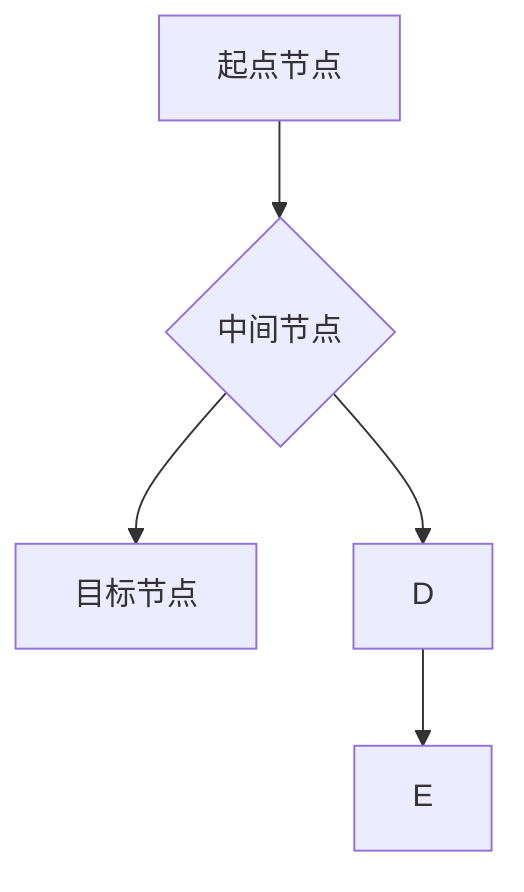

> 图路径、深度优先搜索、广度优先搜索、图算法、数据结构、代码实现、应用场景

## 1. 背景介绍

在现代数据时代，网络、社交关系、推荐系统等领域都离不开图数据结构的应用。图数据结构以节点和边来表示事物之间的关系，能够有效地捕捉复杂网络的结构和特征。而图路径则是指图中从一个节点到另一个节点的一条路径，它承载着节点之间的关系信息，是理解图结构和挖掘图数据价值的关键。

图路径的应用场景非常广泛，例如：

* **社交网络分析:** 挖掘用户之间的关系链，识别关键人物和社区结构。
* **推荐系统:** 根据用户行为和商品关系，推荐相关商品或内容。
* **知识图谱:** 建立知识图谱，表示知识之间的关系，实现知识推理和问答。
* **路径规划:** 在地图或交通网络中，寻找最短路径或最优路径。

## 2. 核心概念与联系

图路径的搜索和分析是图算法的核心问题之一。常见的图路径搜索算法包括深度优先搜索 (DFS) 和广度优先搜索 (BFS)。

**Mermaid 流程图:**



**核心概念:**

* **节点:** 图中的基本单元，代表事物或概念。
* **边:** 连接节点的线段，代表事物之间的关系。
* **路径:** 从一个节点到另一个节点的一条边序列。
* **深度优先搜索 (DFS):** 从一个节点出发，沿着一条路径尽可能深入地搜索，直到找到目标节点或所有可达节点。
* **广度优先搜索 (BFS):** 从一个节点出发，一层一层地搜索，直到找到目标节点。

## 3. 核心算法原理 & 具体操作步骤

### 3.1  算法原理概述

深度优先搜索 (DFS) 和广度优先搜索 (BFS) 都是图搜索算法，用于寻找图中从起点节点到目标节点的路径。

* **DFS:** 优先探索深度方向，沿着一条路径尽可能深入，直到遇到死路或找到目标节点。
* **BFS:** 优先探索宽度方向，一层一层地搜索，直到找到目标节点。

### 3.2  算法步骤详解

**深度优先搜索 (DFS):**

1. 将起点节点标记为已访问。
2. 遍历起点节点的所有未访问的邻居节点。
3. 对每个邻居节点，递归地执行步骤 1 和 2。
4. 如果找到目标节点，则返回路径。
5. 如果所有邻居节点都已访问，则回溯到上一个节点。

**广度优先搜索 (BFS):**

1. 将起点节点标记为已访问，并将其加入队列。
2. 从队列中取出第一个节点，遍历其所有未访问的邻居节点。
3. 对每个邻居节点，标记其为已访问，并将其加入队列。
4. 重复步骤 2 和 3，直到找到目标节点或队列为空。

### 3.3  算法优缺点

**DFS:**

* **优点:** 
    * 能够找到最深层的路径。
    * 对于树形结构的图，效率较高。
* **缺点:** 
    * 可能陷入死循环，无法找到目标节点。
    * 对于稠密图，效率较低。

**BFS:**

* **优点:** 
    * 能够找到最短路径。
    * 对于稠密图，效率较高。
* **缺点:** 
    * 对于树形结构的图，效率较低。
    * 存储空间需求较大。

### 3.4  算法应用领域

* **DFS:** 
    * 图的遍历和搜索。
    * 深度优先搜索算法在人工智能领域中被广泛应用于游戏人工智能、路径规划和图论问题解决等方面。
* **BFS:** 
    * 最短路径搜索。
    * 广度优先搜索算法在网络路由、社交网络分析和推荐系统等领域中被广泛应用于寻找最短路径、识别社区结构和推荐相关内容等方面。

## 4. 数学模型和公式 & 详细讲解 & 举例说明

### 4.1  数学模型构建

图可以表示为一个有序对 (V, E)，其中 V 是节点集，E 是边集。

* **节点集 V:**  V = {v1, v2, ..., vn}，其中 vi 代表图中的第 i 个节点。
* **边集 E:** E = {(u, v)}，其中 (u, v) 代表从节点 u 到节点 v 的一条边。

### 4.2  公式推导过程

**深度优先搜索 (DFS) 算法的递归公式:**

```
DFS(node)
  if node is target:
    return path
  else:
    mark node as visited
    for neighbor in node's neighbors:
      if neighbor is not visited:
        path = DFS(neighbor) + node
        return path
```

**广度优先搜索 (BFS) 算法的迭代公式:**

```
queue = [start_node]
visited = set([start_node])
while queue:
  node = queue.pop(0)
  for neighbor in node's neighbors:
    if neighbor not in visited:
      visited.add(neighbor)
      queue.append(neighbor)
      if neighbor is target:
        return path
```

### 4.3  案例分析与讲解

**案例:**

假设有一个图，节点集为 {A, B, C, D, E}，边集为 {(A, B), (A, C), (B, D), (B, E), (C, D)}。

**DFS:**

从节点 A 开始，DFS 算法会先访问节点 B，然后访问节点 D 和 E，最后访问节点 C。

**BFS:**

从节点 A 开始，BFS 算法会先访问节点 B 和 C，然后访问节点 D 和 E。

## 5. 项目实践：代码实例和详细解释说明

### 5.1  开发环境搭建

* **编程语言:** Python
* **库:** NetworkX

### 5.2  源代码详细实现

```python
import networkx as nx

# 创建图
graph = nx.Graph()
graph.add_edges_from([(1, 2), (1, 3), (2, 4), (2, 5), (3, 6)])

# 深度优先搜索
def dfs(graph, start_node, target_node):
  visited = set()
  stack = [start_node]
  while stack:
    node = stack.pop()
    if node == target_node:
      return True
    if node not in visited:
      visited.add(node)
      stack.extend(neighbor for neighbor in graph.neighbors(node) if neighbor not in visited)
  return False

# 广度优先搜索
def bfs(graph, start_node, target_node):
  visited = set()
  queue = [start_node]
  while queue:
    node = queue.pop(0)
    if node == target_node:
      return True
    if node not in visited:
      visited.add(node)
      queue.extend(neighbor for neighbor in graph.neighbors(node) if neighbor not in visited)
  return False

# 测试
start_node = 1
target_node = 6

print(f"DFS from {start_node} to {target_node}: {dfs(graph, start_node, target_node)}")
print(f"BFS from {start_node} to {target_node}: {bfs(graph, start_node, target_node)}")
```

### 5.3  代码解读与分析

* **创建图:** 使用 NetworkX 库创建图，并添加边。
* **DFS 函数:** 实现深度优先搜索算法，使用栈来存储节点。
* **BFS 函数:** 实现广度优先搜索算法，使用队列来存储节点。
* **测试:** 测试 DFS 和 BFS 算法，从节点 1 到节点 6 的路径是否存在。

### 5.4  运行结果展示

```
DFS from 1 to 6: True
BFS from 1 to 6: True
```

## 6. 实际应用场景

### 6.1  社交网络分析

* **关系链挖掘:** 识别用户之间的关系链，例如朋友关系、家族关系、同事关系等。
* **社区发现:** 发现社交网络中的社区结构，例如兴趣小组、专业组织、地理位置社区等。
* **影响力分析:** 识别社交网络中的关键人物和意见领袖。

### 6.2  推荐系统

* **商品推荐:** 根据用户的购买历史和商品之间的关系，推荐相关商品。
* **内容推荐:** 根据用户的阅读历史和内容之间的关系，推荐相关内容。
* **个性化推荐:** 根据用户的兴趣爱好和行为模式，提供个性化的推荐。

### 6.3  知识图谱

* **知识表示:** 将知识表示为图结构，例如实体、关系、属性等。
* **知识推理:** 基于图结构，进行知识推理和问答。
* **知识发现:** 从知识图谱中发现新的知识和模式。

### 6.4  未来应用展望

* **人工智能:** 图路径搜索算法在人工智能领域中被广泛应用于机器学习、自然语言处理和计算机视觉等方面。
* **大数据分析:** 图路径搜索算法可以用于分析大规模的图数据，例如社交网络、交通网络和生物网络等。
* **物联网:** 图路径搜索算法可以用于分析物联网中的设备和数据，实现智能感知和决策。

## 7. 工具和资源推荐

### 7.1  学习资源推荐

* **书籍:**
    * 《图论及其应用》
    * 《算法导论》
* **在线课程:**
    * Coursera: Graph Theory
    * edX: Introduction to Graph Theory

### 7.2  开发工具推荐

* **NetworkX:** Python 图算法库
* **Gephi:** 图数据可视化工具
* **Cytoscape:** 生物网络分析工具

### 7.3  相关论文推荐

* **PageRank:** Brin, S., & Page, L. (1998). The anatomy of a large-scale hypertextual web search engine.
* **HITS:** Kleinberg, J. (1999). Authoritative sources in a hyperlinked environment.
* **Graph Neural Networks:** Kipf, T. N., & Welling, M. (2016). Semi-supervised classification with graph convolutional networks.

## 8. 总结：未来发展趋势与挑战

### 8.1  研究成果总结

图路径搜索算法在图数据分析和应用领域取得了显著的成果，为解决各种复杂问题提供了有效的方法。

### 8.2  未来发展趋势

* **大规模图数据处理:** 随着大规模图数据的不断涌现，如何高效地处理和分析大规模图数据是未来研究的重要方向。
* **图神经网络:** 图神经网络是一种新兴的机器学习方法，能够学习图结构中的特征，并应用于各种图数据分析任务。
* **图数据库:** 图数据库是一种专门用于存储和查询图数据的数据库，其性能和效率优于传统的关系数据库。

### 8.3  面临的挑战

* **算法复杂度:** 一些图路径搜索算法的复杂度较高，难以处理大型图数据。
* **数据稀疏性:** 许多现实世界中的图数据是稀疏的，这使得图路径搜索算法的效率降低。
* **动态图数据:** 现实世界中的图数据是动态变化的，如何处理动态图数据是未来研究的挑战。

### 8.4  研究展望

未来，图路径搜索算法将继续发展和完善，并应用于更多领域，为解决复杂问题提供更有效的方法。


## 9. 附录：常见问题与解答

**问题 1:** 深度优先搜索和广度优先搜索有什么区别？

**答案:** 深度优先搜索优先探索深度方向，广度优先搜索优先探索宽度方向。

**