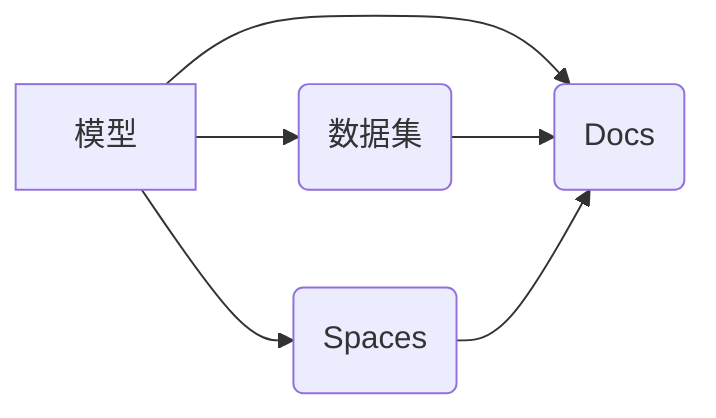

> Hugging Face, 开源社区, 自然语言处理, 机器学习, Transformers, 模型, 数据集, Spaces, Docs

## 1. 背景介绍

在当今数据爆炸的时代，机器学习和深度学习技术蓬勃发展，为解决各种复杂问题提供了强大的工具。然而，开发和部署这些模型往往需要大量的计算资源、专业知识和时间。为了降低技术门槛，促进开源社区的协作和创新，Hugging Face 应运而生。

Hugging Face 是一家致力于构建开源机器学习社区的平台，其核心目标是让每个人都能轻松地使用和贡献机器学习模型。该平台提供了一个丰富的资源库，包含各种预训练模型、数据集、工具和文档，为机器学习爱好者、研究人员和开发者提供了便捷的平台。

## 2. 核心概念与联系

Hugging Face 的核心概念围绕着模型、数据集、Spaces 和 Docs 四个方面展开。

**2.1 模型 (Models)**

Hugging Face 的模型库包含了各种类型的预训练模型，涵盖自然语言处理、计算机视觉、音频处理等多个领域。这些模型经过大量的训练数据训练，具有强大的泛化能力，可以用于各种下游任务，例如文本分类、机器翻译、问答系统等。

**2.2 数据集 (Datasets)**

Hugging Face 的数据集库提供了大量的公开数据集，涵盖文本、图像、音频等多种数据类型。这些数据集可以用于训练和评估机器学习模型，也可以用于进行数据分析和探索。

**2.3 Spaces (Spaces)**

Spaces 是 Hugging Face 提供的一个平台，用于展示和部署机器学习模型。开发者可以将自己的模型上传到 Spaces，并通过简单的界面进行演示和交互。Spaces 允许用户体验模型的功能，并与其他用户分享和协作。

**2.4 Docs (Docs)**

Hugging Face 的文档库提供了丰富的学习资源和技术文档，涵盖机器学习基础知识、模型使用指南、开发工具介绍等方面。文档以清晰易懂的语言撰写，并配有大量的示例代码和案例分析，帮助用户快速入门和掌握 Hugging Face 平台。

**2.5 核心概念关系图**



## 3. 核心算法原理 & 具体操作步骤

Hugging Face 平台支持多种机器学习算法，其中 Transformer 模型最为突出。

### 3.1 算法原理概述

Transformer 模型是一种基于注意力机制的深度学习模型，其核心思想是通过学习文本序列之间的关系来理解和生成文本。与传统的循环神经网络 (RNN) 不同，Transformer 模型能够并行处理整个序列，从而提高训练速度和效率。

Transformer 模型主要由以下几个部分组成：

* **编码器 (Encoder):** 用于将输入文本序列编码成向量表示。
* **解码器 (Decoder):** 用于根据编码后的向量表示生成输出文本序列。
* **注意力机制 (Attention):** 用于学习文本序列之间的关系，并赋予不同词语不同的权重。

### 3.2 算法步骤详解

1. **输入文本序列:** 将输入文本序列分割成一个个词语或子词，并将其转换为数字表示。
2. **编码器处理:** 将数字表示的词语输入到编码器中，编码器通过多层 Transformer 块进行处理，最终将每个词语编码成一个向量表示。
3. **注意力机制:** 在编码器和解码器中，注意力机制用于学习文本序列之间的关系。注意力机制会计算每个词语与其他词语之间的相关性，并根据相关性赋予每个词语不同的权重。
4. **解码器处理:** 解码器接收编码后的向量表示，并通过多层 Transformer 块进行处理，最终生成输出文本序列。
5. **输出文本序列:** 将解码器输出的向量表示转换为文本序列，并进行后处理，例如去除非法的字符或符号。

### 3.3 算法优缺点

**优点:**

* **并行处理能力强:** Transformer 模型能够并行处理整个序列，从而提高训练速度和效率。
* **长距离依赖关系建模能力强:** 注意力机制能够有效地学习文本序列之间的长距离依赖关系。
* **泛化能力强:** 预训练 Transformer 模型在各种下游任务上表现出色。

**缺点:**

* **计算资源需求高:** Transformer 模型参数量大，训练和推理需要大量的计算资源。
* **训练时间长:** 训练 Transformer 模型需要很长时间。

### 3.4 算法应用领域

Transformer 模型在自然语言处理领域有着广泛的应用，例如：

* **机器翻译:** 将一种语言翻译成另一种语言。
* **文本摘要:** 将长文本压缩成短文本。
* **问答系统:** 回答用户提出的问题。
* **文本生成:** 生成新的文本内容。

## 4. 数学模型和公式 & 详细讲解 & 举例说明

Transformer 模型的数学基础是注意力机制和多头注意力机制。

### 4.1 数学模型构建

**4.1.1 注意力机制**

注意力机制的核心思想是学习文本序列之间的关系，并赋予不同词语不同的权重。给定一个输入序列 X = (x1, x2, ..., xn)，注意力机制计算每个词语 xi 与其他词语之间的相关性，并根据相关性计算一个权重向量 αi = (αi1, αi2, ..., αin)。

**公式:**

```latex
αij = softmax(Qij * Kji)
```

其中:

* Qi 和 Kj 分别是词语 xi 和 xj 的查询向量和键向量。
* Qij 和 Kji 是查询向量 Qi 和键向量 Kj 的点积。
* softmax 函数将点积结果转换为概率分布。

**4.1.2 多头注意力机制**

多头注意力机制是将多个注意力机制并行执行，并对结果进行融合。每个注意力机制学习不同的方面，从而提高模型的表达能力。

**公式:**

```latex
MultiHead(Q, K, V) = Concat(head1, head2, ..., headh) * WO
```

其中:

* head1, head2, ..., headh 是每个注意力机制的输出。
* WO 是一个线性变换矩阵。

### 4.2 公式推导过程

注意力机制的公式推导过程可以参考 Transformer 模型的原始论文。

### 4.3 案例分析与讲解

可以以一个具体的机器翻译任务为例，分析 Transformer 模型如何利用注意力机制学习文本序列之间的关系，并生成翻译结果。

## 5. 项目实践：代码实例和详细解释说明

### 5.1 开发环境搭建

使用 Python 语言和 Hugging Face 的 Transformers 库进行开发。

### 5.2 源代码详细实现

```python
from transformers import AutoModelForSeq2SeqLM, AutoTokenizer

# 加载预训练模型和词典
model_name = "Helsinki-NLP/opus-mt-en-fr"
model = AutoModelForSeq2SeqLM.from_pretrained(model_name)
tokenizer = AutoTokenizer.from_pretrained(model_name)

# 输入文本
input_text = "Hello, world!"

# 编码输入文本
input_ids = tokenizer.encode(input_text, return_tensors="pt")

# 生成翻译结果
output = model.generate(input_ids)

# 解码输出结果
translated_text = tokenizer.decode(output[0], skip_special_tokens=True)

# 打印翻译结果
print(translated_text)
```

### 5.3 代码解读与分析

* 使用 `AutoModelForSeq2SeqLM.from_pretrained()` 加载预训练的序列到序列模型。
* 使用 `AutoTokenizer.from_pretrained()` 加载对应的词典。
* 使用 `tokenizer.encode()` 将输入文本编码成数字表示。
* 使用 `model.generate()` 生成翻译结果。
* 使用 `tokenizer.decode()` 将输出结果解码成文本。

### 5.4 运行结果展示

```
Bonjour le monde!
```

## 6. 实际应用场景

Hugging Face 平台的模型、数据集和工具在各个领域都有广泛的应用场景。

### 6.1 自然语言处理

* **机器翻译:** 将一种语言翻译成另一种语言。
* **文本摘要:** 将长文本压缩成短文本。
* **问答系统:** 回答用户提出的问题。
* **文本生成:** 生成新的文本内容。

### 6.2 计算机视觉

* **图像分类:** 将图像分类到不同的类别。
* **目标检测:** 在图像中检测到特定目标。
* **图像分割:** 将图像分割成不同的区域。

### 6.3 音频处理

* **语音识别:** 将语音转换为文本。
* **语音合成:** 将文本转换为语音。
* **音乐生成:** 生成新的音乐内容。

### 6.4 未来应用展望

随着人工智能技术的不断发展，Hugging Face 平台将继续扩展其功能和应用场景，例如：

* **多模态学习:** 将文本、图像、音频等多种数据类型融合在一起进行学习。
* **个性化推荐:** 根据用户的兴趣和偏好进行个性化推荐。
* **自动代码生成:** 自动生成代码，提高开发效率。

## 7. 工具和资源推荐

### 7.1 学习资源推荐

* **Hugging Face 官方文档:** https://huggingface.co/docs
* **Hugging Face Transformers 库文档:** https://huggingface.co/docs/transformers/index
* **机器学习基础知识:** https://www.coursera.org/learn/machine-learning

### 7.2 开发工具推荐

* **Python:** https://www.python.org/
* **Jupyter Notebook:** https://jupyter.org/

### 7.3 相关论文推荐

* **Attention Is All You Need:** https://arxiv.org/abs/1706.03762

## 8. 总结：未来发展趋势与挑战

Hugging Face 平台为机器学习和深度学习的发展做出了重要贡献，其开源社区和丰富的资源库为开发者提供了强大的支持。

### 8.1 研究成果总结

Hugging Face 平台的模型、数据集和工具在各个领域都有广泛的应用，并取得了显著的成果。

### 8.2 未来发展趋势

Hugging Face 平台将继续发展，朝着以下方向发展：

* **多模态学习:** 将文本、图像、音频等多种数据类型融合在一起进行学习。
* **个性化推荐:** 根据用户的兴趣和偏好进行个性化推荐。
* **自动代码生成:** 自动生成代码，提高开发效率。

### 8.3 面临的挑战

Hugging Face 平台也面临着一些挑战，例如：

* **模型规模和训练成本:** 大型模型的训练成本很高，需要大量的计算资源。
* **数据质量和偏见:** 数据质量和偏见会影响模型的性能和公平性。
* **开源社区的维护和发展:** 需要持续的社区参与和贡献来维护和发展开源平台。

### 8.4 研究展望

未来，Hugging Face 平台将继续推动机器学习和深度学习的发展，并为解决社会问题提供新的解决方案。

## 9. 附录：常见问题与解答

* **如何使用 Hugging Face 平台？**

  访问 Hugging Face 网站 (https://huggingface.co/)，注册账号并登录。

* **如何下载预训练模型？**

  在 Hugging Face 模型库中搜索所需的模型，点击下载按钮即可。

* **如何训练自己的模型？**

  使用 Hugging Face Transformers 库，根据模型的文档进行训练。

* **如何部署模型？**

  可以使用 Hugging Face Spaces 平台部署模型，并通过简单的界面进行演示和交互。


作者：禅与计算机程序设计艺术 / Zen and the Art of Computer Programming 
<end_of_turn>