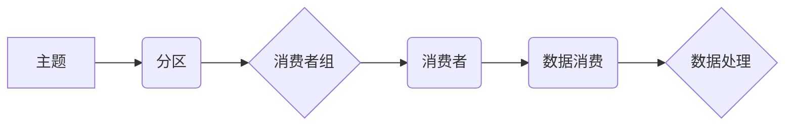

> Kafka, Group, 分区, 消费者, 订阅, 重均衡, 消费组, 负载均衡, 并发消费

## 1. 背景介绍

Apache Kafka 作为一款高性能、分布式流式数据平台，在处理海量数据实时消费和处理方面表现出色。Kafka 的核心组件之一是消费者组（Consumer Group），它为消费数据提供了强大的功能，例如数据均衡分配、消费者重均衡、并行消费等。

在实际应用中，我们经常需要多个消费者同时消费同一主题的数据，并保证数据的完整性和顺序性。消费者组正是为了解决这些问题而设计的。它将消费者划分为一个组，并根据主题的分区将数据均衡分配给各个消费者。当消费者加入或退出组时，Kafka 会自动进行重均衡，确保数据被公平地分配。

## 2. 核心概念与联系

### 2.1 消费者组

消费者组是 Kafka 中用于管理消费者的逻辑分组。每个消费者组包含多个消费者，这些消费者共同消费同一个主题的数据。

### 2.2 主题分区

主题（Topic）是 Kafka 中用于存储数据的逻辑容器。每个主题可以被划分为多个分区（Partition），每个分区都是一个独立的日志文件，数据按照顺序写入分区中。

### 2.3 消费者订阅

消费者订阅主题时，会指定一个消费者组名称。Kafka 会将该消费者添加到指定的消费者组中，并根据消费者组的配置和主题的分区数量，将数据均衡分配给各个消费者。

### 2.4 重均衡

当消费者加入或退出消费者组时，Kafka 会触发重均衡过程。重均衡过程会重新分配主题的分区给消费者，确保数据被公平地分配。

**Kafka Group 核心架构流程图**



## 3. 核心算法原理 & 具体操作步骤

### 3.1 算法原理概述

Kafka 的消费者组机制基于一种称为“Range Partition Assignment”的算法。该算法将主题的分区按照一定的规则分配给消费者，并根据消费者数量和分区数量进行均衡分配。

### 3.2 算法步骤详解

1. **分区分配:** Kafka 会根据消费者组的配置和主题的分区数量，将分区分配给消费者。
2. **消费者订阅:** 消费者订阅主题时，会指定一个消费者组名称。Kafka 会将该消费者添加到指定的消费者组中。
3. **重均衡:** 当消费者加入或退出消费者组时，Kafka 会触发重均衡过程。重均衡过程会重新分配主题的分区给消费者，确保数据被公平地分配。

### 3.3 算法优缺点

**优点:**

* **均衡分配:** 算法能够将数据均衡分配给消费者，避免数据倾斜。
* **自动重均衡:** 当消费者加入或退出消费者组时，Kafka 会自动进行重均衡，确保数据被公平地分配。
* **高可用性:** 消费者组机制可以提高系统的可用性，因为即使某个消费者宕机，其他消费者仍然可以继续消费数据。

**缺点:**

* **复杂性:** 消费者组机制的实现相对复杂，需要对 Kafka 的内部机制有一定的了解。
* **性能开销:** 重均衡过程会带来一定的性能开销，需要根据实际情况进行优化。

### 3.4 算法应用领域

消费者组机制广泛应用于各种场景，例如：

* **实时数据处理:** 将实时数据流分配给多个消费者进行处理，例如日志分析、监控告警等。
* **消息队列:** 将消息队列中的消息分配给多个消费者进行消费，例如订单处理、邮件发送等。
* **数据同步:** 将数据同步到多个数据库或存储系统，例如数据备份、灾难恢复等。

## 4. 数学模型和公式 & 详细讲解 & 举例说明

### 4.1 数学模型构建

假设有 `n` 个消费者和 `m` 个主题分区，则消费者组的均衡分配目标可以表示为：

**目标函数:**

$$
minimize \sum_{i=1}^{n} |p_i - \frac{m}{n}|
$$

其中：

* $p_i$ 表示第 $i$ 个消费者分配到的分区数量。
* $m/n$ 表示每个消费者平均分配到的分区数量。

### 4.2 公式推导过程

Kafka 使用一种称为“Range Partition Assignment”的算法来实现均衡分配。该算法将主题的分区按照一定的规则分配给消费者，并根据消费者数量和分区数量进行均衡分配。

具体来说，该算法会将主题的分区按照顺序编号，然后将消费者按照顺序编号。然后，算法会将分区按照一定的规则分配给消费者，例如：

* 将第一个分区分配给第一个消费者，第二个分区分配给第二个消费者，以此类推。
* 将分区按照一定的规则划分到不同的消费者组中。

### 4.3 案例分析与讲解

假设有 3 个消费者和 5 个主题分区，则每个消费者平均分配到的分区数量为 5/3 = 1.67。

使用 Range Partition Assignment 算法，可以将分区分配给消费者如下：

* 消费者 1: 分区 0, 1, 2
* 消费者 2: 分区 3, 4

## 5. 项目实践：代码实例和详细解释说明

### 5.1 开发环境搭建

* Java Development Kit (JDK) 8 或更高版本
* Apache Kafka 2.0 或更高版本
* Maven 或 Gradle 构建工具

### 5.2 源代码详细实现

```java
import org.apache.kafka.clients.consumer.ConsumerConfig;
import org.apache.kafka.clients.consumer.ConsumerRecord;
import org.apache.kafka.clients.consumer.ConsumerRecords;
import org.apache.kafka.clients.consumer.KafkaConsumer;
import org.apache.kafka.common.serialization.StringDeserializer;

import java.time.Duration;
import java.util.Collections;
import java.util.Properties;

public class KafkaConsumerExample {

    public static void main(String[] args) {
        // Kafka 配置
        Properties props = new Properties();
        props.put(ConsumerConfig.BOOTSTRAP_SERVERS_CONFIG, "localhost:9092");
        props.put(ConsumerConfig.GROUP_ID_CONFIG, "my-group");
        props.put(ConsumerConfig.KEY_DESERIALIZER_CLASS_CONFIG, StringDeserializer.class.getName());
        props.put(ConsumerConfig.VALUE_DESERIALIZER_CLASS_CONFIG, StringDeserializer.class.getName());

        // 创建 Kafka 消费者
        KafkaConsumer<String, String> consumer = new KafkaConsumer<>(props);

        // 订阅主题
        consumer.subscribe(Collections.singletonList("my-topic"));

        // 消费消息
        while (true) {
            ConsumerRecords<String, String> records = consumer.poll(Duration.ofMillis(100));
            for (ConsumerRecord<String, String> record : records) {
                System.out.println("Received message: " + record.value());
            }
        }
    }
}
```

### 5.3 代码解读与分析

* **Kafka 配置:** 首先，我们需要配置 Kafka 消费者所需的属性，包括 Kafka 集群地址、消费者组 ID、键和值反序列化器等。
* **创建 Kafka 消费者:** 使用配置信息创建 Kafka 消费者实例。
* **订阅主题:** 使用 `subscribe()` 方法订阅指定的主题。
* **消费消息:** 使用 `poll()` 方法从主题中拉取消息。`poll()` 方法会阻塞一段时间，直到有新的消息可用。

### 5.4 运行结果展示

当运行代码时，消费者会从主题 "my-topic" 中拉取消息，并打印到控制台。

## 6. 实际应用场景

### 6.1 实时数据处理

Kafka 的消费者组机制可以用于实时处理海量数据流。例如，可以将日志数据流分配给多个消费者进行分析，或者将传感器数据流分配给多个消费者进行监控告警。

### 6.2 消息队列

Kafka 可以作为消息队列，将消息分配给多个消费者进行消费。例如，可以将订单数据消息分配给多个消费者进行处理，或者将邮件数据消息分配给多个消费者进行发送。

### 6.3 数据同步

Kafka 可以用于将数据同步到多个数据库或存储系统。例如，可以将数据库中的数据同步到 Kafka 主题，然后由多个消费者将数据写入不同的数据库或存储系统。

### 6.4 未来应用展望

随着数据量的不断增长和实时处理需求的增加，Kafka 的消费者组机制将有更广泛的应用场景。例如，可以用于构建更复杂的实时数据处理系统，或者用于实现更灵活的数据同步方案。

## 7. 工具和资源推荐

### 7.1 学习资源推荐

* Apache Kafka 官方文档: https://kafka.apache.org/documentation/
* Kafka 入门教程: https://www.tutorialspoint.com/kafka/index.htm
* Kafka 中文社区: https://www.cnblogs.com/kafka/

### 7.2 开发工具推荐

* Apache Kafka CLI: https://kafka.apache.org/documentation/#cli
* Kafka Manager: https://kafka-manager.github.io/
* Confluent Control Center: https://docs.confluent.io/current/control-center/index.html

### 7.3 相关论文推荐

* Kafka: A Distributed Streaming Platform
* The Design and Implementation of Apache Kafka

## 8. 总结：未来发展趋势与挑战

### 8.1 研究成果总结

Kafka 的消费者组机制是一个重要的功能，它为消费数据提供了强大的功能，例如数据均衡分配、消费者重均衡、并行消费等。该机制的实现基于一种称为“Range Partition Assignment”的算法，该算法能够将数据均衡分配给消费者，并根据消费者数量和分区数量进行调整。

### 8.2 未来发展趋势

随着数据量的不断增长和实时处理需求的增加，Kafka 的消费者组机制将继续发展，例如：

* **更智能的均衡分配算法:** 开发更智能的均衡分配算法，能够更好地适应不同的场景和需求。
* **更强大的消费者管理功能:** 提供更强大的消费者管理功能，例如自动发现和注册消费者、动态调整消费者数量等。
* **更完善的监控和告警机制:** 提供更完善的监控和告警机制，能够及时发现和解决消费者组中的问题。

### 8.3 面临的挑战

Kafka 的消费者组机制也面临一些挑战，例如：

* **性能优化:** 重均衡过程会带来一定的性能开销，需要进一步优化。
* **复杂性:** 消费者组机制的实现相对复杂，需要对 Kafka 的内部机制有一定的了解。
* **容错性:** 消费者组机制需要保证高可用性，需要进一步提高容错性。

### 8.4 研究展望

未来，我们将继续研究 Kafka 的消费者组机制，开发更智能、更强大的功能，并解决其面临的挑战，为用户提供更优质的实时数据处理体验。

## 9. 附录：常见问题与解答

### 9.1 消费者组名称如何命名？

消费者组名称应该是一个唯一的标识符，并且不能包含空格或特殊字符。

### 9.2 如何进行重均衡？

Kafka 会自动进行重均衡，当消费者加入或退出消费者组时。也可以手动触发重均衡。

### 9.3 如何监控消费者组的健康状态？

可以使用 Kafka 管理工具或监控系统监控消费者组的健康状态，例如消费者数量、分区分配情况、消息消费速度等。


作者：禅与计算机程序设计艺术 / Zen and the Art of Computer Programming 
<end_of_turn>