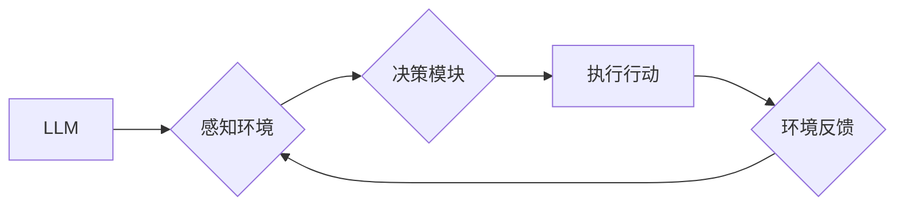

> Large Language Model (LLM), AI Agent, 知识表示, 决策推理, 交互式系统, 自然语言处理 (NLP), 强化学习 (RL)

## 1. 背景介绍

近年来，人工智能（AI）领域取得了令人瞩目的进展，其中大型语言模型（LLM）和AI代理（AI Agent）是两个备受关注的领域。LLM，如GPT-3、LaMDA等，展现出强大的文本生成、理解和翻译能力，而AI代理则致力于通过感知环境、制定决策并执行行动来实现特定目标。

LLM和AI代理各自拥有独特的优势，但它们也存在着相互补充的潜力。将LLM与AI代理相结合，可以构建更智能、更具适应性的交互式系统，从而推动AI技术向更广泛的应用领域拓展。

## 2. 核心概念与联系

### 2.1 LLM概述

大型语言模型（LLM）是一种基于深度学习的强大神经网络模型，其核心是训练在海量文本数据上，能够理解和生成人类语言。LLM拥有以下关键特征：

* **规模庞大:** LLM通常拥有数十亿甚至数千亿个参数，使其能够学习复杂的语言模式和语义关系。
* **文本生成能力:** LLM能够生成流畅、连贯的文本，包括文章、故事、对话等。
* **文本理解能力:** LLM能够理解文本的含义，进行文本分类、问答、摘要等任务。
* **多任务学习:** LLM可以被微调用于各种自然语言处理（NLP）任务，例如机器翻译、情感分析、代码生成等。

### 2.2 AI Agent概述

AI代理是一种能够感知环境、制定决策并执行行动以实现特定目标的智能体。AI代理通常由以下几个关键组件组成：

* **感知模块:** 用于获取环境信息，例如传感器数据、文本信息等。
* **决策模块:** 用于根据环境信息和目标制定行动计划。
* **执行模块:** 用于执行决策并与环境交互。

### 2.3 LLM与AI Agent的联系

LLM和AI代理可以相互补充，共同构建更智能的交互式系统。LLM可以为AI代理提供强大的语言理解和生成能力，而AI代理可以为LLM提供感知环境、制定决策和执行行动的能力。

**Mermaid 流程图:**



## 3. 核心算法原理 & 具体操作步骤

### 3.1 算法原理概述

将LLM与AI代理相结合的算法通常基于强化学习（RL）原理。RL是一种机器学习方法，通过奖励机制来训练智能体学习最优的策略。

在LLM与AI代理的结合中，LLM可以被视为AI代理的决策模块，而环境反馈则可以被视为LLM的训练数据。通过RL算法，AI代理可以学习利用LLM的语言能力来完成任务，并不断优化其决策策略。

### 3.2 算法步骤详解

1. **环境建模:** 建立一个模拟真实世界的环境，并定义AI代理的目标和奖励机制。
2. **LLM微调:** 将预训练的LLM微调到特定任务，例如文本分类、对话生成等。
3. **策略网络训练:** 使用RL算法训练一个策略网络，该网络接收环境信息和LLM的输出作为输入，并输出AI代理的行动。
4. **环境交互:** AI代理与环境交互，根据策略网络的输出执行行动，并获得环境反馈。
5. **奖励信号:** 根据环境反馈，计算AI代理的奖励信号。
6. **策略更新:** 使用奖励信号更新策略网络，使其学习更优的决策策略。
7. **迭代训练:** 重复步骤4-6，直到AI代理的性能达到预期目标。

### 3.3 算法优缺点

**优点:**

* **强大的语言能力:** LLM可以为AI代理提供强大的语言理解和生成能力，使其能够更好地与人类交互。
* **适应性强:** RL算法可以使AI代理适应不断变化的环境，并学习新的策略。
* **可扩展性:** LLM和AI代理的架构可以轻松扩展，以处理更复杂的任务。

**缺点:**

* **训练成本高:** 训练LLM和AI代理需要大量的计算资源和时间。
* **数据依赖性:** LLM和AI代理的性能依赖于训练数据的质量和数量。
* **可解释性低:** RL算法的决策过程往往难以解释，这可能导致AI代理的行为难以理解。

### 3.4 算法应用领域

LLM与AI代理的结合在多个领域具有广泛的应用前景，例如：

* **聊天机器人:** 开发更智能、更自然的聊天机器人，能够理解用户意图并提供更精准的回复。
* **虚拟助手:** 创建更强大的虚拟助手，能够帮助用户完成各种任务，例如日程安排、信息查询、设备控制等。
* **教育领域:** 开发个性化学习系统，根据学生的学习进度和需求提供定制化的学习内容和辅导。
* **医疗保健:** 辅助医生诊断疾病、制定治疗方案，并提供患者个性化的健康建议。

## 4. 数学模型和公式 & 详细讲解 & 举例说明

### 4.1 数学模型构建

在LLM与AI代理的结合中，我们可以使用马尔可夫决策过程（MDP）来建模交互过程。MDP由以下几个要素组成：

* **状态空间 (S):** 环境可能处于的各种状态。
* **动作空间 (A):** AI代理可以执行的各种动作。
* **转移概率 (P):** 从一个状态执行一个动作后转移到另一个状态的概率。
* **奖励函数 (R):** AI代理在某个状态执行某个动作后获得的奖励。

### 4.2 公式推导过程

目标是找到一个策略 π(s) ，该策略将每个状态映射到一个动作，使得AI代理在长期的交互过程中获得最大的总奖励。

可以使用动态规划或蒙特卡罗方法来求解MDP，其中动态规划方法通过递推的方式求解最优策略，而蒙特卡罗方法通过模拟多个交互轨迹来估计策略价值。

### 4.3 案例分析与讲解

例如，我们可以将一个聊天机器人视为一个MDP。

* **状态空间:** 聊天机器人的内部状态，例如当前对话主题、用户的情绪等。
* **动作空间:** 聊天机器人的可执行动作，例如发送文本消息、播放音频等。
* **转移概率:** 用户发送消息后，聊天机器人进入下一个状态的概率。
* **奖励函数:** 用户对聊天机器人的回复感到满意时获得奖励。

通过训练RL算法，聊天机器人可以学习到最优的策略，从而更好地与用户进行对话。

## 5. 项目实践：代码实例和详细解释说明

### 5.1 开发环境搭建

* Python 3.7+
* TensorFlow/PyTorch
* OpenAI API

### 5.2 源代码详细实现

```python
# 使用OpenAI API获取LLM的文本生成结果
response = openai.Completion.create(
    engine="text-davinci-003",
    prompt="你好，请问今天天气怎么样？",
    max_tokens=100
)

# 获取LLM生成的文本
generated_text = response.choices[0].text

# 将LLM生成的文本作为AI代理的决策输入
# ...

# 执行AI代理的动作
# ...

# 获取环境反馈
# ...
```

### 5.3 代码解读与分析

* 代码首先使用OpenAI API获取LLM的文本生成结果。
* 然后，将LLM生成的文本作为AI代理的决策输入。
* AI代理根据LLM的输出执行相应的动作，并获取环境反馈。

### 5.4 运行结果展示

运行代码后，AI代理将根据LLM的输出，例如天气预报，做出相应的回应，例如“今天天气晴朗”。

## 6. 实际应用场景

### 6.1 智能客服

LLM可以为智能客服提供强大的对话理解和生成能力，使其能够更自然地与用户进行交互，并提供更精准的解答。

### 6.2 个性化教育

LLM可以根据学生的学习进度和需求，生成个性化的学习内容和辅导，从而提高学习效率。

### 6.3 内容创作

LLM可以辅助人类进行内容创作，例如生成文章、故事、诗歌等，提高创作效率。

### 6.4 未来应用展望

随着LLM和AI代理技术的不断发展，其应用场景将更加广泛，例如：

* **自动驾驶:** LLM可以帮助自动驾驶系统理解道路环境和交通规则，从而提高驾驶安全性。
* **医疗诊断:** LLM可以辅助医生进行疾病诊断，并提供个性化的治疗方案。
* **科学研究:** LLM可以帮助科学家分析大规模数据，并发现新的科学规律。

## 7. 工具和资源推荐

### 7.1 学习资源推荐

* **OpenAI API文档:** https://beta.openai.com/docs/api-reference/introduction
* **HuggingFace Transformers:** https://huggingface.co/docs/transformers/index
* **DeepMind RL算法教程:** https://deepmind.com/blog/reinforcement-learning-tutorial

### 7.2 开发工具推荐

* **TensorFlow:** https://www.tensorflow.org/
* **PyTorch:** https://pytorch.org/
* **Jupyter Notebook:** https://jupyter.org/

### 7.3 相关论文推荐

* **Attention Is All You Need:** https://arxiv.org/abs/1706.03762
* **Deep Reinforcement Learning with Double Q-learning:** https://arxiv.org/abs/1509.06461

## 8. 总结：未来发展趋势与挑战

### 8.1 研究成果总结

LLM与AI代理的结合取得了显著的进展，为构建更智能、更具适应性的交互式系统提供了新的思路和方法。

### 8.2 未来发展趋势

* **模型规模和能力的提升:** 随着计算资源的不断发展，LLM的规模和能力将进一步提升，从而赋予AI代理更强大的语言理解和生成能力。
* **多模态交互:** 将LLM与其他模态信息，例如图像、音频等相结合，构建更全面的交互体验。
* **可解释性增强:** 研究更可解释的RL算法，使得AI代理的行为更加透明和可理解。

### 8.3 面临的挑战

* **数据安全和隐私:** LLM的训练需要大量数据，如何保证数据安全和隐私是一个重要的挑战。
* **伦理问题:** AI代理的决策可能会受到LLM的训练数据中的偏见影响，如何避免AI代理产生不公平或有害的行为是一个需要认真思考的伦理问题。
* **可持续发展:** LLM的训练和部署需要大量的计算资源，如何实现LLM技术的可持续发展是一个重要的挑战。

### 8.4 研究展望

未来，LLM与AI代理的结合将继续是一个重要的研究方向，我们期待看到更多创新应用和突破性进展。


## 9. 附录：常见问题与解答

**Q1: LLM与AI代理的区别是什么？**

**A1:** LLM是专注于语言理解和生成的大型神经网络模型，而AI代理则是能够感知环境、制定决策并执行行动以实现特定目标的智能体。

**Q2: 如何将LLM与AI代理相结合？**

**A2:** 可以使用强化学习算法来训练AI代理，使其学习利用LLM的语言能力来完成任务。

**Q3: LLM与AI代理的应用场景有哪些？**

**A3:** LLM与AI代理的应用场景非常广泛，例如智能客服、个性化教育、内容创作等。

**Q4: LLM与AI代理面临哪些挑战？**

**A4:** LLM与AI代理面临的数据安全、隐私、伦理和可持续发展等挑战。


作者：禅与计算机程序设计艺术 / Zen and the Art of Computer Programming 
<end_of_turn>