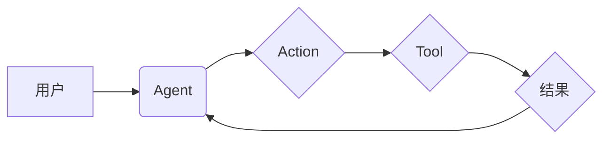

> LangChain, Agents, 模块设计, 原理剖析, 语言模型, 应用程序, 自动化

## 1. 背景介绍

在人工智能领域，大型语言模型（LLM）的快速发展为我们带来了强大的文本处理能力。然而，LLM本身通常局限于文本生成、理解和翻译等特定任务。为了让LLM能够更灵活地应对复杂场景，并具备自主学习和决策的能力，LangChain 引入了 Agents 模块。

LangChain Agents 是一个强大的框架，它允许我们构建能够与外部世界交互的智能代理。这些代理可以利用 LLM 的能力，并结合其他工具和数据源，完成更复杂的任务，例如：

* **自动化的任务执行:**  例如，根据用户指令，自动完成邮件回复、日程安排、文档总结等任务。
* **复杂问题的解决:**  例如，通过搜索网络信息、分析数据、与专家进行对话，解决需要多步骤推理和决策的复杂问题。
* **个性化体验:**  例如，根据用户的喜好和需求，定制个性化的内容推荐、学习计划、娱乐体验等。

## 2. 核心概念与联系

LangChain Agents 模块的核心概念包括：

* **Agent:** 智能代理，是一个能够感知环境、设定目标、采取行动并反馈结果的实体。
* **Action:** 代理可以执行的动作，例如：查询网络信息、生成文本、控制外部应用程序等。
* **Tool:** 代理可以使用的工具，例如：搜索引擎、数据库、代码执行器等。
* **Memory:** 代理的记忆，用于存储历史信息，帮助代理做出更明智的决策。

**LangChain Agents 模块架构**



## 3. 核心算法原理 & 具体操作步骤

### 3.1  算法原理概述

LangChain Agents 模块的核心算法是基于强化学习（RL）的策略优化算法。

* **策略:**  代理采取行动的策略，可以由 LLM 生成，并根据环境反馈进行更新。
* **奖励:**  代理采取行动后获得的奖励，用于指导策略的优化。
* **环境:**  代理所处的环境，包括状态、动作和奖励。

通过不断地与环境交互，代理会学习到最优的策略，从而能够完成目标任务。

### 3.2  算法步骤详解

1. **初始化:**  设置代理的初始状态、目标和策略。
2. **感知环境:**  代理感知当前环境的状态。
3. **选择行动:**  根据策略，代理选择一个动作。
4. **执行行动:**  代理执行选择的动作，并观察环境的变化。
5. **获得奖励:**  根据环境的变化，代理获得奖励。
6. **更新策略:**  根据奖励信号，更新代理的策略。
7. **重复步骤2-6:**  代理不断地与环境交互，直到达到目标或终止条件。

### 3.3  算法优缺点

**优点:**

* **适应性强:**  RL 算法能够学习到复杂的策略，并适应不断变化的环境。
* **自主性强:**  代理能够自主地学习和决策，无需人工干预。

**缺点:**

* **训练成本高:**  RL 算法的训练需要大量的样本数据和计算资源。
* **稳定性差:**  RL 算法的训练过程可能不稳定，难以保证收敛到最优解。

### 3.4  算法应用领域

RL 算法在许多领域都有广泛的应用，例如：

* **机器人控制:**  训练机器人完成复杂的任务，例如导航、抓取、组装等。
* **游戏 AI:**  开发能够与人类玩家进行对抗的 AI 对手。
* **推荐系统:**  根据用户的行为数据，推荐个性化的商品或内容。

## 4. 数学模型和公式 & 详细讲解 & 举例说明

### 4.1  数学模型构建

RL 算法的核心是价值函数和策略函数。

* **价值函数:**  评估代理在特定状态下采取特定行动的长期回报。
* **策略函数:**  根据当前状态，决定代理采取的行动。

### 4.2  公式推导过程

**价值函数:**

$$
V(s) = E[\sum_{t=0}^{\infty} \gamma^t r(s_t, a_t)]
$$

其中：

* $V(s)$ 是状态 $s$ 的价值函数。
* $E$ 表示期望值。
* $\gamma$ 是折扣因子，控制未来回报的权重。
* $r(s_t, a_t)$ 是在状态 $s_t$ 执行动作 $a_t$ 后获得的奖励。

**策略函数:**

$$
\pi(a|s) = P(a|s)
$$

其中：

* $\pi(a|s)$ 是在状态 $s$ 下执行动作 $a$ 的概率。

### 4.3  案例分析与讲解

假设一个代理在玩游戏，目标是获得尽可能高的分数。

* **状态:**  游戏中的当前场景，例如玩家的位置、敌人数量等。
* **动作:**  玩家可以执行的动作，例如移动、攻击、使用道具等。
* **奖励:**  获得分数、击杀敌人等。

通过 RL 算法，代理可以学习到最优的策略，例如：

* 在敌人靠近时，采取攻击动作。
* 在有道具时，使用道具获得额外奖励。

## 5. 项目实践：代码实例和详细解释说明

### 5.1  开发环境搭建

* Python 3.8+
* LangChain 0.0.20+
* OpenAI API 

### 5.2  源代码详细实现

```python
from langchain.agents import initialize_agent
from langchain.agents import Tool
from langchain.llms import OpenAI

# 定义工具
search_tool = Tool(
    name="Search",
    func=lambda query: f"Search results for: {query}",
)

# 初始化 LLM
llm = OpenAI(temperature=0)

# 初始化代理
agent = initialize_agent(
    llm=llm,
    tools=[search_tool],
    agent="zero-shot-react-description",
)

# 使用代理执行任务
query = "What is the capital of France?"
response = agent.run(query)
print(response)
```

### 5.3  代码解读与分析

* **工具定义:**  定义了一个名为 "Search" 的工具，用于模拟搜索引擎查询。
* **LLM 初始化:**  使用 OpenAI 的 LLM 模型。
* **代理初始化:**  使用 `initialize_agent` 函数初始化代理，指定 LLM、工具和代理类型。
* **代理执行任务:**  使用 `agent.run` 方法执行任务，并打印结果。

### 5.4  运行结果展示

```
Search results for: What is the capital of France?
```

## 6. 实际应用场景

LangChain Agents 模块在许多实际应用场景中都有着广泛的应用，例如：

* **客服机器人:**  自动处理客户咨询，提供快速响应和个性化服务。
* **内容创作助手:**  帮助作家、记者等撰写文章、剧本等内容。
* **代码生成工具:**  根据用户需求，自动生成代码片段。

### 6.4  未来应用展望

随着 LLM 和 RL 算法的不断发展，LangChain Agents 模块的应用场景将会更加广泛，例如：

* **个性化教育:**  根据学生的学习进度和需求，提供个性化的学习计划和辅导。
* **医疗辅助:**  帮助医生诊断疾病、制定治疗方案。
* **科学研究:**  加速科学研究的进程，例如药物研发、材料设计等。

## 7. 工具和资源推荐

### 7.1  学习资源推荐

* **LangChain 官方文档:** https://python.langchain.com/docs/
* **LangChain GitHub 仓库:** https://github.com/langchain-org/langchain
* **OpenAI API 文档:** https://platform.openai.com/docs/api-reference

### 7.2  开发工具推荐

* **Python:**  用于开发 LangChain Agents 应用。
* **Jupyter Notebook:**  用于实验和调试代码。
* **VS Code:**  用于代码编辑和调试。

### 7.3  相关论文推荐

* **Reinforcement Learning: An Introduction** by Sutton and Barto
* **Proximal Policy Optimization Algorithms** by Schulman et al.

## 8. 总结：未来发展趋势与挑战

### 8.1  研究成果总结

LangChain Agents 模块为构建智能代理提供了强大的工具和框架，推动了 LLM 在实际应用中的落地。

### 8.2  未来发展趋势

* **更强大的 LLM:**  随着 LLM 的不断发展，代理将能够处理更复杂的任务，并做出更智能的决策。
* **更丰富的工具库:**  LangChain 将会提供更多类型的工具，例如数据库连接、代码执行器等，使代理能够访问更广泛的数据和功能。
* **更安全的代理:**  研究人员将致力于开发更安全的代理，防止代理被恶意利用。

### 8.3  面临的挑战

* **训练成本高:**  训练强大的代理需要大量的计算资源和数据。
* **稳定性差:**  RL 算法的训练过程可能不稳定，难以保证收敛到最优解。
* **可解释性低:**  代理的决策过程可能难以理解，这可能会导致信任问题。

### 8.4  研究展望

未来，LangChain Agents 模块的研究将继续朝着以下方向发展：

* **开发更有效的训练算法:**  降低训练成本，提高训练效率。
* **提高代理的可解释性:**  使代理的决策过程更加透明，增强用户信任。
* **探索新的应用场景:**  将 LangChain Agents 应用于更多领域，例如医疗、教育、金融等。

## 9. 附录：常见问题与解答

* **Q: 如何选择合适的代理类型？**

A:  不同的代理类型适用于不同的任务。例如，zero-shot-react-description 类型适用于需要理解自然语言指令的任务，而 goal-conditioned 类型适用于需要完成特定目标的任务。

* **Q: 如何评估代理的性能？**

A:  可以使用各种指标来评估代理的性能，例如准确率、召回率、F1-score 等。

* **Q: 如何训练自己的代理？**

A:  可以使用 LangChain 提供的工具和示例代码来训练自己的代理。

作者：禅与计算机程序设计艺术 / Zen and the Art of Computer Programming


<end_of_turn>