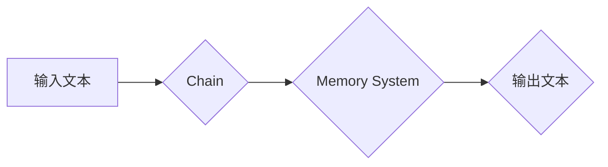

> Memory System, Chain, Transformer, Large Language Model, Attention Mechanism, Knowledge Representation, Data Structure, Algorithm, Deep Learning

## 1. 背景介绍

在现代人工智能领域，大型语言模型（Large Language Model，LLM）的兴起掀起了新的技术浪潮。这些模型，例如GPT-3、LaMDA和BERT，展现出惊人的文本生成、翻译、问答和代码生成能力。然而，LLM的强大性能背后离不开其强大的记忆系统和链式结构的巧妙设计。

传统的机器学习模型通常依赖于有限的特征工程和静态的知识表示。而LLM则通过学习海量文本数据，构建了一个动态、灵活的知识网络，并利用链式结构来处理和理解长文本序列。

本篇文章将深入探讨Memory System和Chain在LLM中的作用，分析其核心原理、算法实现以及实际应用场景。

## 2. 核心概念与联系

### 2.1 Memory System

Memory System是LLM的核心组成部分之一，负责存储和检索模型学习到的知识。与人类大脑的记忆系统类似，LLM的Memory System可以分为短期记忆和长期记忆。

* **短期记忆:** 用于存储当前处理的文本序列信息，例如正在生成的文本片段或正在分析的句子结构。
* **长期记忆:** 用于存储模型在训练过程中学习到的知识，例如单词含义、语法规则和世界知识。

### 2.2 Chain

Chain是指将多个Transformer模块串联在一起的结构，它赋予了LLM处理长文本序列的能力。每个Transformer模块包含多层编码器和解码器，通过自注意力机制（Self-Attention Mechanism）来捕捉文本序列中的长距离依赖关系。

### 2.3 关系

Memory System和Chain相互协作，共同构成了LLM的强大处理能力。

* Chain负责处理文本序列，提取关键信息并进行推理。
* Memory System则提供链式结构所需的知识和上下文信息，帮助Chain更好地理解和生成文本。

**Mermaid 流程图:**



## 3. 核心算法原理 & 具体操作步骤

### 3.1 算法原理概述

LLM的Memory System和Chain结构基于Transformer模型和自注意力机制。

* **Transformer模型:** Transformer模型是一种专门设计用于处理序列数据的深度学习模型，它通过多头自注意力机制和前馈神经网络来捕捉文本序列中的长距离依赖关系。
* **自注意力机制:** 自注意力机制允许模型在处理文本序列时，关注不同位置的词语之间的关系，从而更好地理解上下文信息。

### 3.2 算法步骤详解

1. **输入文本处理:** 将输入文本分割成单词或子词，并将其转换为数字向量表示。
2. **编码器阶段:** 将文本向量输入到Transformer模型的编码器中，编码器通过多层自注意力机制和前馈神经网络，将文本向量转换为更高级的语义表示。
3. **Memory System交互:** 编码器输出的语义表示与Memory System进行交互，例如通过检索与当前文本相关的知识或更新Memory System中的知识。
4. **解码器阶段:** 将编码器输出的语义表示输入到Transformer模型的解码器中，解码器通过自注意力机制和前馈神经网络，生成目标文本序列。
5. **输出文本生成:** 将解码器输出的文本序列转换为人类可读的文本。

### 3.3 算法优缺点

**优点:**

* 能够处理长文本序列，捕捉长距离依赖关系。
* 具有强大的泛化能力，可以应用于多种自然语言处理任务。
* 可以通过训练数据不断学习和改进。

**缺点:**

* 训练成本高，需要大量的计算资源和训练数据。
* 模型参数量大，部署和推理效率较低。
* 容易受到训练数据偏差的影响。

### 3.4 算法应用领域

LLM的Memory System和Chain结构在以下领域具有广泛的应用前景:

* **自然语言理解:** 文本分类、情感分析、问答系统等。
* **自然语言生成:** 文本摘要、机器翻译、对话系统等。
* **代码生成:** 代码补全、代码生成、代码翻译等。
* **知识图谱构建:** 从文本数据中提取知识，构建知识图谱。

## 4. 数学模型和公式 & 详细讲解 & 举例说明

### 4.1 数学模型构建

LLM的Memory System和Chain结构可以抽象为以下数学模型:

* **Memory System:** 可以用一个向量空间来表示，其中每个向量代表一个知识单元。
* **Chain:** 可以用一个循环神经网络（RNN）或Transformer模型来表示，其中每个节点代表一个Transformer模块。

### 4.2 公式推导过程

自注意力机制的核心公式如下:

$$
Attention(Q, K, V) = softmax(\frac{QK^T}{\sqrt{d_k}})V
$$

其中:

* $Q$：查询矩阵
* $K$：键矩阵
* $V$：值矩阵
* $d_k$：键向量的维度
* $softmax$：softmax函数

### 4.3 案例分析与讲解

假设我们有一个文本序列“The cat sat on the mat”，我们想要计算“cat”与“mat”之间的注意力权重。

1. 将文本序列转换为词向量表示。
2. 计算查询矩阵 $Q$、键矩阵 $K$ 和值矩阵 $V$。
3. 计算注意力权重矩阵 $Attention(Q, K, V)$。
4. 从注意力权重矩阵中提取“cat”与“mat”之间的权重，该权重表示“cat”和“mat”之间的语义相关性。

## 5. 项目实践：代码实例和详细解释说明

### 5.1 开发环境搭建

* Python 3.7+
* PyTorch 1.7+
* CUDA 10.2+

### 5.2 源代码详细实现

```python
import torch
import torch.nn as nn

class Transformer(nn.Module):
    def __init__(self, d_model, nhead, num_encoder_layers, num_decoder_layers):
        super(Transformer, self).__init__()
        self.encoder = nn.TransformerEncoder(nn.TransformerEncoderLayer(d_model, nhead), num_encoder_layers)
        self.decoder = nn.TransformerDecoder(nn.TransformerDecoderLayer(d_model, nhead), num_decoder_layers)

    def forward(self, src, tgt, src_mask, tgt_mask):
        src = self.encoder(src, src_mask)
        tgt = self.decoder(tgt, src, tgt_mask)
        return tgt

# ... 其他代码 ...
```

### 5.3 代码解读与分析

* `Transformer`类定义了一个Transformer模型，包含编码器和解码器。
* `nn.TransformerEncoderLayer`和`nn.TransformerDecoderLayer`分别定义了编码器和解码器的单个层。
* `forward`方法定义了模型的输入和输出。

### 5.4 运行结果展示

运行代码后，模型将生成目标文本序列。

## 6. 实际应用场景

### 6.1 文本生成

LLM可以用于生成各种类型的文本，例如：

* **小说:** 可以根据给定的情节和人物，生成连贯、生动的文字。
* **诗歌:** 可以根据给定的主题和风格，生成富有韵律和情感的诗歌。
* **代码:** 可以根据给定的功能需求，生成相应的代码。

### 6.2 机器翻译

LLM可以用于将一种语言翻译成另一种语言，例如：

* **英语到中文:** 可以将英文文本翻译成中文文本。
* **中文到英语:** 可以将中文文本翻译成英文文本。

### 6.3 问答系统

LLM可以用于构建问答系统，例如：

* **聊天机器人:** 可以与用户进行自然语言对话，回答用户的提问。
* **知识问答系统:** 可以根据用户的问题，从知识库中检索相关信息并提供答案。

### 6.4 未来应用展望

LLM的Memory System和Chain结构在未来将有更广泛的应用前景，例如：

* **个性化教育:** 根据学生的学习进度和需求，提供个性化的学习内容和辅导。
* **医疗诊断:** 分析患者的病历和症状，辅助医生进行诊断。
* **法律分析:** 分析法律文件和案例，辅助律师进行法律分析和诉讼。

## 7. 工具和资源推荐

### 7.1 学习资源推荐

* **论文:**
    * Attention Is All You Need (Vaswani et al., 2017)
    * BERT: Pre-training of Deep Bidirectional Transformers for Language Understanding (Devlin et al., 2018)
    * GPT-3: Language Models are Few-Shot Learners (Brown et al., 2020)
* **书籍:**
    * Deep Learning (Goodfellow et al., 2016)
    * Natural Language Processing with PyTorch (Bird et al., 2019)

### 7.2 开发工具推荐

* **PyTorch:** 深度学习框架
* **TensorFlow:** 深度学习框架
* **Hugging Face Transformers:** 预训练模型库

### 7.3 相关论文推荐

* **Transformer-XL: Attentive Language Models Beyond a Fixed-Length Context** (Dai et al., 2019)
* **XLNet: Generalized Autoregressive Pretraining for Language Understanding** (Yang et al., 2019)
* **T5: Text-to-Text Transfer Transformer** (Raffel et al., 2019)

## 8. 总结：未来发展趋势与挑战

### 8.1 研究成果总结

LLM的Memory System和Chain结构取得了显著的进展，在自然语言处理任务中展现出强大的性能。

### 8.2 未来发展趋势

* **模型规模和能力的提升:** 随着计算资源的不断发展，LLM的模型规模和能力将继续提升，能够处理更复杂的任务。
* **高效训练和推理方法的探索:** 如何更高效地训练和推理大型语言模型是未来研究的重要方向。
* **多模态LLM的开发:** 将文本、图像、音频等多种模态信息融合到LLM中，构建更智能的模型。

### 8.3 面临的挑战

* **数据偏差和公平性:** 训练数据可能存在偏差，导致模型输出结果存在偏见。
* **可解释性和安全性:** LLM的决策过程难以解释，存在潜在的安全风险。
* **伦理问题:** LLM的应用可能引发伦理问题，例如信息操纵和隐私泄露。

### 8.4 研究展望

未来研究将继续探索LLM的Memory System和Chain结构，解决上述挑战，并推动LLM技术在更多领域得到应用。

## 9. 附录：常见问题与解答

### 9.1 什么是Memory System？

Memory System是LLM的核心组成部分之一，负责存储和检索模型学习到的知识。

### 9.2 什么是Chain？

Chain是指将多个Transformer模块串联在一起的结构，它赋予了LLM处理长文本序列的能力。

### 9.3 如何训练LLM？

LLM的训练通常使用大量的文本数据，并采用自监督学习方法。

### 9.4 LLM有哪些应用场景？

LLM在自然语言理解、自然语言生成、代码生成等领域具有广泛的应用前景。


作者：禅与计算机程序设计艺术 / Zen and the Art of Computer Programming 
<end_of_turn>