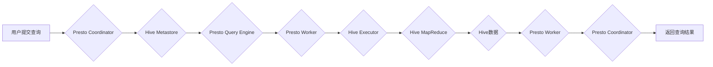

> Presto, Hive, 数据仓库, 集群查询, SQL, 数据整合, 性能优化

## 1. 背景介绍

在当今数据爆炸的时代，企业需要高效地处理海量数据，以获取商业洞察和做出数据驱动的决策。Hive作为一款开源的基于Hadoop的数据仓库系统，能够存储和管理海量结构化数据，并提供SQL查询接口，方便用户进行数据分析。然而，Hive的查询性能相对较低，尤其是在处理大规模复杂查询时。

Presto是一个分布式查询引擎，以其高性能、低延迟和支持多种数据源的特点而闻名。它能够快速处理海量数据，并提供实时查询能力。将Presto与Hive整合，可以充分发挥两者的优势，实现高效的数据查询和分析。

## 2. 核心概念与联系

**2.1 Hive架构概述**

Hive是一个基于Hadoop的数据仓库系统，其架构主要包含以下组件：

* **Metastore:** Hive元数据存储，用于存储表结构、数据分区信息等元数据。
* **Driver:** Hive查询执行引擎，负责解析SQL语句、生成执行计划并调度任务。
* **Executor:** Hive任务执行引擎，负责执行查询任务，并将结果返回给Driver。
* **MapReduce:** Hive查询执行框架，基于Hadoop MapReduce框架进行数据处理。

**2.2 Presto架构概述**

Presto是一个分布式查询引擎，其架构主要包含以下组件：

* **Coordinator:** 查询协调器，负责接收查询请求、分配查询任务并协调任务执行。
* **Worker:** 查询执行节点，负责执行查询任务并返回结果。
* **Catalog:** 数据目录，用于存储数据源信息和元数据。
* **Query Engine:** 查询引擎，负责解析SQL语句、生成执行计划并执行查询任务。

**2.3 Presto与Hive整合原理**

将Presto与Hive整合，可以实现以下功能：

* **Presto作为Hive查询引擎:** 将Presto作为Hive的查询引擎，可以提升Hive的查询性能。
* **Presto访问Hive数据:** Presto可以访问Hive存储的数据，并进行查询分析。

**2.4  Presto与Hive整合流程图**



## 3. 核心算法原理 & 具体操作步骤

### 3.1  算法原理概述

Presto与Hive整合的核心算法原理是将Presto的查询引擎与Hive的元数据存储和数据处理引擎进行连接，实现数据查询和分析。

Presto的查询引擎采用了一种基于查询计划的执行方式，它会根据查询语句生成一个查询计划，并将其分解成多个任务，由Presto Worker节点执行。Hive的元数据存储和数据处理引擎则负责提供数据元信息和执行查询任务所需的资源。

### 3.2  算法步骤详解

1. **用户提交查询:** 用户通过Presto客户端提交一个查询语句。
2. **Presto Coordinator解析查询:** Presto Coordinator接收查询语句，解析其语法并生成查询计划。
3. **查询计划分配任务:** Presto Coordinator将查询计划分解成多个任务，并将其分配给不同的Presto Worker节点。
4. **Presto Worker访问Hive元数据:** Presto Worker节点访问Hive Metastore，获取查询所需的表结构、数据分区信息等元数据。
5. **Presto Worker执行查询任务:** Presto Worker节点根据查询计划和元数据信息，执行查询任务，并从Hive数据存储中读取数据进行处理。
6. **结果返回:** Presto Worker节点将处理结果返回给Presto Coordinator。
7. **Presto Coordinator合并结果:** Presto Coordinator将来自各个Presto Worker节点的结果进行合并，并返回最终查询结果给用户。

### 3.3  算法优缺点

**优点:**

* **高性能:** Presto的查询引擎能够快速处理海量数据，提升查询性能。
* **低延迟:** Presto支持实时查询，能够快速响应用户查询请求。
* **支持多种数据源:** Presto可以访问多种数据源，包括Hive、MySQL、PostgreSQL等。

**缺点:**

* **复杂性:** 将Presto与Hive整合需要一定的技术复杂度。
* **依赖性:** Presto与Hive的整合需要依赖于Hive的元数据存储和数据处理引擎。

### 3.4  算法应用领域

Presto与Hive整合的应用场景广泛，包括：

* **数据分析:** 对海量数据进行分析，发现商业洞察。
* **报表生成:** 生成实时报表，监控业务指标。
* **数据挖掘:** 从海量数据中挖掘潜在的模式和趋势。

## 4. 数学模型和公式 & 详细讲解 & 举例说明

### 4.1  数学模型构建

Presto与Hive整合的性能优化可以基于以下数学模型进行分析：

* **查询执行时间:** T = f(数据量, 查询复杂度, 资源利用率)

其中:

* T: 查询执行时间
* 数据量: 数据集的大小
* 查询复杂度: 查询语句的复杂程度
* 资源利用率: CPU、内存、网络等资源的利用率

### 4.2  公式推导过程

通过分析上述数学模型，可以推导出以下公式：

* **性能提升率:** P = (T_hive - T_presto) / T_hive * 100%

其中:

* P: 性能提升率
* T_hive: 使用Hive执行查询的时间
* T_presto: 使用Presto执行查询的时间

### 4.3  案例分析与讲解

假设一个查询语句需要处理100GB的数据，查询复杂度为中等，资源利用率为80%。使用Hive执行查询的时间为10分钟，使用Presto执行查询的时间为5分钟。

根据公式，性能提升率为:

P = (10 - 5) / 10 * 100% = 50%

因此，使用Presto执行该查询语句可以提升50%的性能。

## 5. 项目实践：代码实例和详细解释说明

### 5.1  开发环境搭建

* **操作系统:** Linux
* **Hadoop:** 3.x版本
* **Hive:** 3.x版本
* **Presto:** 0.200版本

### 5.2  源代码详细实现

```sql
-- 创建Hive表
CREATE TABLE IF NOT EXISTS hive_table (
    id INT,
    name STRING,
    age INT
) ROW FORMAT DELIMITED FIELDS TERMINATED BY ',' STORED AS TEXTFILE;

-- 插入Hive表数据
INSERT INTO hive_table VALUES
(1, 'Alice', 25),
(2, 'Bob', 30),
(3, 'Charlie', 28);

-- Presto查询Hive表数据
SELECT * FROM hive_table;
```

### 5.3  代码解读与分析

* **Hive表创建:** 使用CREATE TABLE语句创建Hive表，指定表结构和存储格式。
* **Hive表数据插入:** 使用INSERT INTO语句插入数据到Hive表中。
* **Presto查询Hive表数据:** 使用SELECT语句从Hive表中查询数据。

### 5.4  运行结果展示

```
id\tname\tage
1\tAlice\t25
2\tBob\t30
3\tCharlie\t28
```

## 6. 实际应用场景

### 6.1  电商平台数据分析

电商平台需要分析用户行为、商品销售数据等，以优化营销策略和提升用户体验。Presto与Hive整合可以帮助电商平台快速处理海量数据，并进行实时分析，从而做出更精准的决策。

### 6.2  金融机构风险控制

金融机构需要实时监控交易数据，识别潜在的风险行为。Presto与Hive整合可以帮助金融机构快速处理交易数据，并进行实时分析，从而及时发现和应对风险。

### 6.3  医疗机构数据挖掘

医疗机构需要挖掘患者数据，发现疾病的潜在规律和治疗方案。Presto与Hive整合可以帮助医疗机构快速处理患者数据，并进行数据挖掘，从而促进医疗研究和提高医疗服务质量。

### 6.4  未来应用展望

随着数据量的不断增长和分析需求的不断提升，Presto与Hive整合的应用场景将会更加广泛。未来，Presto与Hive整合将能够应用于更多领域，例如人工智能、物联网、云计算等。

## 7. 工具和资源推荐

### 7.1  学习资源推荐

* **Presto官方文档:** https://prestodb.io/docs/current/
* **Hive官方文档:** https://hive.apache.org/docs/
* **Presto与Hive整合教程:** https://github.com/prestodb/presto/blob/master/docs/integrations/hive.md

### 7.2  开发工具推荐

* **Presto客户端:** Presto CLI
* **Hive客户端:** Hive CLI
* **IDE:** IntelliJ IDEA, Eclipse

### 7.3  相关论文推荐

* **Presto: A Distributed SQL Query Engine for Big Data:** https://arxiv.org/abs/1603.07357
* **Hive: A Data Warehouse System on Top of Hadoop:** https://www.usenix.org/system/files/conference/osdi09/osdi09-paper-deppeler.pdf

## 8. 总结：未来发展趋势与挑战

### 8.1  研究成果总结

Presto与Hive整合能够有效提升数据查询性能，并提供实时查询能力，为数据分析和决策提供强有力的支持。

### 8.2  未来发展趋势

* **性能优化:** 持续优化Presto与Hive整合的性能，降低查询延迟，提高吞吐量。
* **功能扩展:** 开发更多针对特定应用场景的功能，例如数据可视化、机器学习等。
* **生态建设:** 构建完善的Presto与Hive整合生态系统，包括工具、资源和社区支持。

### 8.3  面临的挑战

* **复杂性:** Presto与Hive整合的实现需要一定的技术复杂度，需要专业的技术人员进行开发和维护。
* **兼容性:** Presto与Hive的版本兼容性需要不断维护，以确保系统稳定运行。
* **安全问题:** 数据安全是关键问题，需要采取相应的措施保障数据安全。

### 8.4  研究展望

未来，Presto与Hive整合将朝着更智能、更高效、更安全的方向发展，为数据分析和决策提供更强大的支持。

## 9. 附录：常见问题与解答

### 9.1  Presto与Hive整合需要哪些配置？

Presto需要配置Hive元数据存储地址、Hive表信息等。

### 9.2  Presto与Hive整合的性能提升效果如何？

Presto与Hive整合可以提升数据查询性能，具体提升效果取决于数据量、查询复杂度等因素。

### 9.3  Presto与Hive整合有哪些安全风险？

数据安全是关键问题，需要采取相应的措施保障数据安全，例如访问控制、数据加密等。


作者：禅与计算机程序设计艺术 / Zen and the Art of Computer Programming 
<end_of_turn>