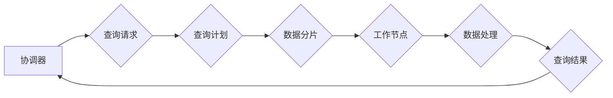

> Presto,MPP,分布式数据库,查询引擎,SQL,数据仓库,Hadoop,Spark,YARN

## 1. 背景介绍

在海量数据时代，高效、快速的查询分析能力成为数据驱动决策的关键。传统的单机数据库难以应对海量数据的处理需求，分布式数据库系统应运而生。Presto作为一款开源的分布式SQL查询引擎，以其高性能、低延迟和易用性，在数据仓库、实时分析等领域得到了广泛应用。

Presto由Facebook开源，最初用于内部的广告分析系统，后来逐渐发展成为一个成熟的开源项目。它基于Hadoop生态系统，能够查询各种数据源，包括HDFS、S3、Cassandra等。Presto的架构设计灵活，支持水平扩展，能够处理海量数据查询。

## 2. 核心概念与联系

Presto的核心概念包括协调器、工作节点、查询计划、数据分片等。

**Mermaid 流程图：**



**核心概念解释：**

* **协调器:** Presto的控制中心，负责接收查询请求、生成查询计划、分配任务给工作节点并协调结果返回。
* **工作节点:** Presto的计算节点，负责执行查询计划中的数据处理任务。
* **查询计划:** 协调器根据查询语句生成的数据处理步骤，包括数据源、数据分片、执行顺序等。
* **数据分片:** 将大型数据表划分为多个小块，方便并行处理。

## 3. 核心算法原理 & 具体操作步骤

### 3.1  算法原理概述

Presto的核心算法是基于**并行查询**和**数据分片**的。它将查询语句分解成多个子任务，并行执行在不同的工作节点上，从而提高查询效率。

### 3.2  算法步骤详解

1. **接收查询请求:** 协调器接收用户提交的SQL查询语句。
2. **解析查询语句:** 协调器解析查询语句，确定查询目标表、查询条件、排序字段等信息。
3. **生成查询计划:** 协调器根据查询语句信息，生成一个查询计划，包括数据源、数据分片、执行顺序等。
4. **分配任务:** 协调器将查询计划中的任务分配给不同的工作节点。
5. **数据分片:** 工作节点根据查询计划，将数据表进行分片，并读取对应的数据块。
6. **数据处理:** 工作节点执行查询计划中的数据处理操作，例如过滤、排序、聚合等。
7. **结果合并:** 工作节点将处理结果发送回协调器，协调器将所有结果合并成最终的查询结果。
8. **返回结果:** 协调器将最终的查询结果返回给用户。

### 3.3  算法优缺点

**优点:**

* **高性能:** 并行查询和数据分片机制，能够有效提高查询效率。
* **低延迟:** Presto支持实时查询，能够快速响应用户请求。
* **易用性:** 使用标准的SQL语法，易于学习和使用。
* **灵活扩展:** 支持水平扩展，能够处理海量数据查询。

**缺点:**

* **资源消耗:** 并行查询需要消耗大量的计算资源。
* **复杂性:** Presto的架构相对复杂，需要一定的技术积累才能进行开发和维护。

### 3.4  算法应用领域

Presto广泛应用于数据仓库、实时分析、机器学习等领域。

* **数据仓库:** Presto能够快速查询和分析海量数据，支持数据挖掘和报表分析。
* **实时分析:** Presto能够实时处理流式数据，支持实时监控和报警。
* **机器学习:** Presto能够用于机器学习模型的训练和评估，支持大规模数据分析。

## 4. 数学模型和公式 & 详细讲解 & 举例说明

### 4.1  数学模型构建

Presto的查询优化器基于**代价模型**，通过估算不同查询计划的执行代价，选择最优的查询计划。代价模型通常包括以下几个方面：

* **数据扫描代价:** 扫描数据表所需的时间。
* **数据传输代价:** 数据在不同节点之间传输所需的时间。
* **数据处理代价:** 执行查询计划中的数据处理操作所需的时间。

### 4.2  公式推导过程

Presto的代价模型通常使用以下公式进行计算：

```latex
代价 = 数据扫描代价 + 数据传输代价 + 数据处理代价
```

其中，每个代价项的计算公式根据具体的场景和算法而有所不同。

### 4.3  案例分析与讲解

假设我们有一个包含10亿条数据的表，需要查询其中满足特定条件的数据。

* **数据扫描代价:** 可以根据表的大小和查询条件的范围来估算。
* **数据传输代价:** 可以根据数据传输的距离和网络带宽来估算。
* **数据处理代价:** 可以根据查询条件的复杂度和数据处理操作的类型来估算。

通过计算以上三个代价项，Presto的查询优化器可以比较不同的查询计划，选择代价最低的查询计划。

## 5. 项目实践：代码实例和详细解释说明

### 5.1  开发环境搭建

Presto的开发环境搭建需要以下软件：

* Java JDK
* Maven
* Hadoop
* YARN

### 5.2  源代码详细实现

Presto的源代码托管在GitHub上，可以从以下地址下载：https://github.com/prestodb/presto

### 5.3  代码解读与分析

Presto的源代码主要包含以下几个模块：

* **协调器:** 负责接收查询请求、生成查询计划、分配任务给工作节点并协调结果返回。
* **工作节点:** 负责执行查询计划中的数据处理任务。
* **查询引擎:** 负责执行查询语句，包括数据扫描、数据处理、结果合并等操作。
* **数据源:** 提供访问不同数据源的接口，例如HDFS、S3、Cassandra等。

### 5.4  运行结果展示

Presto的运行结果可以以文本、CSV、JSON等格式输出。

## 6. 实际应用场景

Presto在数据仓库、实时分析、机器学习等领域得到了广泛应用。

### 6.1  数据仓库

Presto可以用于构建数据仓库，快速查询和分析海量数据，支持数据挖掘和报表分析。

### 6.2  实时分析

Presto可以用于实时分析，实时处理流式数据，支持实时监控和报警。

### 6.3  机器学习

Presto可以用于机器学习模型的训练和评估，支持大规模数据分析。

### 6.4  未来应用展望

随着数据量的不断增长，Presto的应用场景将会更加广泛。未来，Presto可能会应用于以下领域：

* **物联网数据分析:** 处理海量物联网数据，进行实时分析和决策。
* **金融风险管理:** 实时监控金融市场数据，识别和评估风险。
* **医疗健康分析:** 分析医疗数据，辅助诊断和治疗。

## 7. 工具和资源推荐

### 7.1  学习资源推荐

* Presto官方文档: https://prestodb.io/docs/current/
* Presto GitHub仓库: https://github.com/prestodb/presto
* Presto社区论坛: https://prestodb.io/community/

### 7.2  开发工具推荐

* IntelliJ IDEA
* Eclipse

### 7.3  相关论文推荐

* Presto: A Distributed SQL Query Engine for Big Data
* Cost-Based Query Optimization in Presto

## 8. 总结：未来发展趋势与挑战

### 8.1  研究成果总结

Presto作为一款开源的分布式SQL查询引擎，在数据仓库、实时分析等领域取得了显著的成果。其高性能、低延迟和易用性使其成为海量数据分析的首选工具之一。

### 8.2  未来发展趋势

未来，Presto将会继续朝着以下方向发展：

* **性能优化:** 进一步提高查询效率，降低资源消耗。
* **功能扩展:** 支持更多数据源和查询功能。
* **生态系统建设:** 构建完善的生态系统，包括工具、插件和社区支持。

### 8.3  面临的挑战

Presto也面临着一些挑战：

* **复杂性:** Presto的架构相对复杂，需要一定的技术积累才能进行开发和维护。
* **资源消耗:** 并行查询需要消耗大量的计算资源，成本较高。
* **数据安全:** 海量数据安全问题需要得到重视。

### 8.4  研究展望

未来，我们将继续研究和改进Presto，使其成为更强大、更易用、更安全的分布式SQL查询引擎。

## 9. 附录：常见问题与解答

### 9.1  常见问题

* Presto如何连接到不同的数据源？
* Presto如何进行查询优化？
* Presto如何进行数据安全保护？

### 9.2  解答

* Presto可以通过配置数据源连接信息来连接到不同的数据源。
* Presto使用代价模型进行查询优化，选择代价最低的查询计划。
* Presto支持多种数据安全机制，例如身份验证、授权和数据加密。


作者：禅与计算机程序设计艺术 / Zen and the Art of Computer Programming 
<end_of_turn>