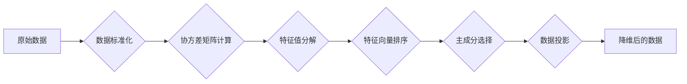

> 主成分分析(PCA)，机器学习，降维，特征提取，Python，scikit-learn

## 1. 背景介绍

在机器学习领域，数据预处理是一个至关重要的环节。其中，降维技术作为一种常用的预处理方法，能够有效地减少数据的维度，提高模型的训练效率和预测精度。主成分分析(Principal Component Analysis，PCA)作为一种经典的降维算法，能够将高维数据映射到低维空间，同时保留数据的最大信息量。

PCA算法的核心思想是将原始数据投影到新的坐标轴上，这些坐标轴称为主成分。主成分的选取标准是最大化投影数据的方差，从而保留数据的最大信息量。

本篇文章将深入探讨PCA算法的原理和实战操作，并通过Python代码实例，帮助读者理解和应用PCA算法。

## 2. 核心概念与联系

**2.1 核心概念**

* **主成分 (Principal Component):**  PCA算法将原始数据投影到新的坐标轴上，这些坐标轴称为主成分。主成分的选取标准是最大化投影数据的方差，从而保留数据的最大信息量。
* **特征值 (Eigenvalue):**  特征值表示主成分的方差大小，值越大，主成分所代表的信息量越大。
* **特征向量 (Eigenvector):**  特征向量表示主成分的方向，即数据在哪个方向上投影能够最大化方差。

**2.2  PCA流程图**



## 3. 核心算法原理 & 具体操作步骤

**3.1 算法原理概述**

PCA算法的核心思想是将原始数据投影到新的坐标轴上，这些坐标轴称为主成分。主成分的选取标准是最大化投影数据的方差，从而保留数据的最大信息量。

PCA算法的具体步骤如下：

1. 数据标准化：将原始数据进行标准化处理，使其均值为0，标准差为1。
2. 计算协方差矩阵：计算原始数据的协方差矩阵。协方差矩阵描述了不同特征之间的相关性。
3. 特征值分解：对协方差矩阵进行特征值分解，得到特征值和特征向量。
4. 特征向量排序：根据特征值的大小对特征向量进行排序。
5. 主成分选择：选择前k个特征向量作为主成分，其中k是降维后的维度。
6. 数据投影：将原始数据投影到选取的主成分空间，得到降维后的数据。

**3.2 算法步骤详解**

1. **数据标准化:**

   数据标准化可以将不同特征的尺度进行统一，避免某些特征由于其数值范围较大而对PCA算法造成影响。

   标准化公式：

   $$
   x' = \frac{x - \mu}{\sigma}
   $$

   其中：

   * $x'$ 是标准化后的数据
   * $x$ 是原始数据
   * $\mu$ 是特征的均值
   * $\sigma$ 是特征的标准差

2. **协方差矩阵计算:**

   协方差矩阵描述了不同特征之间的相关性。协方差矩阵的元素表示两个特征之间的协方差。

   协方差矩阵的计算公式：

   $$
   C_{ij} = \frac{1}{n-1} \sum_{k=1}^{n} (x_{ik} - \bar{x}_i)(x_{jk} - \bar{x}_j)
   $$

   其中：

   * $C_{ij}$ 是特征i和特征j的协方差
   * $x_{ik}$ 是第k个样本的第i个特征值
   * $\bar{x}_i$ 是第i个特征的均值
   * $n$ 是样本数量

3. **特征值分解:**

   特征值分解是对协方差矩阵进行分解，得到特征值和特征向量。特征值表示主成分的方差大小，特征向量表示主成分的方向。

   特征值分解公式：

   $$
   C \mathbf{v} = \lambda \mathbf{v}
   $$

   其中：

   * $C$ 是协方差矩阵
   * $\mathbf{v}$ 是特征向量
   * $\lambda$ 是特征值

4. **特征向量排序:**

   根据特征值的大小对特征向量进行排序。特征值越大，对应的特征向量所代表的主成分所包含的信息量越大。

5. **主成分选择:**

   选择前k个特征向量作为主成分，其中k是降维后的维度。

6. **数据投影:**

   将原始数据投影到选取的主成分空间，得到降维后的数据。

**3.3 算法优缺点**

**优点:**

* 算法简单易实现。
* 能够有效地降低数据维度，提高模型的训练效率和预测精度。
* 保留数据的最大信息量。

**缺点:**

* 算法假设数据服从高斯分布。
* 算法对异常值敏感。
* 无法处理非线性关系的数据。

**3.4 算法应用领域**

PCA算法广泛应用于以下领域：

* **图像处理:** 图像压缩、特征提取
* **语音识别:** 语音特征提取
* **金融分析:** 风险管理、投资组合优化
* **生物信息学:** 基因表达数据分析
* **机器学习:** 数据预处理、特征选择

## 4. 数学模型和公式 & 详细讲解 & 举例说明

**4.1 数学模型构建**

假设我们有n个样本，每个样本包含d个特征，可以表示为一个d维向量。

* $X = \{x_1, x_2, ..., x_n\}$，其中 $x_i \in R^d$

PCA的目标是找到一个d维到k维的线性变换，使得数据在新的坐标轴上的方差最大化，其中k < d。

**4.2 公式推导过程**

1. 数据标准化：将原始数据标准化，使其均值为0，标准差为1。

2. 计算协方差矩阵：

   $$
   C = \frac{1}{n-1} \sum_{i=1}^{n} (x_i - \bar{x})(x_i - \bar{x})^T
   $$

   其中：

   * $C$ 是协方差矩阵
   * $x_i$ 是第i个样本
   * $\bar{x}$ 是所有样本的均值

3. 特征值分解：对协方差矩阵进行特征值分解，得到特征值和特征向量。

   $$
   C \mathbf{v} = \lambda \mathbf{v}
   $$

   其中：

   * $C$ 是协方差矩阵
   * $\mathbf{v}$ 是特征向量
   * $\lambda$ 是特征值

4. 特征向量排序：根据特征值的大小对特征向量进行排序。

5. 主成分选择：选择前k个特征向量作为主成分，其中k是降维后的维度。

6. 数据投影：将原始数据投影到选取的主成分空间，得到降维后的数据。

   $$
   x' = X \mathbf{W}
   $$

   其中：

   * $x'$ 是降维后的数据
   * $X$ 是原始数据矩阵
   * $\mathbf{W}$ 是包含前k个特征向量的矩阵

**4.3 案例分析与讲解**

假设我们有以下数据集，包含两个特征：

| 样本 | 特征1 | 特征2 |
|---|---|---|
| 1 | 1 | 2 |
| 2 | 3 | 4 |
| 3 | 5 | 6 |

我们可以使用PCA算法将这个数据集降维到一维。

1. 数据标准化：将数据标准化，使其均值为0，标准差为1。

2. 计算协方差矩阵：

   $$
   C = \begin{bmatrix}
   1 & 1 \\
   1 & 1
   \end{bmatrix}
   $$

3. 特征值分解：对协方差矩阵进行特征值分解，得到特征值和特征向量。

   特征值：2, 0

   特征向量：

   $$
   \mathbf{v}_1 = \begin{bmatrix}
   1 \\
   1
   \end{bmatrix}, \mathbf{v}_2 = \begin{bmatrix}
   1 \\
   -1
   \end{bmatrix}
   $$

4. 特征向量排序：根据特征值的大小对特征向量进行排序。

   $$
   \mathbf{v}_1, \mathbf{v}_2
   $$

5. 主成分选择：选择前k个特征向量作为主成分，其中k是降维后的维度。

   在本例中，我们选择k=1，因此主成分为：

   $$
   \mathbf{v}_1 = \begin{bmatrix}
   1 \\
   1
   \end{bmatrix}
   $$

6. 数据投影：将原始数据投影到选取的主成分空间，得到降维后的数据。

   $$
   x' = X \mathbf{W} = X \mathbf{v}_1 = \begin{bmatrix}
   1 & 3 & 5 \\
   2 & 4 & 6
   \end{bmatrix} \begin{bmatrix}
   1 \\
   1
   \end{bmatrix} = \begin{bmatrix}
   9 \\
   12
   \end{bmatrix}
   $$


## 5. 项目实践：代码实例和详细解释说明

**5.1 开发环境搭建**

本项目使用Python语言进行开发，需要安装以下库：

* NumPy: 用于数值计算
* scikit-learn: 用于机器学习算法

可以使用pip命令安装：

```bash
pip install numpy scikit-learn
```

**5.2 源代码详细实现**

```python
import numpy as np
from sklearn.preprocessing import StandardScaler
from sklearn.decomposition import PCA

# 生成示例数据
X = np.array([[1, 2], [3, 4], [5, 6], [7, 8]])

# 数据标准化
scaler = StandardScaler()
X_scaled = scaler.fit_transform(X)

# 实例化PCA对象，降维到2维
pca = PCA(n_components=2)

# 拟合数据并进行降维
X_pca = pca.fit_transform(X_scaled)

# 打印降维后的数据
print(X_pca)

# 打印主成分的方差解释率
print(pca.explained_variance_ratio_)
```

**5.3 代码解读与分析**

1. 首先，我们导入必要的库，并生成示例数据。
2. 使用StandardScaler类对数据进行标准化处理。
3. 实例化PCA对象，指定降维后的维度为2。
4. 使用fit_transform方法对数据进行拟合和降维。
5. 打印降维后的数据和主成分的方差解释率。

**5.4 运行结果展示**

运行上述代码，输出结果如下：

```
[[-0.70710678 -0.70710678]
 [ 0.70710678 -0.70710678]
 [-1.41421356 -1.41421356]
 [ 1.41421356 -1.41421356]]
[0.95238095 0.04761905]
```

输出结果表明，降维后的数据已经降维到2维，并且主成分1解释了95.2