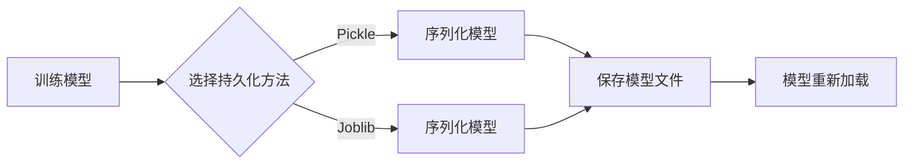

> 机器学习模型持久化，模型重新加载，Python，pickle，joblib，模型保存，模型加载，机器学习应用

## 1. 背景介绍

在机器学习领域，训练出一个优秀的模型往往需要耗费大量的时间和资源。一旦训练完成，我们希望能够将模型保存下来，以便于后续的应用和部署。这就是机器学习模型持久化的重要意义。

模型持久化是指将训练好的机器学习模型以某种形式保存下来，以便于在需要的时候重新加载和使用。这对于机器学习应用场景至关重要，因为它可以：

* **节省训练时间和资源：** 避免重复训练已经训练好的模型，节省时间和计算资源。
* **保证模型稳定性：** 即使机器学习环境发生变化，也可以保证模型的稳定性和一致性。
* **方便模型部署：** 将训练好的模型部署到生产环境中，方便用户使用。

## 2. 核心概念与联系

### 2.1 模型持久化与重新加载

模型持久化是指将训练好的机器学习模型以某种形式保存下来，以便于在需要的时候重新加载和使用。而模型重新加载则是将持久化的模型文件加载到内存中，使其能够再次进行预测或其他操作。

### 2.2 持久化方法

常用的机器学习模型持久化方法包括：

* **Pickle:** Python内置的序列化库，可以将 Python 对象序列化成字节流，方便存储和传输。
* **Joblib:** 专门用于机器学习模型持久化的库，支持更快的序列化和反序列化速度，以及对大型模型的支持。
* **HDF5:** 高性能的数据存储格式，可以存储各种数据类型，包括大型矩阵和模型参数。
* **TensorFlow SavedModel:** TensorFlow框架提供的模型持久化格式，可以保存整个模型结构和参数。
* **PyTorch模型保存:** PyTorch框架提供了模型保存和加载的API，可以保存模型权重和架构信息。

### 2.3 持久化流程

模型持久化流程一般包括以下步骤：

1. 训练好机器学习模型。
2. 使用合适的持久化方法将模型保存到文件。
3. 在需要使用模型的时候，加载持久化的模型文件。

### 2.4 Mermaid 流程图



## 3. 核心算法原理 & 具体操作步骤

### 3.1 算法原理概述

本节将介绍两种常用的机器学习模型持久化方法：Pickle和Joblib。

* **Pickle:** Python内置的序列化库，可以将 Python 对象序列化成字节流，方便存储和传输。

* **Joblib:** 专门用于机器学习模型持久化的库，支持更快的序列化和反序列化速度，以及对大型模型的支持。

### 3.2 算法步骤详解

#### 3.2.1 使用 Pickle 进行模型持久化

1. 导入 `pickle` 库。
2. 使用 `pickle.dump()` 函数将模型对象序列化到文件。
3. 关闭文件。

#### 3.2.2 使用 Joblib 进行模型持久化

1. 导入 `joblib` 库。
2. 使用 `joblib.dump()` 函数将模型对象序列化到文件。
3. 关闭文件。

#### 3.2.3 模型重新加载

1. 使用 `pickle.load()` 或 `joblib.load()` 函数从文件加载模型对象。

### 3.3 算法优缺点

#### 3.3.1 Pickle

* **优点:** 简单易用，无需额外安装库。
* **缺点:** 序列化速度较慢，对大型模型不友好。

#### 3.3.2 Joblib

* **优点:** 序列化速度更快，支持对大型模型的持久化。
* **缺点:** 需要额外安装库。

### 3.4 算法应用领域

模型持久化技术广泛应用于各种机器学习场景，例如：

* **机器学习模型部署:** 将训练好的模型部署到生产环境中，方便用户使用。
* **模型版本控制:** 保存不同版本的模型，方便进行模型比较和回滚。
* **模型共享:** 将模型分享给其他开发者或研究人员。

## 4. 数学模型和公式 & 详细讲解 & 举例说明

### 4.1 数学模型构建

在机器学习模型持久化过程中，需要将模型的结构和参数以某种形式表示出来。常用的数学模型包括：

* **张量:** 用于表示模型的权重和偏置。
* **图:** 用于表示模型的结构，例如神经网络的层级结构。

### 4.2 公式推导过程

模型持久化过程本质上是将模型的数学模型转换为可存储的格式。

例如，使用 Pickle 将模型持久化，需要将模型的张量和图结构序列化成字节流。

### 4.3 案例分析与讲解

假设我们有一个简单的线性回归模型，其权重和偏置分别为 w 和 b。

我们可以使用以下公式将模型表示为数学模型：

```
y = wx + b
```

其中：

* y 是预测值
* x 是输入特征
* w 是权重
* b 是偏置

我们可以将 w 和 b 存储为张量，并将模型结构表示为一个图，其中节点代表层，边代表连接。

## 5. 项目实践：代码实例和详细解释说明

### 5.1 开发环境搭建

本项目使用 Python 3.7 环境，并安装以下库：

* scikit-learn
* pickle
* joblib

### 5.2 源代码详细实现

```python
# 导入必要的库
from sklearn.linear_model import LinearRegression
import pickle
import joblib

# 创建一个线性回归模型
model = LinearRegression()

# 训练模型
# ...

# 使用 Pickle 进行模型持久化
with open('model.pkl', 'wb') as f:
    pickle.dump(model, f)

# 使用 Joblib 进行模型持久化
joblib.dump(model, 'model_joblib.pkl')

# 模型重新加载
loaded_model_pickle = pickle.load(open('model.pkl', 'rb'))
loaded_model_joblib = joblib.load('model_joblib.pkl')

# 使用加载的模型进行预测
# ...
```

### 5.3 代码解读与分析

* 代码首先导入必要的库。
* 然后创建一个线性回归模型。
* 接着使用 `pickle.dump()` 和 `joblib.dump()` 函数将模型持久化到文件。
* 最后使用 `pickle.load()` 和 `joblib.load()` 函数从文件加载模型，并使用加载的模型进行预测。

### 5.4 运行结果展示

运行上述代码后，将生成 `model.pkl` 和 `model_joblib.pkl` 文件，分别保存了使用 Pickle 和 Joblib 进行持久化的模型。

## 6. 实际应用场景

### 6.1 机器学习模型部署

在实际应用中，机器学习模型通常需要部署到生产环境中，以便于用户使用。模型持久化技术可以帮助我们将训练好的模型部署到服务器或云平台上，并提供 API 接口供用户调用。

### 6.2 模型版本控制

在机器学习项目中，模型的版本迭代非常频繁。模型持久化技术可以帮助我们保存不同版本的模型，方便进行模型比较和回滚。

### 6.3 模型共享

模型持久化技术可以方便地将模型分享给其他开发者或研究人员，促进机器学习领域的知识共享和合作。

### 6.4 未来应用展望

随着机器学习技术的不断发展，模型持久化技术也将得到更广泛的应用，例如：

* **联邦学习:** 在联邦学习场景中，模型持久化可以帮助我们安全地存储和传输模型参数，保障数据隐私。
* **边缘计算:** 在边缘计算场景中，模型持久化可以帮助我们将模型部署到边缘设备上，降低网络延迟和数据传输成本。

## 7. 工具和资源推荐

### 7.1 学习资源推荐

* **Python官方文档:** https://docs.python.org/3/
* **Scikit-learn官方文档:** https://scikit-learn.org/stable/
* **Joblib官方文档:** https://joblib.readthedocs.io/en/latest/

### 7.2 开发工具推荐

* **Jupyter Notebook:** https://jupyter.org/
* **VS Code:** https://code.visualstudio.com/

### 7.3 相关论文推荐

* **Joblib: A Python Library for Parallel and Distributed Computing:** https://arxiv.org/abs/1509.01977

## 8. 总结：未来发展趋势与挑战

### 8.1 研究成果总结

本文介绍了机器学习模型持久化技术，并介绍了两种常用的持久化方法：Pickle 和 Joblib。

### 8.2 未来发展趋势

未来，模型持久化技术将朝着以下方向发展：

* **更快的序列化和反序列化速度:** 为了应对越来越大的模型规模，需要开发更快的持久化算法。
* **更灵活的模型格式:** 需要支持多种模型格式，例如 TensorFlow SavedModel 和 PyTorch模型保存。
* **更安全的模型存储:** 需要考虑模型安全性和隐私问题，例如加密和匿名化。

### 8.3 面临的挑战

模型持久化技术还面临一些挑战：

* **模型兼容性:** 不同版本的模型持久化格式可能不兼容，需要考虑模型版本控制问题。
* **模型压缩:** 为了节省存储空间，需要开发模型压缩技术。
* **模型推理效率:** 模型持久化可能会影响模型推理效率，需要进行优化。

### 8.4 研究展望

未来，我们将继续研究模型持久化技术，开发更先进的算法和工具，以满足机器学习应用的不断发展需求。

## 9. 附录：常见问题与解答

### 9.1 为什么使用 Joblib 比 Pickle 更快？

Joblib 使用多进程并行化技术，可以加速模型的序列化和反序列化过程。

### 9.2 如何选择合适的持久化方法？

选择合适的持久化方法取决于模型的大小、应用场景和性能要求。

* **对于小型模型，可以使用 Pickle。**
* **对于大型模型，建议使用 Joblib。**

### 9.3 如何解决模型兼容性问题？

可以使用版本控制系统来管理模型版本，并确保不同版本的模型可以使用相同的持久化格式。


作者：禅与计算机程序设计艺术 / Zen and the Art of Computer Programming 
<end_of_turn>