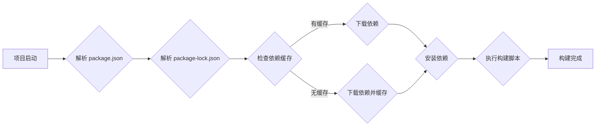

> Yarn, 构建工具, 依赖管理, 缓存, 并行下载, 性能优化, 构建流程

## 1. 背景介绍

在现代软件开发中，依赖管理和构建流程是至关重要的环节。随着项目规模的不断扩大，依赖数量的增加，传统的构建工具逐渐显得力不从心。Yarn 作为 npm 的替代方案，凭借其高效的依赖管理、缓存机制和并行下载能力，迅速成为前端开发中不可或缺的构建工具。

## 2. 核心概念与联系

Yarn 的核心概念围绕着依赖管理、缓存和构建流程展开。

**2.1 依赖管理**

Yarn 使用一个称为 `package-lock.json` 的文件来精确记录项目的依赖关系和版本信息。通过解析这个文件，Yarn 可以确保每个项目在不同的环境下都能使用相同的依赖版本，从而避免由于依赖冲突导致的开发问题。

**2.2 缓存机制**

Yarn 拥有强大的缓存机制，可以缓存已下载的依赖包，避免重复下载，从而显著提高构建速度。

**2.3 并行下载**

Yarn 支持并行下载依赖包，可以充分利用网络带宽，加速依赖下载过程。

**2.4 构建流程**

Yarn 提供了一个灵活的构建流程，可以根据项目的需要自定义构建步骤，例如编译代码、压缩文件、生成发布包等。

**2.5 Mermaid 流程图**



## 3. 核心算法原理 & 具体操作步骤

### 3.1  算法原理概述

Yarn 的核心算法主要围绕着依赖解析、版本匹配和缓存管理。

* **依赖解析:** Yarn 会解析 `package.json` 文件中的依赖信息，并根据依赖关系构建一个依赖树。
* **版本匹配:** Yarn 会根据依赖树和 `package-lock.json` 文件中的版本信息，选择满足条件的依赖版本。
* **缓存管理:** Yarn 会将下载的依赖包缓存到本地，并在后续构建过程中优先使用缓存的依赖包。

### 3.2  算法步骤详解

1. **解析 `package.json` 文件:** Yarn 会首先解析项目的 `package.json` 文件，获取项目名称、版本信息以及依赖列表。
2. **解析 `package-lock.json` 文件:** 如果存在 `package-lock.json` 文件，Yarn 会解析该文件，获取已安装依赖的版本信息和依赖树结构。
3. **依赖树构建:** 根据 `package.json` 文件和 `package-lock.json` 文件的信息，Yarn 会构建一个依赖树，表示项目的依赖关系。
4. **版本匹配:** Yarn 会根据依赖树和 `package-lock.json` 文件中的版本信息，选择满足条件的依赖版本。
5. **依赖下载:** Yarn 会下载所需的依赖包，并将其缓存到本地。
6. **依赖安装:** Yarn 会将下载的依赖包安装到项目的依赖目录。
7. **构建执行:** Yarn 会执行项目的构建脚本，完成项目的构建过程。

### 3.3  算法优缺点

**优点:**

* **高效的依赖管理:** Yarn 的依赖管理机制可以确保项目的依赖关系一致性，避免依赖冲突。
* **强大的缓存机制:** Yarn 的缓存机制可以显著提高构建速度。
* **并行下载:** Yarn 支持并行下载依赖包，可以充分利用网络带宽。
* **灵活的构建流程:** Yarn 提供了一个灵活的构建流程，可以根据项目的需要自定义构建步骤。

**缺点:**

* **学习曲线:** Yarn 的一些特性，例如 `package-lock.json` 文件，对于初学者来说可能需要一些时间来理解。
* **与 npm 的兼容性:** Yarn 和 npm 的语法有一些差异，需要进行一些调整。

### 3.4  算法应用领域

Yarn 的核心算法广泛应用于前端开发、移动开发、后端开发等领域。

## 4. 数学模型和公式 & 详细讲解 & 举例说明

Yarn 的核心算法涉及到一些数学模型和公式，例如依赖树的构建、版本匹配的算法等。

### 4.1  数学模型构建

依赖树可以看作是一个有向无环图，其中每个节点代表一个依赖包，边表示依赖关系。

### 4.2  公式推导过程

版本匹配的算法通常使用一些数学公式来比较版本号，例如比较版本号的大小、版本号的兼容性等。

### 4.3  案例分析与讲解

## 5. 项目实践：代码实例和详细解释说明

### 5.1  开发环境搭建

1. 安装 Node.js 和 npm。
2. 安装 Yarn：`npm install -g yarn`

### 5.2  源代码详细实现

```javascript
// package.json
{
  "name": "my-project",
  "version": "1.0.0",
  "dependencies": {
    "react": "^18.2.0",
    "react-dom": "^18.2.0"
  }
}
```

### 5.3  代码解读与分析

* `package.json` 文件定义了项目的名称、版本信息以及依赖列表。
* `dependencies` 属性指定了项目的直接依赖包。
* `^` 符号表示版本号的松散匹配，允许使用最新版本或兼容的版本。

### 5.4  运行结果展示

使用 Yarn 安装依赖包：`yarn install`

## 6. 实际应用场景

Yarn 在前端开发中被广泛应用于以下场景：

* **单页面应用 (SPA) 开发:** Yarn 可以帮助开发者快速构建和管理 SPA 的依赖关系。
* **React、Vue、Angular 等框架开发:** Yarn 可以帮助开发者管理这些框架的依赖包和构建流程。
* **npm 迁移:** Yarn 可以帮助开发者将项目从 npm 迁移到 Yarn。

### 6.4  未来应用展望

随着软件开发的不断发展，Yarn 将会继续演进，支持更多新的功能和特性，例如更强大的缓存机制、更灵活的构建流程、更完善的依赖管理等。

## 7. 工具和资源推荐

### 7.1  学习资源推荐

* Yarn 官方文档: https://yarnpkg.com/en/docs/
* Yarn 中文文档: https://www.npmjs.com/package/yarn

### 7.2  开发工具推荐

* Visual Studio Code: https://code.visualstudio.com/
* WebStorm: https://www.jetbrains.com/webstorm/

### 7.3  相关论文推荐

* Yarn: A Fast, Reliable, and Secure Dependency Manager: https://yarnpkg.com/en/docs/getting-started

## 8. 总结：未来发展趋势与挑战

### 8.1  研究成果总结

Yarn 作为一种高效的依赖管理和构建工具，已经取得了显著的成果，并在前端开发领域得到了广泛应用。

### 8.2  未来发展趋势

未来，Yarn 将会继续朝着以下方向发展：

* **更强大的缓存机制:** Yarn 将会进一步优化缓存机制，提高构建速度和效率。
* **更灵活的构建流程:** Yarn 将会提供更灵活的构建流程，支持更多类型的构建任务。
* **更完善的依赖管理:** Yarn 将会提供更完善的依赖管理功能，例如依赖冲突检测、依赖版本管理等。

### 8.3  面临的挑战

Yarn 也面临着一些挑战，例如：

* **与 npm 的兼容性:** Yarn 和 npm 的语法有一些差异，需要进行一些调整。
* **社区支持:** Yarn 的社区支持相对 npm 较小，需要更多的开发者参与进来。

### 8.4  研究展望

未来，Yarn 的研究方向将包括：

* **更智能的依赖管理:** 研究如何利用机器学习等技术，实现更智能的依赖管理。
* **更安全的构建流程:** 研究如何提高构建流程的安全性和可靠性。
* **更跨平台的应用:** 研究如何将 Yarn 应用到更多平台，例如移动开发、后端开发等。

## 9. 附录：常见问题与解答

### 9.1  常见问题

* 如何安装 Yarn?
* 如何使用 Yarn 安装依赖包?
* 如何使用 Yarn 构建项目?

### 9.2  解答

* 安装 Yarn 的方法见 5.1 节。
* 使用 Yarn 安装依赖包的命令是 `yarn install`。
* 使用 Yarn 构建项目的命令是 `yarn build`。


作者：禅与计算机程序设计艺术 / Zen and the Art of Computer Programming 
<end_of_turn>