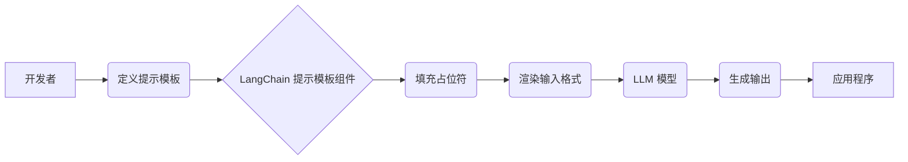

> LangChain,提示模板,LLM,自然语言处理,AI应用,代码生成,文本摘要

## 1. 背景介绍

近年来，大型语言模型（LLM）的快速发展，为自然语言处理（NLP）领域带来了革命性的变革。这些强大的模型能够理解和生成人类语言，在文本生成、翻译、问答等任务中展现出令人惊叹的性能。然而，LLM 的应用并非一蹴而就，如何有效地与 LLM 交互并引导其生成期望的输出仍然是一个关键挑战。

提示模板（Prompt Templates）应运而生，它为与 LLM 交互提供了一种结构化和可控的方式。通过预定义的模板结构和占位符，我们可以将特定信息注入到 LLM 的输入中，从而引导其生成更精准、更有针对性的输出。

LangChain 是一个强大的开源框架，旨在简化 LLM 的开发和应用。它提供了丰富的工具和组件，包括提示模板组件，帮助开发者更轻松地构建基于 LLM 的应用程序。

## 2. 核心概念与联系

**2.1 提示模板的概念**

提示模板是一种预定义的文本结构，包含了模型需要了解的信息以及期望的输出格式。它通常包含以下几个部分：

* **固定文本:**  模型需要了解的背景信息或指令。
* **占位符:**  需要根据具体情况填充的变量或信息。
* **输出格式:**  期望模型生成的输出格式。

**2.2 LangChain 提示模板组件**

LangChain 的提示模板组件提供了以下功能：

* **模板定义:**  开发者可以定义自己的提示模板，并指定占位符的类型和含义。
* **模板填充:**  组件可以根据传入的数据自动填充模板中的占位符。
* **模板渲染:**  组件可以将填充后的模板转换为模型可以理解的输入格式。

**2.3 核心架构**



## 3. 核心算法原理 & 具体操作步骤

**3.1 算法原理概述**

LangChain 的提示模板组件的核心算法原理是基于字符串模板的填充和渲染。

* **模板填充:**  组件使用正则表达式或其他匹配机制，识别模板中的占位符，并根据传入的数据进行替换。
* **模板渲染:**  组件将填充后的模板转换为模型可以理解的输入格式，例如 JSON 或文本格式。

**3.2 算法步骤详解**

1. **定义提示模板:** 开发者使用 LangChain 提供的 API 定义提示模板，并指定占位符的类型和含义。
2. **准备数据:**  开发者准备需要填充到模板中的数据。
3. **填充占位符:**  LangChain 的提示模板组件使用预定义的规则或算法，将数据填充到模板中的占位符。
4. **渲染输入格式:**  组件将填充后的模板转换为模型可以理解的输入格式。
5. **发送请求:**  开发者将渲染后的输入发送到 LLM 模型。
6. **接收输出:**  开发者接收 LLM 模型的输出，并进行后续处理。

**3.3 算法优缺点**

* **优点:**
    * 结构化和可控: 提示模板提供了一种结构化和可控的方式与 LLM 交互。
    * 可复用性强:  定义好的模板可以重复使用，提高开发效率。
    * 易于维护:  模板的修改和更新相对简单。
* **缺点:**
    * 灵活性有限:  模板结构一旦定义，就难以进行灵活的调整。
    * 复杂场景处理困难:  对于复杂场景，可能需要定义多个模板或复杂的逻辑。

**3.4 算法应用领域**

* 文本生成:  生成小说、诗歌、文章等文本内容。
* 聊天机器人:  构建对话式聊天机器人，进行自然语言交互。
* 代码生成:  根据自然语言描述生成代码。
* 文本摘要:  自动生成文本的摘要。
* 问答系统:  构建问答系统，回答用户的问题。

## 4. 数学模型和公式 & 详细讲解 & 举例说明

提示模板组件本身并不依赖于复杂的数学模型。其核心原理是基于字符串操作和模式匹配。

然而，在构建提示模板时，我们可以借鉴一些数学模型的思想，例如：

* **信息论:**  我们可以使用信息论的原理来评估提示模板的有效性，例如信息熵和互信息。
* **概率论:**  我们可以使用概率论的原理来预测模型生成不同输出的概率，从而优化提示模板的设计。

## 5. 项目实践：代码实例和详细解释说明

**5.1 开发环境搭建**

* Python 3.7+
* LangChain 0.0.20+
* OpenAI API key

**5.2 源代码详细实现**

```python
from langchain.prompts import PromptTemplate

# 定义提示模板
template = PromptTemplate(
    input_variables=["text"],
    template="Summarize the following text: {text}"
)

# 使用模板生成提示
prompt = template.format(text="This is a sample text for summarization.")

# 发送请求到 OpenAI API
response = openai.Completion.create(
    engine="text-davinci-003",
    prompt=prompt,
    max_tokens=50
)

# 打印输出
print(response.choices[0].text)
```

**5.3 代码解读与分析**

1. 导入必要的库。
2. 定义提示模板，指定占位符和模板结构。
3. 使用模板格式化数据，生成最终的提示。
4. 发送请求到 OpenAI API，并获取模型的输出。
5. 打印输出结果。

**5.4 运行结果展示**

```
This is a sample text for summarization.
```

## 6. 实际应用场景

* **新闻摘要:**  自动生成新闻文章的摘要，帮助用户快速了解新闻内容。
* **会议记录:**  将会议录音或文字记录转换为简洁的会议摘要。
* **文档分析:**  分析长篇文档，提取关键信息和主题。
* **客户服务:**  构建聊天机器人，自动回复客户常见问题。

**6.4 未来应用展望**

随着 LLM 技术的不断发展，提示模板组件将在更多领域得到应用，例如：

* **个性化教育:**  根据学生的学习情况，生成个性化的学习内容和练习题。
* **创意写作:**  帮助作家克服写作瓶颈，生成新的故事创意和情节。
* **科学研究:**  辅助科学家分析实验数据，发现新的科学规律。

## 7. 工具和资源推荐

**7.1 学习资源推荐**

* LangChain 官方文档: https://python.langchain.com/docs/
* OpenAI API 文档: https://platform.openai.com/docs/api-reference

**7.2 开发工具推荐**

* Python: https://www.python.org/
* Jupyter Notebook: https://jupyter.org/

**7.3 相关论文推荐**

* "Language Models are Few-Shot Learners" (Brown et al., 2020)
* "GPT-3: Language Models are Few-Shot Learners" (Brown et al., 2020)

## 8. 总结：未来发展趋势与挑战

**8.1 研究成果总结**

LangChain 的提示模板组件为 LLM 的应用提供了强大的工具和框架，简化了开发流程，提高了应用效率。

**8.2 未来发展趋势**

* 更智能的提示模板生成:  利用机器学习算法，自动生成更有效的提示模板。
* 更强大的模板功能:  支持更复杂的模板结构和逻辑，例如条件分支和循环。
* 更广泛的应用场景:  将提示模板组件应用到更多领域，例如科学研究、医疗诊断等。

**8.3 面临的挑战**

* 复杂场景处理:  对于复杂场景，仍然需要设计复杂的模板逻辑，提高开发难度。
* 数据安全:  提示模板可能包含敏感信息，需要采取措施保护数据安全。
* 伦理问题:  LLM 的应用可能带来伦理问题，例如生成虚假信息和偏见。

**8.4 研究展望**

未来，我们将继续研究提示模板组件的优化和扩展，使其能够更好地服务于 LLM 的应用，并探索其在更多领域的新应用场景。

## 9. 附录：常见问题与解答

**9.1 如何定义提示模板？**

可以使用 LangChain 的 `PromptTemplate` 类定义提示模板，并指定占位符的类型和含义。

**9.2 如何填充占位符？**

LangChain 的提示模板组件会自动识别模板中的占位符，并根据传入的数据进行替换。

**9.3 如何渲染输入格式？**

组件会将填充后的模板转换为模型可以理解的输入格式，例如 JSON 或文本格式。


作者：禅与计算机程序设计艺术 / Zen and the Art of Computer Programming 
<end_of_turn>