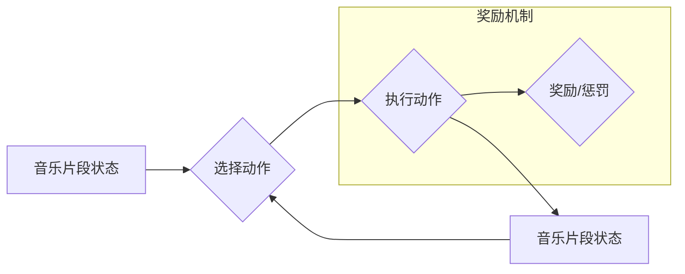

> AI, Q-learning, 音乐制作, 机器学习, 算法, 音乐创作, 算法应用

## 1. 背景介绍

音乐，作为人类文明的重要组成部分，蕴含着丰富的文化内涵和情感表达。传统的音乐创作往往依赖于作曲家的灵感和技巧，而近年来，随着人工智能技术的快速发展，AI在音乐制作领域也展现出巨大的潜力。

Q-learning，作为一种强化学习算法，通过不断与环境交互，学习最优的策略，在游戏、机器人控制等领域取得了显著的成果。将Q-learning应用于音乐制作，可以实现AI自动生成音乐，并根据用户反馈进行调整，为音乐创作提供新的思路和可能性。

## 2. 核心概念与联系

### 2.1 强化学习

强化学习是一种机器学习方法，其核心思想是通过奖励和惩罚机制，引导智能体学习最优的行为策略。

在强化学习中，智能体与环境交互，根据环境的状态采取行动，并获得相应的奖励或惩罚。智能体通过不断学习和调整策略，最终达到最大化奖励的目标。

### 2.2 Q-learning

Q-learning是一种基于价值函数的强化学习算法，其目标是学习一个状态-动作价值函数Q(s,a)，该函数表示在状态s下采取动作a的期望回报。

Q-learning算法通过迭代更新Q函数，最终找到最优策略，即在每个状态下采取能够获得最大期望回报的动作。

### 2.3 音乐制作与Q-learning

将Q-learning应用于音乐制作，可以将音乐创作过程视为一个强化学习任务。

* **状态空间:** 音乐片段的当前状态，例如音符、节奏、旋律等。
* **动作空间:** 可采取的音乐创作动作，例如添加音符、改变节奏、调整旋律等。
* **奖励函数:** 根据音乐片段的质量、美感等因素进行评估，给予相应的奖励或惩罚。

通过Q-learning算法，AI可以学习到最优的音乐创作策略，自动生成具有艺术价值的音乐作品。

**Mermaid 流程图**



## 3. 核心算法原理 & 具体操作步骤

### 3.1 算法原理概述

Q-learning算法的核心思想是通过迭代更新状态-动作价值函数Q(s,a)，学习最优策略。

算法的基本步骤如下：

1. 初始化状态-动作价值函数Q(s,a)。
2. 根据当前状态s，选择一个动作a。
3. 执行动作a，观察环境反馈的下一个状态s'和奖励r。
4. 更新状态-动作价值函数Q(s,a)根据Bellman方程：

```
Q(s,a) = Q(s,a) + α[r + γmaxQ(s',a') - Q(s,a)]
```

其中：

* α为学习率，控制学习速度。
* γ为折扣因子，控制未来奖励的权重。
* maxQ(s',a')为下一个状态s'下所有动作a'的价值函数的最大值。

5. 重复步骤2-4，直到Q函数收敛。

### 3.2 算法步骤详解

1. **初始化:**

   * 为每个状态-动作对Q(s,a)赋予一个初始值，通常为0。
   * 设置学习率α和折扣因子γ。

2. **环境交互:**

   * 从初始状态开始，AI根据当前状态选择一个动作。
   * 执行动作后，观察环境反馈的下一个状态和奖励。

3. **Q值更新:**

   * 使用Bellman方程更新当前状态-动作对的Q值。
   * 其中，r为当前奖励，γ为折扣因子，maxQ(s',a')为下一个状态下所有动作的Q值最大值。

4. **策略选择:**

   * 根据更新后的Q值，选择下一个动作。
   * 通常使用ε-贪婪策略，以一定的概率选择随机动作，以探索新的策略。

5. **重复步骤2-4:**

   * 重复以上步骤，直到Q函数收敛，即Q值不再发生显著变化。

### 3.3 算法优缺点

**优点:**

* 能够学习最优策略，无需事先定义规则。
* 可以应用于复杂的环境，并适应环境变化。
* 能够学习离散和连续的动作空间。

**缺点:**

* 训练时间较长，需要大量的样本数据。
* 容易陷入局部最优解。
* 对环境的奖励函数设计依赖性强。

### 3.4 算法应用领域

Q-learning算法广泛应用于以下领域：

* **游戏:** 训练AI游戏代理，例如AlphaGo、AlphaZero。
* **机器人控制:** 训练机器人执行复杂任务，例如导航、抓取。
* **推荐系统:** 预测用户对物品的偏好，提供个性化推荐。
* **金融交易:** 训练交易策略，自动进行股票交易。

## 4. 数学模型和公式 & 详细讲解 & 举例说明

### 4.1 数学模型构建

在音乐制作中，我们可以将音乐片段的状态表示为一个向量，其中每个元素代表一个音乐特征，例如音符、节奏、旋律等。

动作空间可以表示为一系列可执行的音乐创作操作，例如添加音符、改变节奏、调整旋律等。

奖励函数可以根据音乐片段的质量、美感等因素进行评估，给予相应的奖励或惩罚。

### 4.2 公式推导过程

Q-learning算法的核心是Bellman方程，用于更新状态-动作价值函数Q(s,a)：

```
Q(s,a) = Q(s,a) + α[r + γmaxQ(s',a') - Q(s,a)]
```

其中：

* α为学习率，控制学习速度。
* γ为折扣因子，控制未来奖励的权重。
* r为当前奖励。
* s'为下一个状态。
* a'为下一个状态下采取的动作。

### 4.3 案例分析与讲解

假设我们训练一个AI作曲家，目标是生成一首具有旋律美感的音乐片段。

我们可以将音乐片段的状态表示为音符序列，动作空间可以是添加音符、删除音符、改变音符节奏等。

奖励函数可以根据音乐片段的旋律流畅度、节奏变化等因素进行评估。

通过Q-learning算法，AI可以学习到最优的音符序列生成策略，最终生成一首具有旋律美感的音乐片段。

## 5. 项目实践：代码实例和详细解释说明

### 5.1 开发环境搭建

* Python 3.x
* TensorFlow 或 PyTorch 等深度学习框架
* Music21 或 Librosa 等音乐处理库

### 5.2 源代码详细实现

```python
import tensorflow as tf

# 定义Q网络模型
class QNetwork(tf.keras.Model):
    def __init__(self, state_size, action_size):
        super(QNetwork, self).__init__()
        self.dense1 = tf.keras.layers.Dense(64, activation='relu')
        self.dense2 = tf.keras.layers.Dense(32, activation='relu')
        self.output = tf.keras.layers.Dense(action_size)

    def call(self, state):
        x = self.dense1(state)
        x = self.dense2(x)
        return self.output(x)

# 定义Q-learning算法
def q_learning(env, q_network, learning_rate, discount_factor, epsilon):
    # 训练循环
    for episode in range(num_episodes):
        state = env.reset()
        done = False
        while not done:
            # 选择动作
            if random.random() < epsilon:
                action = env.action_space.sample()
            else:
                action = tf.argmax(q_network(state)).numpy()

            # 执行动作
            next_state, reward, done, _ = env.step(action)

            # 更新Q值
            target = reward + discount_factor * tf.reduce_max(q_network(next_state))
            with tf.GradientTape() as tape:
                q_value = q_network(state)
                loss = tf.keras.losses.mean_squared_error(target, q_value[0, action])
            gradients = tape.gradient(loss, q_network.trainable_variables)
            optimizer.apply_gradients(zip(gradients, q_network.trainable_variables))

            state = next_state

### 5.3 代码解读与分析

* **Q网络模型:** 使用多层感知机构建Q网络，将音乐片段的状态作为输入，输出每个动作的Q值。
* **Q-learning算法:** 采用经典的Q-learning算法，通过Bellman方程更新Q值，学习最优策略。
* **环境交互:** 使用音乐处理库模拟音乐创作环境，定义状态、动作、奖励等。
* **训练循环:** 训练Q网络，使其能够生成具有旋律美感的音乐片段。

### 5.4 运行结果展示

训练完成后，可以将Q网络应用于新的音乐片段生成任务，观察生成的音乐片段是否具有旋律美感。

## 6. 实际应用场景

### 6.1 音乐创作辅助工具

AI可以辅助音乐人创作音乐，例如生成旋律、伴奏、歌词等。

### 6.2 个性化音乐推荐

根据用户的音乐偏好，AI可以推荐个性化的音乐作品。

### 6.3 音乐风格转换

AI可以将一首音乐作品转换为不同的音乐风格，例如将古典音乐转换为流行音乐。

### 6.4 音乐游戏开发

AI可以用于开发音乐游戏，例如节奏游戏、音乐创作游戏等。

### 6.5 未来应用展望

随着人工智能技术的不断发展，AI在音乐制作领域的应用将更加广泛和深入。

例如，AI可以帮助音乐人创作更具创意和情感表达的音乐作品，也可以为音乐教育和音乐治疗提供新的工具和方法。

## 7. 工具和资源推荐

### 7.1 学习资源推荐

* **书籍:**
    * Reinforcement Learning: An Introduction by Sutton and Barto
    * Deep Learning by Goodfellow, Bengio, and Courville
* **在线课程:**
    * Coursera: Reinforcement Learning Specialization
    * Udacity: Deep Learning Nanodegree

### 7.2 开发工具推荐

* **Python:** 
    * TensorFlow
    * PyTorch
* **音乐处理库:**
    * Music21
    * Librosa

### 7.3 相关论文推荐

* **Deep Reinforcement Learning for Music Generation**
* **A Survey of Deep Learning for Music Generation**
* **Q-Learning for Music Composition**

## 8. 总结：未来发展趋势与挑战

### 8.1 研究成果总结

将Q-learning应用于音乐制作取得了显著的成果，AI能够学习生成具有旋律美感的音乐片段，并为音乐创作提供新的思路和可能性。

### 8.2 未来发展趋势

未来，AI在音乐制作领域的应用将更加深入和广泛，例如：

* **更复杂的音乐创作:** AI能够创作更复杂的音乐作品，例如多声部音乐、交响乐等。
* **更个性化的音乐体验:** AI能够根据用户的音乐偏好，生成个性化的音乐作品。
* **音乐与其他艺术形式的融合:** AI能够将音乐与其他艺术形式，例如绘画、舞蹈等进行融合，创造新的艺术体验。

### 8.3 面临的挑战

* **音乐的复杂性和主观性:** 音乐的创作和欣赏具有复杂性和主观性，AI需要克服这些挑战，才能真正理解和创作出具有艺术价值的音乐作品。
* **数据量的不足:** AI需要大量的音乐数据进行训练，而高质量的音乐数据往往比较稀缺。
* **伦理问题:** AI在音乐创作中的应用可能会引发一些伦