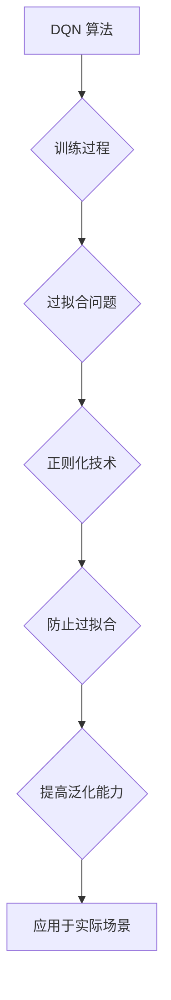

> Deep Q-Network (DQN), 正则化, 过拟合, 深度学习, 机器学习, 算法优化

## 1. 背景介绍

在深度学习的蓬勃发展中，Deep Q-Network (DQN) 作为一种强大的强化学习算法，在游戏、机器人控制等领域取得了显著的成果。然而，在训练过程中，过拟合问题常常成为阻碍其性能提升的瓶颈。过拟合是指模型在训练数据上表现良好，但在未见过的数据上表现欠佳，这会导致模型泛化能力不足，难以应用于实际场景。

正则化技术作为一种常用的防止过拟合的策略，通过在模型训练过程中加入惩罚项，来限制模型的复杂度，从而提高模型的泛化能力。本文将深入探讨 DQN 算法与正则化技术的结合，分析其原理、实现方法以及应用场景，并通过案例分析和代码实例，阐明其在防止过拟合方面的有效性。

## 2. 核心概念与联系

**2.1 DQN 算法概述**

DQN 算法是一种基于深度神经网络的强化学习算法，它通过学习一个 Q 函数来估计在给定状态下采取特定动作的期望回报。Q 函数的输出值代表了采取该动作在当前状态下获得的长期奖励总和。DQN 算法的核心思想是利用经验回放机制来解决强化学习中的样本效率问题，并通过目标网络和双网络结构来稳定训练过程。

**2.2 正则化技术概述**

正则化技术是一种防止过拟合的常用方法，它通过在模型的损失函数中添加惩罚项，来限制模型的复杂度。常见的正则化技术包括 L1 正则化和 L2 正则化。L1 正则化惩罚模型参数的绝对值之和，而 L2 正则化惩罚模型参数的平方和。

**2.3 DQN 与正则化技术的联系**

DQN 算法在训练过程中容易出现过拟合问题，而正则化技术可以有效地解决这个问题。通过在 DQN 算法的损失函数中添加正则化项，可以限制模型的复杂度，从而提高模型的泛化能力。

**2.4 Mermaid 流程图**



## 3. 核心算法原理 & 具体操作步骤

### 3.1 算法原理概述

DQN 算法结合了深度神经网络和强化学习的思想，通过学习一个 Q 函数来估计在给定状态下采取特定动作的期望回报。其核心思想是利用经验回放机制来解决强化学习中的样本效率问题，并通过目标网络和双网络结构来稳定训练过程。

### 3.2 算法步骤详解

1. **初始化:** 初始化 Q 网络参数，并设置经验回放缓冲池。
2. **收集经验:** 在环境中与环境交互，收集状态、动作、奖励和下一个状态的经验数据，并将其存储到经验回放缓冲池中。
3. **训练 Q 网络:** 从经验回放缓冲池中随机采样一批经验数据，计算 Q 值的损失函数，并使用梯度下降算法更新 Q 网络参数。
4. **更新目标网络:** 定期更新目标网络的参数，使其与主网络的参数保持一致。
5. **重复步骤 2-4:** 直到模型达到预设的性能指标。

### 3.3 算法优缺点

**优点:**

* **样本效率高:** 经验回放机制可以有效地利用已收集的经验数据，提高训练效率。
* **能够处理高维状态空间:** 深度神经网络可以有效地学习复杂的状态表示。
* **应用广泛:** DQN 算法在游戏、机器人控制、推荐系统等领域都有广泛的应用。

**缺点:**

* **训练过程不稳定:** DQN 算法的训练过程可能比较不稳定，需要仔细调参才能获得良好的性能。
* **容易出现过拟合:** DQN 算法容易在训练数据上过拟合，需要采用正则化技术等方法来防止过拟合。

### 3.4 算法应用领域

* **游戏:** DQN 算法在游戏领域取得了显著的成果，例如 AlphaGo 和 Atari 游戏。
* **机器人控制:** DQN 算法可以用于训练机器人控制策略，例如机器人导航和抓取。
* **推荐系统:** DQN 算法可以用于个性化推荐，例如电影推荐和商品推荐。
* **其他领域:** DQN 算法还可以应用于其他领域，例如医疗诊断和金融交易。

## 4. 数学模型和公式 & 详细讲解 & 举例说明

### 4.1 数学模型构建

DQN 算法的核心是 Q 函数，它是一个从状态-动作对映射到期望回报的函数。

$$Q(s, a)$$

其中：

* $s$ 表示当前状态。
* $a$ 表示采取的动作。
* $Q(s, a)$ 表示在状态 $s$ 下采取动作 $a$ 的期望回报。

### 4.2 公式推导过程

DQN 算法的目标是学习一个能够最大化期望回报的 Q 函数。可以使用以下公式来更新 Q 函数的参数：

$$
\theta_{t+1} = \theta_t - \alpha \nabla_{\theta} L(\theta, D)
$$

其中：

* $\theta$ 表示 Q 函数的参数。
* $t$ 表示训练迭代次数。
* $\alpha$ 表示学习率。
* $L(\theta, D)$ 表示损失函数，其中 $D$ 表示经验数据。

### 4.3 案例分析与讲解

假设我们有一个简单的游戏环境，其中玩家可以选择向上、向下、向左、向右四个动作。每个动作都会导致玩家进入新的状态，并获得相应的奖励。

DQN 算法可以学习一个 Q 函数，来估计在每个状态下采取每个动作的期望回报。例如，如果玩家处于状态 $s_1$，并且选择向上动作 $a_1$，那么 Q 函数的输出值 $Q(s_1, a_1)$ 就代表了玩家采取向上动作在状态 $s_1$ 下获得的期望回报。

通过训练 DQN 算法，我们可以学习到一个能够最大化期望回报的 Q 函数，从而指导玩家做出最优决策。

## 5. 项目实践：代码实例和详细解释说明

### 5.1 开发环境搭建

* Python 3.6+
* TensorFlow 2.0+
* OpenAI Gym

### 5.2 源代码详细实现

```python
import tensorflow as tf
import numpy as np
from tensorflow.keras.models import Sequential
from tensorflow.keras.layers import Dense

# 定义 DQN 网络结构
class DQN(tf.keras.Model):
    def __init__(self, state_size, action_size):
        super(DQN, self).__init__()
        self.dense1 = Dense(64, activation='relu')
        self.dense2 = Dense(64, activation='relu')
        self.output = Dense(action_size, activation='linear')

    def call(self, state):
        x = self.dense1(state)
        x = self.dense2(x)
        return self.output(x)

# 定义 DQN 算法
class DQNAgent:
    def __init__(self, state_size, action_size, learning_rate=0.001, gamma=0.99, epsilon=1.0, epsilon_decay=0.995, epsilon_min=0.01):
        self.state_size = state_size
        self.action_size = action_size
        self.learning_rate = learning_rate
        self.gamma = gamma
        self.epsilon = epsilon
        self.epsilon_decay = epsilon_decay
        self.epsilon_min = epsilon_min
        self.model = DQN(state_size, action_size)
        self.target_model = DQN(state_size, action_size)
        self.optimizer = tf.keras.optimizers.Adam(learning_rate=self.learning_rate)

    def choose_action(self, state):
        if np.random.rand() < self.epsilon:
            return np.random.randint(self.action_size)
        else:
            q_values = self.model(state)
            return np.argmax(q_values[0])

    def train(self, state, action, reward, next_state, done):
        with tf.GradientTape() as tape:
            target_q_values = self.target_model(next_state)
            target = reward + self.gamma * tf.reduce_max(target_q_values, axis=1) * (1 - done)
            q_values = self.model(state)
            loss = tf.keras.losses.mean_squared_error(target, q_values[0][action])
        gradients = tape.gradient(loss, self.model.trainable_variables)
        self.optimizer.apply_gradients(zip(gradients, self.model.trainable_variables))

    def update_target_model(self):
        self.target_model.set_weights(self.model.get_weights())

# ... (其他代码)
```

### 5.3 代码解读与分析

* **DQN 网络结构:** 代码中定义了一个 DQN 网络结构，它包含两层全连接层和一层输出层。
* **DQN 算法:** 代码中定义了一个 DQNAgent 类，它包含了 DQN 算法的核心逻辑，包括选择动作、训练模型和更新目标网络。
* **训练过程:** 训练过程包括收集经验数据、计算损失函数和更新模型参数。

### 5.4 运行结果展示

训练完成后，可以将训练好的 DQN 模型应用于游戏环境中，观察其在游戏中的表现。

## 6. 实际应用场景

DQN 算法在许多实际应用场景中取得了成功，例如：

* **游戏 AI:** DQN 算法可以训练出能够玩游戏并取得高分的 AI 玩家，例如 AlphaGo 和 Atari 游戏。
* **机器人控制:** DQN 算法可以用于训练机器人控制策略，例如机器人导航和抓取。
* **推荐系统:** DQN 算法可以用于个性化推荐，例如电影推荐和商品推荐。

### 6.4 未来应用展望

DQN 算法在未来还将有更多的应用场景，例如：

* **自动驾驶:** DQN 算法可以用于训练自动驾驶汽车的控制策略。
* **医疗诊断:** DQN 算法可以用于辅助医生进行医疗诊断。
* **金融交易:** DQN 算法可以用于开发自动交易系统。

## 7. 工具和资源推荐

### 7.1 学习资源推荐

* **书籍:**
    * Deep Reinforcement Learning Hands-On by Maxim Lapan
    * Reinforcement Learning: An Introduction by Richard S. Sutton and Andrew G. Barto
* **在线课程:**
    * Deep Reinforcement Learning Specialization by DeepLearning.AI
    * Reinforcement Learning by David Silver (University of DeepMind)

### 7.2 开发工具推荐

* **TensorFlow:** 深度学习框架
* **PyTorch:** 深度学习框架
* **OpenAI Gym:** 强化学习环境

### 7.3 相关论文推荐

* **Playing Atari with Deep Reinforcement Learning** by Mnih et al. (2013)
* **Human-level control through deep reinforcement learning** by Mnih et al. (2015)
* **Deep Q-Networks** by Mnih et al. (2015)

## 8. 总结：未来发展趋势与挑战

### 8.1 研究成果总结

DQN 算法在强化学习领域取得了显著的成果，为解决复杂决策问题提供了新的思路和方法。

### 8.2 未来发展趋势

* **模型效率:** 提高 DQN 算法的模型效率，使其能够处理更大规模的数据和更复杂的