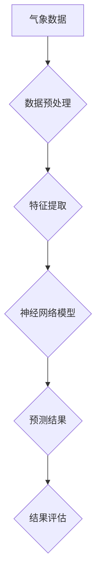

> 天气预测，神经网络，深度学习，卷积神经网络，循环神经网络，时间序列分析，数据可视化

## 1. 背景介绍

天气预报一直是人类文明发展的重要组成部分，它直接影响着人们的生产生活。传统的数值天气预报模型依赖于复杂的物理方程和大量观测数据，但其预测精度受限于模型本身的简化和观测数据的局限性。近年来，随着深度学习技术的快速发展，神经网络模型在天气预测领域展现出巨大的潜力。

神经网络能够自动学习数据中的复杂模式和关系，并将其转化为预测结果，从而提高天气预报的准确性。与传统的统计模型相比，神经网络模型具有以下优势：

* **非线性建模能力强:** 神经网络能够学习数据中的非线性关系，更好地模拟天气系统复杂的行为。
* **数据驱动:** 神经网络模型的训练依赖于大量数据，能够从数据中提取更丰富的特征信息。
* **端到端学习:** 神经网络模型可以进行端到端训练，无需人工设计复杂的特征工程，简化了模型开发过程。

## 2. 核心概念与联系

### 2.1  天气预测的基本原理

天气预测的核心是利用物理定律和数学模型模拟大气层中气流、温度、湿度等要素的变化趋势，从而预测未来天气状况。

### 2.2  神经网络模型的应用

神经网络模型在天气预测中主要用于以下几个方面：

* **降水预测:** 利用神经网络模型学习降水量与气象要素之间的关系，预测未来降水量的大小和范围。
* **温度预测:** 利用神经网络模型学习温度与气象要素之间的关系，预测未来温度的变化趋势。
* **风速预测:** 利用神经网络模型学习风速与气象要素之间的关系，预测未来风速的大小和方向。

### 2.3  神经网络模型架构

常用的神经网络模型架构包括卷积神经网络（CNN）和循环神经网络（RNN）。

* **卷积神经网络（CNN）:** CNN擅长处理图像数据，可以提取图像中的特征信息，例如云团的形状、大小和分布，从而辅助天气预测。
* **循环神经网络（RNN）:** RNN擅长处理时间序列数据，可以学习时间序列中的模式和趋势，例如气温、降水量等要素随时间的变化规律，从而辅助天气预测。



## 3. 核心算法原理 & 具体操作步骤

### 3.1  算法原理概述

神经网络模型的核心是多层神经元网络，每个神经元接收来自前一层神经元的输入信号，并对其进行处理，输出到下一层神经元。通过多层神经元的叠加，神经网络能够学习数据中的复杂模式和关系。

### 3.2  算法步骤详解

1. **数据收集和预处理:** 收集气象数据，包括温度、湿度、气压、风速、降水量等要素，并进行清洗、标准化等预处理操作。
2. **特征提取:** 从气象数据中提取特征信息，例如气温变化率、湿度变化趋势、风向变化等。
3. **模型构建:** 选择合适的深度学习模型架构，例如CNN或RNN，并根据具体任务进行模型参数的调整。
4. **模型训练:** 利用训练数据训练神经网络模型，调整模型参数，使模型能够准确预测天气状况。
5. **模型评估:** 利用测试数据评估模型的预测精度，并根据评估结果进行模型调优。
6. **模型部署:** 将训练好的模型部署到生产环境中，用于实时天气预测。

### 3.3  算法优缺点

**优点:**

* 预测精度高
* 能够学习复杂模式
* 数据驱动，无需人工特征工程

**缺点:**

* 训练数据量大
* 计算资源消耗高
* 模型解释性差

### 3.4  算法应用领域

* 天气预报
* 农业生产
* 交通运输
* 自然灾害预警

## 4. 数学模型和公式 & 详细讲解 & 举例说明

### 4.1  数学模型构建

神经网络模型可以看作是一个复杂的数学函数，其输入是气象数据，输出是天气预测结果。

### 4.2  公式推导过程

神经网络模型的训练过程本质上是一个优化问题，目标是找到最优的模型参数，使得模型的预测结果与实际观测值之间的误差最小。常用的优化算法包括梯度下降法和动量法。

### 4.3  案例分析与讲解

例如，在预测降水量时，我们可以使用一个多层感知机（MLP）模型，其输入层接收气象数据，输出层输出降水量预测值。模型的训练过程可以利用均方误差（MSE）作为损失函数，通过梯度下降法优化模型参数。

## 5. 项目实践：代码实例和详细解释说明

### 5.1  开发环境搭建

* Python 3.x
* TensorFlow 或 PyTorch 深度学习框架
* NumPy 科学计算库
* Matplotlib 数据可视化库

### 5.2  源代码详细实现

```python
import tensorflow as tf

# 定义模型结构
model = tf.keras.models.Sequential([
    tf.keras.layers.Dense(64, activation='relu', input_shape=(num_features,)),
    tf.keras.layers.Dense(32, activation='relu'),
    tf.keras.layers.Dense(1)
])

# 编译模型
model.compile(optimizer='adam', loss='mse')

# 训练模型
model.fit(X_train, y_train, epochs=10, batch_size=32)

# 评估模型
loss = model.evaluate(X_test, y_test)
print('Loss:', loss)
```

### 5.3  代码解读与分析

* `tf.keras.models.Sequential`: 定义一个顺序模型，层级结构清晰。
* `tf.keras.layers.Dense`: 定义全连接层，每个神经元连接到上一层所有神经元。
* `activation='relu'`: 使用ReLU激活函数，提高模型的非线性表达能力。
* `optimizer='adam'`: 使用Adam优化器，加速模型训练。
* `loss='mse'`: 使用均方误差作为损失函数，衡量模型预测结果与实际观测值之间的误差。
* `model.fit()`: 训练模型，输入训练数据和超参数。
* `model.evaluate()`: 评估模型，输入测试数据并计算损失值。

### 5.4  运行结果展示

训练完成后，可以将模型应用于实际数据进行预测，并可视化预测结果与实际观测值之间的差异。

## 6. 实际应用场景

### 6.1  天气预报服务

神经网络模型可以用于构建更精准的天气预报服务，为用户提供更详细、更准确的天气信息。

### 6.2  农业生产

天气预报信息对于农业生产至关重要，神经网络模型可以帮助农民预测未来天气状况，制定合理的种植计划和防灾措施。

### 6.3  交通运输

天气状况会直接影响交通运输安全，神经网络模型可以用于预测道路交通状况，为驾驶员提供实时路况信息，提高交通安全。

### 6.4  未来应用展望

随着深度学习技术的不断发展，神经网络模型在天气预测领域将有更广泛的应用前景，例如：

* **超短期天气预报:** 利用高分辨率气象数据和实时传感器数据，实现分钟级甚至秒级的超短期天气预报。
* **极端天气预警:** 利用神经网络模型识别极端天气事件的特征，提高极端天气预警的准确性和及时性。
* **气候变化模拟:** 利用大规模气候数据，训练更复杂的深度学习模型，模拟未来气候变化趋势。

## 7. 工具和资源推荐

### 7.1  学习资源推荐

* **书籍:**
    * 《深度学习》
    * 《神经网络与深度学习》
* **在线课程:**
    * Coursera: 深度学习
    * Udacity: 深度学习工程师
* **博客和论坛:**
    * TensorFlow 官方博客
    * PyTorch 官方博客
    * Kaggle

### 7.2  开发工具推荐

* **Python:** 
* **TensorFlow:** 开源深度学习框架
* **PyTorch:** 开源深度学习框架
* **Jupyter Notebook:** 交互式编程环境

### 7.3  相关论文推荐

* **《Attention Is All You Need》:** 提出Transformer模型，用于自然语言处理，也适用于时间序列数据处理。
* **《Long Short-Term Memory》:** 提出LSTM网络，用于处理长序列数据，在天气预测中应用广泛。
* **《Generative Adversarial Networks》:** 提出GAN模型，用于生成数据，可以用于生成合成气象数据。

## 8. 总结：未来发展趋势与挑战

### 8.1  研究成果总结

神经网络模型在天气预测领域取得了显著的成果，能够提高预测精度，并为用户提供更详细、更准确的天气信息。

### 8.2  未来发展趋势

* **模型复杂度提升:** 训练更复杂的深度学习模型，例如Transformer和GAN，提高预测精度和泛化能力。
* **数据融合:** 融合多种数据源，例如卫星遥感数据、地面观测数据和数值天气预报模型输出，构建更全面的天气预测模型。
* **实时预测:** 利用高分辨率气象数据和实时传感器数据，实现分钟级甚至秒级的超短期天气预报。

### 8.3  面临的挑战

* **数据获取和处理:** 获取高质量的气象数据并进行有效处理仍然是一个挑战。
* **模型解释性:** 深度学习模型的内部机制难以解释，这限制了模型的应用和信任度。
* **计算资源:** 训练大型深度学习模型需要大量的计算资源，这对于资源有限的机构来说是一个挑战。

### 8.4  研究展望

未来，我们将继续探索深度学习在天气预测领域的应用，致力于构建更精准、更可靠的天气预报系统，为人类社会提供更有效的服务。

## 9. 附录：常见问题与解答

* **Q: 神经网络模型的预测精度如何？**

A: 神经网络模型在天气预测领域取得了显著的成果，能够提高预测精度，但其精度仍然受到数据质量、模型复杂度和训练方法等因素的影响。

* **Q: 如何评估神经网络模型的性能？**

A: 常用的评估指标包括均方误差（MSE）、平均绝对误差（MAE）和相关系数（R）。

* **Q: 如何选择合适的深度学习模型架构？**

A: 选择合适的模型架构取决于具体任务和数据特点。常用的模型架构包括CNN、RNN和Transformer。

* **Q: 如何处理天气数据中的缺失值？**

A: 可以使用插值法、平均法或其他数据填充方法处理缺失值。

* **Q: 如何提高神经网络模型的泛化能力？**

A: 可以使用正则化技术、交叉验证和数据增强等方法提高模型的泛化能力。


作者：禅与计算机程序设计艺术 / Zen and the Art of Computer Programming 
<end_of_turn>