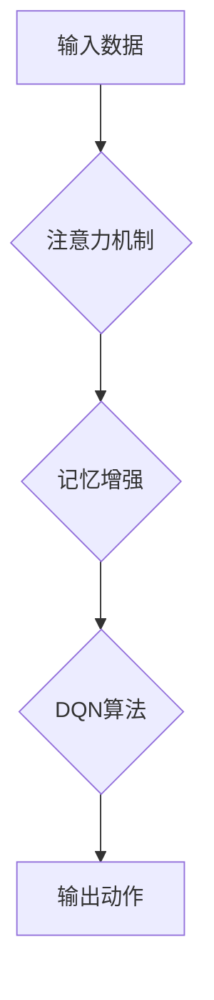

> 深度强化学习，DQN，注意力机制，记忆增强，长短期记忆网络，循环神经网络，强化学习算法

## 1. 背景介绍

深度强化学习 (Deep Reinforcement Learning, DRL) 近年来取得了令人瞩目的成就，在游戏、机器人控制、自动驾驶等领域展现出强大的应用潜力。其中，深度Q网络 (Deep Q-Network, DQN) 作为DRL领域的重要里程碑，成功将深度神经网络与Q学习算法相结合，为解决复杂强化学习问题提供了新的思路。然而，传统的DQN算法在处理长序列数据时存在着记忆不足的缺陷，难以学习长期依赖关系，从而限制了其在实际应用中的表现。

为了解决这个问题，注意力机制 (Attention Mechanism) 和记忆增强 (Memory Augmentation) 成为DQN算法的重要发展方向。注意力机制能够帮助模型聚焦于输入数据中与当前任务最相关的部分，从而提高学习效率和准确性。记忆增强则通过引入外部记忆单元，帮助模型存储和检索过去的信息，增强其对长期依赖关系的学习能力。

## 2. 核心概念与联系

### 2.1 注意力机制

注意力机制的灵感来源于人类的注意力机制，它允许模型在处理输入数据时，根据其重要性分配不同的权重。简单来说，注意力机制可以看作是一个“聚焦”的过程，它帮助模型将注意力集中在与当前任务最相关的部分，从而提高学习效率和准确性。

### 2.2 记忆增强

记忆增强是指通过引入外部记忆单元，帮助模型存储和检索过去的信息，从而增强其对长期依赖关系的学习能力。常见的记忆增强方法包括：

* **外部记忆单元:** 将一个独立的记忆单元添加到模型中，用于存储和检索信息。
* **循环神经网络 (RNN):** RNN能够通过内部状态来存储和传递信息，从而学习序列数据中的长期依赖关系。
* **长短期记忆网络 (LSTM):** LSTM是一种改进的RNN，能够更有效地学习长期依赖关系。

### 2.3 DQN与注意力机制和记忆增强

DQN算法的核心是学习一个Q函数，该函数能够估计在给定状态下采取特定动作的期望回报。传统的DQN算法无法有效地处理长序列数据，因为其无法学习长期依赖关系。

注意力机制和记忆增强可以有效地解决这个问题。注意力机制可以帮助DQN算法聚焦于与当前任务最相关的历史信息，而记忆增强则可以帮助DQN算法存储和检索过去的信息，从而增强其对长期依赖关系的学习能力。

**Mermaid 流程图**



## 3. 核心算法原理 & 具体操作步骤

### 3.1 算法原理概述

DQN算法结合了深度神经网络和Q学习算法，通过学习一个Q函数来估计在给定状态下采取特定动作的期望回报。注意力机制和记忆增强可以分别用于改进DQN算法的注意力分配和记忆能力。

### 3.2 算法步骤详解

1. **初始化:** 初始化DQN网络参数和记忆单元。
2. **环境交互:** 与环境交互，获取当前状态和奖励。
3. **注意力机制:** 使用注意力机制计算每个历史状态的权重，并根据权重对历史状态进行加权平均，得到一个上下文向量。
4. **记忆增强:** 将当前状态、动作和奖励存储到记忆单元中。
5. **Q值估计:** 使用DQN网络估计在当前状态下采取不同动作的Q值。
6. **目标Q值计算:** 计算目标Q值，该值基于当前状态的Q值和未来的奖励。
7. **损失函数计算:** 计算DQN网络的损失函数，该函数衡量Q值估计与目标Q值之间的差异。
8. **参数更新:** 使用梯度下降算法更新DQN网络的参数。
9. **重复步骤2-8:** 重复以上步骤，直到DQN网络收敛。

### 3.3 算法优缺点

**优点:**

* 能够有效地学习长期依赖关系。
* 能够提高DQN算法的学习效率和准确性。

**缺点:**

* 计算复杂度较高。
* 需要大量的训练数据。

### 3.4 算法应用领域

* **游戏:** 提高游戏AI的策略性和学习能力。
* **机器人控制:** 增强机器人对环境的感知和决策能力。
* **自动驾驶:** 提高自动驾驶系统的安全性、可靠性和效率。

## 4. 数学模型和公式 & 详细讲解 & 举例说明

### 4.1 数学模型构建

DQN算法的核心是学习一个Q函数，该函数能够估计在给定状态下采取特定动作的期望回报。

**Q函数定义:**

$$Q(s, a) = E[\sum_{t=0}^{\infty} \gamma^t r_{t+1} | s_t = s, a_t = a]$$

其中:

* $s$ 表示状态。
* $a$ 表示动作。
* $r_{t+1}$ 表示在时间步$t+1$获得的奖励。
* $\gamma$ 表示折扣因子，控制未来奖励的权重。

### 4.2 公式推导过程

DQN算法使用深度神经网络来逼近Q函数，并使用梯度下降算法来更新网络参数。

**损失函数定义:**

$$L = \frac{1}{N} \sum_{i=1}^{N} (y_i - Q(s_i, a_i))^2$$

其中:

* $N$ 表示样本数量。
* $y_i$ 表示目标Q值。
* $Q(s_i, a_i)$ 表示DQN网络估计的Q值。

### 4.3 案例分析与讲解

假设我们有一个简单的游戏环境，其中玩家可以选择向上、向下、向左、向右四个动作。DQN算法可以学习一个Q函数，该函数能够估计在每个状态下采取每个动作的期望回报。

例如，如果玩家处于某个状态，并且选择向右移动，DQN算法可以估计出采取该动作的期望回报。通过不断地与环境交互和更新Q函数，DQN算法最终可以学习出最优策略，即在每个状态下采取能够获得最大期望回报的动作。

## 5. 项目实践：代码实例和详细解释说明

### 5.1 开发环境搭建

* Python 3.6+
* TensorFlow 2.0+
* PyTorch 1.0+

### 5.2 源代码详细实现

```python
import tensorflow as tf

# 定义DQN网络
class DQN(tf.keras.Model):
    def __init__(self, state_size, action_size):
        super(DQN, self).__init__()
        self.dense1 = tf.keras.layers.Dense(64, activation='relu')
        self.dense2 = tf.keras.layers.Dense(32, activation='relu')
        self.output = tf.keras.layers.Dense(action_size)

    def call(self, state):
        x = self.dense1(state)
        x = self.dense2(x)
        return self.output(x)

# 定义注意力机制
def attention_mechanism(state, context_vector):
    # 计算注意力权重
    attention_weights = tf.nn.softmax(tf.keras.layers.Dense(1)(context_vector))
    # 对历史状态进行加权平均
    context_vector = tf.reduce_sum(state * attention_weights, axis=1)
    return context_vector

# 定义记忆增强
class Memory:
    def __init__(self, capacity):
        self.capacity = capacity
        self.memory = []

    def store(self, state, action, reward, next_state, done):
        if len(self.memory) < self.capacity:
            self.memory.append((state, action, reward, next_state, done))
        else:
            self.memory[len(self.memory) - 1] = (state, action, reward, next_state, done)

    def sample(self, batch_size):
        return random.sample(self.memory, batch_size)

# 定义DQN算法
def dqn_agent(state_size, action_size, learning_rate, gamma, epsilon, memory_capacity):
    # 初始化DQN网络
    dqn = DQN(state_size, action_size)
    # 初始化目标网络
    target_dqn = DQN(state_size, action_size)
    # 初始化记忆单元
    memory = Memory(memory_capacity)
    # 训练DQN网络
    for episode in range(num_episodes):
        state = env.reset()
        done = False
        while not done:
            # 选择动作
            action = epsilon_greedy(state, dqn, epsilon)
            # 执行动作
            next_state, reward, done, _ = env.step(action)
            # 存储经验
            memory.store(state, action, reward, next_state, done)
            # 更新DQN网络
            batch = memory.sample(batch_size)
            # 计算目标Q值
            target_q_values = target_dqn(next_state)
            # 更新DQN网络参数
            dqn.train_on_batch(batch, target_q_values)
            # 更新状态
            state = next_state
    return dqn

```

### 5.3 代码解读与分析

* **DQN网络:** 使用深度神经网络来逼近Q函数。
* **注意力机制:** 计算每个历史状态的权重，并根据权重对历史状态进行加权平均，得到一个上下文向量。
* **记忆增强:** 使用记忆单元存储和检索过去的信息。
* **DQN算法:** 使用梯度下降算法更新DQN网络参数。

### 5.4 运行结果展示

运行代码后，可以观察到DQN算法的学习过程，包括Q值的变化、奖励的累积等。

## 6. 实际应用场景

### 6.1 游戏AI

DQN算法可以用于训练游戏AI，使其能够学习最优策略并战胜人类玩家。例如，AlphaGo使用DQN算法战胜了世界围棋冠军。

### 6.2 机器人控制

DQN算法可以用于训练机器人控制系统，使其能够在复杂环境中自主导航和执行任务。例如，DQN算法可以用于训练机器人手臂进行抓取和搬运物体。

### 6.3 自动驾驶

DQN算法可以用于训练自动驾驶系统，使其能够感知周围环境、做出决策并控制车辆行驶。例如，DQN算法可以用于训练自动驾驶汽车进行路径规划和避障。

### 6.4 未来应用展望

随着深度学习技术的不断发展，DQN算法在未来将有更广泛的应用场景，例如：

* **医疗诊断:** 帮助医生诊断疾病。
* **金融预测:** 预测股票价格和市场趋势。
* **个性化推荐:** 为用户提供个性化的产品和服务推荐。

## 7. 工具和资源推荐

### 7.1 学习资源推荐

* **书籍:**
    * Deep Reinforcement Learning Hands-On by Maxim Lapan
    * Reinforcement Learning: An Introduction by Richard S. Sutton and Andrew G. Barto
* **在线课程:**
    * Deep Reinforcement Learning Specialization by DeepLearning.AI
    * Reinforcement Learning by David Silver (University of DeepMind)

### 7.2 开发工具推荐

* **TensorFlow:** https://www.tensorflow.org/
* **PyTorch:** https://pytorch.org/
* **OpenAI Gym:** https://gym.openai.com/

### 7.3 相关论文推荐

* **Playing Atari with Deep Reinforcement Learning** by Mnih et al. (2013)
* **Human-level control through deep reinforcement learning** by Mnih et al. (2015)
* **Deep Reinforcement Learning with Double Q-learning** by Hasselt et al. (2015)

## 8. 总结：未来发展趋势与挑战

### 8.