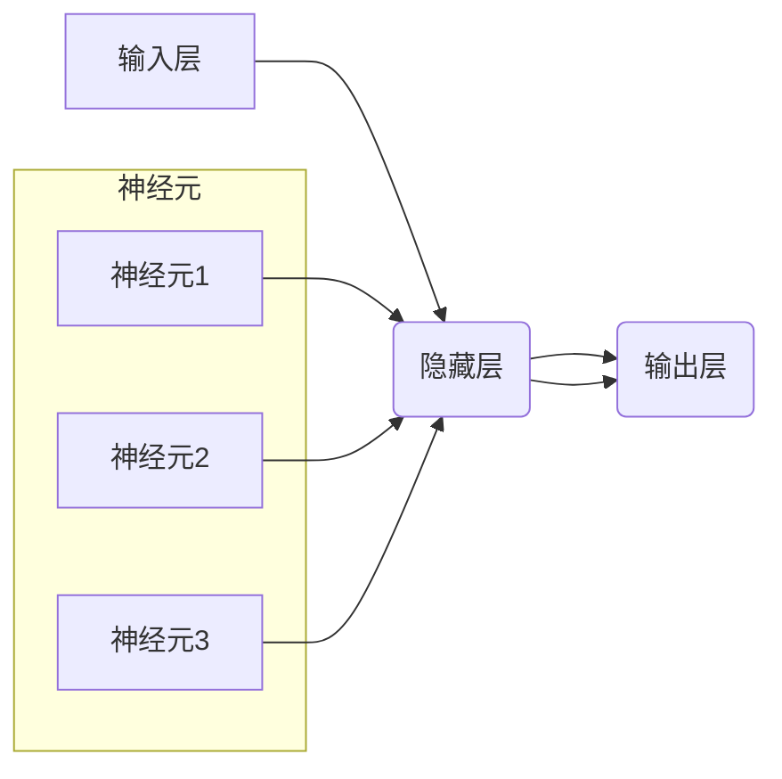

> 深度学习、神经网络、卷积神经网络、循环神经网络、反向传播、激活函数、损失函数、优化算法

## 1. 背景介绍

深度学习作为机器学习领域最前沿的突破，近年来在图像识别、自然语言处理、语音识别等领域取得了令人瞩目的成就。其核心在于模仿人类大脑神经网络的结构和功能，通过多层神经元网络进行特征提取和学习，从而实现对复杂数据的理解和预测。

然而，深度学习的复杂性和抽象性也让许多人望而却步。本文将从基础概念出发，深入浅出地讲解深度学习的原理、算法和应用，帮助读者理解深度学习的本质，并为进一步学习和实践打下坚实的基础。

## 2. 核心概念与联系

深度学习的核心概念包括：

* **神经网络:** 由多个相互连接的神经元组成，每个神经元接收输入信号，经过处理后输出信号。神经元之间通过权重连接，权重决定了信号的传递强度。
* **层:** 神经元按功能分组形成层，深度学习网络通常由多个层组成，例如输入层、隐藏层和输出层。
* **激活函数:** 用于引入非线性，使神经网络能够学习复杂的模式。常见的激活函数包括 sigmoid、ReLU、tanh 等。
* **权重和偏置:** 权重决定了神经元之间的连接强度，偏置决定了神经元的阈值。
* **反向传播:** 用于训练神经网络的算法，通过计算误差并反向传播到各层，调整权重和偏置，使网络输出更接近真实值。

**核心概念关系图:**



## 3. 核心算法原理 & 具体操作步骤

### 3.1  算法原理概述

深度学习的核心算法是反向传播算法，它通过迭代更新神经网络的权重和偏置，使网络的输出误差最小化。

反向传播算法的基本步骤如下：

1. **前向传播:** 将输入数据通过神经网络传递，计算输出结果。
2. **误差计算:** 计算输出结果与真实值的误差。
3. **反向传播:** 将误差反向传播到各层神经元，计算每个神经元的梯度。
4. **权重更新:** 根据梯度更新神经网络的权重和偏置。

### 3.2  算法步骤详解

1. **初始化:** 随机初始化神经网络的权重和偏置。
2. **前向传播:** 将输入数据输入到神经网络的第一层，并依次传递到下一层，直到输出层。每个神经元接收来自上一层的输入信号，经过激活函数处理后输出信号。
3. **误差计算:** 将输出结果与真实值进行比较，计算误差。常用的误差函数包括均方误差、交叉熵等。
4. **反向传播:** 从输出层开始，计算每个神经元的梯度。梯度表示权重和偏置调整的方向和幅度。
5. **权重更新:** 使用梯度下降算法更新神经网络的权重和偏置。梯度下降算法通过调整权重和偏置，使误差函数最小化。
6. **重复步骤2-5:** 重复前向传播、误差计算、反向传播和权重更新步骤，直到误差达到预设阈值或训练次数达到上限。

### 3.3  算法优缺点

**优点:**

* 能够学习复杂的非线性关系。
* 具有强大的泛化能力，能够对未知数据进行预测。
* 在图像识别、自然语言处理等领域取得了突破性进展。

**缺点:**

* 训练时间长，需要大量的计算资源。
* 容易过拟合，需要进行正则化和交叉验证等技巧来避免。
* 难以解释模型的决策过程，缺乏可解释性。

### 3.4  算法应用领域

* **图像识别:** 人脸识别、物体检测、图像分类等。
* **自然语言处理:** 文本分类、情感分析、机器翻译等。
* **语音识别:** 语音转文本、语音助手等。
* **推荐系统:** 商品推荐、用户画像等。
* **医疗诊断:** 病情预测、疾病诊断等。

## 4. 数学模型和公式 & 详细讲解 & 举例说明

### 4.1  数学模型构建

深度学习模型本质上是一个复杂的数学模型，其核心是神经网络的结构和权重参数。

**神经网络模型:**

$$
y = f(W^L x^L + b^L)
$$

其中：

* $y$ 是输出结果
* $x^L$ 是第 $L$ 层的输入
* $W^L$ 是第 $L$ 层的权重矩阵
* $b^L$ 是第 $L$ 层的偏置向量
* $f$ 是激活函数

### 4.2  公式推导过程

反向传播算法的核心是计算梯度，并根据梯度更新权重和偏置。

**梯度计算公式:**

$$
\frac{\partial Loss}{\partial W^L} = \frac{\partial Loss}{\partial y} \cdot \frac{\partial y}{\partial x^L} \cdot \frac{\partial x^L}{\partial W^L}
$$

其中：

* $Loss$ 是损失函数
* $\frac{\partial Loss}{\partial y}$ 是损失函数对输出结果的梯度
* $\frac{\partial y}{\partial x^L}$ 是输出结果对输入的梯度
* $\frac{\partial x^L}{\partial W^L}$ 是输入对权重的梯度

### 4.3  案例分析与讲解

假设我们有一个简单的线性回归模型，目标是预测房价。

**模型:**

$$
y = Wx + b
$$

其中：

* $y$ 是房价
* $x$ 是房屋面积
* $W$ 是权重
* $b$ 是偏置

**损失函数:**

$$
Loss = \frac{1}{2} \sum_{i=1}^{n} (y_i - \hat{y}_i)^2
$$

其中：

* $y_i$ 是真实房价
* $\hat{y}_i$ 是模型预测的房价
* $n$ 是样本数量

通过反向传播算法，我们可以计算出 $W$ 和 $b$ 的梯度，并根据梯度更新 $W$ 和 $b$ 的值，最终得到一个能够准确预测房价的模型。

## 5. 项目实践：代码实例和详细解释说明

### 5.1  开发环境搭建

* Python 3.x
* TensorFlow 或 PyTorch 等深度学习框架
* Jupyter Notebook 或 VS Code 等代码编辑器

### 5.2  源代码详细实现

```python
import tensorflow as tf

# 定义模型
model = tf.keras.models.Sequential([
    tf.keras.layers.Dense(128, activation='relu', input_shape=(784,)),
    tf.keras.layers.Dense(10, activation='softmax')
])

# 编译模型
model.compile(optimizer='adam',
              loss='sparse_categorical_crossentropy',
              metrics=['accuracy'])

# 训练模型
model.fit(x_train, y_train, epochs=10)

# 评估模型
loss, accuracy = model.evaluate(x_test, y_test)
print('Loss:', loss)
print('Accuracy:', accuracy)
```

### 5.3  代码解读与分析

* **定义模型:** 使用 TensorFlow 的 `keras` API 定义一个简单的多层感知机模型。
* **编译模型:** 使用 Adam 优化器、交叉熵损失函数和准确率指标编译模型。
* **训练模型:** 使用训练数据训练模型，设置训练轮数为 10。
* **评估模型:** 使用测试数据评估模型的性能，输出损失值和准确率。

### 5.4  运行结果展示

训练完成后，模型会输出训练过程中的损失值和准确率，以及测试集上的损失值和准确率。

## 6. 实际应用场景

深度学习在各个领域都有广泛的应用，例如：

* **图像识别:** 自动驾驶、人脸识别、医学影像分析等。
* **自然语言处理:** 机器翻译、文本摘要、聊天机器人等。
* **语音识别:** 语音助手、语音搜索等。
* **推荐系统:** 商品推荐、用户画像等。
* **金融领域:** 欺诈检测、风险评估等。

### 6.4  未来应用展望

随着深度学习技术的不断发展，其应用场景将更加广泛，例如：

* **个性化教育:** 根据学生的学习情况提供个性化的学习方案。
* **医疗诊断:** 更准确、更早地诊断疾病，提高医疗效率。
* **科学研究:** 加速科学发现，推动科技进步。

## 7. 工具和资源推荐

### 7.1  学习资源推荐

* **书籍:**
    * 深度学习
    * 深度学习实践
    * 
* **在线课程:**
    * Coursera 深度学习课程
    * Udacity 深度学习课程
    * fast.ai 深度学习课程

### 7.2  开发工具推荐

* **TensorFlow:** Google 开发的开源深度学习框架。
* **PyTorch:** Facebook 开发的开源深度学习框架。
* **Keras:** TensorFlow 的高层API，简化深度学习模型的构建。

### 7.3  相关论文推荐

* **ImageNet Classification with Deep Convolutional Neural Networks**
* **Attention Is All You Need**
* **Generative Adversarial Networks**

## 8. 总结：未来发展趋势与挑战

### 8.1  研究成果总结

深度学习取得了令人瞩目的成就，在图像识别、自然语言处理等领域取得了突破性进展。

### 8.2  未来发展趋势

* **模型更深、更复杂:** 研究更深层次、更复杂的深度学习模型，例如 Transformer、GPT 等。
* **数据更丰富、更多样:** 利用更多数据类型，例如文本、图像、音频等，训练更强大的模型。
* **算法更有效、更鲁棒:** 研究更有效的训练算法和正则化技巧，提高模型的泛化能力和鲁棒性。
* **解释性更强:** 研究更可解释的深度学习模型，帮助人们理解模型的决策过程。

### 8.3  面临的挑战

* **数据获取和标注:** 深度学习模型需要大量的训练数据，数据获取和标注成本高昂。
* **计算资源:** 训练深度学习模型需要大量的计算资源，成本高昂。
* **模型可解释性:** 深度学习模型的决策过程难以解释，缺乏可解释性。
* **伦理问题:** 深度学习模型可能存在偏见和歧视，需要解决伦理问题。

### 8.4  研究展望

未来，深度学习将继续发展，在更多领域发挥重要作用。我们需要不断探索新的算法、模型和应用场景，并解决深度学习面临的挑战，推动深度学习技术向更安全、更可靠、更可解释的方向发展。

## 9. 附录：常见问题与解答

**Q1: 深度学习和机器学习有什么区别？**

**A1:** 深度学习是机器学习的一种子集，它利用多层神经网络来学习复杂的特征，而传统机器学习算法通常依赖于人工特征工程。

**Q2: 如何选择合适的深度学习框架？**

**A2:** TensorFlow 和 PyTorch 是两个最流行的深度学习框架，TensorFlow 更适合于生产环境，PyTorch 更适合于研究和开发。

**Q3: 如何解决深度学习模型的过拟合问题？**

**A3:** 可以使用正则化、交叉验证、数据增强等技巧来解决过拟合问题。

**Q4: 深度学习模型的训练需要多长时间？**

**A