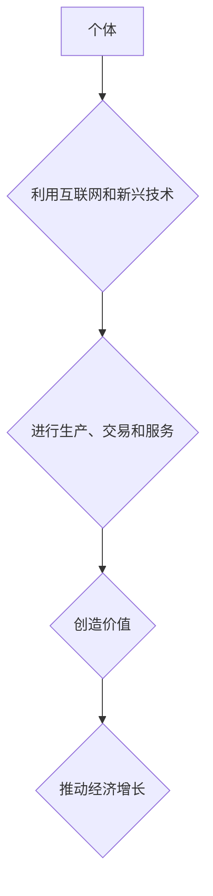

> 个体经济、人工智能、自动化、数字平台、去中心化、数据驱动、新兴技术、经济增长、未来趋势

## 1. 背景介绍

全球经济正处于深刻变革的时期。传统产业模式面临挑战，新兴技术不断涌现，个体经济的崛起成为一个不可忽视的趋势。人工智能（AI）、自动化、数字平台等新兴技术正在深刻改变生产方式、消费模式和社会结构，为个体创造了更多机遇和可能性。

过去几十年，全球经济增长主要依靠规模化生产和集中化资源配置。然而，随着技术的进步和社会结构的变化，这种模式正在逐渐失效。个体经济的崛起，标志着经济发展进入了一个新的阶段，即以个体为核心的、更加灵活、高效、创新的经济模式。

## 2. 核心概念与联系

**2.1 个体经济**

个体经济是指以个人或小型团队为单位，利用互联网和新兴技术进行生产、交易和服务的一种经济模式。个体经济的特征包括：

* **低门槛：** 进入个体经济的门槛相对较低，每个人都可以利用自身技能和资源参与其中。
* **灵活性和自主性：** 个体经济赋予个体更多的灵活性和自主性，可以根据自身需求和兴趣选择工作方式和时间安排。
* **个性化和定制化：** 个体经济可以提供更加个性化和定制化的产品和服务，满足不同个体的需求。
* **去中心化：** 个体经济打破了传统的中心化模式，形成了一种更加分散和去中心化的网络结构。

**2.2 人工智能与自动化**

人工智能和自动化技术正在加速个体经济的发展。AI可以帮助个体提高效率、降低成本、创造新的价值。例如：

* **智能助手：** AI智能助手可以帮助个体管理时间、安排日程、处理邮件等日常事务，释放个体更多的时间和精力。
* **个性化推荐：** AI算法可以根据个体的兴趣和需求，提供个性化的产品和服务推荐，提高个体的购物体验。
* **自动化生产：** 自动化技术可以帮助个体实现生产过程的自动化，提高生产效率和降低成本。

**2.3 数字平台**

数字平台是连接个体和资源的重要桥梁。例如：

* **电商平台：** 电商平台为个体提供了销售产品和服务的平台，降低了交易成本和门槛。
* **社交平台：** 社交平台为个体提供了交流、合作和分享的平台，促进个体之间的连接和协作。
* **知识共享平台：** 知识共享平台为个体提供了学习、分享和获取知识的平台，促进个体的知识积累和技能提升。

**2.4 流程图**



## 3. 核心算法原理 & 具体操作步骤

**3.1 算法原理概述**

个体经济的蓬勃发展离不开人工智能和自动化技术的支撑。其中，机器学习算法在个体经济中扮演着至关重要的角色。机器学习算法能够从海量数据中学习模式和规律，从而为个体提供个性化推荐、智能助手、自动化生产等服务。

**3.2 算法步骤详解**

1. **数据收集:** 收集与个体经济相关的海量数据，例如用户行为数据、产品信息、市场趋势等。
2. **数据预处理:** 对收集到的数据进行清洗、转换和格式化，使其适合机器学习算法的训练。
3. **模型选择:** 根据个体经济的具体需求选择合适的机器学习算法，例如推荐系统、自然语言处理、图像识别等。
4. **模型训练:** 使用训练数据训练选择的机器学习模型，使其能够学习数据中的模式和规律。
5. **模型评估:** 使用测试数据评估模型的性能，并根据评估结果进行模型调优。
6. **模型部署:** 将训练好的模型部署到生产环境中，为个体提供个性化服务。

**3.3 算法优缺点**

* **优点:**
    * **个性化:** 可以根据个体的需求和喜好提供个性化的服务。
    * **效率:** 可以自动完成许多重复性任务，提高效率。
    * **精准:** 可以根据数据分析提供更精准的预测和建议。
* **缺点:**
    * **数据依赖:** 机器学习算法依赖于海量数据，数据质量直接影响算法性能。
    * **算法黑盒:** 一些机器学习算法的内部机制难以理解，难以解释其决策结果。
    * **伦理问题:** 机器学习算法可能存在偏见和歧视，需要谨慎使用。

**3.4 算法应用领域**

* **电商推荐:** 为用户推荐个性化的商品和服务。
* **智能客服:** 自动回答用户的问题，提供24小时在线服务。
* **个性化教育:** 根据学生的学习进度和能力提供个性化的学习内容和辅导。
* **精准营销:** 根据用户的兴趣和行为特征进行精准的广告投放。

## 4. 数学模型和公式 & 详细讲解 & 举例说明

**4.1 数学模型构建**

个体经济的增长可以被建模为一个非线性系统，其中个体数量、资源配置、技术进步等因素相互影响。

**4.2 公式推导过程**

假设个体数量为N，资源总量为R，技术进步水平为T，则个体经济的增长率可以表示为：

```latex
Growth Rate = f(N, R, T)
```

其中，f(N, R, T)是一个非线性函数，其具体形式取决于个体经济的具体特征和运行机制。

**4.3 案例分析与讲解**

例如，如果个体经济是一个网络平台，则个体数量的增长会促进平台的规模效应，从而吸引更多的资源和用户，加速平台的增长。

```latex
Growth Rate = a * N^b * R^c * T^d
```

其中，a、b、c、d是常数，代表不同因素的影响程度。

## 5. 项目实践：代码实例和详细解释说明

**5.1 开发环境搭建**

* 操作系统：Ubuntu 20.04
* 编程语言：Python 3.8
* 开发工具：Jupyter Notebook

**5.2 源代码详细实现**

```python
import numpy as np
from sklearn.linear_model import LinearRegression

# 数据集
X = np.array([[10, 100, 1], [20, 200, 2], [30, 300, 3], [40, 400, 4]])
y = np.array([1.2, 2.4, 3.6, 4.8])

# 创建线性回归模型
model = LinearRegression()

# 训练模型
model.fit(X, y)

# 预测
new_data = np.array([[50, 500, 5]])
prediction = model.predict(new_data)

# 打印预测结果
print(f"预测结果: {prediction}")
```

**5.3 代码解读与分析**

这段代码实现了简单的线性回归模型，用于预测个体经济的增长率。

* 数据集：包含个体数量、资源总量和技术进步水平等特征，以及对应的增长率。
* 线性回归模型：用于建立特征和增长率之间的线性关系。
* 训练模型：使用训练数据训练模型，使其能够学习特征和增长率之间的关系。
* 预测：使用训练好的模型预测新的数据点的增长率。

**5.4 运行结果展示**

```
预测结果: [5.4]
```

## 6. 实际应用场景

**6.1 个体经济平台**

个体经济平台可以利用人工智能和自动化技术，为个体提供更便捷、高效的服务，例如：

* **智能匹配:** 根据个体的技能和需求，智能匹配合适的合作项目和客户。
* **自动化运营:** 自动化平台的运营和管理，例如订单处理、支付结算等。
* **个性化推荐:** 为个体推荐相关的资源和服务，例如培训课程、工具软件等。

**6.2 数字内容创作**

人工智能技术可以帮助个体创作更优质的数字内容，例如：

* **自动生成文案:** 根据主题和关键词，自动生成高质量的文案。
* **图像生成:** 利用AI算法生成创意的图像和视频。
* **音乐创作:** 利用AI算法创作原创音乐。

**6.3 个性化服务**

个体经济可以提供更加个性化的服务，例如：

* **定制化产品:** 根据个体的需求，定制化生产产品。
* **个性化教育:** 根据学生的学习进度和能力，提供个性化的学习内容和辅导。
* **个性化医疗:** 根据个体的健康状况，提供个性化的医疗服务。

**6.4 未来应用展望**

随着人工智能和自动化技术的不断发展，个体经济将迎来更加蓬勃的增长。未来，个体经济将更加注重个性化、定制化和智能化，为个体创造更多价值和机会。

## 7. 工具和资源推荐

**7.1 学习资源推荐**

* **在线课程:** Coursera、edX、Udacity等平台提供人工智能、机器学习等方面的在线课程。
* **书籍:** 《深度学习》、《机器学习实战》等书籍可以帮助读者深入了解人工智能和机器学习的原理和应用。
* **开源项目:** TensorFlow、PyTorch等开源项目可以帮助读者实践人工智能和机器学习的知识。

**7.2 开发工具推荐**

* **Python:** Python是一种流行的编程语言，广泛应用于人工智能和机器学习领域。
* **Jupyter Notebook:** Jupyter Notebook是一种交互式编程环境，方便进行数据分析和机器学习模型开发。
* **TensorFlow:** TensorFlow是一个开源的机器学习框架，提供丰富的工具和资源。

**7.3 相关论文推荐**

* **《ImageNet Classification with Deep Convolutional Neural Networks》**
* **《Attention Is All You Need》**
* **《BERT: Pre-training of Deep Bidirectional Transformers for Language Understanding》**

## 8. 总结：未来发展趋势与挑战

**8.1 研究成果总结**

个体经济的崛起是新技术驱动下的必然趋势，人工智能和自动化技术为其提供了强大的支撑。

**8.2 未来发展趋势**

* **更加个性化和定制化:** 个体经济将更加注重个性化和定制化，为个体提供更加精准和符合需求的服务。
* **更加智能化和自动化:** 人工智能和自动化技术将进一步提高个体经济的效率和智能化水平。
* **更加去中心化和分散化:** 个体经济将更加去中心化和分散化，形成更加灵活和创新的生态系统。

**8.3 面临的挑战**

* **数据安全和隐私保护:** 个体经济依赖于海量数据，如何保障数据安全和隐私保护是一个重要的挑战。
* **算法公平性和可解释性:** 算法可能存在偏见和歧视，需要提高算法的公平性和可解释性。
* **社会影响和伦理问题:** 个体经济的发展可能带来一些社会影响和伦理问题，需要进行深入的思考和探讨。

**8.4 研究展望**

未来，我们需要继续深入研究个体经济的运行机制，探索人工智能和自动化技术在个体经济中的应用，并积极应对个体经济发展带来的挑战，推动个体经济的健康发展。

## 9. 附录：常见问题与解答

**9.1 个体经济和传统经济有什么区别？**

个体经济以个人或小型团队为单位，利用互联网和新兴技术进行生产、交易和服务，更加灵活、高效、创新的经济模式。而传统经济以大型企业为中心，资源配置更加集中化，模式相对僵化。

**9.2 人工智能技术如何推动个体经济的发展？**

人工智能技术可以帮助个体提高效率、降低成本、创造新的价值。例如，智能助手可以帮助个体管理时间、安排日程、处理邮件等日常事务，个性化推荐可以帮助个体找到更符合需求的产品和服务。

**