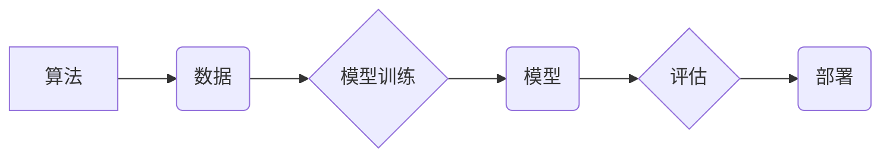

> 人工智能 (AI)、机器学习 (ML)、深度学习 (DL)、算法、算力、模型训练、数据驱动、伦理

## 1. 背景介绍

人工智能 (AI) 正以惊人的速度发展，深刻地改变着我们的生活和工作方式。从智能手机的语音助手到自动驾驶汽车，AI 的应用领域日益广泛。然而，AI 的发展并非一蹴而就，它背后蕴含着复杂的算法、庞大的数据和强大的算力。

本篇文章将从算法到算力，全面解读 AI 的发展全景图，探讨其核心概念、算法原理、数学模型、项目实践以及未来发展趋势。

## 2. 核心概念与联系

**2.1  算法**

算法是 AI 的基石，它是一系列步骤或规则，用于解决特定问题或完成特定任务。在 AI 领域，算法通常用于从数据中学习模式、预测未来趋势或做出决策。

**2.2  数据**

数据是 AI 的燃料，它为算法提供学习和训练的素材。AI 算法的性能直接取决于数据的质量和数量。

**2.3  算力**

算力是 AI 训练和运行模型所需的计算能力。随着 AI 模型的规模不断增长，对算力的需求也越来越高。

**2.4  模型**

模型是 AI 算法的具体实现，它通过学习数据，建立起描述数据规律的数学模型。

**2.5  训练**

训练是指使用数据来调整 AI 模型的参数，使其能够更好地预测或决策。

**2.6  评估**

评估是指使用独立的数据集来测试 AI 模型的性能，并衡量其准确性、效率等指标。

**2.7  部署**

部署是指将训练好的 AI 模型部署到实际应用场景中，使其能够为用户提供服务。

**Mermaid 流程图**

## 3. 核心算法原理 & 具体操作步骤

### 3.1  算法原理概述

本节将介绍机器学习算法的原理，包括监督学习、无监督学习和强化学习。

**3.1.1  监督学习**

监督学习是指在已知输入输出对的情况下，训练模型预测新的输入输出对。例如，图像分类任务中，训练数据包含图像和对应的类别标签，模型通过学习这些数据，能够预测新的图像的类别。

**3.1.2  无监督学习**

无监督学习是指在没有标签数据的情况下，训练模型发现数据中的潜在结构或模式。例如，聚类算法可以将数据点分组到不同的类别，而降维算法可以将高维数据降到低维空间。

**3.1.3  强化学习**

强化学习是指训练模型通过与环境交互，学习最优策略。例如，游戏 AI 可以通过与游戏环境交互，学习如何玩游戏并获得最高分。

### 3.2  算法步骤详解

**3.2.1  数据预处理**

数据预处理是机器学习算法的前提，它包括数据清洗、数据转换和数据特征工程等步骤。

**3.2.2  模型选择**

根据具体任务选择合适的机器学习算法。

**3.2.3  模型训练**

使用训练数据训练模型，调整模型参数。

**3.2.4  模型评估**

使用测试数据评估模型性能，并进行模型调优。

**3.2.5  模型部署**

将训练好的模型部署到实际应用场景中。

### 3.3  算法优缺点

不同的机器学习算法具有不同的优缺点，需要根据具体任务选择合适的算法。

### 3.4  算法应用领域

机器学习算法广泛应用于各个领域，例如：

* **图像识别**
* **自然语言处理**
* **推荐系统**
* **预测分析**
* **医疗诊断**

## 4. 数学模型和公式 & 详细讲解 & 举例说明

### 4.1  数学模型构建

机器学习算法通常基于数学模型，例如线性回归、逻辑回归、支持向量机等。这些模型通过数学公式来描述数据之间的关系。

### 4.2  公式推导过程

本节将详细推导一些常用的机器学习算法的数学公式，例如线性回归的损失函数和梯度下降算法。

### 4.3  案例分析与讲解

本节将通过案例分析，讲解如何使用数学模型和公式来解决实际问题。

## 5. 项目实践：代码实例和详细解释说明

### 5.1  开发环境搭建

本节将介绍如何搭建机器学习开发环境，包括安装必要的软件和库。

### 5.2  源代码详细实现

本节将提供一个简单的机器学习项目代码实例，并进行详细的代码解读和分析。

### 5.3  代码解读与分析

本节将对代码实例进行详细的解读和分析，解释代码的逻辑和功能。

### 5.4  运行结果展示

本节将展示代码实例的运行结果，并进行分析和解释。

## 6. 实际应用场景

### 6.1  医疗诊断

AI 可以用于辅助医生进行诊断，例如识别病变图像、预测疾病风险等。

### 6.2  金融风险管理

AI 可以用于识别金融风险，例如欺诈检测、信用评分等。

### 6.3  个性化推荐

AI 可以用于提供个性化推荐，例如商品推荐、内容推荐等。

### 6.4  未来应用展望

AI 的应用场景还在不断扩展，未来将有更多新的应用场景出现。

## 7. 工具和资源推荐

### 7.1  学习资源推荐

* **在线课程:** Coursera, edX, Udacity
* **书籍:** 《深入理解深度学习》、《机器学习实战》
* **博客:** Towards Data Science, Machine Learning Mastery

### 7.2  开发工具推荐

* **Python:** 广泛用于机器学习开发
* **TensorFlow:** 开源深度学习框架
* **PyTorch:** 开源深度学习框架

### 7.3  相关论文推荐

* **《ImageNet Classification with Deep Convolutional Neural Networks》**
* **《Attention Is All You Need》**

## 8. 总结：未来发展趋势与挑战

### 8.1  研究成果总结

AI 领域取得了显著的进展，例如图像识别、自然语言处理等领域取得了突破性进展。

### 8.2  未来发展趋势

* **模型规模化:** 模型规模将继续扩大，以提高模型性能。
* **数据驱动:** 数据将成为 AI 发展的关键要素，数据质量和数据量将不断提升。
* **边缘计算:** AI 将部署到边缘设备，实现更低延迟和更高效率。
* **解释性 AI:** 研究如何解释 AI 模型的决策过程，提高 AI 的可解释性和可信度。

### 8.3  面临的挑战

* **数据隐私和安全:** AI 的发展需要大量数据，如何保护数据隐私和安全是一个重要挑战。
* **算法偏见:** AI 算法可能存在偏见，导致不公平的结果。
* **伦理问题:** AI 的发展引发了伦理问题，例如人工智能的责任和义务。

### 8.4  研究展望

未来 AI 研究将继续探索新的算法、新的模型和新的应用场景，以解决人类面临的各种挑战。

## 9. 附录：常见问题与解答

本节将解答一些关于 AI 的常见问题。

作者：禅与计算机程序设计艺术 / Zen and the Art of Computer Programming

<end_of_turn>