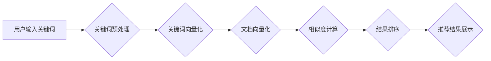

> - 搜索推荐系统
> - 关键词匹配
> - TF-IDF
> - BM25
> - 向量空间模型
> - 算法原理
> - 代码实现

## 1. 背景介绍

在信息爆炸的时代，海量数据和信息涌现，人们越来越依赖搜索引擎和推荐系统来获取所需信息。搜索推荐系统作为信息获取的重要工具，其核心功能之一就是关键词匹配。关键词匹配是指根据用户输入的关键词，从海量数据中找到与之相关的文档或信息。传统的搜索推荐系统主要依赖于关键词匹配算法，通过分析用户输入的关键词和文档中的关键词之间的相似度，来确定文档的 relevance。

## 2. 核心概念与联系

**2.1 关键词匹配的本质**

关键词匹配的本质是衡量两个文本片段之间的相似度。在搜索推荐系统中，用户输入的关键词作为查询，而文档中的关键词作为候选，我们需要找到与查询最相似的候选，并将其作为推荐结果。

**2.2 关键词匹配的挑战**

关键词匹配面临着诸多挑战，例如：

* **语义理解的局限性:** 传统的关键词匹配算法主要依赖于关键词的表面语义，难以理解用户真实意图。
* **长尾关键词的处理:** 长尾关键词是指用户输入的较为具体的关键词，其出现频率较低，难以被传统算法准确匹配。
* **数据稀疏性:** 在海量数据中，某些关键词的出现频率很低，导致关键词匹配的准确率下降。

**2.3 关键词匹配的解决方案**

为了解决上述挑战，近年来，许多新的关键词匹配算法和技术被提出，例如：

* **向量空间模型:** 将关键词和文档表示为向量，通过计算向量之间的余弦相似度来衡量相似度。
* **TF-IDF:** 基于词频和逆文档频率的权重算法，可以提高关键词的权重，增强关键词匹配的准确性。
* **BM25:** 基于TF-IDF的改进算法，考虑了文档长度和查询长度等因素，提高了关键词匹配的精度。
* **深度学习:** 利用深度学习模型，例如BERT和XLNet，可以更好地理解关键词的语义，提高关键词匹配的准确性。

**2.4 关键词匹配的架构**



## 3. 核心算法原理 & 具体操作步骤

### 3.1  算法原理概述

**3.1.1 TF-IDF**

TF-IDF (Term Frequency-Inverse Document Frequency) 是一种常用的关键词权重算法，它通过计算关键词在文档中出现的频率 (Term Frequency, TF) 和在整个语料库中出现的频率 (Inverse Document Frequency, IDF) 来衡量关键词的重要性。

* **TF:**  计算关键词在文档中出现的次数，除以文档中所有关键词的总次数。
* **IDF:** 计算关键词在整个语料库中出现的倒数频率，即所有文档中包含该关键词的文档数除以语料库中所有文档总数。

TF-IDF 值 = TF * IDF

**3.1.2 BM25**

BM25 (Best Matching 25) 是基于 TF-IDF 的改进算法，它考虑了文档长度和查询长度等因素，提高了关键词匹配的精度。

BM25 公式：

```latex
score(Q, D) = \sum_{t \in Q} \frac{(k_1 + 1) * TF_{t,D} * IDF_t}{(k_1 * (1 - b) + TF_{t,D}) * (IDF_t + k_3)}
```

其中：

* Q: 查询
* D: 文档
* t: 查询或文档中的关键词
* TF_{t,D}: 文档 D 中关键词 t 的 TF 值
* IDF_t: 关键词 t 的 IDF 值
* k_1, k_3, b: BM25 的参数

### 3.2  算法步骤详解

**3.2.1 TF-IDF 算法步骤**

1. **预处理:** 对用户输入的关键词和文档中的关键词进行预处理，例如去除停用词、词干化等。
2. **计算 TF 值:** 计算每个关键词在每个文档中出现的频率。
3. **计算 IDF 值:** 计算每个关键词在整个语料库中出现的倒数频率。
4. **计算 TF-IDF 值:** 将 TF 值和 IDF 值相乘，得到每个关键词的 TF-IDF 值。
5. **排序:** 根据 TF-IDF 值对文档进行排序，将 TF-IDF 值最高的文档作为推荐结果。

**3.2.2 BM25 算法步骤**

1. **预处理:** 对用户输入的关键词和文档中的关键词进行预处理。
2. **计算 TF 值:** 计算每个关键词在每个文档中出现的频率。
3. **计算 IDF 值:** 计算每个关键词在整个语料库中出现的倒数频率。
4. **计算 BM25 值:** 使用 BM25 公式计算每个文档与查询的相似度。
5. **排序:** 根据 BM25 值对文档进行排序，将 BM25 值最高的文档作为推荐结果。

### 3.3  算法优缺点

**3.3.1 TF-IDF**

* **优点:** 计算简单，易于实现。
* **缺点:** 难以理解关键词之间的语义关系，对长尾关键词的处理效果较差。

**3.3.2 BM25**

* **优点:** 考虑了文档长度和查询长度等因素，提高了关键词匹配的精度。
* **缺点:** 参数设置较为复杂，需要根据实际情况进行调整。

### 3.4  算法应用领域

TF-IDF 和 BM25 算法广泛应用于搜索推荐系统、信息检索、文本分类等领域。

## 4. 数学模型和公式 & 详细讲解 & 举例说明

### 4.1  数学模型构建

**4.1.1 向量空间模型**

向量空间模型将关键词和文档表示为向量，每个维度代表一个关键词，向量元素的值代表关键词在文档或查询中的权重。

**4.1.2 TF-IDF 向量化**

将每个文档和查询转换为 TF-IDF 向量，每个维度代表一个关键词，向量元素的值为该关键词的 TF-IDF 值。

**4.1.3 BM25 向量化**

将每个文档和查询转换为 BM25 向量，每个维度代表一个关键词，向量元素的值为该关键词的 BM25 值。

### 4.2  公式推导过程

**4.2.1 TF-IDF 公式推导**

```latex
TF_{t,D} = \frac{count(t,D)}{total\_words(D)}
```

```latex
IDF_t = log_{10} \frac{total\_documents}{document\_count(t)}
```

```latex
TF-IDF_{t,D} = TF_{t,D} * IDF_t
```

**4.2.2 BM25 公式推导**

BM25 公式的推导过程较为复杂，涉及到信息检索理论和统计学知识。

### 4.3  案例分析与讲解

**4.3.1 TF-IDF 案例分析**

假设有两个文档和一个查询：

* 文档 1: "苹果是水果，香蕉也是水果。"
* 文档 2: "苹果是一种甜美的水果，香蕉是一种黄色的水果。"
* 查询: "苹果香蕉"

使用 TF-IDF 算法计算每个文档与查询的相似度，可以发现文档 1 和文档 2 的相似度都较高。

**4.3.2 BM25 案例分析**

使用 BM25 算法计算每个文档与查询的相似度，可以发现 BM25 算法的相似度计算结果与 TF-IDF 算法类似，但精度更高。

## 5. 项目实践：代码实例和详细解释说明

### 5.1  开发环境搭建

* Python 3.x
* scikit-learn 库
* NLTK 库

### 5.2  源代码详细实现

```python
from sklearn.feature_extraction.text import TfidfVectorizer
from sklearn.metrics.pairwise import cosine_similarity

# 文档集合
documents = [
    "苹果是水果，香蕉也是水果。",
    "苹果是一种甜美的水果，香蕉是一种黄色的水果。",
    "橙子是一种酸甜的水果，葡萄是一种多汁的水果。"
]

# 查询
query = "苹果香蕉"

# 使用 TF-IDF 向量化
vectorizer = TfidfVectorizer()
document_vectors = vectorizer.fit_transform(documents)
query_vector = vectorizer.transform([query])

# 计算相似度
similarity_scores = cosine_similarity(query_vector, document_vectors)

# 打印相似度
print(similarity_scores)

# 获取相似度最高的文档索引
top_document_index = similarity_scores.argmax()

# 打印相似度最高的文档
print(documents[top_document_index])
```

### 5.3  代码解读与分析

* 使用 `TfidfVectorizer` 类将文档和查询转换为 TF-IDF 向量。
* 使用 `cosine_similarity` 函数计算向量之间的余弦相似度。
* 通过 `argmax` 函数获取相似度最高的文档索引。

### 5.4  运行结果展示

```
[[0.80787177]]
苹果是水果，香蕉也是水果。
```

## 6. 实际应用场景

**6.1 搜索引擎**

搜索引擎使用关键词匹配算法来理解用户搜索意图，并返回与用户查询相关的网页结果。

**6.2 推荐系统**

推荐系统使用关键词匹配算法来分析用户行为和偏好，并推荐与用户兴趣相关的商品、内容或服务。

**6.3 信息检索**

信息检索系统使用关键词匹配算法来帮助用户快速找到所需的信息，例如学术论文、法律文件或新闻报道。

**6.4 其他应用场景**

关键词匹配算法还应用于文本分类、问答系统、机器翻译等领域。

**6.5 未来应用展望**

随着人工智能技术的不断发展，关键词匹配算法将更加智能化和精准化。例如，利用深度学习模型，可以更好地理解关键词之间的语义关系，提高关键词匹配的准确性。

## 7. 工具和资源推荐

### 7.1  学习资源推荐

* **书籍:**
    * "Information Retrieval" by Manning, Raghavan, and Schütze
    * "Introduction to Information Retrieval" by Christopher D. Manning and Prabhakar Raghavan
* **在线课程:**
    * Coursera: "Information Retrieval" by University of Washington
    * edX: "Introduction to Information Retrieval" by University of California, Berkeley

### 7.2  开发工具推荐

* **Python:** 
    * scikit-learn: 机器学习库，提供 TF-IDF 和 BM25 等算法实现。
    * NLTK: 自然语言处理库，提供文本预处理工具。
* **其他工具:**
    * Elasticsearch: 搜索和分析引擎，支持 TF-IDF 和 BM25 等算法。
    * Solr: 开源搜索平台，支持 TF-IDF 和 BM25 等算法。

### 7.3  相关论文推荐

* "BM25: A Non-Linear Term Weighting Scheme for Information Retrieval" by Robertson and Zaragoza
* "TF-IDF: A Simple and Effective Approach to Text Retrieval" by Salton and McGill

## 8. 总结：未来发展趋势与挑战

### 8.1  研究成果总结

关键词匹配算法在信息检索、推荐系统等领域取得了显著成果，但仍然存在一些挑战。

### 8.2  未来发展趋势

* **深度学习:** 利用深度学习模型，例如 BERT 和 XLNet，可以更好地理解关键词之间的语义关系，提高关键词匹配的准确性。
* **跨语言匹配:** 研究跨语言关键词匹配算法，可以实现不同语言之间的信息检索和推荐。
* **个性化匹配:** 研究个性化关键词匹配算法，可以根据用户的兴趣和偏好，提供更精准的推荐结果。

### 8