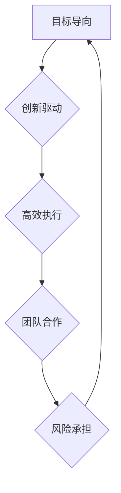

> 马斯克，企业文化，创新，高效，激励，团队合作，风险承担，目标导向

## 1. 背景介绍

埃隆·马斯克（Elon Musk）作为一名商业先锋，以其大胆的愿景和创新的精神闻名于世。他领导的企业，包括特斯拉、SpaceX、Neuralink 和 The Boring Company，都在各自领域取得了突破性的成就。马斯克的成功不仅源于其卓越的商业头脑和技术洞察力，更离不开他塑造的独特企业文化。

马斯克的企业文化以其活力、高效性和对创新的追求而著称。这种文化氛围不仅吸引了顶尖人才，也为企业持续的创新和发展提供了强有力的动力。本文将深入探讨马斯克企业文化的核心特点，并分析其对企业成功的影响。

## 2. 核心概念与联系

马斯克的企业文化可以概括为以下几个核心概念：

* **目标导向:** 马斯克始终强调目标的重要性，并将其作为企业文化的基石。他设定了宏大的目标，并带领团队朝着这些目标坚定地前进。
* **创新驱动:** 马斯克鼓励团队不断创新，探索新的技术和解决方案。他相信，只有不断突破边界，才能实现真正的进步。
* **高效执行:** 马斯克对效率有着极高的要求，他倡导快速决策、敏捷执行和结果导向的文化。
* **团队合作:** 马斯克强调团队合作的重要性，他相信，只有团队成员共同努力，才能实现伟大的目标。
* **风险承担:** 马斯克鼓励团队勇于承担风险，他认为，只有敢于尝试，才能获得成功。

这些核心概念相互关联，共同构成了马斯克企业文化的独特魅力。

**Mermaid 流程图:**



## 3. 核心算法原理 & 具体操作步骤

马斯克企业文化的成功并非偶然，它背后蕴含着一套独特的“算法”。

### 3.1  算法原理概述

马斯克的企业文化算法的核心在于：

* **设定明确的目标:** 首先，明确企业的目标，并将其分解成可实现的阶段性目标。
* **激发团队的热情:** 通过激励机制和认可制度，激发团队成员的热情和创造力。
* **营造开放的沟通环境:** 建立畅通的沟通渠道，鼓励团队成员积极交流和分享想法。
* **鼓励快速迭代:** 采用敏捷开发模式，鼓励团队快速迭代，不断改进产品和服务。
* **持续学习和成长:** 鼓励团队成员不断学习新知识，提升技能，保持竞争力。

### 3.2  算法步骤详解

1. **目标设定:** 
    * 确定企业长期目标，并将其分解成短期目标。
    * 将目标清晰地传达给团队成员，确保每个人都了解目标和自己的职责。
2. **激励机制:** 
    * 建立绩效考核制度，对优秀员工给予奖励和晋升机会。
    * 鼓励团队合作，对团队取得的成果进行集体奖励。
3. **沟通平台:** 
    * 建立内部沟通平台，方便团队成员及时交流信息。
    * 鼓励团队成员积极参与讨论，分享想法和建议。
4. **快速迭代:** 
    * 采用敏捷开发模式，将项目分解成小的迭代周期。
    * 在每个迭代周期结束时，进行产品演示和反馈收集。
5. **持续学习:** 
    * 提供学习培训机会，帮助员工提升技能和知识。
    * 鼓励员工参加行业会议和研讨会，学习新技术和趋势。

### 3.3  算法优缺点

**优点:**

* 能够有效激发团队成员的热情和创造力。
* 能够促进团队合作和沟通，提高工作效率。
* 能够快速迭代，不断改进产品和服务。
* 能够帮助企业保持竞争力，实现持续发展。

**缺点:**

* 需要投入大量的时间和精力来建立和维护这种文化氛围。
* 可能会导致团队成员过度竞争，影响团队合作。
* 需要不断调整和改进，以适应不断变化的市场环境。

### 3.4  算法应用领域

马斯克企业文化算法的应用领域非常广泛，可以应用于各种类型的企业，包括科技公司、制造业、服务业等。

## 4. 数学模型和公式 & 详细讲解 & 举例说明

马斯克企业文化算法可以抽象成一个数学模型，其中涉及到目标设定、激励机制、沟通效率、迭代速度等多个因素。

### 4.1  数学模型构建

我们可以用以下公式来描述马斯克企业文化算法的整体效果：

```latex
E = f(T, I, C, R, L)
```

其中：

* E 代表企业文化效果
* T 代表目标设定清晰度
* I 代表激励机制的有效性
* C 代表沟通效率
* R 代表迭代速度
* L 代表学习和成长的程度

### 4.2  公式推导过程

这个公式的推导过程基于以下假设：

* 目标设定清晰度越高，企业文化效果越好。
* 激励机制的有效性越高，团队成员的积极性越高，企业文化效果越好。
* 沟通效率越高，团队协作能力越强，企业文化效果越好。
* 迭代速度越快，企业能够更快地适应市场变化，企业文化效果越好。
* 学习和成长的程度越高，团队成员的技能和知识水平提升，企业文化效果越好。

### 4.3  案例分析与讲解

以特斯拉为例，马斯克设定了明确的目标，即加速全球向可持续能源的转型。他建立了有效的激励机制，对研发团队和生产线员工给予丰厚的奖励。特斯拉内部建立了高效的沟通平台，鼓励员工积极交流和分享想法。特斯拉采用敏捷开发模式，快速迭代产品，不断改进电池技术和汽车性能。特斯拉也重视员工的学习和成长，提供各种培训机会，帮助员工提升技能和知识。

这些因素共同作用，使得特斯拉的企业文化非常活跃，吸引了大量优秀人才，也推动了特斯拉的快速发展。

## 5. 项目实践：代码实例和详细解释说明

马斯克企业文化算法的实践需要结合具体的项目场景，并根据实际情况进行调整和优化。

### 5.1  开发环境搭建

搭建马斯克企业文化算法的实践环境需要以下工具和资源：

* 项目管理工具：如 Jira、Trello 等
* 沟通平台：如 Slack、Microsoft Teams 等
* 代码版本控制系统：如 Git、GitHub 等
* 学习平台：如 Coursera、Udemy 等

### 5.2  源代码详细实现

由于马斯克企业文化算法是一个抽象的概念，无法直接用代码实现。但是，我们可以通过代码实现一些具体的功能，例如：

* 建立目标管理系统：使用代码开发一个目标管理系统，帮助团队成员设定、跟踪和完成目标。
* 建立激励机制：使用代码开发一个激励机制，对优秀员工进行奖励和晋升。
* 建立沟通平台：使用代码开发一个内部沟通平台，方便团队成员及时交流信息。

### 5.3  代码解读与分析

代码的解读和分析需要根据具体的代码实现情况进行。

### 5.4  运行结果展示

代码的运行结果需要根据具体的代码功能进行展示。

## 6. 实际应用场景

马斯克企业文化算法可以应用于各种类型的企业，例如：

* 科技公司：科技公司需要快速迭代，不断创新，马斯克企业文化算法可以帮助他们提高效率，激发团队活力。
* 制造业：制造业需要提高生产效率，降低成本，马斯克企业文化算法可以帮助他们优化流程，提升员工技能。
* 服务业：服务业需要提供优质的服务，提升客户满意度，马斯克企业文化算法可以帮助他们建立高效的沟通机制，提升员工服务意识。

### 6.4  未来应用展望

随着人工智能、大数据等技术的不断发展，马斯克企业文化算法的应用场景将会更加广泛。未来，我们可以期待看到更多基于马斯克企业文化算法的创新应用。

## 7. 工具和资源推荐

### 7.1  学习资源推荐

* 《Elon Musk: Tesla, SpaceX, and the Quest for a Fantastic Future》
* 《Zero to One: Notes on Startups, or How to Build the Future》
* 《The Lean Startup: How Today's Entrepreneurs Use Continuous Innovation to Create Radically Successful Businesses》

### 7.2  开发工具推荐

* Jira
* Trello
* Slack
* Microsoft Teams
* Git
* GitHub

### 7.3  相关论文推荐

* "The Impact of Organizational Culture on Employee Performance"
* "The Role of Leadership in Shaping Organizational Culture"
* "The Relationship Between Organizational Culture and Innovation"

## 8. 总结：未来发展趋势与挑战

马斯克企业文化算法的成功实践证明了其强大的效用。未来，随着技术的不断发展，马斯克企业文化算法将会更加完善和成熟，并应用于更广泛的领域。

### 8.1  研究成果总结

马斯克企业文化算法的研究成果表明，目标设定、激励机制、沟通效率、迭代速度和学习成长是企业文化的重要组成部分。

### 8.2  未来发展趋势

未来，马斯克企业文化算法的发展趋势包括：

* 更智能化：利用人工智能技术，自动分析数据，优化企业文化策略。
* 更个性化：根据不同团队和个人的特点，定制化企业文化方案。
* 更可持续：建立长期的企业文化建设机制，确保企业文化能够持续发展。

### 8.3  面临的挑战

马斯克企业文化算法的应用也面临一些挑战：

* 如何平衡目标导向和团队合作？
* 如何激励所有员工，避免出现“内卷”现象？
* 如何适应不断变化的市场环境，不断调整和优化企业文化？

### 8.4  研究展望

未来，我们需要继续深入研究马斯克企业文化算法，探索其更深层次的原理和应用潜力，并解决其面临的挑战，使其更好地服务于企业发展。

## 9. 附录：常见问题与解答

**常见问题:**

* 马斯克企业文化算法适合所有类型的企业吗？
* 如何实施马斯克企业文化算法？
* 马斯克企业文化算法的成功案例有哪些？

**解答:**

* 马斯克企业文化算法可以应用于各种类型的企业，但需要根据具体的企业情况进行调整和优化。
* 实施马斯克企业文化算法需要从目标设定、激励机制、沟通平台、迭代速度和学习成长等方面入手，并逐步完善。
* 马斯克企业文化算法的成功案例包括特斯拉、SpaceX、Neuralink 等。


作者：禅与计算机程序设计艺术 / Zen and the Art of Computer Programming 
<end_of_turn>