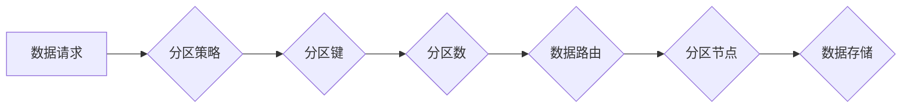

> 分区, 分区算法, 数据存储, 分布式系统, 高可用性, 性能优化, 代码实例

## 1. 背景介绍

随着互联网技术的飞速发展，数据规模呈指数级增长，传统的集中式存储架构已难以满足海量数据存储和处理的需求。分布式存储系统应运而生，并逐渐成为大数据时代的主流架构。分区技术作为分布式存储系统的重要组成部分，在数据存储、访问和管理方面发挥着关键作用。

分区技术将数据按照一定的规则分割成多个独立的部分，称为分区。每个分区存储在不同的节点上，并由相应的节点负责管理。这种分而治之的策略能够有效地解决集中式存储系统面临的瓶颈问题，例如：

* **数据规模限制:** 分区技术可以将海量数据分割成多个较小的部分，方便存储和管理。
* **单点故障风险:** 分区技术将数据分散存储在多个节点上，即使某个节点发生故障，也不会影响其他节点的数据访问和处理。
* **性能瓶颈:** 分区技术可以将数据访问和处理任务分配到不同的节点上，提高系统整体的处理能力。

## 2. 核心概念与联系

分区技术的核心概念包括：

* **分区键:** 用于将数据划分为不同区间的键值。
* **分区数:** 分区技术中划分的分区数量。
* **分区策略:** 用于确定数据如何分配到不同分区中的规则。
* **数据路由:** 用于将数据请求转发到相应分区节点的机制。

**分区技术架构**



## 3. 核心算法原理 & 具体操作步骤

### 3.1  算法原理概述

分区算法的核心目的是将数据按照一定的规则分配到不同的分区中，以实现数据均衡分布和高效访问。常见的分区算法包括：

* **哈希分区:** 使用哈希函数将数据键映射到分区索引，实现数据均匀分布。
* **范围分区:** 将数据按照键值范围划分到不同的分区中，适用于有序数据。
* **模数分区:** 将数据键除以分区数，取余数作为分区索引，简单易实现。

### 3.2  算法步骤详解

以哈希分区算法为例，其具体操作步骤如下：

1. **选择哈希函数:** 选择一个合适的哈希函数，确保其能够将数据键映射到分区索引范围内。
2. **计算分区索引:** 使用哈希函数将数据键映射到分区索引。
3. **将数据写入分区:** 将数据写入对应的分区节点。

### 3.3  算法优缺点

**哈希分区算法**

* **优点:** 数据分布均匀，访问效率高。
* **缺点:** 无法根据数据范围进行分区，数据更新和删除操作可能需要重新计算分区索引。

**范围分区算法**

* **优点:** 可以根据数据范围进行分区，数据更新和删除操作相对简单。
* **缺点:** 数据分布可能不均匀，访问效率可能较低。

### 3.4  算法应用领域

分区算法广泛应用于分布式数据库、缓存系统、文件系统等领域。

## 4. 数学模型和公式 & 详细讲解 & 举例说明

### 4.1  数学模型构建

假设我们有N个数据项，M个分区，哈希函数为h(x)，其中x为数据项的键值。

**分区模型:**

```
P = {P1, P2, ..., PM}
```

其中，Pi表示第i个分区。

**数据分配规则:**

```
data_item_i ∈ Pi  if  h(data_item_i) % M = i - 1
```

其中，data_item_i表示第i个数据项。

### 4.2  公式推导过程

哈希函数的输出值范围为[0, M-1]，因此数据项的分配到分区索引可以通过取余操作实现。

### 4.3  案例分析与讲解

假设我们有10个数据项，3个分区，哈希函数为h(x) = x % 3。

数据项的键值分别为：1, 2, 3, 4, 5, 6, 7, 8, 9, 10。

根据数据分配规则，数据项的分配结果如下：

* P1: {1, 4, 7, 10}
* P2: {2, 5, 8}
* P3: {3, 6, 9}

## 5. 项目实践：代码实例和详细解释说明

### 5.1  开发环境搭建

* 操作系统: Ubuntu 20.04
* 编程语言: Python 3.8
* 框架: Flask

### 5.2  源代码详细实现

```python
from flask import Flask, request, jsonify

app = Flask(__name__)

# 数据分区字典
partitions = {
    0: {},
    1: {},
    2: {}
}

# 哈希函数
def hash_function(key):
    return hash(key) % 3

@app.route('/store', methods=['POST'])
def store_data():
    data = request.get_json()
    key = data['key']
    value = data['value']

    partition_index = hash_function(key)
    partitions[partition_index][key] = value

    return jsonify({'status': 'success'})

@app.route('/get', methods=['GET'])
def get_data():
    key = request.args.get('key')

    partition_index = hash_function(key)
    value = partitions[partition_index].get(key)

    return jsonify({'value': value})

if __name__ == '__main__':
    app.run(debug=True)
```

### 5.3  代码解读与分析

* **数据分区字典:** 使用字典存储数据，每个分区对应一个字典。
* **哈希函数:** 使用Python内置的hash函数计算数据键的哈希值，并取余数作为分区索引。
* **存储数据:** 将数据存储到对应的分区字典中。
* **获取数据:** 根据数据键计算分区索引，从对应的分区字典中获取数据。

### 5.4  运行结果展示

运行代码后，可以使用以下命令访问服务：

* **存储数据:**

```
curl -X POST -H "Content-Type: application/json" -d '{"key": "test1", "value": "hello"}' http://localhost:5000/store
```

* **获取数据:**

```
curl http://localhost:5000/get?key=test1
```

## 6. 实际应用场景

分区技术广泛应用于各种分布式系统中，例如：

* **分布式数据库:** 分区技术可以将数据分散存储在多个节点上，提高数据库的吞吐量和可用性。
* **缓存系统:** 分区技术可以将缓存数据按照不同的类型或访问频率进行分区，提高缓存命中率和性能。
* **文件系统:** 分区技术可以将文件系统的数据分割成多个分区，提高文件系统的可靠性和扩展性。

### 6.4  未来应用展望

随着大数据和云计算的快速发展，分区技术将继续发挥重要作用，并将在以下领域得到更广泛的应用：

* **实时数据处理:** 分区技术可以用于构建实时数据处理系统，例如流式数据分析和事件驱动架构。
* **机器学习:** 分区技术可以用于构建分布式机器学习平台，提高机器学习模型的训练速度和效率。
* **物联网:** 分区技术可以用于构建物联网数据存储和处理系统，提高物联网应用的可靠性和实时性。

## 7. 工具和资源推荐

### 7.1  学习资源推荐

* **书籍:**
    * 分布式系统设计
    * 分布式数据库
* **在线课程:**
    * Coursera: 分布式系统
    * Udemy: 分布式数据库

### 7.2  开发工具推荐

* **分布式数据库:**
    * Cassandra
    * MongoDB
    * Redis
* **分布式文件系统:**
    * HDFS
    * Ceph

### 7.3  相关论文推荐

* **论文:**
    * The Design and Implementation of Cassandra
    * A Survey of Distributed Database Systems

## 8. 总结：未来发展趋势与挑战

### 8.1  研究成果总结

分区技术作为分布式存储系统的重要组成部分，在数据存储、访问和管理方面发挥着关键作用。

### 8.2  未来发展趋势

* **更智能的分区策略:** 基于机器学习和数据分析，实现更智能的分区策略，提高数据均衡分布和访问效率。
* **动态分区调整:** 根据数据变化和系统负载，动态调整分区数量和数据分配，提高系统弹性和性能。
* **跨数据中心分区:** 实现跨数据中心的分区，提高数据可用性和灾难恢复能力。

### 8.3  面临的挑战

* **数据一致性:** 在分布式环境下，保证数据一致性是一个重要的挑战。
* **数据迁移:** 分区调整和数据迁移操作需要高效和可靠的机制。
* **安全性和隐私保护:** 分区技术需要考虑数据安全性和隐私保护问题。

### 8.4  研究展望

未来，分区技术将继续朝着更智能、更灵活、更安全的方向发展，并将在更多领域得到应用。


## 9. 附录：常见问题与解答

* **Q1: 为什么需要使用分区技术？**

* **A1:** 分区技术可以解决集中式存储系统面临的瓶颈问题，例如数据规模限制、单点故障风险和性能瓶颈。

* **Q2: 分区算法有哪些？**

* **A2:** 常见的分区算法包括哈希分区、范围分区和模数分区。

* **Q3: 如何选择合适的分区算法？**

* **A3:** 选择合适的分区算法需要考虑数据特点、系统需求和性能要求。

* **Q4: 分区技术如何保证数据一致性？**

* **A4:** 分区技术需要结合相应的分布式一致性协议，例如Paxos或Raft，保证数据一致性。


作者：禅与计算机程序设计艺术 / Zen and the Art of Computer Programming 
<end_of_turn>