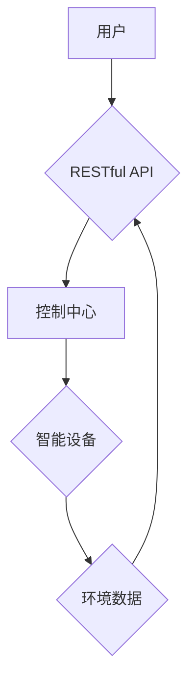

> 智能家居, RESTful API, Java, Spring Boot, MQTT, 物联网, 安全

## 1. 背景介绍

智能家居已成为现代生活的重要组成部分，它通过将各种智能设备连接到网络，实现对家居环境的自动化控制和远程管理。随着物联网技术的快速发展，智能家居市场呈现出爆发式增长，对智能家居控制系统的需求也日益增加。

传统的智能家居控制系统通常采用封闭的协议和平台，缺乏灵活性、可扩展性和安全性。基于RESTful API的设计理念为智能家居控制系统提供了新的解决方案。RESTful API是一种基于互联网协议的轻量级、灵活的应用编程接口，它采用资源、请求和状态码等概念，使应用程序之间能够轻松地进行数据交换和交互。

## 2. 核心概念与联系

### 2.1 RESTful API

RESTful API是一种基于互联网协议的架构风格，它利用HTTP协议来实现资源的创建、读取、更新和删除（CRUD）操作。RESTful API的特点包括：

* **基于资源：** 所有数据都以资源的形式表示，每个资源都有唯一的标识符（URI）。
* **状态转移：** 使用HTTP状态码来表示请求的结果，例如200表示成功，404表示资源不存在。
* **缓存：** 允许客户端缓存资源，提高性能。
* **层级架构：** API可以被组织成多个层次，每个层次负责特定的功能。

### 2.2 智能家居系统架构

智能家居系统通常由以下几个主要部分组成：

* **智能设备：** 包括传感器、执行器、网关等，负责感知环境信息和执行控制指令。
* **控制中心：** 负责接收来自智能设备的事件信息，并根据用户指令或预设规则进行控制。
* **用户界面：** 允许用户与智能家居系统进行交互，例如通过手机APP、语音助手等。

### 2.3  RESTful API在智能家居中的应用

RESTful API可以用于实现智能家居系统中的各种功能，例如：

* **设备控制：** 用户可以通过API远程控制智能设备，例如开关灯、调节温度等。
* **场景管理：** 用户可以创建和管理智能家居场景，例如“起床场景”，“睡觉场景”等，通过API自动执行场景中的设备控制指令。
* **数据采集和分析：** 智能设备可以将数据上传到控制中心，通过API进行数据分析和可视化，帮助用户了解家居环境和设备运行状况。

### 2.4  Mermaid 流程图



## 3. 核心算法原理 & 具体操作步骤

### 3.1  算法原理概述

智能家居控制API的设计需要考虑以下几个关键算法：

* **设备识别和认证：** 确保只有授权的设备才能访问API，防止未经授权的设备进行控制。
* **消息队列：** 用于处理来自智能设备的事件信息和用户指令，确保消息的可靠传递和处理。
* **规则引擎：** 用于根据用户预设规则或场景触发设备控制指令。
* **数据加密和安全：** 保护用户隐私和设备安全，防止数据被窃取或篡改。

### 3.2  算法步骤详解

1. **设备注册和认证：** 智能设备需要向控制中心注册，并提供设备标识符和认证信息。控制中心会验证设备的合法性，并分配唯一的设备ID。
2. **消息订阅和发布：** 智能设备可以订阅特定的主题，接收相关事件信息。用户可以通过API发布指令，控制智能设备。
3. **规则引擎触发：** 控制中心会根据用户预设规则或场景，触发相应的设备控制指令。
4. **设备控制和反馈：** 控制中心将指令发送到目标设备，设备执行指令并反馈执行结果。

### 3.3  算法优缺点

* **优点：**
    * 灵活性高：可以根据不同的需求定制API接口和功能。
    * 可扩展性强：可以轻松添加新的设备和功能。
    * 安全性高：可以使用多种安全机制保护用户隐私和设备安全。
* **缺点：**
    * 开发成本较高：需要对RESTful API和智能家居系统架构有深入了解。
    * 维护成本较高：需要不断更新API接口和设备驱动程序。

### 3.4  算法应用领域

RESTful API在智能家居领域有着广泛的应用，例如：

* **智能照明控制：** 用户可以通过API控制灯光开关、亮度、颜色等。
* **智能空调控制：** 用户可以通过API设置温度、模式、定时等。
* **智能安防系统：** 用户可以通过API查看监控视频、控制报警器等。

## 4. 数学模型和公式 & 详细讲解 & 举例说明

### 4.1  数学模型构建

智能家居控制API的设计需要考虑设备状态、用户指令和环境因素等多方面的因素。可以使用状态机模型来描述设备的运行状态和状态转换规则。

状态机模型由状态、事件和转换函数组成。

* **状态：** 代表设备当前的运行状态，例如“待机”、“运行”、“暂停”等。
* **事件：** 代表外部事件或用户指令，例如“开关灯”、“调节温度”等。
* **转换函数：** 根据事件和当前状态，决定设备的下一个状态。

### 4.2  公式推导过程

例如，一个智能灯的控制状态机可以定义如下：

* 状态：{“待机”、“亮”、“灭”}
* 事件：{“开关灯”、“调节亮度”}
* 转换函数：

```
switch (state) {
    case "待机":
        if (event == "开关灯") {
            state = "亮";
        }
        break;
    case "亮":
        if (event == "开关灯") {
            state = "灭";
        } else if (event == "调节亮度") {
            // 根据亮度调节规则更新亮度值
        }
        break;
    case "灭":
        if (event == "开关灯") {
            state = "亮";
        }
        break;
}
```

### 4.3  案例分析与讲解

通过状态机模型，可以实现智能灯的灵活控制，例如：

* 用户点击“开关灯”按钮，可以将灯从“待机”状态切换到“亮”状态。
* 用户点击“调节亮度”按钮，可以根据用户设置的亮度值，调整灯的亮度。

## 5. 项目实践：代码实例和详细解释说明

### 5.1  开发环境搭建

* 操作系统：Windows/Linux/macOS
* JDK：Java 8 或以上版本
* IDE：IntelliJ IDEA 或 Eclipse
* Maven：用于项目构建和依赖管理

### 5.2  源代码详细实现

```java
// 设备实体类
public class Device {
    private String deviceId;
    private String deviceType;
    private String status;

    // 构造函数、getter和setter方法
}

// RESTful API控制器
@RestController
public class DeviceController {

    @Autowired
    private DeviceService deviceService;

    // 获取设备列表
    @GetMapping("/devices")
    public List<Device> getDevices() {
        return deviceService.getAllDevices();
    }

    // 获取单个设备信息
    @GetMapping("/devices/{deviceId}")
    public Device getDevice(@PathVariable String deviceId) {
        return deviceService.getDeviceById(deviceId);
    }

    // 控制设备状态
    @PutMapping("/devices/{deviceId}/status")
    public Device updateDeviceStatus(@PathVariable String deviceId, @RequestBody Device device) {
        return deviceService.updateDeviceStatus(deviceId, device.getStatus());
    }
}

// 设备服务类
@Service
public class DeviceService {

    // 设备数据存储
    private Map<String, Device> devices = new HashMap<>();

    // 添加设备
    public void addDevice(Device device) {
        devices.put(device.getDeviceId(), device);
    }

    // 获取所有设备
    public List<Device> getAllDevices() {
        return new ArrayList<>(devices.values());
    }

    // 获取单个设备
    public Device getDeviceById(String deviceId) {
        return devices.get(deviceId);
    }

    // 更新设备状态
    public Device updateDeviceStatus(String deviceId, String status) {
        Device device = devices.get(deviceId);
        if (device != null) {
            device.setStatus(status);
            return device;
        }
        return null;
    }
}
```

### 5.3  代码解读与分析

* **设备实体类：** 定义了智能设备的基本属性，例如设备ID、设备类型和状态。
* **RESTful API控制器：** 使用Spring Boot的@RestController注解，定义了RESTful API接口，处理用户请求和设备数据。
* **设备服务类：** 提供了设备数据操作的业务逻辑，例如添加设备、获取设备列表、更新设备状态等。

### 5.4  运行结果展示

通过运行上述代码，可以实现以下功能：

* 通过浏览器访问`/devices`接口，获取所有设备列表。
* 通过浏览器访问`/devices/{deviceId}`接口，获取单个设备信息。
* 通过浏览器访问`/devices/{deviceId}/status`接口，更新设备状态。

## 6. 实际应用场景

### 6.1  智能照明控制

用户可以通过API控制智能灯的开关、亮度、颜色等，实现个性化的照明场景。例如，用户可以设置“起床场景”，在早上自动打开灯光并逐渐提高亮度，模拟自然光线，帮助用户醒来。

### 6.2  智能空调控制

用户可以通过API控制智能空调的温度、模式、定时等，实现舒适的室内环境。例如，用户可以设置“外出场景”，在离开家时自动关闭空调，节省能源。

### 6.3  智能安防系统

用户可以通过API查看监控视频、控制报警器等，实现家居安全保障。例如，用户可以设置“入侵报警”场景，当检测到入侵行为时，自动触发报警并通知用户。

### 6.4  未来应用展望

随着物联网技术的不断发展，智能家居控制API的应用场景将更加广泛，例如：

* **智能家居自动化：** 通过API实现家居环境的自动化控制，例如根据用户习惯自动调节灯光、温度、窗帘等。
* **远程家居管理：** 用户可以通过手机APP或语音助手远程控制智能家居设备，即使不在家也能管理家居环境。
* **智能家居数据分析：** 通过API收集和分析智能家居设备的数据，帮助用户了解家居环境和设备运行状况，并提供个性化的建议。

## 7. 工具和资源推荐

### 7.1  学习资源推荐

* **RESTful API设计规范：** https://restfulapi.net/
* **Spring Boot官方文档：** https://spring.io/projects/spring-boot
* **Java编程语言官方文档：** https://docs.oracle.com/javase/tutorial/

### 7.2  开发工具推荐

* **IntelliJ IDEA：** https://www.jetbrains.com/idea/
* **Eclipse：** https://www.eclipse.org/
* **Maven：** https://maven.apache.org/

### 7.3  相关论文推荐

* **RESTful Web Services：** https://www.oreilly.com/library/view/restful-web-services/9780596527205/
* **Designing RESTful APIs：** https://www.oreilly.com/library/view/designing-restful-apis/9781491951507/

## 8. 总结：未来发展趋势与挑战

### 8.1  研究成果总结

本文介绍了基于Java的智能家居设计，重点探讨了RESTful API在智能家居控制系统中的应用。通过分析核心算法原理、代码实例