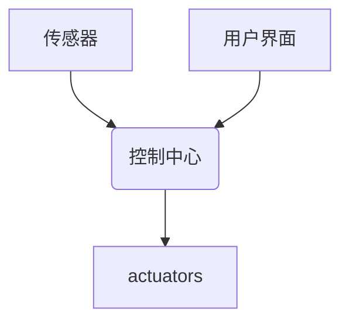

> 智能家居, Java, Web, 响应式设计, 前端界面, RESTful API, Spring Boot, Thymeleaf

## 1. 背景介绍

智能家居已成为现代生活的重要组成部分，它通过网络连接各种智能设备，实现家居自动化、远程控制和场景化体验。而前端界面作为用户与智能家居交互的关键桥梁，其设计和实现直接影响着用户体验和使用便捷性。

传统的智能家居前端界面往往缺乏响应性，难以适应不同设备屏幕尺寸和分辨率的变化。随着移动设备的普及，用户对智能家居前端界面的需求更加多样化，对响应式设计、交互流畅性和个性化定制等方面提出了更高的要求。

基于Java的智能家居设计，可以充分利用Java语言的强大功能和丰富的生态系统，构建高效、可靠、可扩展的智能家居平台。同时，结合Web技术和响应式设计理念，可以打造出用户体验更佳的智能家居前端界面。

## 2. 核心概念与联系

### 2.1 智能家居架构

智能家居系统通常由以下几个核心组件组成：

* **传感器:** 收集家居环境信息，例如温度、湿度、光照、气压等。
* ** actuators:** 控制家居设备，例如灯光、空调、窗帘、门锁等。
* **控制中心:** 处理传感器数据，执行用户指令，协调设备工作。
* **用户界面:** 用户与智能家居系统交互的界面，可以是手机APP、平板电脑、网页浏览器等。

### 2.2 Java与Web整合

Java语言作为一种成熟、稳定、高性能的编程语言，在构建智能家居平台方面具有诸多优势。

* **强大的生态系统:** Java拥有丰富的第三方库和框架，例如Spring Boot、Thymeleaf、RESTful API等，可以简化开发过程，提高开发效率。
* **跨平台性:** Java代码可以在不同的操作系统平台上运行，例如Windows、Linux、macOS等，可以满足不同用户的需求。
* **安全性:** Java语言具有内置的安全机制，可以有效防止恶意攻击和数据泄露。

Web技术作为一种广泛应用于互联网的开发技术，可以实现智能家居系统的远程访问和控制。

* **响应式设计:** Web技术可以实现响应式设计，使智能家居前端界面能够适应不同设备屏幕尺寸和分辨率的变化。
* **跨平台性:** Web浏览器可以运行在不同的操作系统平台上，可以方便用户随时随地访问智能家居系统。
* **易于维护:** Web应用程序可以方便地进行更新和维护，可以及时修复bug和添加新功能。

### 2.3 核心架构图



## 3. 核心算法原理 & 具体操作步骤

### 3.1  算法原理概述

智能家居前端界面的响应式设计主要基于以下算法原理：

* **媒体查询:** 通过CSS媒体查询语句，根据设备屏幕尺寸、分辨率、方向等信息，动态调整网页布局和样式。
* **布局框架:** 使用Flexbox、Grid等布局框架，实现灵活的布局和元素排列，适应不同屏幕尺寸的变化。
* **图像自适应:** 使用图片自适应技术，根据设备屏幕尺寸动态调整图片大小，避免图片过大或过小。

### 3.2  算法步骤详解

1. **分析设备类型和屏幕尺寸:** 使用JavaScript代码获取设备类型和屏幕尺寸信息。
2. **根据媒体查询语句动态调整样式:** 根据设备信息，选择相应的媒体查询语句，动态调整网页布局和样式。
3. **使用布局框架实现灵活布局:** 使用Flexbox、Grid等布局框架，实现元素的灵活排列和布局。
4. **实现图片自适应:** 使用图片自适应技术，根据设备屏幕尺寸动态调整图片大小。

### 3.3  算法优缺点

**优点:**

* 能够适应不同设备屏幕尺寸和分辨率的变化。
* 提升用户体验，提供更流畅的交互体验。
* 降低开发成本，减少针对不同设备的单独开发工作。

**缺点:**

* 需要对媒体查询语句和布局框架有深入了解。
* 复杂的布局设计可能需要较多的代码和调试时间。

### 3.4  算法应用领域

响应式设计算法广泛应用于各种Web应用，例如：

* **智能家居前端界面:** 适应不同设备屏幕尺寸，提供流畅的交互体验。
* **电商网站:** 优化商品展示和购物流程，提升用户体验。
* **新闻网站:** 适应不同设备屏幕尺寸，方便用户阅读新闻内容。

## 4. 数学模型和公式 & 详细讲解 & 举例说明

### 4.1  数学模型构建

响应式设计算法的核心是根据设备屏幕尺寸和分辨率，动态调整网页布局和样式。

我们可以使用以下数学模型来描述网页元素的尺寸变化：

* **宽度变化:**  `new_width = original_width * (screen_width / reference_width)`
* **高度变化:** `new_height = original_height * (screen_height / reference_height)`

其中:

* `new_width` 和 `new_height` 是调整后的元素宽度和高度。
* `original_width` 和 `original_height` 是元素原始的宽度和高度。
* `screen_width` 和 `screen_height` 是设备屏幕的宽度和高度。
* `reference_width` 和 `reference_height` 是参考屏幕的宽度和高度。

### 4.2  公式推导过程

上述公式的推导过程基于比例关系。

假设一个网页元素的原始宽度为 `original_width`，原始高度为 `original_height`，参考屏幕的宽度为 `reference_width`，参考屏幕的高度为 `reference_height`。

当设备屏幕的宽度为 `screen_width`，高度为 `screen_height` 时，我们需要根据比例关系调整元素的尺寸。

我们可以将元素的宽度和高度分别与参考屏幕的宽度和高度进行比例计算，得到调整后的元素宽度和高度。

### 4.3  案例分析与讲解

假设一个网页元素的原始宽度为 300px，原始高度为 200px，参考屏幕的宽度为 1280px，参考屏幕的高度为 800px。

当设备屏幕的宽度为 768px，高度为 1024px 时，我们可以使用上述公式计算调整后的元素宽度和高度：

* `new_width = 300 * (768 / 1280) = 180px`
* `new_height = 200 * (1024 / 800) = 256px`

因此，在设备屏幕宽度为 768px，高度为 1024px 的情况下，该元素的宽度将调整为 180px，高度将调整为 256px。

## 5. 项目实践：代码实例和详细解释说明

### 5.1  开发环境搭建

* **Java Development Kit (JDK):** 下载并安装最新版本的JDK。
* **Integrated Development Environment (IDE):** 选择合适的IDE，例如Eclipse、IntelliJ IDEA等。
* **Maven:** 下载并安装Maven，用于项目依赖管理。
* **Web Server:** 选择合适的Web服务器，例如Tomcat、Jetty等。

### 5.2  源代码详细实现

```java
// Spring Boot Controller
@RestController
public class HomeController {

    @GetMapping("/")
    public String index() {
        return "Hello, World!";
    }
}

// Thymeleaf Template
<!DOCTYPE html>
<html xmlns:th="http://www.thymeleaf.org">
<head>
    <title>智能家居前端界面</title>
    <link rel="stylesheet" href="https://stackpath.bootstrapcdn.com/bootstrap/4.5.2/css/bootstrap.min.css">
</head>
<body>
    <div class="container">
        <h1>智能家居</h1>
        <p>欢迎使用智能家居系统!</p>
    </div>
</body>
</html>
```

### 5.3  代码解读与分析

* **Spring Boot Controller:** 使用Spring Boot框架构建RESTful API，处理用户请求。
* **Thymeleaf Template:** 使用Thymeleaf模板引擎渲染前端界面，将数据动态绑定到页面元素中。
* **Bootstrap:** 使用Bootstrap框架提供预定义的样式和组件，简化前端开发。

### 5.4  运行结果展示

运行上述代码后，可以在浏览器中访问http://localhost:8080/，看到智能家居前端界面的基本页面。

## 6. 实际应用场景

### 6.1  场景一：远程控制灯光

用户可以通过智能家居前端界面，远程控制家居灯光开关，调节灯光亮度和颜色。

### 6.2  场景二：智能场景控制

用户可以创建智能场景，例如“起床场景”，“睡觉场景”等，通过一键触发，实现多设备联动控制。

### 6.3  场景三：设备状态监控

用户可以通过智能家居前端界面，实时监控家居设备的运行状态，例如空调温度、窗帘位置等。

### 6.4  未来应用展望

随着物联网技术的不断发展，智能家居的应用场景将更加广泛，例如：

* **健康监测:** 智能家居可以监测用户的健康数据，例如心率、血压、睡眠质量等，并提供健康建议。
* **安全防范:** 智能家居可以实现远程监控、报警提醒等功能，提高家居安全防范能力。
* **个性化定制:** 智能家居可以根据用户的喜好和习惯，提供个性化的服务和体验。

## 7. 工具和资源推荐

### 7.1  学习资源推荐

* **Spring Boot官方文档:** https://spring.io/projects/spring-boot
* **Thymeleaf官方文档:** https://www.thymeleaf.org/
* **Java编程规范:** https://www.oracle.com/java/technologies/javase-programming-conventions.html

### 7.2  开发工具推荐

* **Eclipse:** https://www.eclipse.org/
* **IntelliJ IDEA:** https://www.jetbrains.com/idea/
* **Maven:** https://maven.apache.org/

### 7.3  相关论文推荐

* **A Survey of Smart Home Technologies and Applications:** https://ieeexplore.ieee.org/document/8807777
* **Responsive Web Design: A Comprehensive Guide:** https://www.smashingmagazine.com/2011/09/responsive-web-design/

## 8. 总结：未来发展趋势与挑战

### 8.1  研究成果总结

基于Java的智能家居设计，结合Web技术和响应式设计理念，可以打造出用户体验更佳的智能家居前端界面。

### 8.2  未来发展趋势

* **人工智能:** 将人工智能技术融入智能家居系统，实现更智能的设备控制和场景化体验。
* **边缘计算:** 将计算能力下沉到边缘设备，提高智能家居系统的实时性和响应速度。
* **隐私保护:** 加强智能家居系统的隐私保护机制，保障用户数据安全。

### 8.3  面临的挑战

* **技术复杂性:** 智能家居系统涉及多种技术领域，开发和维护难度较高。
* **安全风险:** 智能家居系统面临着网络攻击和数据泄露的风险。
* **用户体验:** 需要不断优化用户体验，提高用户对智能家居系统的满意度。

### 8.4  研究展望

未来，我们将继续深入研究智能家居系统的设计、开发和应用，探索更智能、更安全、更便捷的智能家居解决方案。

## 9. 附录：常见问题与解答

### 9.1  问题一：如何实现设备的远程控制？

**解答:**

可以使用RESTful API，将设备控制逻辑暴露出来，通过网络请求实现远程控制。

### 9.2  问题二：如何保证智能家居系统的安全？

**解答:**

可以使用多种安全机制，例如身份验证、数据加密、入侵检测等，保障智能家居系统的安全。

###