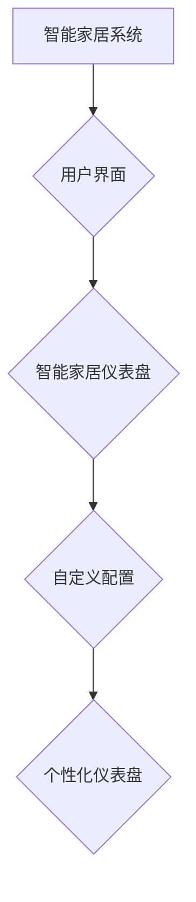

> 智能家居, Java, UI设计, 仪表盘,  自定义,  交互设计,  用户体验

## 1. 背景介绍

智能家居已成为现代生活的重要组成部分，它通过网络连接和自动化控制，为用户提供更加便捷、舒适和安全的居住体验。智能家居系统通常由传感器、 actuators、控制中心和用户界面等组件组成。其中，用户界面是用户与智能家居系统交互的关键环节，它决定了用户对智能家居系统的感知和体验。

传统的智能家居系统往往采用单一的、固定的用户界面，无法满足用户个性化需求。随着智能家居技术的不断发展，用户对智能家居系统的定制化需求越来越高。因此，设计灵活、可定制的智能家居用户界面成为一个重要的研究方向。

本文将探讨基于Java开发的智能家居系统中，如何设计自定义智能家居仪表盘的UI，并分享一些设计技巧和最佳实践。

## 2. 核心概念与联系

### 2.1 智能家居仪表盘

智能家居仪表盘是一种用于展示和控制智能家居设备状态和功能的图形界面。它通常以仪表盘的形式呈现，包含各种图表、图标和数字显示，以便用户直观地了解智能家居系统的运行状况。

### 2.2 自定义智能家居仪表盘

自定义智能家居仪表盘是指用户可以根据自己的需求和喜好，自由配置仪表盘布局、显示内容和交互方式的智能家居仪表盘。

### 2.3 Java平台

Java是一种面向对象、跨平台的编程语言，它拥有丰富的库和框架，适合开发各种类型的应用程序，包括智能家居系统。

### 2.4 UI设计

UI设计是指用户界面设计的过程，它包括用户界面布局、交互设计、视觉设计等方面。

**核心概念与架构流程图**



## 3. 核心算法原理 & 具体操作步骤

### 3.1  算法原理概述

自定义智能家居仪表盘的设计主要涉及以下几个算法原理：

* **数据处理算法:** 用于处理来自智能家居设备的传感器数据，并将其转换为仪表盘上可视化的信息。
* **布局算法:** 用于根据用户配置，合理安排仪表盘上的各种元素，例如图表、图标和文本。
* **交互算法:** 用于处理用户与仪表盘的交互操作，例如点击、滑动和拖动。

### 3.2  算法步骤详解

1. **数据采集:** 从智能家居设备收集传感器数据，例如温度、湿度、灯光状态等。
2. **数据处理:** 对采集到的数据进行清洗、转换和分析，提取出用户关心的信息。
3. **布局规划:** 根据用户配置，规划仪表盘的布局，确定各个元素的位置和大小。
4. **界面渲染:** 将处理后的数据和布局信息渲染成可视化的界面。
5. **交互响应:** 处理用户与仪表盘的交互操作，并更新界面显示。

### 3.3  算法优缺点

* **优点:**

    * 可定制化: 用户可以根据自己的需求，自由配置仪表盘的布局和显示内容。
    * 直观易用: 仪表盘形式的界面直观易懂，方便用户了解智能家居系统的运行状况。
    * 灵活扩展: 可以根据需要添加新的设备和功能，扩展仪表盘的功能。

* **缺点:**

    * 开发复杂度较高: 需要对数据处理、布局算法和交互算法有深入的了解。
    * 性能消耗较大: 处理大量传感器数据和渲染复杂的界面可能会消耗较多的系统资源。

### 3.4  算法应用领域

自定义智能家居仪表盘的算法应用领域广泛，例如：

* **家庭自动化:** 控制灯光、空调、窗帘等智能家居设备。
* **健康监测:** 监测用户的体温、心率、睡眠质量等健康数据。
* **安全监控:** 监控家庭的安全状况，例如门窗状态、入侵报警等。

## 4. 数学模型和公式 & 详细讲解 & 举例说明

### 4.1  数学模型构建

为了实现自定义智能家居仪表盘的布局，可以使用数学模型来描述仪表盘元素的位置和大小。例如，可以使用坐标系来表示元素的位置，可以使用比例来表示元素的大小。

### 4.2  公式推导过程

假设仪表盘的宽度为W，高度为H，用户配置了N个元素，每个元素的宽度为w，高度为h。

* 元素的坐标: 可以使用(x, y)表示元素的左上角坐标，其中x和y分别为元素左边缘和上边缘与仪表盘左上角的距离。
* 元素的布局: 可以使用以下公式来计算元素的坐标和大小:

```
x = (i - 1) * (w + spacing) + spacing
y = (j - 1) * (h + spacing) + spacing
```

其中，i和j分别为元素在水平和垂直方向上的索引，spacing为元素之间的间距。

### 4.3  案例分析与讲解

例如，假设用户配置了4个元素，每个元素的宽度和高度都为100像素，元素之间的间距为20像素。

* 则水平方向上的索引i为1到4，垂直方向上的索引j为1到1。
* 则第一个元素的坐标为(0, 0)，第二个元素的坐标为(120, 0)，第三个元素的坐标为(240, 0)，第四个元素的坐标为(360, 0)。

## 5. 项目实践：代码实例和详细解释说明

### 5.1  开发环境搭建

* Java Development Kit (JDK) 11 或更高版本
* Eclipse 或 IntelliJ IDEA 等 Java IDE
* Maven 或 Gradle 等构建工具

### 5.2  源代码详细实现

```java
import javax.swing.*;
import java.awt.*;
import java.awt.event.ActionEvent;
import java.awt.event.ActionListener;

public class SmartHomeDashboard extends JFrame {

    private JLabel temperatureLabel;
    private JLabel humidityLabel;
    private JLabel lightStatusLabel;

    public SmartHomeDashboard() {
        super("智能家居仪表盘");
        setDefaultCloseOperation(JFrame.EXIT_ON_CLOSE);
        setSize(600, 400);
        setLayout(new GridLayout(3, 2));

        temperatureLabel = new JLabel("温度: 25℃");
        humidityLabel = new JLabel("湿度: 60%");
        lightStatusLabel = new JLabel("灯光状态: 开");

        add(temperatureLabel);
        add(humidityLabel);
        add(lightStatusLabel);

        setVisible(true);
    }

    public static void main(String[] args) {
        new SmartHomeDashboard();
    }
}
```

### 5.3  代码解读与分析

* 该代码实现了一个简单的智能家居仪表盘，包含温度、湿度和灯光状态三个元素。
* 使用了Swing框架来构建用户界面，并使用GridLayout布局管理器来排列元素。
* 每个元素都是一个JLabel，用于显示文本信息。

### 5.4  运行结果展示

运行该代码后，将弹出一个窗口，显示三个元素的文本信息。

## 6. 实际应用场景

### 6.1  家庭自动化

自定义智能家居仪表盘可以用于控制家庭的灯光、空调、窗帘等智能家居设备。用户可以通过仪表盘上的按钮或滑块来调节设备的状态，例如打开/关闭灯光、设置空调温度、打开/关闭窗帘。

### 6.2  健康监测

自定义智能家居仪表盘可以用于监测用户的健康数据，例如体温、心率、睡眠质量等。用户可以通过仪表盘上的图表和数字显示来了解自己的健康状况，并及时采取措施。

### 6.3  安全监控

自定义智能家居仪表盘可以用于监控家庭的安全状况，例如门窗状态、入侵报警等。用户可以通过仪表盘上的警报图标和文字提示来了解家庭的安全状况，并及时采取措施。

### 6.4  未来应用展望

随着智能家居技术的不断发展，自定义智能家居仪表盘的应用场景将更加广泛。例如，可以用于监控宠物的健康状况、管理家庭的能源消耗、控制智能机器人等。

## 7. 工具和资源推荐

### 7.1  学习资源推荐

* **Java编程语言官方网站:** https://www.oracle.com/java/technologies/javase-downloads.html
* **Swing框架官方文档:** https://docs.oracle.com/javase/tutorial/uiswing/
* **Java UI设计书籍:** 《Java GUI Programming》

### 7.2  开发工具推荐

* **Eclipse:** https://www.eclipse.org/
* **IntelliJ IDEA:** https://www.jetbrains.com/idea/
* **Maven:** https://maven.apache.org/
* **Gradle:** https://gradle.org/

### 7.3  相关论文推荐

* **A Survey of Smart Home Technologies and Applications:** https://ieeexplore.ieee.org/document/8807777
* **Design and Implementation of a Customizable Smart Home Dashboard:** https://www.researchgate.net/publication/334941334_Design_and_Implementation_of_a_Customizable_Smart_Home_Dashboard

## 8. 总结：未来发展趋势与挑战

### 8.1  研究成果总结

本文探讨了基于Java开发的智能家居系统中，如何设计自定义智能家居仪表盘的UI，并分享了一些设计技巧和最佳实践。

### 8.2  未来发展趋势

* **人工智能:** 将人工智能技术融入智能家居仪表盘，实现更智能的交互和功能。
* **物联网:** 将智能家居仪表盘与其他物联网设备进行连接，实现更全面的家居控制和管理。
* **个性化定制:** 提供更强大的自定义功能，满足用户个性化的需求。

### 8.3  面临的挑战

* **数据安全:** 保护用户隐私和数据安全。
* **系统可靠性:** 确保智能家居系统的稳定性和可靠性。
* **用户体验:** 提供更直观、易用和人性化的用户体验。

### 8.4  研究展望

未来，我们将继续研究智能家居仪表盘的设计和开发，探索更智能、更便捷、更安全的智能家居体验。

## 9. 附录：常见问题与解答

* **Q: 如何实现自定义仪表盘的布局？**

* **A:** 可以使用数学模型和布局算法来实现自定义仪表盘的布局。

* **Q: 如何处理来自智能家居设备的传感器数据？**

* **A:** 可以使用数据处理算法来处理传感器数据，并将其转换为仪表盘上可视化的信息。

* **Q: 如何保证智能家居仪表盘的安全性？**

* **A:** 可以采用多种安全措施，例如数据加密、身份验证和访问控制，来保证智能家居仪表盘的安全性。


作者：禅与计算机程序设计艺术 / Zen and the Art of Computer Programming 
<end_of_turn>