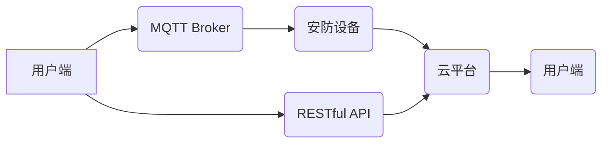

> MQTT, RESTful API, 智能家居, 安防系统, 物联网, 消息队列, 网络安全

## 1. 背景介绍

随着物联网技术的快速发展，智能家居已成为现代生活的重要组成部分。智能家居系统能够通过网络连接各种智能设备，实现对家居环境的自动化控制和远程管理，为用户提供更加便捷、舒适和安全的居住体验。安防系统作为智能家居的核心功能之一，旨在保障家庭安全，防止财产损失和人身伤害。

传统的安防系统通常采用 wired 连接方式，局限于室内范围，且功能单一，难以满足现代智能家居的需求。基于 MQTT 协议和 RESTful API 的智能家居安防系统集成设计，能够有效解决这些问题。

MQTT 协议是一种轻量级、低功耗的消息传输协议，特别适用于物联网场景。它采用发布/订阅模式，能够实现设备之间高效、可靠的消息传递。RESTful API 是一种基于 HTTP 协议的 Web 服务架构，能够实现不同系统之间的数据交换和功能调用。

结合 MQTT 协议和 RESTful API，可以构建一个灵活、可扩展、安全可靠的智能家居安防系统。

## 2. 核心概念与联系

### 2.1 MQTT 协议

MQTT 是一种基于 TCP/IP 的轻量级消息传输协议，旨在为物联网设备提供高效、可靠的消息传递机制。它采用发布/订阅模式，其中：

* **发布者 (Publisher):** 发送消息的设备或应用程序。
* **订阅者 (Subscriber):** 接收特定主题消息的设备或应用程序。
* **消息 Broker:** 管理消息的发布和订阅，并转发消息到相应的订阅者。

MQTT 协议的特点：

* 轻量级：协议本身非常小，占用资源少，适合资源受限的设备。
* 低功耗：消息传输效率高，能够降低设备的功耗。
* 可靠性：消息传递机制保证消息的可靠传输。
* 灵活扩展：支持多种消息格式和主题订阅模式。

### 2.2 RESTful API

RESTful API 是一种基于 HTTP 协议的 Web 服务架构，采用资源定位和状态转移的方式进行数据交换和功能调用。其特点：

* **资源定位:** 使用 URL 来标识资源，例如 `/users` 表示所有用户资源。
* **状态转移:** 使用 HTTP 状态码来表示请求结果，例如 200 表示成功，404 表示资源不存在。
* **操作方法:** 使用 HTTP 动词来表示操作类型，例如 GET 获取资源，POST 创建资源，PUT 更新资源，DELETE 删除资源。

RESTful API 的优势：

* 简单易用：基于标准 HTTP 协议，易于理解和使用。
* 可扩展性强：可以轻松扩展 API 接口，添加新的功能和资源。
* 平台无关：可以跨平台使用，支持多种编程语言和开发环境。

### 2.3 系统架构

基于 MQTT 协议和 RESTful API 的智能家居安防系统架构如下：



**系统架构说明:**

* **用户端:** 用户可以通过手机、平板电脑等设备访问系统，控制安防设备和查看实时状态。
* **MQTT Broker:** 负责管理设备之间的消息发布和订阅，实现设备之间高效、可靠的消息传递。
* **安防设备:** 包括摄像头、门磁、烟雾探测器等，负责收集安全信息并通过 MQTT 协议发送到 Broker。
* **云平台:** 提供数据存储、分析和处理服务，并通过 RESTful API 提供给用户端访问。
* **RESTful API:** 提供给用户端和云平台之间的数据交换和功能调用接口。

## 3. 核心算法原理 & 具体操作步骤

### 3.1  算法原理概述

智能家居安防系统中，核心算法主要涉及以下几个方面：

* **异常检测算法:** 用于识别设备数据中的异常情况，例如门窗突然打开、烟雾浓度突然升高等。常用的算法包括统计方法、机器学习算法等。
* **行为分析算法:** 用于分析用户的行为模式，识别异常行为，例如用户在特定时间段内频繁打开门窗、用户在特定区域内停留时间过长等。
* **路径规划算法:** 用于规划安防巡逻路线，提高巡逻效率和覆盖范围。常用的算法包括 Dijkstra 算法、A* 算法等。

### 3.2  算法步骤详解

以异常检测算法为例，其具体操作步骤如下：

1. **数据采集:** 安防设备收集安全信息，例如温度、湿度、门窗状态、摄像头图像等。
2. **数据预处理:** 对采集到的数据进行清洗、转换和特征提取，例如去除噪声、归一化数据、提取关键特征等。
3. **模型训练:** 使用训练数据训练异常检测模型，例如使用机器学习算法训练分类模型或回归模型。
4. **异常检测:** 将实时采集到的数据输入到训练好的模型中，预测数据是否属于异常情况。
5. **报警处理:** 当模型预测数据为异常情况时，触发报警机制，例如发送短信、邮件或语音通知等。

### 3.3  算法优缺点

**优点:**

* 能够有效识别异常情况，提高安防系统的可靠性。
* 可以根据用户的需求定制化算法，实现个性化的安防服务。

**缺点:**

* 算法训练需要大量的数据，数据质量直接影响算法性能。
* 算法需要不断更新和优化，以适应不断变化的攻击方式和环境变化。

### 3.4  算法应用领域

异常检测算法广泛应用于智能家居安防系统、工业安全监控、金融欺诈检测等领域。

## 4. 数学模型和公式 & 详细讲解 & 举例说明

### 4.1  数学模型构建

在智能家居安防系统中，可以使用数学模型来描述设备状态、用户行为和安全风险等。例如，可以使用状态转移矩阵来描述设备状态的演变过程，可以使用贝叶斯网络来描述用户行为和安全风险之间的关系。

### 4.2  公式推导过程

以状态转移矩阵为例，假设一个安防设备有三种状态：正常、报警、故障。状态转移矩阵可以表示设备状态在不同时间段内的转移概率。

```
状态转移矩阵:
[ P(正常->正常)  P(正常->报警)  P(正常->故障) ]
[ P(报警->正常)  P(报警->报警)  P(报警->故障) ]
[ P(故障->正常)  P(故障->报警)  P(故障->故障) ]
```

其中，P(i->j) 表示设备从状态 i 转移到状态 j 的概率。

### 4.3  案例分析与讲解

假设一个门磁传感器，其状态转移矩阵如下：

```
状态转移矩阵:
[ 0.9  0.05  0.05 ]
[ 0.1  0.8  0.1 ]
[ 0.01  0.05  0.94 ]
```

该矩阵表示：

* 设备处于正常状态时，下一时间段仍处于正常状态的概率为 0.9。
* 设备处于正常状态时，转变成报警状态的概率为 0.05，转变成故障状态的概率为 0.05。
* 设备处于报警状态时，下一时间段仍处于报警状态的概率为 0.8。

通过分析状态转移矩阵，可以预测设备状态的未来变化趋势，并采取相应的措施。

## 5. 项目实践：代码实例和详细解释说明

### 5.1  开发环境搭建

* **操作系统:** Ubuntu 20.04 LTS
* **编程语言:** Python 3.8
* **MQTT Broker:** Mosquitto 1.6
* **RESTful API框架:** Flask 2.0

### 5.2  源代码详细实现

```python
# mqtt_client.py
import paho.mqtt.client as mqtt

# MQTT Broker 地址
MQTT_BROKER = "mqtt.example.com"
# MQTT Broker 端口
MQTT_PORT = 1883
# MQTT 主题
MQTT_TOPIC = "home/security"

def on_connect(client, userdata, flags, rc):
    if rc == 0:
        print("Connected to MQTT Broker!")
        client.subscribe(MQTT_TOPIC)
    else:
        print("Connection failed!")

def on_message(client, userdata, msg):
    print(f"Received message: {msg.payload.decode()}")

client = mqtt.Client()
client.on_connect = on_connect
client.on_message = on_message
client.connect(MQTT_BROKER, MQTT_PORT)
client.loop_forever()

# rest_api.py
from flask import Flask, request, jsonify

app = Flask(__name__)

@app.route('/security', methods=['GET'])
def get_security_status():
    # 从 MQTT Broker 获取安防设备状态
    # ...
    security_status = "safe"  # 示例状态
    return jsonify({"status": security_status})

if __name__ == '__main__':
    app.run(debug=True)
```

### 5.3  代码解读与分析

* **mqtt_client.py:** 该文件实现了一个 MQTT 客户端，连接到 MQTT Broker，订阅主题 `home/security`，并处理接收到的消息。
* **rest_api.py:** 该文件实现了一个 RESTful API，提供 `/security` 接口，用于获取安防设备状态。该接口从 MQTT Broker 获取设备状态，并返回 JSON 格式的响应。

### 5.4  运行结果展示

运行上述代码，可以实现以下功能：

* MQTT 客户端连接到 MQTT Broker，订阅主题 `home/security`。
* RESTful API 服务器启动，提供 `/security` 接口。
* 当安防设备发送消息到主题 `home/security` 时，MQTT 客户端会接收消息并打印到控制台。
* 用户可以通过访问 `/security` 接口获取安防设备状态。

## 6. 实际应用场景

### 6.1  智能家居安防系统

基于 MQTT 协议和 RESTful API 的智能家居安防系统可以实现以下功能：

* **远程监控:** 用户可以通过手机或平板电脑远程监控家中安防设备状态，例如查看摄像头画面、门窗状态等。
* **报警通知:** 当安防设备检测到异常情况时，系统会及时发送短信、邮件或语音通知给用户。
* **智能控制:** 用户可以通过手机或平板电脑远程控制安防设备，例如开启/关闭灯光、门锁等。

### 6.2  企业安防系统

该系统也可以应用于企业安防系统，例如：

* **人员出入管理:** 通过门禁系统和摄像头监控人员出入情况，记录人员进出时间和地点。
* **资产安全管理:** 通过传感器监控重要资产的位置和状态，防止资产丢失或被盗。
* **视频监控:** 通过摄像头监控企业内部环境，及时发现异常情况。

### 6.3  智慧城市安防

该系统还可以应用于智慧城市安防，例如：

* **公共安全监控:** 通过摄像头监控公共场所，预防和应对犯罪事件。
* **交通安全管理:** 通过传感器监控交通流量和道路状况，提高交通安全。
* **环境监测:** 通过传感器监控环境空气质量、水质等，保障环境安全。

### 6.4  未来应用展望

随着物联网技术的不断发展，基于 MQTT 协议和 RESTful API 的智能家居安防系统将拥有更广泛的应用场景，例如：

* **人脸识别:** 利用人脸识别技术，实现更精准的人员识别和管理。
* **语音控制:** 支持语音控制安防设备，提高用户体验。
* **人工智能:** 利用人工智能技术，实现更智能的安防决策和预警。

## 7. 工具和资源推荐

### 7.1  学习资源推荐

* **MQTT 协议:** https://mqtt.org/
