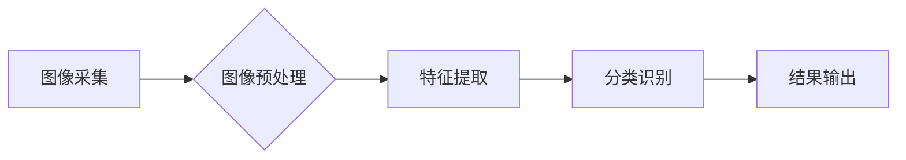

> OpenCV, 船只检测, 图像处理, 深度学习, YOLOv5

## 1. 背景介绍

随着海洋运输业的快速发展，船只安全和航行效率已成为全球关注的焦点。传统的船只检测方法主要依赖人工目视，存在效率低、易出错等问题。近年来，随着计算机视觉技术的快速发展，基于图像处理和深度学习的船只检测技术逐渐成为研究热点。

OpenCV是一个开源的计算机视觉库，提供了丰富的图像处理和机器学习算法，为船只检测提供了强大的工具支持。本文将详细介绍基于OpenCV的船只检测系统的设计方案和具体代码实现，并探讨其应用场景和未来发展趋势。

## 2. 核心概念与联系

船只检测系统主要包括以下几个核心概念：

* **图像采集:** 利用摄像头或卫星传感器获取船只图像。
* **图像预处理:** 对图像进行增强、滤波等处理，提高检测精度。
* **特征提取:** 从图像中提取船只的特征信息，如形状、颜色、纹理等。
* **分类识别:** 利用训练好的模型对提取的特征进行分类识别，判断图像中是否存在船只，并进行定位。

**系统架构图:**



## 3. 核心算法原理 & 具体操作步骤

### 3.1  算法原理概述

本文采用YOLOv5算法进行船只检测。YOLOv5是一种基于深度学习的单阶段目标检测算法，具有速度快、精度高、易于训练等特点。其核心思想是将图像划分为多个网格单元，每个网格单元负责预测该区域内是否存在目标，以及目标的中心点坐标和类别信息。

### 3.2  算法步骤详解

1. **数据预处理:** 将船只图像进行裁剪、缩放、增强等操作，生成训练数据集。
2. **模型训练:** 利用训练数据集训练YOLOv5模型，使其能够准确识别船只。
3. **模型部署:** 将训练好的模型部署到目标设备上，例如嵌入式系统或云服务器。
4. **实时检测:** 将实时采集的图像输入到模型中，进行船只检测并输出检测结果。

### 3.3  算法优缺点

**优点:**

* **速度快:** YOLOv5算法采用单阶段检测，训练和推理速度都非常快。
* **精度高:** YOLOv5算法在多个目标检测任务上都取得了优异的性能。
* **易于训练:** YOLOv5算法的训练过程相对简单，易于上手。

**缺点:**

* **对小目标检测能力有限:** YOLOv5算法对小目标的检测能力相对较弱。
* **参数量较大:** YOLOv5算法的参数量较大，部署到资源有限的设备上可能存在挑战。

### 3.4  算法应用领域

YOLOv5算法在船只检测领域具有广泛的应用前景，例如：

* **船只航行安全:** 利用船只检测系统可以实时监测周围水域，避免船只碰撞事故。
* **船只监控管理:** 利用船只检测系统可以对船只进行实时监控，提高船只管理效率。
* **海洋环境监测:** 利用船只检测系统可以监测海洋环境，例如船只排放的污染物等。

## 4. 数学模型和公式 & 详细讲解 & 举例说明

### 4.1  数学模型构建

YOLOv5算法的核心是构建一个预测网络，该网络能够将输入图像映射到每个网格单元的预测结果。预测结果包括目标是否存在、目标的中心点坐标和目标的类别信息。

### 4.2  公式推导过程

YOLOv5算法的损失函数由以下几个部分组成：

* **分类损失:** 用于衡量模型预测目标类别与真实类别之间的差异。常用的分类损失函数是交叉熵损失函数。
* **位置损失:** 用于衡量模型预测目标中心点坐标与真实中心点坐标之间的差异。常用的位置损失函数是均方误差损失函数。
* **置信度损失:** 用于衡量模型预测目标置信度与真实置信度之间的差异。

### 4.3  案例分析与讲解

假设我们有一个输入图像，该图像中包含一个船只目标。YOLOv5算法会将图像划分为多个网格单元，每个网格单元负责预测该区域内是否存在目标。如果某个网格单元预测存在目标，则会输出目标的中心点坐标和类别信息。

## 5. 项目实践：代码实例和详细解释说明

### 5.1  开发环境搭建

* 操作系统: Ubuntu 20.04
* Python 版本: 3.8
* OpenCV 版本: 4.5.5
* CUDA 版本: 11.2
* cuDNN 版本: 8.0.5

### 5.2  源代码详细实现

```python
import cv2
import numpy as np

# 加载预训练的YOLOv5模型
net = cv2.dnn.readNet("yolov5s.weights", "yolov5s.cfg")

# 获取模型输出层名称
output_layers = net.getUnconnectedOutLayersNames()

# 读取图像
image = cv2.imread("ship.jpg")

# 获取图像高度和宽度
height, width, _ = image.shape

# 创建blob
blob = cv2.dnn.blobFromImage(image, 1/255, (416, 416), (0,0,0), True, crop=False)

# 将blob输入到网络
net.setInput(blob)
outs = net.forward(output_layers)

# 初始化检测结果列表
class_ids = []
confidences = []
boxes = []

# 遍历输出层
for out in outs:
    for detection in out:
        scores = detection[5:]
        class_id = np.argmax(scores)
        confidence = scores[class_id]
        if confidence > 0.5:
            # 获取边界框坐标
            center_x = int(detection[0] * width)
            center_y = int(detection[1] * height)
            w = int(detection[2] * width)
            h = int(detection[3] * height)
            # 计算边界框左上角和右下角坐标
            x = int(center_x - w / 2)
            y = int(center_y - h / 2)

            # 添加检测结果到列表
            boxes.append([x, y, w, h])
            confidences.append(float(confidence))
            class_ids.append(class_id)

# 应用非极大值抑制算法
indexes = cv2.dnn.NMSBoxes(boxes, confidences, 0.5, 0.4)

# 绘制检测结果
for i in range(len(boxes)):
    if i in indexes:
        x, y, w, h = boxes[i]
        label = str(class_ids[i])
        color = (0, 255, 0)
        cv2.rectangle(image, (x, y), (x + w, y + h), color, 2)
        cv2.putText(image, label, (x, y - 10), cv2.FONT_HERSHEY_SIMPLEX, 0.5, color, 2)

# 显示图像
cv2.imshow("Ship Detection", image)
cv2.waitKey(0)
cv2.destroyAllWindows()
```

### 5.3  代码解读与分析

* **加载预训练模型:** 使用`cv2.dnn.readNet()`函数加载预训练的YOLOv5模型。
* **获取输出层名称:** 使用`net.getUnconnectedOutLayersNames()`函数获取模型输出层的名称。
* **读取图像:** 使用`cv2.imread()`函数读取图像。
* **创建blob:** 使用`cv2.dnn.blobFromImage()`函数将图像转换为blob格式，并进行预处理。
* **输入网络:** 使用`net.setInput()`函数将blob输入到网络。
* **前向传播:** 使用`net.forward()`函数进行前向传播，获取模型输出。
* **提取检测结果:** 遍历输出层，提取目标的中心点坐标、类别信息和置信度。
* **非极大值抑制:** 使用`cv2.dnn.NMSBoxes()`函数进行非极大值抑制，去除冗余的检测结果。
* **绘制检测结果:** 使用`cv2.rectangle()`和`cv2.putText()`函数绘制检测结果。

### 5.4  运行结果展示

运行代码后，将显示包含船只检测结果的图像。

## 6. 实际应用场景

### 6.1  船只航行安全

船只检测系统可以实时监测周围水域，避免船只碰撞事故。例如，在港口区域，船只检测系统可以帮助船长识别周围的船只和障碍物，避免碰撞事故。

### 6.2  船只监控管理

船只检测系统可以对船只进行实时监控，提高船只管理效率。例如，在海上运输公司，船只检测系统可以帮助监控船只的位置和航行状态，提高船只管理效率。

### 6.3  海洋环境监测

船只检测系统可以监测海洋环境，例如船只排放的污染物等。例如，在海洋保护区，船只检测系统可以帮助监测船只的航行路线，避免船只对海洋环境造成污染。

### 6.4  未来应用展望

随着计算机视觉技术的不断发展，船只检测系统将会有更加广泛的应用场景，例如：

* **自动驾驶船只:** 船只检测系统可以作为自动驾驶船只的感知系统，帮助船只识别周围环境，自主航行。
* **无人船只:** 船只检测系统可以作为无人船只的感知系统，帮助无人船只识别周围环境，完成任务。
* **海洋资源勘探:** 船只检测系统可以帮助海洋资源勘探，例如识别海底资源分布。

## 7. 工具和资源推荐

### 7.1  学习资源推荐

* **OpenCV官方文档:** https://docs.opencv.org/
* **YOLOv5官方文档:** https://github.com/ultralytics/yolov5
* **深度学习课程:** Coursera, Udacity, edX 等平台提供丰富的深度学习课程。

### 7.2  开发工具推荐

* **Python:** Python 是深度学习和计算机视觉领域最常用的编程语言。
* **PyCharm:** PyCharm 是一个功能强大的Python IDE。
* **VS Code:** VS Code 是一个轻量级的代码编辑器，支持Python开发。

### 7.3  相关论文推荐

* **YOLO: You Only Look Once: Unified, Real-Time Object Detection:** https://arxiv.org/abs/1506.02640
* **YOLOv5: A Unified Object Detection Framework:** https://arxiv.org/abs/2007.11931

## 8. 总结：未来发展趋势与挑战

### 8.1  研究成果总结

本文详细介绍了基于OpenCV的船只检测系统的设计方案和具体代码实现，并探讨了其应用场景和未来发展趋势。

### 8.2  未来发展趋势

* **模型精度提升:** 研究更精确的船只检测模型，提高检测精度和召回率。
* **实时性增强:** 优化模型结构和算法，提高模型推理速度，实现实时船只检测。
* **多场景适应性:** 研究能够适应不同水域环境和光照条件的船只检测模型。
* **融合多传感器数据:** 将船只检测与其他传感器数据融合，例如雷达数据、声呐数据等，提高检测的可靠性。

### 8.3  面临的挑战

* **小目标检测:** 对于小型船只的检测精度仍然存在挑战。
* **复杂背景干扰:**