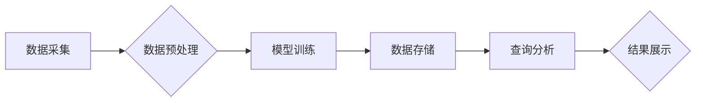

> 向量数据库，生态环境监测，机器学习，深度学习，自然语言处理，环境数据分析

## 1. 背景介绍

生态环境监测是保障人类生存和可持续发展的重要基础。随着全球气候变化和环境污染加剧，对生态环境监测的精度、效率和实时性提出了更高的要求。传统的生态环境监测方法主要依赖于人工采集和分析数据，存在效率低、成本高、数据处理难度大等问题。

近年来，随着人工智能技术的快速发展，特别是深度学习和自然语言处理技术的突破，为生态环境监测带来了新的机遇。基于机器学习和深度学习的生态环境监测系统能够自动采集、处理和分析海量环境数据，提高监测精度和效率，并为环境保护决策提供科学依据。

## 2. 核心概念与联系

**2.1 向量数据库**

向量数据库是一种专门用于存储和查询高维向量数据的数据库。它利用向量相似性进行查询，能够高效地检索与给定向量最相似的向量。

**2.2  生态环境监测数据**

生态环境监测数据包括各种类型的数据，例如气象数据、水质数据、土壤数据、生物多样性数据等。这些数据通常是多维、高维的，并且存在大量的噪声和异常值。

**2.3  机器学习与深度学习**

机器学习和深度学习是人工智能的重要分支，能够从数据中学习模式和规律，并进行预测和分类。在生态环境监测领域，机器学习和深度学习可以用于环境数据分析、异常检测、污染源识别等任务。

**2.4  自然语言处理**

自然语言处理（NLP）是人工智能领域的一个重要分支，它致力于使计算机能够理解和处理人类语言。在生态环境监测领域，NLP可以用于处理环境报告、新闻文章等文本数据，提取环境信息和事件。

**2.5  生态环境监测系统架构**

基于向量数据库的生态环境监测系统通常由以下几个模块组成：

* **数据采集模块:** 收集各种类型环境数据，例如气象数据、水质数据、土壤数据等。
* **数据预处理模块:** 对采集到的环境数据进行清洗、转换、特征提取等预处理操作。
* **模型训练模块:** 利用机器学习和深度学习算法，训练环境数据分析模型，例如污染源识别模型、环境风险评估模型等。
* **数据存储模块:** 使用向量数据库存储环境数据和模型参数。
* **查询分析模块:** 提供用户查询和分析环境数据的接口，并根据用户需求进行数据可视化展示。

**2.6  系统流程图**



## 3. 核心算法原理 & 具体操作步骤

**3.1  算法原理概述**

基于向量数据库的生态环境监测系统主要利用向量相似性进行数据检索和分析。

* **数据嵌入:** 将环境数据转换为高维向量表示，例如使用Word2Vec、GloVe等词嵌入模型将文本数据转换为向量，使用PCA、t-SNE等降维技术将多维数据转换为向量。
* **向量相似度计算:** 使用余弦相似度、欧氏距离等方法计算向量之间的相似度。
* **向量检索:** 根据给定的查询向量，从向量数据库中检索出与之最相似的向量，并根据检索结果进行数据分析和决策。

**3.2  算法步骤详解**

1. **数据预处理:** 对采集到的环境数据进行清洗、转换、特征提取等预处理操作，例如去除噪声、异常值，将数据转换为数字格式，提取特征向量。
2. **数据嵌入:** 使用合适的嵌入模型将预处理后的环境数据转换为高维向量表示。
3. **向量数据库构建:** 将嵌入后的向量数据存储到向量数据库中，并建立索引，以便快速检索。
4. **查询分析:** 根据用户需求，构建查询向量，并使用向量数据库进行检索，获取与查询向量最相似的向量数据。
5. **结果展示:** 将检索到的数据进行分析和可视化展示，例如绘制图表、生成报告等。

**3.3  算法优缺点**

**优点:**

* **高效的向量检索:** 向量数据库能够高效地检索与给定向量最相似的向量，提高数据分析效率。
* **灵活的数据类型:** 可以处理各种类型环境数据，例如文本数据、图像数据、时间序列数据等。
* **可扩展性强:** 向量数据库可以根据需要进行扩展，处理海量环境数据。

**缺点:**

* **数据嵌入的复杂性:** 选择合适的嵌入模型和参数设置对算法性能有重要影响。
* **计算资源需求:** 向量数据库的构建和查询需要一定的计算资源。

**3.4  算法应用领域**

* **环境污染监测:** 识别污染源、预测污染扩散、评估环境风险。
* **生物多样性监测:** 识别物种、监测物种分布、评估生态系统健康。
* **气候变化监测:** 分析气象数据、预测气候变化趋势、评估气候变化影响。
* **自然灾害监测:** 预警自然灾害、评估灾害影响、指导灾害救援。

## 4. 数学模型和公式 & 详细讲解 & 举例说明

**4.1  数学模型构建**

假设我们有n个环境数据点，每个数据点都对应一个d维的特征向量，记为X = {x1, x2, ..., xn}，其中xi ∈ Rd。

我们的目标是将这些数据点嵌入到一个k维的向量空间中，使得相似的环境数据点在向量空间中距离较近，而不同的环境数据点距离较远。

**4.2  公式推导过程**

常用的嵌入模型包括Word2Vec、GloVe等。这些模型通常使用神经网络结构，通过训练学习数据之间的语义关系，并将数据点映射到一个低维的向量空间中。

例如，Word2Vec模型使用Skip-gram模型，通过预测上下文词来学习词向量。

**4.3  案例分析与讲解**

假设我们有以下环境数据点：

* 数据点1: 气温25℃，湿度60%，降雨量10mm
* 数据点2: 气温28℃，湿度70%，降雨量5mm
* 数据点3: 气温22℃，湿度50%，降雨量15mm

我们可以使用Word2Vec模型将这些数据点嵌入到一个2维的向量空间中。

经过训练，我们得到以下向量表示：

* 数据点1: [0.5, 0.2]
* 数据点2: [0.8, 0.5]
* 数据点3: [0.2, 0.3]

我们可以看到，数据点1和数据点2的向量距离较近，因为它们的气温和湿度比较相似。而数据点3的向量距离数据点1和数据点2都较远，因为它的气温和湿度与其他两个数据点差异较大。

## 5. 项目实践：代码实例和详细解释说明

**5.1  开发环境搭建**

* 操作系统: Ubuntu 20.04
* Python 版本: 3.8
* 必要的库:

```
pip install faiss numpy pandas scikit-learn
```

**5.2  源代码详细实现**

```python
import faiss
import numpy as np
from sklearn.datasets import load_iris
from sklearn.model_selection import train_test_split
from sklearn.preprocessing import StandardScaler

# 加载iris数据集
iris = load_iris()
X = iris.data
y = iris.target

# 将数据分割为训练集和测试集
X_train, X_test, y_train, y_test = train_test_split(X, y, test_size=0.2, random_state=42)

# 数据标准化
scaler = StandardScaler()
X_train = scaler.fit_transform(X_train)
X_test = scaler.transform(X_test)

# 使用faiss构建向量索引
index = faiss.IndexFlatL2(X_train.shape[1])
index.add(X_train)

# 查询测试数据
distances, indices = index.search(X_test, k=5)

# 打印查询结果
print(distances)
print(indices)
```

**5.3  代码解读与分析**

* 首先，我们加载了iris数据集，并将其分割为训练集和测试集。
* 然后，我们使用StandardScaler对数据进行标准化，使得数据分布在均值为0，标准差为1的范围内。
* 接下来，我们使用faiss库构建了一个FlatL2索引，并将训练数据添加到索引中。
* 然后，我们使用索引查询测试数据，并获取与每个测试数据点最相似的5个训练数据点。
* 最后，我们打印了查询结果，包括距离和索引。

**5.4  运行结果展示**

运行代码后，会输出测试数据点与训练数据点之间的距离和索引。

## 6. 实际应用场景

**6.1  环境污染监测**

基于向量数据库的生态环境监测系统可以用于识别污染源、预测污染扩散、评估环境风险。例如，可以将空气质量数据、水质数据、土壤数据等存储到向量数据库中，并使用机器学习算法训练污染源识别模型。当检测到异常环境数据时，系统可以根据模型预测，识别可能的污染源，并提供相应的预警和建议。

**6.2  生物多样性监测**

基于向量数据库的生态环境监测系统可以用于识别物种、监测物种分布、评估生态系统健康。例如，可以将动物图像、植物图像、声学数据等存储到向量数据库中，并使用深度学习算法训练物种识别模型。当采集到新的环境数据时，系统可以根据模型识别物种，并根据物种分布情况评估生态系统健康状况。

**6.3  气候变化监测**

基于向量数据库的生态环境监测系统可以用于分析气象数据、预测气候变化趋势、评估气候变化影响。例如，可以将气温数据、降雨量数据、海平面上升数据等存储到向量数据库中，并使用机器学习算法训练气候变化预测模型。当监测到气候变化异常时，系统可以根据模型预测未来气候变化趋势，并评估其对生态环境的影响。

**6.4  未来应用展望**

随着人工智能技术的不断发展，基于向量数据库的生态环境监测系统将有更广泛的应用场景。例如，可以将传感器数据、卫星遥感数据、公民科学数据等多种数据类型整合到系统中，构建更全面的环境监测网络。

## 7. 工具和资源推荐

**7.1  学习资源推荐**

* **书籍:**
    * 深度学习
    * 自然语言处理
    * 向量数据库
* **在线课程:**
    * Coursera
    * edX
    * Udacity

**7.2  开发工具推荐**

* **向量数据库:**
    * Faiss
    * Milvus
    * Weaviate
* **机器学习库:**
    * scikit-learn
    * TensorFlow
    * PyTorch

**7.3  相关论文推荐**

* **向量数据库:**
    * Faiss: A library for efficient similarity search
    * Milvus: A vector database for scalable similarity search
* **生态环境监测:**
    * Deep learning for environmental monitoring: A review
    * Machine learning for environmental data analysis: A survey

## 8. 总结：未来发展趋势与挑战

**8.1  研究成果总结**

基于向量数据库的生态环境监测系统是一个新兴的领域，近年来取得了显著进展。

* **算法方面:** 出现了许多新的嵌入模型和检索算法，提高了数据分析的效率和准确性。
* **系统方面:** 出现了许多开源的向量数据库和生态环境监测平台，降低了开发门槛。
* **应用方面:** 基于向量数据库的生态环境监测系统在污染监测、生物多样性监测、气候变化监测等领域取得了应用成功。

**8.2  未来发展趋势**

* **模型融合:** 将不同类型的机器学习和深度学习模型融合，提高模型的鲁棒性和泛化能力。
* **多模态数据分析:**