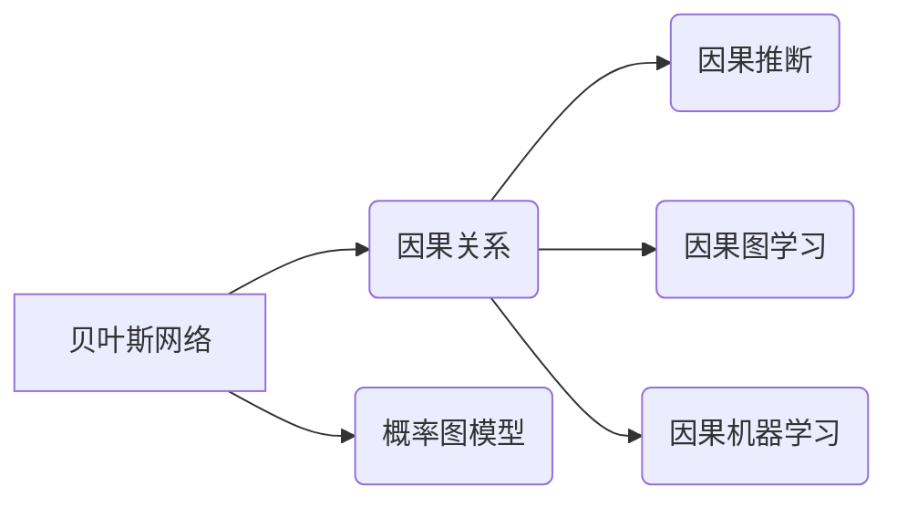

> 贝叶斯网络, 因果关系, 概率图模型, 算法包, causal inference, probabilistic graphical models

## 1. 背景介绍

在数据驱动时代，从数据中挖掘因果关系已成为人工智能领域的重要研究方向。传统的统计方法难以有效地处理复杂系统中的因果关系，而贝叶斯网络作为一种概率图模型，为因果关系研究提供了新的思路和方法。

贝叶斯网络是一种图结构化的概率模型，它用节点和边来表示随机变量之间的依赖关系。每个节点代表一个随机变量，边表示变量之间的因果关系或依赖关系。贝叶斯网络可以有效地表示复杂系统的概率分布，并进行概率推理，从而帮助我们理解因果关系。

近年来，基于贝叶斯网络的因果关系研究取得了显著进展，例如：

* **因果推断:** 利用贝叶斯网络进行因果推断，例如识别治疗效果、评估政策影响等。
* **因果图学习:** 从观测数据中学习因果关系图，例如识别疾病的病因、预测社会事件的影响因素等。
* **因果机器学习:** 将因果关系融入机器学习算法，例如训练更鲁棒的预测模型、避免因果混淆等。

## 2. 核心概念与联系

### 2.1 贝叶斯网络

贝叶斯网络是一种概率图模型，它用节点和边来表示随机变量之间的依赖关系。每个节点代表一个随机变量，边表示变量之间的因果关系或依赖关系。贝叶斯网络的结构可以表示为一个有向无环图（DAG），其中每个节点都有一个概率分布，表示该变量在给定其他变量条件下的概率。

### 2.2 因果关系

因果关系是指一个事件或因素导致另一个事件或因素发生。因果关系是理解世界运行机制的关键，也是人工智能领域的重要研究方向。

### 2.3 概率图模型

概率图模型是一种用于表示和推理概率分布的图形模型。概率图模型包括贝叶斯网络、马尔可夫随机场等。

**核心概念与联系流程图**



## 3. 核心算法原理 & 具体操作步骤

### 3.1 算法原理概述

基于贝叶斯网络的因果关系研究主要包括以下几个步骤：

1. **因果图学习:** 从观测数据中学习因果关系图。
2. **因果推断:** 利用贝叶斯网络进行因果推断，例如识别治疗效果、评估政策影响等。
3. **因果机器学习:** 将因果关系融入机器学习算法，例如训练更鲁棒的预测模型、避免因果混淆等。

### 3.2 算法步骤详解

**3.2.1 因果图学习**

因果图学习的目标是根据观测数据学习出因果关系图。常用的算法包括：

* **PC算法:** 基于条件独立性检验的算法，可以学习出精确的因果关系图。
* **GES算法:** 基于贪婪搜索的算法，可以学习出近似因果关系图。

**3.2.2 因果推断**

因果推断的目标是根据因果关系图和观测数据，推断出因果关系的影响。常用的方法包括：

* **后向因果推断:** 从目标变量出发，反向推断出影响该变量的因果因素。
* **前向因果推断:** 从因果因素出发，前向推断出影响目标变量的因果关系。

**3.2.3 因果机器学习**

因果机器学习的目标是将因果关系融入机器学习算法，提高模型的鲁棒性和解释性。常用的方法包括：

* **因果加权:** 根据因果关系对训练数据进行加权，提高模型对因果关系的敏感性。
* **因果约束:** 在机器学习模型中加入因果约束，例如禁止模型学习到反因果关系。

### 3.3 算法优缺点

**优点:**

* 可以有效地表示复杂系统的因果关系。
* 可以进行概率推理，推断出因果关系的影响。
* 可以将因果关系融入机器学习算法，提高模型的鲁棒性和解释性。

**缺点:**

* 需要大量的观测数据才能学习出准确的因果关系图。
* 因果关系的学习和推断是一个复杂的问题，需要复杂的算法和模型。
* 难以处理高维数据和复杂系统。

### 3.4 算法应用领域

基于贝叶斯网络的因果关系研究在以下领域有广泛的应用：

* **医疗保健:** 识别疾病的病因、评估治疗效果、预测患者的风险。
* **社会科学:** 预测社会事件的影响因素、评估政策效果、理解社会现象的成因。
* **商业:** 预测客户行为、优化营销策略、识别潜在风险。

## 4. 数学模型和公式 & 详细讲解 & 举例说明

### 4.1 数学模型构建

贝叶斯网络可以用一个概率图模型来表示，其中每个节点代表一个随机变量，边表示变量之间的依赖关系。

假设我们有一个贝叶斯网络，包含三个随机变量：X、Y、Z。X是原因变量，Y和Z是结果变量。

我们可以用以下公式来表示贝叶斯网络的概率分布：

```latex
P(X, Y, Z) = P(X) * P(Y|X) * P(Z|X)
```

其中：

* P(X) 是原因变量X的概率分布。
* P(Y|X) 是结果变量Y在给定原因变量X条件下的概率分布。
* P(Z|X) 是结果变量Z在给定原因变量X条件下的概率分布。

### 4.2 公式推导过程

我们可以根据贝叶斯定理推导出以下公式：

```latex
P(X|Y, Z) = \frac{P(Y, Z|X) * P(X)}{P(Y, Z)}
```

其中：

* P(X|Y, Z) 是原因变量X在给定结果变量Y和Z条件下的后验概率。
* P(Y, Z|X) 是结果变量Y和Z在给定原因变量X条件下的联合概率。
* P(X) 是原因变量X的先验概率。
* P(Y, Z) 是结果变量Y和Z的边缘概率。

### 4.3 案例分析与讲解

**案例:** 假设我们有一个贝叶斯网络，包含三个随机变量：

* X: 是否下雨
* Y: 是否需要带伞
* Z: 是否会湿身

我们可以用以下概率分布来表示贝叶斯网络：

* P(X) = 0.6 (下雨的概率)
* P(Y|X) = 1 (如果下雨，则需要带伞)
* P(Z|X) = 0.8 (如果下雨，则会湿身)

我们可以使用贝叶斯定理来计算出，如果需要带伞，那么下雨的概率是多少：

```latex
P(X|Y) = \frac{P(Y|X) * P(X)}{P(Y)}
```

其中：

* P(Y) = P(Y|X) * P(X) + P(Y|¬X) * P(¬X) (需要带伞的概率)

我们可以根据上述公式计算出 P(X|Y) 的值。

## 5. 项目实践：代码实例和详细解释说明

### 5.1 开发环境搭建

* Python 3.7+
* 必要的库：
    * `networkx`: 用于构建和操作图结构
    * `scipy`: 用于数值计算和统计分析
    * `matplotlib`: 用于可视化

### 5.2 源代码详细实现

```python
import networkx as nx
import numpy as np
from scipy.stats import norm

# 定义贝叶斯网络的结构
nodes = ['X', 'Y', 'Z']
edges = [('X', 'Y'), ('X', 'Z')]
graph = nx.DiGraph()
graph.add_nodes_from(nodes)
graph.add_edges_from(edges)

# 定义节点的概率分布
P_X = 0.6  # X 的概率分布
P_Y_given_X = 1  # Y 在给定 X 条件下的概率分布
P_Z_given_X = 0.8  # Z 在给定 X 条件下的概率分布

# 计算节点的联合概率分布
P_X_Y_Z = P_X * P_Y_given_X * P_Z_given_X

# 计算后验概率
P_X_given_Y_Z = (P_Y_given_X * P_Z_given_X * P_X) / P_X_Y_Z

# 打印结果
print(f"节点 X 的后验概率为: {P_X_given_Y_Z}")

# 可视化贝叶斯网络
nx.draw(graph, with_labels=True)
plt.show()
```

### 5.3 代码解读与分析

* 代码首先定义了贝叶斯网络的结构，包括节点和边。
* 然后定义了每个节点的概率分布。
* 接着计算了节点的联合概率分布和后验概率。
* 最后使用 `networkx` 库可视化了贝叶斯网络。

### 5.4 运行结果展示

运行代码后，会输出节点 X 的后验概率，并显示一个可视化的贝叶斯网络图。

## 6. 实际应用场景

### 6.1 医疗保健

* **疾病诊断:** 基于患者症状和病史的贝叶斯网络可以帮助医生诊断疾病。
* **治疗效果评估:** 可以使用贝叶斯网络评估不同治疗方案的效果，并推荐最优方案。
* **风险预测:** 可以根据患者的基因信息和生活方式预测患病风险。

### 6.2 社会科学

* **政策评估:** 可以使用贝叶斯网络评估不同政策的影响，并制定更有效的政策。
* **社会现象分析:** 可以使用贝叶斯网络分析社会现象的成因，例如犯罪率、贫困率等。
* **预测分析:** 可以预测社会事件的发生概率，例如选举结果、经济危机等。

### 6.3 商业

* **客户行为预测:** 可以根据客户的购买历史和行为模式预测他们的未来购买行为。
* **营销策略优化:** 可以使用贝叶斯网络优化营销策略，提高广告效果和客户转化率。
* **风险管理:** 可以识别潜在的商业风险，并制定相应的风险控制措施。

### 6.4 未来应用展望

随着人工智能技术的不断发展，基于贝叶斯网络的因果关系研究将有更广泛的应用前景。例如：

* **个性化医疗:** 基于患者的个体特征，提供个性化的医疗方案。
* **智能决策支持:** 为决策者提供基于因果关系的决策支持。
* **自动驾驶:** 基于因果关系，提高自动驾驶系统的安全性。

## 7. 工具和资源推荐

### 7.1 学习资源推荐

* **书籍:**
    * "Probabilistic Graphical Models: Principles and Techniques" by Daphne Koller and Nir Friedman
    * "Causal Inference: The Mixtape" by Scott Cunningham
* **在线课程:**
    * Coursera: "Probabilistic Graphical Models" by Daphne Koller
    * edX: "Causal Inference" by Judea Pearl

### 7.2 开发工具推荐

* **Python:** 广泛使用的编程语言，用于贝叶斯网络的建模和分析。
* **R:** 统计分析软件，也支持贝叶斯网络的建模和分析。
* **GeNIe:** 用于构建和分析贝叶斯网络的专业软件。

### 7.3 相关论文推荐

* "Causal Inference: What If" by Judea Pearl
* "A General Theory of Causal Inference" by Judea Pearl
* "Causal Discovery with Bayesian Networks" by Peter Spirtes, Clark Glymour, and Richard Scheines

## 8. 总结：未来发展趋势与挑战

### 8.1 研究成果总结

基于贝叶斯网络的