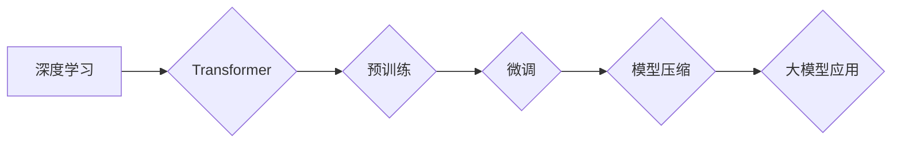

> 大模型、应用开发、深度学习、Transformer、自然语言处理、计算机视觉

## 1. 背景介绍

近年来，深度学习技术取得了飞速发展，特别是大模型的出现，为人工智能领域带来了革命性的变革。大模型是指参数规模庞大、训练数据海量的人工智能模型，其强大的学习能力和泛化能力使其能够在各种任务中表现出卓越的性能。从自然语言处理（NLP）到计算机视觉（CV），大模型已经广泛应用于各个领域，并取得了令人瞩目的成果。

然而，大模型的应用开发并非易事。开发人员需要具备扎实的深度学习知识、丰富的工程经验以及对大模型特性的深刻理解。本指南旨在为开发者提供一个全面的指导，帮助他们理解大模型的原理、掌握应用开发的技巧，并成功构建出具有实用价值的应用。

## 2. 核心概念与联系

大模型的应用开发涉及到多个核心概念和技术，包括：

* **深度学习:** 大模型是基于深度学习技术的，其核心是多层神经网络的结构和训练方法。
* **Transformer:** Transformer是一种新型的深度学习架构，其自注意力机制赋予了模型强大的文本理解和生成能力，成为大模型的基石。
* **预训练:** 预训练是指在大量数据上训练模型，使其学习到通用的语言表示或视觉特征，为下游任务提供强大的基础。
* **微调:** 微调是指在特定任务数据上对预训练模型进行进一步训练，使其能够适应特定应用场景。
* **模型压缩:** 模型压缩是指通过各种技术手段减小模型规模，降低计算成本和部署难度。

**Mermaid 流程图:**



## 3. 核心算法原理 & 具体操作步骤

### 3.1  算法原理概述

大模型的训练主要基于反向传播算法，其核心思想是通过不断调整模型参数，使模型的预测结果与真实值之间的误差最小化。

### 3.2  算法步骤详解

1. **数据预处理:** 将原始数据进行清洗、格式化和编码，使其能够被模型理解。
2. **模型构建:** 根据任务需求选择合适的模型架构，并初始化模型参数。
3. **模型训练:** 使用训练数据对模型进行训练，通过反向传播算法不断调整模型参数，降低模型误差。
4. **模型评估:** 使用验证数据评估模型的性能，并根据评估结果调整训练参数。
5. **模型部署:** 将训练好的模型部署到实际应用环境中，并进行持续监控和维护。

### 3.3  算法优缺点

**优点:**

* 强大的学习能力：大模型能够学习到复杂的模式和关系，从而在各种任务中表现出卓越的性能。
* 泛化能力强：大模型在训练数据之外的数据上也能表现出良好的性能。
* 可迁移性强：预训练的模型可以迁移到不同的任务和领域。

**缺点:**

* 计算资源需求高：训练大模型需要大量的计算资源和时间。
* 数据依赖性强：大模型的性能与训练数据的质量和数量密切相关。
* 可解释性差：大模型的决策过程难以理解，这可能会导致模型的不可信赖性。

### 3.4  算法应用领域

大模型的应用领域非常广泛，包括：

* **自然语言处理:** 文本分类、情感分析、机器翻译、文本生成等。
* **计算机视觉:** 图像识别、物体检测、图像分割、视频分析等。
* **语音识别:** 语音转文本、语音合成等。
* **推荐系统:** 商品推荐、内容推荐等。
* **医疗诊断:** 病症诊断、药物研发等。

## 4. 数学模型和公式 & 详细讲解 & 举例说明

### 4.1  数学模型构建

大模型的数学模型通常基于神经网络，其核心是多层感知机（MLP）和卷积神经网络（CNN）。

* **多层感知机 (MLP):** MLP 由多个全连接层组成，每一层的神经元都与上一层的每个神经元相连接。

* **卷积神经网络 (CNN):** CNN 利用卷积核对输入数据进行卷积操作，提取特征，并通过池化层降低特征维度。

### 4.2  公式推导过程

大模型的训练过程基于反向传播算法，其核心公式是损失函数和梯度下降算法。

* **损失函数:** 用于衡量模型预测结果与真实值的差异。常见的损失函数包括均方误差（MSE）、交叉熵损失（Cross-Entropy Loss）等。

* **梯度下降算法:** 用于更新模型参数，使其朝着降低损失函数的方向进行调整。常见的梯度下降算法包括随机梯度下降（SGD）、动量梯度下降（Momentum）等。

### 4.3  案例分析与讲解

以文本分类任务为例，假设我们使用一个两层MLP模型进行训练，损失函数为交叉熵损失，梯度下降算法为SGD。

1. **输入数据:** 文本数据经过词嵌入后，转化为向量形式。
2. **模型预测:** 模型将输入向量作为特征，经过两层全连接层，输出每个类别的概率分布。
3. **损失计算:** 计算模型预测结果与真实标签之间的交叉熵损失。
4. **梯度计算:** 计算损失函数对模型参数的梯度。
5. **参数更新:** 使用梯度下降算法更新模型参数，降低损失函数值。

## 5. 项目实践：代码实例和详细解释说明

### 5.1  开发环境搭建

* **操作系统:** Linux/macOS
* **编程语言:** Python
* **深度学习框架:** TensorFlow/PyTorch
* **其他工具:** Git、Jupyter Notebook

### 5.2  源代码详细实现

```python
import tensorflow as tf

# 定义模型结构
model = tf.keras.models.Sequential([
    tf.keras.layers.Embedding(input_dim=vocab_size, output_dim=embedding_dim),
    tf.keras.layers.LSTM(units=128),
    tf.keras.layers.Dense(units=num_classes, activation='softmax')
])

# 编译模型
model.compile(optimizer='adam',
              loss='sparse_categorical_crossentropy',
              metrics=['accuracy'])

# 训练模型
model.fit(x_train, y_train, epochs=10, batch_size=32)

# 评估模型
loss, accuracy = model.evaluate(x_test, y_test)
print('Test Loss:', loss)
print('Test Accuracy:', accuracy)
```

### 5.3  代码解读与分析

* **Embedding层:** 将词向量化，将每个词映射到一个低维向量空间。
* **LSTM层:** 用于处理序列数据，学习文本中的上下文信息。
* **Dense层:** 全连接层，用于将LSTM层的输出映射到每个类别的概率分布。
* **编译模型:** 指定优化器、损失函数和评估指标。
* **训练模型:** 使用训练数据训练模型，并记录训练过程中的损失值和准确率。
* **评估模型:** 使用测试数据评估模型的性能。

### 5.4  运行结果展示

训练完成后，可以查看模型的训练损失和准确率曲线，以及测试集上的准确率。

## 6. 实际应用场景

### 6.1  自然语言处理

* **机器翻译:** 使用大模型进行机器翻译，可以实现更高质量的翻译结果。
* **文本摘要:** 使用大模型自动生成文本摘要，可以节省时间和精力。
* **聊天机器人:** 使用大模型构建聊天机器人，可以提供更自然和流畅的对话体验。

### 6.2  计算机视觉

* **图像识别:** 使用大模型进行图像识别，可以识别出图像中的物体、场景和人物。
* **物体检测:** 使用大模型检测图像中的多个物体，并标注其位置和类别。
* **图像生成:** 使用大模型生成逼真的图像，可以用于艺术创作、游戏开发等领域。

### 6.3  语音识别

* **语音转文本:** 使用大模型将语音转换为文本，可以用于语音助手、会议记录等应用。
* **语音合成:** 使用大模型生成语音，可以用于语音播报、虚拟助手等应用。

### 6.4  未来应用展望

大模型的应用前景广阔，未来将应用于更多领域，例如：

* **医疗诊断:** 使用大模型辅助医生进行疾病诊断，提高诊断准确率。
* **金融分析:** 使用大模型分析金融数据，预测市场趋势。
* **教育领域:** 使用大模型个性化学习，提高学习效率。

## 7. 工具和资源推荐

### 7.1  学习资源推荐

* **书籍:**
    * 《深度学习》
    * 《自然语言处理》
    * 《计算机视觉》
* **在线课程:**
    * Coursera
    * edX
    * Udacity

### 7.2  开发工具推荐

* **深度学习框架:** TensorFlow, PyTorch
* **编程语言:** Python
* **云计算平台:** AWS, Azure, GCP

### 7.3  相关论文推荐

* **Attention Is All You Need:** https://arxiv.org/abs/1706.03762
* **BERT: Pre-training of Deep Bidirectional Transformers for Language Understanding:** https://arxiv.org/abs/1810.04805
* **GPT-3: Language Models are Few-Shot Learners:** https://arxiv.org/abs/2005.14165

## 8. 总结：未来发展趋势与挑战

### 8.1  研究成果总结

近年来，大模型在各个领域取得了显著的成果，其强大的学习能力和泛化能力为人工智能的发展带来了新的机遇。

### 8.2  未来发展趋势

* **模型规模继续扩大:** 随着计算资源的不断发展，大模型的规模将继续扩大，从而提升模型的性能。
* **模型效率提升:** 研究人员将致力于开发更有效的训练和推理算法，降低大模型的计算成本和部署难度。
* **多模态大模型:** 将文本、图像、音频等多种模态数据融合到一起，构建更强大的多模态大模型。

### 8.3  面临的挑战

* **数据安全和隐私:** 大模型的训练需要海量数据，如何保证数据安全和隐私是一个重要的挑战。
* **模型可解释性:** 大模型的决策过程难以理解，如何提高模型的可解释性是一个重要的研究方向。
* **伦理问题:** 大模型的应用可能会带来一些伦理问题，例如算法偏见、信息操纵等，需要引起足够的重视。

### 8.4  研究展望

未来，大模型的研究将继续深入，其应用范围将更加广泛，为人类社会带来更多福祉。


## 9. 附录：常见问题与解答

**Q1: 如何选择合适的深度学习框架？**

**A1:** TensorFlow 和 PyTorch 是目前最流行的深度学习框架， TensorFlow 更侧重于生产环境部署，PyTorch 更灵活易用，适合研究和开发。

**Q2: 如何进行大模型的训练？**

**A2:** 大模型的训练需要大量的计算资源和时间，通常需要使用分布式训练技术。

**Q3: 如何评估大模型的性能？**

**A3:** 大模型的性能可以通过各种指标进行评估，例如准确率、召回率、F1-score 等。

**Q4: 如何部署大模型？**

**A4:** 大模型的部署可以采用云计算、边缘计算等方式，需要根据实际应用场景选择合适的部署方案。


作者：禅与计算机程序设计艺术 / Zen and the Art of Computer Programming 
<end_of_turn>