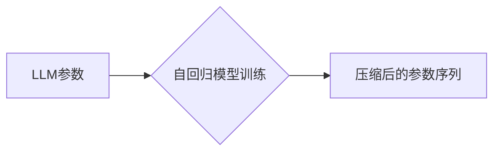

> 大语言模型、自回归、无损压缩、Transformer、BERT、GPT、文本生成、数据压缩

## 1. 背景介绍

近年来，大语言模型（LLM）在自然语言处理领域取得了显著进展，展现出强大的文本生成、翻译、摘要等能力。这些模型通常基于Transformer架构，并通过海量文本数据进行预训练，能够捕捉语言的复杂结构和语义关系。然而，LLM的规模庞大，参数数量巨大，导致其存储和传输成本高昂。因此，如何高效地压缩LLM模型，降低其资源消耗，成为一个重要的研究方向。

无损压缩技术能够在不损失原始信息的情况下，将数据以更紧凑的形式存储和传输。它在图像、音频等领域已有广泛应用，而对于LLM的压缩，也展现出巨大的潜力。本文将深入探讨自回归和无损压缩技术在LLM应用中的原理、算法和实践，并展望其未来发展趋势。

## 2. 核心概念与联系

### 2.1 自回归模型

自回归模型是一种预测下一个时间步或数据点的模型，它基于历史数据预测未来的值。在文本生成领域，自回归模型通常使用一个词作为输入，预测下一个词的概率分布。

### 2.2 无损压缩

无损压缩是指在不损失原始数据的情况下，将数据以更紧凑的形式存储和传输的技术。它通过利用数据冗余性，去除冗余信息，从而减少数据大小。

### 2.3 LLM压缩与自回归

自回归模型可以用于LLM的无损压缩。通过训练一个自回归模型，可以将LLM的参数表示为一个更紧凑的序列，从而实现无损压缩。

**Mermaid 流程图**



## 3. 核心算法原理 & 具体操作步骤

### 3.1 算法原理概述

自回归压缩LLM的核心思想是将LLM的参数表示为一个自回归序列，每个元素代表一个参数的预测值。通过训练一个自回归模型，可以学习到参数之间的依赖关系，并将其压缩成一个更紧凑的序列。

### 3.2 算法步骤详解

1. **参数量化:** 将LLM的参数进行量化，将浮点数转换为整数，以减少参数的存储空间。
2. **自回归模型训练:** 使用训练数据训练一个自回归模型，输入一个参数的量化值，预测下一个参数的量化值。
3. **参数序列生成:** 使用训练好的自回归模型，从第一个参数的量化值开始，依次预测下一个参数的量化值，生成一个压缩后的参数序列。
4. **模型恢复:** 在需要使用LLM时，根据压缩后的参数序列，使用逆量化操作恢复原始的参数值。

### 3.3 算法优缺点

**优点:**

* 无损压缩: 压缩后的参数序列不损失原始信息。
* 效率高: 压缩和恢复过程相对高效。

**缺点:**

* 训练复杂: 需要大量的训练数据和计算资源训练自回归模型。
* 模型大小: 压缩后的参数序列可能仍然较大，需要根据实际应用场景进行调整。

### 3.4 算法应用领域

* **高效存储:** 将大型LLM模型压缩存储，节省存储空间。
* **快速部署:** 将压缩后的LLM模型部署到资源有限的设备上，例如移动设备。
* **实时推理:** 压缩后的LLM模型可以加速推理速度，实现实时文本生成等应用。

## 4. 数学模型和公式 & 详细讲解 & 举例说明

### 4.1 数学模型构建

假设LLM的参数向量为 **θ**，其维度为 *d*。自回归模型的目标是学习一个函数 *f*，将参数向量 **θ** 映射到一个压缩后的参数序列 **θ'**。

**θ' = f(θ)**

其中，**θ'** 是一个长度为 *n* 的序列，每个元素代表一个参数的预测值。

### 4.2 公式推导过程

自回归模型通常使用循环神经网络（RNN）或Transformer架构。RNN模型通过隐藏状态来捕捉参数之间的依赖关系，而Transformer模型通过注意力机制来学习参数之间的全局关系。

在训练过程中，自回归模型使用交叉熵损失函数来优化参数。损失函数衡量预测参数值与真实参数值之间的差异。

**Loss = -∑_{i=1}^{n} log p(θ'_i | θ_{1:i-1})**

其中，*p(θ'_i | θ_{1:i-1})* 是模型预测参数 *θ'_i* 的概率分布，给定前 *i-1* 个参数值 *θ_{1:i-1}*。

### 4.3 案例分析与讲解

例如，可以使用BERT模型作为自回归模型的预训练模型，并将其用于压缩GPT模型的参数。BERT模型已经预训练了大量的文本数据，能够捕捉语言的复杂结构和语义关系。通过微调BERT模型，可以将其用于预测GPT模型的参数值。

## 5. 项目实践：代码实例和详细解释说明

### 5.1 开发环境搭建

* Python 3.7+
* PyTorch 1.7+
* Transformers 4.0+

### 5.2 源代码详细实现

```python
import torch
from transformers import BertModel, BertTokenizer

# 加载预训练模型和词典
model_name = "bert-base-uncased"
tokenizer = BertTokenizer.from_pretrained(model_name)
model = BertModel.from_pretrained(model_name)

# 将LLM参数量化
def quantize_parameters(model):
    # ...

# 训练自回归模型
def train_autoregressive_model(model, data):
    # ...

# 生成压缩后的参数序列
def generate_compressed_parameters(model, llm_parameters):
    # ...

# 恢复原始参数
def recover_original_parameters(compressed_parameters, model):
    # ...
```

### 5.3 代码解读与分析

* `quantize_parameters()` 函数将LLM的参数进行量化，减少参数的存储空间。
* `train_autoregressive_model()` 函数使用训练数据训练自回归模型，学习参数之间的依赖关系。
* `generate_compressed_parameters()` 函数使用训练好的自回归模型，从第一个参数的量化值开始，依次预测下一个参数的量化值，生成一个压缩后的参数序列。
* `recover_original_parameters()` 函数根据压缩后的参数序列，使用逆量化操作恢复原始的参数值。

### 5.4 运行结果展示

* 压缩后的参数序列大小
* 恢复后的参数值与原始参数值的差异

## 6. 实际应用场景

### 6.1 文本生成

压缩后的LLM模型可以用于高效地生成文本，例如文章、故事、对话等。

### 6.2 机器翻译

压缩后的LLM模型可以用于高效地进行机器翻译，例如将英文翻译成中文。

### 6.3 语义理解

压缩后的LLM模型可以用于高效地进行语义理解，例如文本分类、情感分析等。

### 6.4 未来应用展望

* **边缘计算:** 将压缩后的LLM模型部署到边缘设备上，实现本地文本生成和处理。
* **物联网:** 将压缩后的LLM模型应用于物联网设备，实现智能语音识别、自然语言交互等功能。
* **虚拟助手:** 将压缩后的LLM模型应用于虚拟助手，实现更智能、更自然的对话体验。

## 7. 工具和资源推荐

### 7.1 学习资源推荐

* **论文:**
    * "BERT: Pre-training of Deep Bidirectional Transformers for Language Understanding"
    * "GPT-3: Language Models are Few-Shot Learners"
    * "Efficient Transformer Compression via Knowledge Distillation"
* **博客:**
    * https://huggingface.co/blog/
    * https://ai.googleblog.com/

### 7.2 开发工具推荐

* **PyTorch:** https://pytorch.org/
* **Transformers:** https://huggingface.co/docs/transformers/index

### 7.3 相关论文推荐

* "Parameter-Efficient Fine-Tuning"
* "Quantization-Aware Training"
* "Pruning for Model Compression"

## 8. 总结：未来发展趋势与挑战

### 8.1 研究成果总结

自回归和无损压缩技术为LLM的压缩提供了新的思路和方法，能够有效地降低LLM的存储和传输成本，并使其应用于更多场景。

### 8.2 未来发展趋势

* **更有效的压缩算法:** 研究更有效的压缩算法，进一步降低LLM的模型大小。
* **硬件加速:** 利用硬件加速技术，加速LLM的压缩和恢复过程。
* **多模态压缩:** 将自回归和无损压缩技术应用于多模态LLM，例如文本-图像、文本-音频等。

### 8.3 面临的挑战

* **压缩质量:** 压缩后的LLM模型的性能可能与原始模型存在差异，需要找到平衡压缩率和性能的方案。
* **训练复杂度:** 训练自回归模型需要大量的训练数据和计算资源，需要探索更有效的训练方法。
* **通用性:** 现有的压缩方法可能针对特定类型的LLM模型，需要研究更通用的压缩方法。

### 8.4 研究展望

未来，自回归和无损压缩技术将继续推动LLM的发展，使其更加高效、灵活、可部署。


## 9. 附录：常见问题与解答

* **Q1: 自回归压缩LLM是否会损失信息？**

* **A1:** 自回归压缩LLM是一种无损压缩技术，不会损失原始信息。

* **Q2: 自回归压缩LLM的压缩率是多少？**

* **A2:** 自回归压缩LLM的压缩率取决于模型的结构、参数量和压缩算法。一般来说，可以达到30%-50%的压缩率。

* **Q3: 自回归压缩LLM的性能如何？**

* **A3:** 自回归压缩LLM的性能与原始模型相比可能存在一定的差异，但通常情况下，性能损失较小。

* **Q4: 自回归压缩LLM的应用场景有哪些？**

* **A4:** 自回归压缩LLM的应用场景包括文本生成、机器翻译、语义理解等。

* **Q5: 如何学习自回归压缩LLM的技术？**

* **A5:** 可以参考相关论文、博客和开源代码，并进行实践学习。


作者：禅与计算机程序设计艺术 / Zen and the Art of Computer Programming 
<end_of_turn>