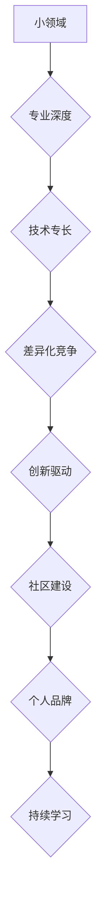

> 小领域，专业深度，技术专长，差异化竞争，创新驱动，社区建设，个人品牌，持续学习

## 1. 背景介绍

在当今科技日新月异的时代，技术领域竞争日益激烈。无论是巨头公司还是初创企业，都面临着激烈的市场竞争。对于个人开发者来说，如何在浩瀚的技术海洋中脱颖而出，建立个人品牌，获得成功，成为一个令人思考的问题。

传统观点认为，只有掌握最热门的技术，才能在竞争中占据优势。然而，随着技术的快速发展，热门技术往往存在周期性，过时的风险也随之增加。因此，单纯追求热门技术，并不能保证长期的成功。

本文将探讨如何在小领域中脱颖出，通过专业深度和技术专长，实现个人价值和职业发展。

## 2. 核心概念与联系

**2.1 小领域定义**

小领域是指一个相对狭窄的技术领域，其用户群体相对较小，市场规模相对较小。

**2.2 专业深度**

专业深度是指在特定领域拥有深入的知识和技能，能够解决复杂问题，并对该领域做出原创性贡献。

**2.3 技术专长**

技术专长是指在特定技术领域拥有独特的技能和经验，能够胜任该领域的工作，并为用户提供高价值的服务。

**2.4 差异化竞争**

差异化竞争是指通过提供独特的价值主张，在竞争中占据优势。

**2.5 创新驱动**

创新驱动是指通过持续的创新，推动技术进步，并创造新的价值。

**2.6 社区建设**

社区建设是指建立一个围绕特定领域的技术社区，促进技术交流和合作。

**2.7 个人品牌**

个人品牌是指个人在特定领域所建立的声誉和影响力。

**2.8 持续学习**

持续学习是指不断学习新知识和技能，保持技术领先。

**Mermaid 流程图**

## 3. 核心算法原理 & 具体操作步骤

**3.1 算法原理概述**

**3.2 算法步骤详解**

**3.3 算法优缺点**

**3.4 算法应用领域**

## 4. 数学模型和公式 & 详细讲解 & 举例说明

**4.1 数学模型构建**

**4.2 公式推导过程**

**4.3 案例分析与讲解**

## 5. 项目实践：代码实例和详细解释说明

**5.1 开发环境搭建**

**5.2 源代码详细实现**

**5.3 代码解读与分析**

**5.4 运行结果展示**

## 6. 实际应用场景

**6.1 应用场景介绍**

**6.2 案例分析**

**6.3 优势与挑战**

**6.4 未来应用展望**

## 7. 工具和资源推荐

**7.1 学习资源推荐**

**7.2 开发工具推荐**

**7.3 相关论文推荐**

## 8. 总结：未来发展趋势与挑战

**8.1 研究成果总结**

**8.2 未来发展趋势**

**8.3 面临的挑战**

**8.4 研究展望**

## 9. 附录：常见问题与解答

**9.1 常见问题**

**9.2 问题解答**

作者：禅与计算机程序设计艺术 / Zen and the Art of Computer Programming

<end_of_turn>