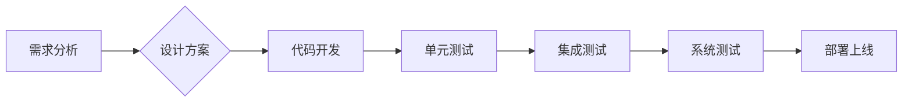

>  流水线、自动化、生产效率、工业革命、软件开发、敏捷开发、DevOps

## 1. 背景介绍

1913年，亨利·福特在底特律的平底车工厂推出了革命性的流水线生产系统，彻底改变了汽车制造业，也为人类社会开启了工业革命的新篇章。福特的流水线生产系统不仅提高了汽车的生产效率，也降低了生产成本，使得汽车从奢侈品变成了大众消费品。

今天，我们站在21世纪的科技浪潮中，同样面临着生产效率和成本控制的挑战。软件开发行业也需要借鉴福特流水线生产的成功经验，探索新的生产模式，提高开发效率，降低开发成本。

## 2. 核心概念与联系

福特流水线生产的核心概念是将复杂的生产过程分解成多个简单重复的工序，每个工序由专门的工人负责，工件在流水线上的不断移动，使得生产过程更加高效、有序。

在软件开发领域，我们可以将流水线生产的概念应用于软件开发流程，将复杂的软件开发过程分解成多个模块，每个模块由专门的开发人员负责，代码在版本控制系统中不断更新，使得开发过程更加高效、协作。

**Mermaid 流程图**



## 3. 核心算法原理 & 具体操作步骤

### 3.1  算法原理概述

软件开发流水线的核心算法原理是**迭代开发**和**持续集成**。

* **迭代开发**是指将软件开发过程划分为多个迭代周期，每个迭代周期完成一个软件功能模块的开发和测试。
* **持续集成**是指将开发人员提交的代码定期集成到主代码库中，并进行自动化测试，确保代码质量和稳定性。

### 3.2  算法步骤详解

1. **需求分析:** 首先，需要对软件的需求进行详细分析，明确软件的功能、性能、用户体验等要求。
2. **设计方案:** 根据需求分析的结果，设计软件的架构、模块划分、数据模型等方案。
3. **代码开发:** 开发人员根据设计方案，编写代码实现软件的功能模块。
4. **单元测试:** 开发人员编写单元测试用例，测试每个代码模块的功能是否正确。
5. **集成测试:** 将多个代码模块集成在一起，进行集成测试，确保各个模块之间能够正常交互。
6. **系统测试:** 对整个软件系统进行测试，确保软件能够满足所有需求。
7. **部署上线:** 将经过测试的软件部署到生产环境中，供用户使用。

### 3.3  算法优缺点

**优点:**

* **提高开发效率:** 迭代开发和持续集成可以缩短软件开发周期，提高开发效率。
* **降低开发成本:** 通过自动化测试和持续集成，可以减少软件缺陷，降低开发成本。
* **提高软件质量:** 迭代开发和持续集成可以不断地对软件进行测试和改进，提高软件质量。

**缺点:**

* **需要团队协作:** 迭代开发和持续集成需要团队成员之间进行密切的协作。
* **需要自动化工具支持:** 迭代开发和持续集成需要使用自动化测试工具和版本控制系统等工具。

### 3.4  算法应用领域

迭代开发和持续集成已经成为软件开发行业的主流开发模式，广泛应用于各种软件开发项目，例如：

* Web 应用开发
* 移动应用开发
* 企业级软件开发
* 游戏开发

## 4. 数学模型和公式 & 详细讲解 & 举例说明

在软件开发流水线中，我们可以使用数学模型来分析和优化开发流程。例如，我们可以使用**蒙特卡罗模拟**来预测软件开发的风险和成本，使用**贝叶斯网络**来分析软件缺陷的发生原因，使用**线性规划**来优化软件开发资源的分配。

### 4.1  数学模型构建

**蒙特卡罗模拟**是一种随机模拟方法，可以用来预测随机事件的概率分布。在软件开发中，我们可以使用蒙特卡罗模拟来预测软件开发的风险和成本。例如，我们可以模拟不同开发人员的开发速度，不同测试用例的测试结果，以及不同软件缺陷的修复成本，从而预测软件开发的风险和成本。

### 4.2  公式推导过程

**贝叶斯网络**是一种概率图模型，可以用来表示和推理随机变量之间的依赖关系。在软件开发中，我们可以使用贝叶斯网络来分析软件缺陷的发生原因。例如，我们可以将软件缺陷、代码质量、开发人员经验等因素作为贝叶斯网络中的节点，并根据历史数据推导出这些因素之间的概率关系，从而分析软件缺陷的发生原因。

### 4.3  案例分析与讲解

**线性规划**是一种数学优化方法，可以用来求解线性目标函数在线性约束条件下的最优解。在软件开发中，我们可以使用线性规划来优化软件开发资源的分配。例如，我们可以将开发人员、测试人员、硬件资源等作为线性规划中的变量，将开发时间、开发成本、软件质量等作为线性规划的目标函数和约束条件，从而优化软件开发资源的分配。

## 5. 项目实践：代码实例和详细解释说明

### 5.1  开发环境搭建

为了实现软件开发流水线，我们需要搭建一个合适的开发环境。开发环境通常包括以下几个部分：

* **版本控制系统:** 用于管理代码的版本和历史记录，例如Git。
* **持续集成工具:** 用于自动构建、测试和部署代码，例如Jenkins。
* **测试工具:** 用于编写和执行自动化测试用例，例如JUnit。
* **代码分析工具:** 用于分析代码质量，例如SonarQube。

### 5.2  源代码详细实现

以下是一个简单的软件开发流水线代码示例，使用Python语言实现：

```python
# 需求分析
requirements = ["用户登录", "用户注册", "商品展示", "购物车"]

# 设计方案
design = {
    "用户登录": "使用用户名和密码登录",
    "用户注册": "使用邮箱注册",
    "商品展示": "使用列表展示商品",
    "购物车": "使用购物车功能添加商品"
}

# 代码开发
def login(username, password):
    # 登录逻辑
    pass

def register(email):
    # 注册逻辑
    pass

# 单元测试
def test_login():
    assert login("admin", "123456") == True

# 集成测试
def test_integration():
    # 集成测试逻辑
    pass

# 系统测试
def test_system():
    # 系统测试逻辑
    pass

# 部署上线
def deploy():
    # 部署逻辑
    pass

# 运行流水线
for requirement in requirements:
    print(f"开发{requirement}功能...")
    # 代码开发、单元测试、集成测试、系统测试、部署上线
```

### 5.3  代码解读与分析

这段代码示例展示了软件开发流水线的基本流程。首先，需要进行需求分析和设计方案，然后进行代码开发，并编写单元测试、集成测试和系统测试用例。最后，将经过测试的代码部署到生产环境中。

### 5.4  运行结果展示

运行这段代码示例，会打印出每个功能开发的日志信息，并执行相应的测试用例。如果测试用例执行成功，则表示软件开发流水线运行正常。

## 6. 实际应用场景

软件开发流水线已经广泛应用于各种实际场景，例如：

* **互联网公司:** 互联网公司通常需要快速迭代开发新的功能，因此需要采用软件开发流水线来提高开发效率。
* **金融机构:** 金融机构需要确保软件系统的稳定性和安全性，因此需要采用软件开发流水线来提高软件质量。
* **医疗机构:** 医疗机构需要确保软件系统的可靠性和准确性，因此需要采用软件开发流水线来提高软件质量。

### 6.4  未来应用展望

随着人工智能、云计算等技术的不断发展，软件开发流水线将会更加智能化、自动化和协作化。未来，软件开发流水线将会更加深入地融入软件开发流程，成为软件开发的标准模式。

## 7. 工具和资源推荐

### 7.1  学习资源推荐

* **书籍:**
    * 《The Phoenix Project: A Novel About IT, DevOps, and Helping Your Business Win》
    * 《Continuous Delivery: Reliable Software Releases through Build, Test, and Deployment Automation》
* **网站:**
    * https://www.atlassian.com/
    * https://www.jenkins.io/
    * https://www.sonarqube.org/

### 7.2  开发工具推荐

* **版本控制系统:** Git
* **持续集成工具:** Jenkins, CircleCI, Travis CI
* **测试工具:** JUnit, pytest, Selenium
* **代码分析工具:** SonarQube, Code Climate

### 7.3  相关论文推荐

* **The Phoenix Project: A Novel About IT, DevOps, and Helping Your Business Win**
* **Continuous Delivery: Reliable Software Releases through Build, Test, and Deployment Automation**

## 8. 总结：未来发展趋势与挑战

### 8.1  研究成果总结

软件开发流水线已经成为软件开发行业的主流开发模式，它提高了开发效率，降低了开发成本，提高了软件质量。

### 8.2  未来发展趋势

未来，软件开发流水线将会更加智能化、自动化和协作化。人工智能、云计算等技术的不断发展将会推动软件开发流水线的进一步发展。

### 8.3  面临的挑战

软件开发流水线也面临着一些挑战，例如：

* **团队协作:** 迭代开发和持续集成需要团队成员之间进行密切的协作。
* **自动化工具:** 迭代开发和持续集成需要使用自动化测试工具和版本控制系统等工具。
* **文化转变:** 传统的软件开发模式和流水线开发模式存在差异，需要企业进行文化转变。

### 8.4  研究展望

未来，我们需要继续研究和探索软件开发流水线的优化方法，使其更加智能化、自动化和协作化，更好地服务于软件开发行业的发展。

## 9. 附录：常见问题与解答

**常见问题:**

* **软件开发流水线和瀑布模型有什么区别？**
* **如何搭建一个软件开发流水线？**
* **如何选择合适的软件开发流水线工具？**

**解答:**

* 软件开发流水线和瀑布模型的区别在于，流水线采用迭代开发和持续集成的方式，而瀑布模型采用线性开发的方式。
* 搭建软件开发流水线需要选择合适的版本控制系统、持续集成工具、测试工具和代码分析工具。
* 选择合适的软件开发流水线工具需要根据项目的具体需求和规模进行选择。


作者：禅与计算机程序设计艺术 / Zen and the Art of Computer Programming 
<end_of_turn>