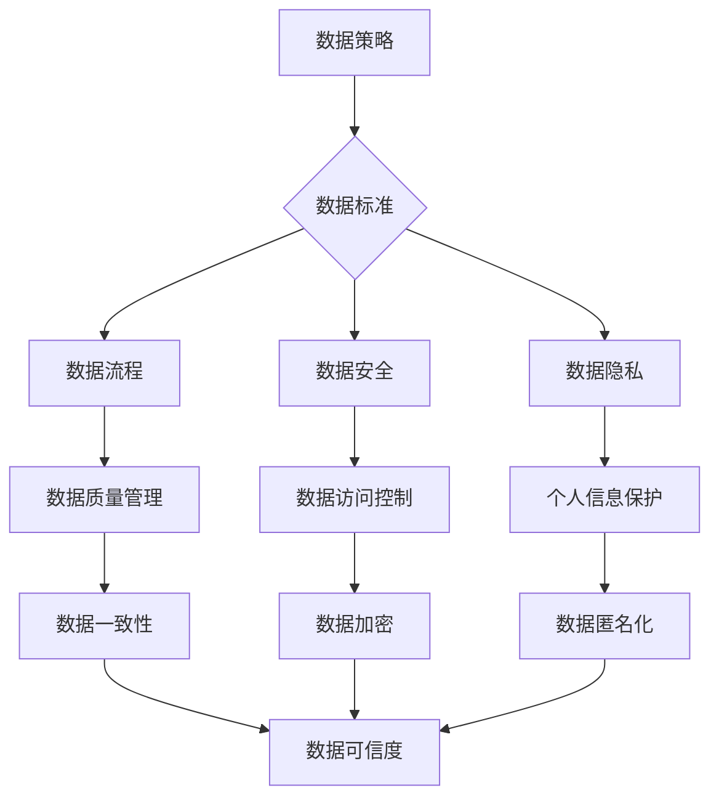

> 数据治理、数据管理制度、数据质量、数据安全、数据隐私、数据标准化、数据可信度

## 1. 背景介绍

在当今数据爆炸的时代，数据已成为企业最重要的资产之一。然而，海量数据的积累也带来了新的挑战，如何有效地管理和利用数据，成为了企业发展的关键问题。数据治理应运而生，它旨在建立一套规范、标准、可控的数据管理制度，确保数据的质量、安全、隐私和可信度。

数据治理并非一蹴而就，它需要企业从战略层面进行规划，并逐步实施，最终形成一套完整的体系。本文将深入探讨数据治理的各个方面，并提供一些实用的建议，帮助企业建立健全的数据管理制度。

## 2. 核心概念与联系

**2.1 数据治理的概念**

数据治理是指企业对数据生命周期的各个阶段进行规划、管理和控制，以确保数据的质量、安全、隐私和可信度。它涵盖了数据策略、数据标准、数据流程、数据安全、数据隐私等多个方面。

**2.2 数据治理的要素**

数据治理的核心要素包括：

* **数据策略:** 明确企业对数据的整体目标和方向，包括数据的使用场景、数据价值、数据安全等。
* **数据标准:** 制定统一的数据定义、数据格式、数据质量标准等，确保数据的一致性和可互操作性。
* **数据流程:** 建立数据采集、存储、处理、分析、共享等流程，规范数据生命周期管理。
* **数据安全:** 实施数据访问控制、数据加密、数据备份等措施，保障数据安全。
* **数据隐私:** 遵守相关法律法规，保护用户个人信息隐私。

**2.3 数据治理与其他概念的关系**

数据治理与其他概念密切相关，例如：

* **数据管理:** 数据管理是数据治理的基础，它涵盖了数据存储、数据检索、数据备份等技术层面。
* **数据分析:** 数据分析是数据治理的目标之一，通过对数据的分析，可以挖掘数据价值，支持企业决策。
* **数据科学:** 数据科学是利用数据分析、机器学习等技术，从数据中发现规律和洞察，推动企业创新。

**2.4 数据治理架构**

数据治理架构通常包括以下几个层级：

* **战略层:** 制定数据治理的总体策略和目标。
* **管理层:** 负责制定数据治理的具体方案和标准，并监督执行。
* **操作层:** 负责执行数据治理的具体工作，例如数据质量管理、数据安全管理等。

**Mermaid 流程图**



## 3. 核心算法原理 & 具体操作步骤

**3.1 算法原理概述**

数据治理的核心算法原理主要包括数据质量评估、数据标准化、数据安全控制等方面。

* **数据质量评估:** 利用统计学、机器学习等算法，对数据的完整性、准确性、一致性、时效性等进行评估，识别数据质量问题。
* **数据标准化:** 利用数据清洗、数据转换、数据映射等技术，将数据转换为统一的格式和标准，确保数据的一致性和可互操作性。
* **数据安全控制:** 利用加密算法、访问控制机制、审计日志等技术，保障数据的安全性和隐私性。

**3.2 算法步骤详解**

**数据质量评估算法步骤:**

1. **数据采集:** 收集需要评估的数据。
2. **数据清洗:** 对数据进行清洗，去除重复数据、缺失数据等。
3. **数据标准化:** 将数据转换为统一的格式和标准。
4. **数据质量指标定义:** 定义数据质量指标，例如完整性、准确性、一致性等。
5. **数据质量评估:** 利用算法对数据进行评估，计算数据质量指标值。
6. **数据质量报告:** 生成数据质量报告，展示数据质量情况。

**数据标准化算法步骤:**

1. **数据分析:** 对数据进行分析，识别数据格式、数据类型等差异。
2. **标准定义:** 制定数据标准，包括数据格式、数据类型、数据编码等。
3. **数据转换:** 利用数据转换工具，将数据转换为标准格式。
4. **数据映射:** 建立数据映射关系，确保数据之间的转换准确性。
5. **数据验证:** 对转换后的数据进行验证，确保数据符合标准。

**数据安全控制算法步骤:**

1. **风险评估:** 对数据安全风险进行评估，识别潜在的威胁。
2. **安全策略制定:** 制定数据安全策略，包括访问控制、数据加密、审计日志等。
3. **安全技术实施:** 实施安全技术，例如访问控制系统、数据加密算法、审计日志系统等。
4. **安全监控:** 对数据安全进行监控，及时发现和处理安全事件。

**3.3 算法优缺点**

**数据质量评估算法:**

* **优点:** 可以客观地评估数据质量，识别数据质量问题。
* **缺点:** 需要大量的计算资源，评估结果可能受到算法参数的影响。

**数据标准化算法:**

* **优点:** 可以确保数据的一致性和可互操作性。
* **缺点:** 需要进行大量的规则定义和数据转换，可能导致数据丢失或错误。

**数据安全控制算法:**

* **优点:** 可以有效地保障数据的安全性和隐私性。
* **缺点:** 需要投入大量的成本和资源，可能影响数据访问效率。

**3.4 算法应用领域**

数据治理算法广泛应用于各个领域，例如：

* **金融行业:** 用于风险管理、欺诈检测、客户画像等。
* **医疗行业:** 用于电子病历管理、疾病诊断、药物研发等。
* **电商行业:** 用于商品推荐、用户画像、营销分析等。

## 4. 数学模型和公式 & 详细讲解 & 举例说明

**4.1 数学模型构建**

数据治理的数学模型可以用来描述数据质量、数据安全、数据隐私等方面的指标和关系。例如，可以构建一个数据质量模型，用数学公式来表示数据完整性、准确性、一致性等指标之间的关系。

**4.2 公式推导过程**

假设我们想要构建一个数据完整性的数学模型，我们可以使用以下公式：

```latex
完整性 = 1 - (缺失值数量 / 总数据量)
```

其中：

* 完整性：表示数据的完整性程度，取值范围为0到1。
* 缺失值数量：表示数据中缺失值的个数。
* 总数据量：表示数据的总数量。

**4.3 案例分析与讲解**

假设我们有一张包含1000条数据的客户信息表，其中有100条数据缺失了客户的电话号码。那么，根据上述公式，我们可以计算出数据的完整性为：

```latex
完整性 = 1 - (100 / 1000) = 0.9
```

这表明该客户信息表的完整性为90%。

**4.4 其他数学模型**

除了数据完整性模型，还可以构建其他数据治理相关的数学模型，例如：

* 数据准确性模型
* 数据一致性模型
* 数据安全模型
* 数据隐私模型

## 5. 项目实践：代码实例和详细解释说明

**5.1 开发环境搭建**

为了演示数据治理的实践应用，我们可以使用Python语言开发一个简单的代码实例。

开发环境搭建步骤如下：

1. 安装Python语言环境。
2. 安装必要的Python库，例如pandas、numpy、scikit-learn等。

**5.2 源代码详细实现**

```python
import pandas as pd

# 加载数据
data = pd.read_csv('customer_data.csv')

# 数据清洗
data.dropna(subset=['phone'], inplace=True)

# 数据标准化
data['age'] = data['age'].astype(int)

# 数据质量评估
data_quality = data.isnull().sum() / len(data) * 100

print(data_quality)

# 数据安全控制
data['phone'] = data['phone'].apply(lambda x: '***' * 3)

# 保存数据
data.to_csv('cleaned_data.csv', index=False)
```

**5.3 代码解读与分析**

这段代码首先加载了客户数据，然后进行了数据清洗、数据标准化、数据质量评估和数据安全控制等操作。

* 数据清洗：删除了电话号码缺失的数据。
* 数据标准化：将年龄字段转换为整数类型。
* 数据质量评估：计算了数据中缺失值的百分比。
* 数据安全控制：对电话号码进行了脱敏处理。

**5.4 运行结果展示**

运行这段代码后，会生成一个名为cleaned_data.csv的文件，该文件包含了清洗后的客户数据。

## 6. 实际应用场景

数据治理在各个行业都有广泛的应用场景，例如：

* **金融行业:** 银行可以使用数据治理来管理客户数据、交易数据、风险数据等，确保数据的准确性、完整性和安全性。
* **医疗行业:** 医院可以使用数据治理来管理患者数据、医疗记录数据、药品数据等，保障患者隐私和数据安全。
* **电商行业:** 电商平台可以使用数据治理来管理用户数据、商品数据、订单数据等，提高数据质量和服务效率。

**6.4 未来应用展望**

随着数据量的不断增长和数据分析技术的不断发展，数据治理将变得越来越重要。未来，数据治理将更加注重数据可信度、数据伦理和数据可持续性等方面。

## 7. 工具和资源推荐

**7.1 学习资源推荐**

* **书籍:**
    * 《数据治理：从战略到实践》
    * 《数据治理：构建数据驱动的企业》
* **在线课程:**
    * Coursera: Data Governance
    * Udemy: Data Governance Fundamentals

**7.2 开发工具推荐**

* **数据质量工具:**
    * Talend Data Quality
    * Informatica PowerCenter
* **数据标准化工具:**
    * Apache Camel
    * MuleSoft Anypoint Platform
* **数据安全工具:**
    * Splunk
    * IBM QRadar

**7.3 相关论文推荐**

* **数据治理的定义和框架:**
    * DAMA International, Data Management Body of Knowledge (DMBOK)
* **数据质量评估方法:**
    * Wang, R., & Strong, D. M. (2009). Data quality assessment: A survey. ACM Computing Surveys, 41(4), 1-38.
* **数据安全控制方法:**
    * NIST, Cybersecurity Framework

## 8. 总结：未来发展趋势与挑战

**8.1 研究成果总结**

数据治理已经取得了显著的成果，为企业提供了有效的数据管理解决方案。

**8.2 未来发展趋势**

未来，数据治理将朝着以下几个方向发展：

* **更加智能化:** 利用人工智能技术，自动识别数据质量问题，并提供解决方案。
* **更加自动化:** 利用自动化工具，简化数据治理流程，提高效率。
* **更加可视化:** 利用数据可视化技术，直观展示数据治理情况，方便决策。

**8.3 面临的挑战**

数据治理也面临着一些挑战，例如：

* **数据孤岛问题:** 数据分散在不同的系统中，难以整合和管理。
* **数据安全风险:** 数据泄露和数据攻击的风险越来越高。
* **数据隐私保护:** 如何保护用户个人信息隐私是一个重要的挑战。

**8.4 研究展望**

未来，我们需要继续研究和探索新的数据治理方法和技术，以应对不断变化的数据环境和挑战。


## 9. 附录：常见问题与解答

**9.1 如何建立数据治理