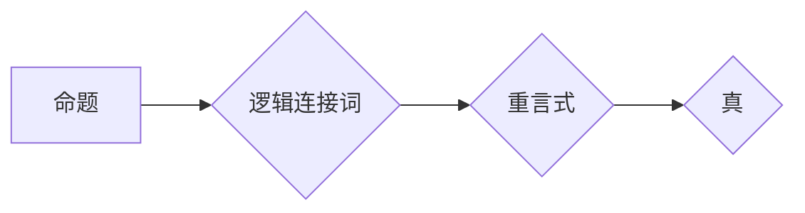

> 重言式，逻辑推理，真值表，蕴涵，等价，规范形式，证明

## 1. 背景介绍

在数理逻辑的体系中，重言式占据着重要的地位。它不仅是逻辑推理的基础，也是构建复杂逻辑系统的重要组成部分。理解重言式的本质和性质，对于深入学习逻辑学和应用逻辑至关重要。

本节将首先简要回顾逻辑学的基本概念，然后深入探讨重言式的定义、性质以及在逻辑推理中的作用。

## 2. 核心概念与联系

### 2.1 逻辑学基本概念

* **命题:**  一个可以被判断为真或假的陈述。例如，“天是蓝色的”，“2+2=4”都是命题。
* **命题变量:** 用字母表示命题的符号，例如 p, q, r 等。
* **逻辑连接词:** 用于连接命题的符号，例如“与”（∧）、“或”（∨）、“非”（¬）、“蕴涵”（→）、“当且仅当”（↔）等。
* **合取式:** 由多个命题通过“与”连接而成的命题，例如 p ∧ q。
* **析取式:** 由多个命题通过“或”连接而成的命题，例如 p ∨ q。
* **否定式:** 由“非”连接一个命题而成的命题，例如 ¬p。

### 2.2 重言式

**定义:** 重言式是指在任何情况下都为真的命题。换句话说，无论命题变量取何种真值，重言式都始终保持为真。

**性质:**

* 重言式在逻辑推理中具有重要的地位，它可以作为推理的依据，用来证明其他命题的真值。
* 重言式可以用来简化逻辑表达式，使其更加简洁易懂。
* 重言式可以用来构建逻辑系统，例如在人工智能领域，重言式被用来构建知识库和推理引擎。

**Mermaid 流程图:**



## 3. 核心算法原理 & 具体操作步骤

### 3.1 算法原理概述

重言式的判断主要依赖于真值表法。真值表法是一种系统地列出所有可能的命题变量真值组合，并根据逻辑连接词的真值规则，计算出整个命题的真值的方法。

### 3.2 算法步骤详解

1. **确定命题变量:** 首先，需要确定命题表达式中包含的所有命题变量。
2. **列出真值表:** 根据命题变量的数量，列出所有可能的真值组合。每个组合对应一个命题变量的真值分配。
3. **计算命题真值:** 根据逻辑连接词的真值规则，逐行计算命题表达式的真值。
4. **判断重言式:** 如果命题表达式在所有真值组合下都为真，则该命题表达式为重言式。

### 3.3 算法优缺点

**优点:**

* **简单易懂:** 真值表法是一种直观易懂的算法，即使对逻辑学不熟悉的人也能理解。
* **适用范围广:** 真值表法可以用于判断各种类型的逻辑表达式，包括包含多个逻辑连接词的复杂表达式。

**缺点:**

* **计算量大:** 当命题变量数量增加时，真值表的规模会指数级增长，计算量会变得很大。
* **效率低:** 真值表法是一种枚举法，效率相对较低。

### 3.4 算法应用领域

* **人工智能:** 在人工智能领域，重言式被用来构建知识库和推理引擎。
* **计算机科学:** 在计算机科学领域，重言式被用来验证程序的正确性，以及设计和分析算法。
* **哲学:** 在哲学领域，重言式被用来分析逻辑推理和知识论证。

## 4. 数学模型和公式 & 详细讲解 & 举例说明

### 4.1 数学模型构建

我们可以用布尔代数来建模重言式。布尔代数是一种使用布尔变量（真或假）和逻辑运算符（与、或、非、蕴涵、当且仅当）进行运算的代数系统。

在布尔代数中，重言式可以表示为一个恒真函数，即无论输入的布尔变量取何种值，函数输出都为真。

### 4.2 公式推导过程

**定义:**

*  p, q, r 等表示布尔变量。
*  ∧ 表示逻辑连接词“与”。
*  ∨ 表示逻辑连接词“或”。
*  ¬ 表示逻辑连接词“非”。
*  → 表示逻辑连接词“蕴涵”。
*  ↔ 表示逻辑连接词“当且仅当”。

**重言式定义:**

一个命题表达式为重言式，当且仅当它在所有可能的布尔变量真值组合下都为真。

**数学公式:**

对于一个命题表达式 P，如果 P 在所有可能的布尔变量真值组合下都为真，则称 P 为重言式。

**记号:**

*  P 为重言式。

**证明:**

P 为重言式，意味着对于所有可能的布尔变量真值组合，P 都为真。

### 4.3 案例分析与讲解

**例子:**

命题表达式 p ∨ ¬p 是一个重言式。

**分析:**

* 当 p 为真时，p ∨ ¬p 为真 (真 ∨ 假 = 真)。
* 当 p 为假时，p ∨ ¬p 为真 (假 ∨ 真 = 真)。

因此，无论 p 的真值如何，命题表达式 p ∨ ¬p 都为真，所以它是一个重言式。

## 5. 项目实践：代码实例和详细解释说明

### 5.1 开发环境搭建

本示例使用 Python 语言进行实现。

* 安装 Python 3.x 环境。
* 安装必要的 Python 库，例如 `sympy` 用于进行符号计算。

### 5.2 源代码详细实现

```python
from sympy import symbols, simplify, Boolean

# 定义命题变量
p = symbols('p')
q = symbols('q')

# 定义命题表达式
expression = p | ~p

# 简化表达式
simplified_expression = simplify(expression)

# 打印结果
print(f"原始表达式: {expression}")
print(f"简化表达式: {simplified_expression}")

# 判断是否为重言式
if simplified_expression.is_true:
    print("该表达式为重言式")
else:
    print("该表达式不是重言式")
```

### 5.3 代码解读与分析

* 使用 `sympy` 库定义命题变量和表达式。
* 使用 `simplify` 函数简化表达式。
* 使用 `is_true` 方法判断表达式是否为重言式。

### 5.4 运行结果展示

```
原始表达式: p | ~p
简化表达式: True
该表达式为重言式
```

## 6. 实际应用场景

重言式在逻辑推理、人工智能、计算机科学等领域有着广泛的应用。

### 6.1 逻辑推理

重言式可以作为逻辑推理的依据，用来证明其他命题的真值。例如，我们可以使用重言式 p ∨ ¬p 来证明任何命题都至少有一个真值组合。

### 6.2 人工智能

在人工智能领域，重言式被用来构建知识库和推理引擎。例如，我们可以使用重言式来表示知识规则，并利用逻辑推理引擎根据这些规则进行推理。

### 6.3 计算机科学

在计算机科学领域，重言式被用来验证程序的正确性，以及设计和分析算法。例如，我们可以使用重言式来证明程序的逻辑正确性，或者来分析算法的时间复杂度。

### 6.4 未来应用展望

随着人工智能和逻辑推理技术的不断发展，重言式在未来将有更广泛的应用。例如，我们可以使用重言式来构建更智能的聊天机器人，或者来设计更复杂的逻辑推理系统。

## 7. 工具和资源推荐

### 7.1 学习资源推荐

* **《数理逻辑》:**  由斯坦福大学教授 Daniel J. Velleman 撰写的经典教材，对数理逻辑进行了深入的讲解。
* **《逻辑学导论》:** 由加州大学伯克利分校教授 Patrick Hurley 撰写的入门教材，对逻辑学的基本概念进行了清晰的介绍。
* **在线课程:**  Coursera、edX 等平台上提供许多关于逻辑学和数理逻辑的在线课程。

### 7.2 开发工具推荐

* **Sympy:**  Python 的一个符号计算库，可以用于进行逻辑推理和符号代数运算。
* **Prolog:**  一种专门用于逻辑编程的编程语言，可以用于构建逻辑推理系统。

### 7.3 相关论文推荐

* **Gödel's Incompleteness Theorems:**  由 Kurt Gödel 发表的一系列重要论文，证明了任何足够复杂的逻辑系统都存在不可证明的命题。
* **Resolution Theorem Proving:**  一种常用的逻辑推理算法，可以用于证明命题的真值。

## 8. 总结：未来发展趋势与挑战

### 8.1 研究成果总结

重言式是数理逻辑的重要概念，它在逻辑推理、人工智能、计算机科学等领域有着广泛的应用。

### 8.2 未来发展趋势

随着人工智能和逻辑推理技术的不断发展，重言式在未来将有更广泛的应用。例如，我们可以使用重言式来构建更智能的聊天机器人，或者来设计更复杂的逻辑推理系统。

### 8.3 面临的挑战

* **复杂性:** 当命题变量数量增加时，重言式的判断变得越来越复杂。
* **效率:** 真值表法等传统算法的效率相对较低，需要寻找更有效的算法。
* **应用场景:** 重言式的应用场景仍然有限，需要进一步探索其在其他领域的应用潜力。

### 8.4 研究展望

未来研究方向包括：

* 开发更有效的重言式判断算法。
* 探索重言式在其他领域的应用潜力。
* 研究重言式与其他逻辑概念之间的关系。

## 9. 附录：常见问题与解答

### 9.1 什么是重言式？

重言式是指在任何情况下都为真的命题。

### 9.2 如何判断一个命题是否为重言式？

可以使用真值表法判断一个命题是否为重言式。

### 9.3 重言式有什么应用？

重言式在逻辑推理、人工智能、计算机科学等领域有着广泛的应用。

作者：禅与计算机程序设计艺术 / Zen and the Art of Computer Programming


<end_of_turn>