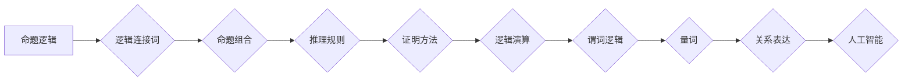

> 数理逻辑，逻辑演算，命题逻辑，谓词逻辑，推理规则，证明方法，计算机科学，人工智能

## 1. 背景介绍

数理逻辑作为计算机科学和人工智能的基础理论，在现代信息技术发展中扮演着至关重要的角色。它为计算机程序的正确性、人工智能系统的推理能力以及自然语言理解等领域提供了坚实的理论基础。

逻辑演算是数理逻辑的核心分支之一，它研究命题和谓词的组合、关系以及推理规则。通过逻辑演算，我们可以用精确的符号语言表达和分析各种论证，并构建出可靠的推理系统。

本篇文章将深入探讨逻辑演算的基本概念、推理规则以及证明方法，并通过具体的例子说明其在计算机科学和人工智能中的应用。

## 2. 核心概念与联系

### 2.1 命题逻辑

命题逻辑是逻辑演算的基础，它研究简单命题的组合和关系。

* **命题:** 一个可以被视为真或假的陈述。例如，“天是蓝色的”是一个命题，它可以是真或假。
* **命题变量:** 用字母表示命题的符号，例如 p, q, r 等。
* **逻辑连接词:** 用于连接命题的符号，例如：
    * **与 (∧):** 如果两个命题都为真，则整个命题为真。
    * **或 (∨):** 如果至少有一个命题为真，则整个命题为真。
    * **非 (¬):** 反转命题的真值。
    * **当且仅当 (↔):** 两个命题具有相同的真值。
    * **蕴涵 (→):** 如果第一个命题为真，则第二个命题也为真的关系。

### 2.2 谓词逻辑

谓词逻辑是命题逻辑的扩展，它允许我们使用谓词和量词来表达关于对象的属性和关系。

* **谓词:** 一个可以接受多个参数，并返回真或假的函数。例如，“x 是偶数”是一个谓词，它接受一个整数 x 作为参数，并返回真或假。
* **量词:** 用于量化对象的符号，例如：
    * **全称量词 (∀):** 表示“对于所有”。
    * **存在量词 (∃):** 表示“存在”。

### 2.3 推理规则

推理规则是逻辑演算的核心，它们规定了如何从已知命题推导出新的命题。

* **modus ponens:** 如果 p → q 为真，且 p 为真，则 q 为真。
* **modus tollens:** 如果 p → q 为真，且 ¬q 为真，则 ¬p 为真。
* **syllogism:** 如果 p → q 为真，且 q → r 为真，则 p → r 为真。

### 2.4 证明方法

证明方法是使用推理规则从已知命题推导出目标命题的过程。常见的证明方法包括：

* **直接证明:** 直接使用推理规则从已知命题推导出目标命题。
* **反证法:** 假设目标命题为假，然后推导出矛盾，从而证明目标命题为真。
* **归纳法:** 证明对于所有自然数 n，命题 P(n) 都成立。

**Mermaid 流程图**



## 3. 核心算法原理 & 具体操作步骤

### 3.1 算法原理概述

逻辑演算的核心算法是推理算法，它用于根据已知命题推导出新的命题。常见的推理算法包括：

* **前向推理:** 从已知事实出发，通过应用推理规则逐步推导出新的结论。
* **后向推理:** 从目标结论出发，通过反向应用推理规则逐步推导出所需的已知事实。
* **基于规则的推理:** 使用一组预先定义的规则来进行推理。

### 3.2 算法步骤详解

**前向推理算法步骤:**

1. **初始化:** 将已知事实添加到知识库中。
2. **选择事实:** 从知识库中选择一个可应用推理规则的事实。
3. **应用规则:** 应用推理规则将该事实推导出新的结论。
4. **更新知识库:** 将新的结论添加到知识库中。
5. **重复步骤2-4:** 直到达到目标结论或知识库中没有可应用的推理规则。

**后向推理算法步骤:**

1. **目标设定:** 设置需要推导的目标结论。
2. **规则匹配:** 从规则库中查找与目标结论相关的规则。
3. **求解前提:** 根据规则，确定目标结论的前提条件。
4. **知识库查询:** 从知识库中查询前提条件是否已知。
5. **递归调用:** 如果前提条件未知，则递归调用后向推理算法，直到找到所有前提条件。
6. **结论生成:** 当所有前提条件已知时，则可以推导出目标结论。

### 3.3 算法优缺点

**前向推理:**

* **优点:** 容易理解和实现，适用于处理简单问题。
* **缺点:** 效率较低，难以处理复杂问题。

**后向推理:**

* **优点:** 效率较高，适用于处理复杂问题。
* **缺点:** 难以理解和实现，需要大量的规则和知识库。

### 3.4 算法应用领域

逻辑演算的推理算法广泛应用于以下领域:

* **人工智能:** 用于构建智能系统，例如专家系统、自然语言理解系统和机器学习算法。
* **计算机科学:** 用于程序验证、软件测试和代码生成。
* **哲学:** 用于分析逻辑推理和知识论证。
* **法律:** 用于法律推理和案例分析。

## 4. 数学模型和公式 & 详细讲解 & 举例说明

### 4.1 数学模型构建

在数学模型中，我们可以用符号来表示命题、逻辑连接词和量词。例如：

* p 代表命题“天是蓝色的”。
* ¬p 代表命题“天不是蓝色的”。
* p ∧ q 代表命题“天是蓝色的且地球是圆的”。

### 4.2 公式推导过程

我们可以使用逻辑规则来推导新的命题。例如，使用 modus ponens 规则，如果我们知道 p → q 为真，且 p 为真，则可以推导出 q 为真。

### 4.3 案例分析与讲解

**案例:**

证明命题 “如果今天是星期天，那么明天是星期一” 是正确的。

**证明:**

1. 假设今天是星期天。
2. 根据定义，星期天之后的日期是星期一。
3. 因此，如果今天是星期天，那么明天是星期一。

**公式:**

* p: 今天是星期天。
* q: 明天是星期一。
* p → q: 如果今天是星期天，那么明天是星期一。

**推导过程:**

1. 假设 p 为真。
2. 根据定义，q 为真。
3. 因此，p → q 为真。

## 5. 项目实践：代码实例和详细解释说明

### 5.1 开发环境搭建

* 操作系统: Ubuntu 20.04
* 编程语言: Python 3.8
* 工具: Jupyter Notebook

### 5.2 源代码详细实现

```python
# 定义逻辑连接词
def and_operation(p, q):
  return p and q

def or_operation(p, q):
  return p or q

def not_operation(p):
  return not p

# 定义命题
p = True
q = False

# 使用逻辑连接词进行运算
result_and = and_operation(p, q)
result_or = or_operation(p, q)
result_not = not_operation(p)

# 打印结果
print(f"p: {p}")
print(f"q: {q}")
print(f"p ∧ q: {result_and}")
print(f"p ∨ q: {result_or}")
print(f"¬p: {result_not}")
```

### 5.3 代码解读与分析

* 代码首先定义了逻辑连接词的函数，例如 `and_operation`、`or_operation` 和 `not_operation`。
* 然后，定义了两个命题 `p` 和 `q`，并设置了它们的真值。
* 最后，使用定义的逻辑连接词函数对命题进行运算，并打印结果。

### 5.4 运行结果展示

```
p: True
q: False
p ∧ q: False
p ∨ q: True
¬p: False
```

## 6. 实际应用场景

### 6.1 专家系统

专家系统是一种利用人工智能技术模拟人类专家知识和推理能力的软件系统。逻辑演算是专家系统构建的基础，它用于表示专家知识和进行推理。例如，一个医疗诊断专家系统可以使用逻辑演算来表示疾病的症状和诊断规则，并根据患者的症状推断出可能的疾病。

### 6.2 自然语言理解

自然语言理解是指计算机能够理解和解释人类语言的能力。逻辑演算可以用于分析自然语言句子，识别其结构和含义。例如，可以使用逻辑演算来识别句子中的主语、谓语和宾语，并推断出句子的逻辑关系。

### 6.3 程序验证

程序验证是指通过数学证明来确保程序的正确性。逻辑演算可以用于表示程序的逻辑结构和行为，并使用推理规则来证明程序的正确性。例如，可以使用逻辑演算来证明一个程序不会出现错误，或者证明一个程序满足特定的安全要求。

### 6.4 未来应用展望

随着人工智能技术的不断发展，逻辑演算将在更多领域得到应用。例如，它可以用于构建更智能的机器人、更精准的医疗诊断系统和更安全的网络安全系统。

## 7. 工具和资源推荐

### 7.1 学习资源推荐

* **《数理逻辑》:**  
    * 作者:  
    * 出版社:  
* **《人工智能导论》:**  
    * 作者: Stuart Russell, Peter Norvig
    * 出版社: Pearson Education
* **在线课程:** Coursera, edX 等平台提供许多关于逻辑演算和人工智能的在线课程。

### 7.2 开发工具推荐

* **Prolog:** 一种专门用于逻辑编程的编程语言。
* **SMT Solvers:** 用于解决符号数学问题，例如程序验证和模型检查的工具。

### 7.3 相关论文推荐

* **《A Logical Framework for Knowledge Representation》:**  
    * 作者: John McCarthy
    * 出版年: 1980
* **《Resolution Theorem Proving》:**  
    * 作者:  
    * 出版年:  

## 8. 总结：未来发展趋势与挑战

### 8.1 研究成果总结

逻辑演算作为数理逻辑的基础，为计算机科学和人工智能的发展做出了重要贡献。它为程序验证、自然语言理解、专家系统等领域提供了理论基础和技术手段。

### 8.2 未来发展趋势

* **更强大的推理算法:** 研究更强大、更灵活的推理算法，例如基于深度学习的推理算法。
* **更复杂的知识表示:** 研究更复杂的知识表示方法，例如基于图的知识表示和基于语义网络的知识表示。
* **更广泛的应用领域:** 将逻辑演算应用于更多领域，例如自动驾驶、医疗诊断和金融分析。

### 8.3 面临的挑战

* **知识表示的复杂性:** 现实世界中的知识非常复杂，难以用逻辑语言精确地表示。
* **推理算法的效率:** 许多逻辑推理算法效率较低，难以处理大型知识库。
* **解释性和可解释性:** 许多人工智能系统缺乏解释性和可解释性，难以让人理解其推理过程。

### 8.4