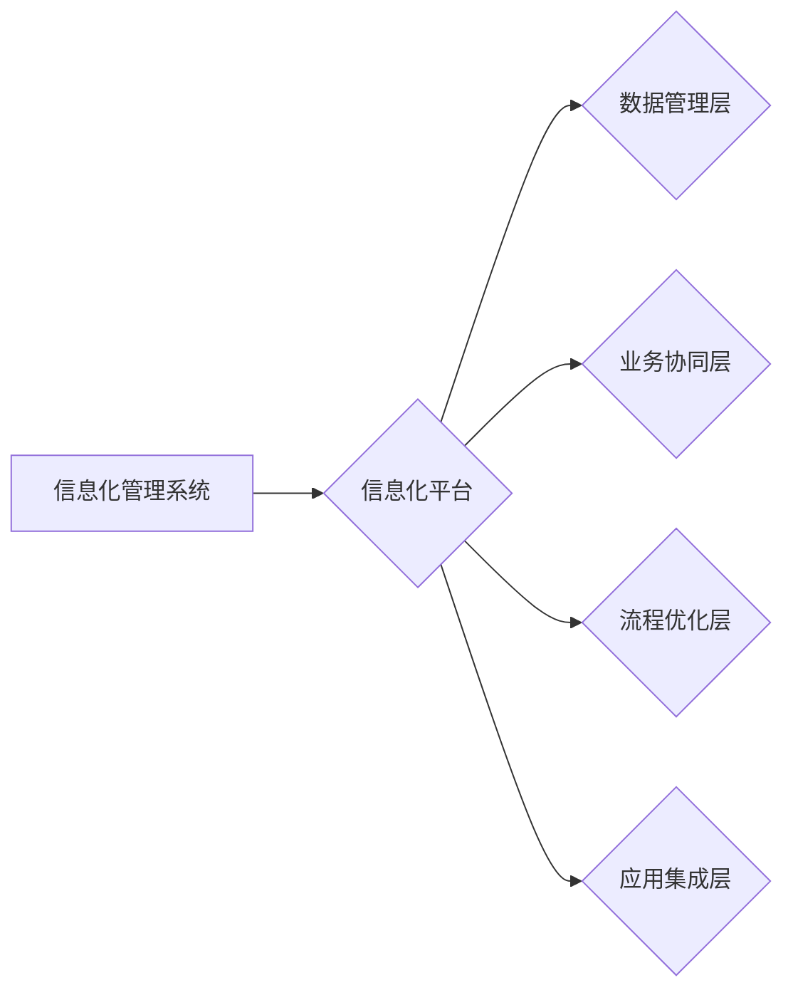

信息化管理系统,信息化平台,系统集成,数据管理,流程优化,业务协同,云计算,人工智能

## 1. 背景介绍

在当今数字化时代，信息化已经成为各行各业发展的关键驱动力。企业为了提升运营效率、降低成本、增强竞争力，纷纷开始建设信息化管理系统。然而，传统的孤立的信息化系统往往存在数据孤岛、流程重复、协同不足等问题，难以满足企业日益增长的需求。因此，搭建一个集成的、可管理的信息化平台，成为企业数字化转型的重要方向。

信息化管理系统是指利用计算机技术和网络技术，对企业内部的业务流程、数据资源、人员管理等进行数字化管理的系统。信息化管理系统可以帮助企业实现以下目标：

* **提高运营效率:** 自动化流程、优化资源配置、减少人工操作，提高工作效率。
* **降低运营成本:** 减少重复劳动、优化资源利用、降低人工成本。
* **增强竞争力:** 提供实时数据分析、支持数据驱动的决策，提升企业竞争力。
* **提升客户体验:** 提供便捷的线上服务、个性化的产品推荐，提升客户满意度。

## 2. 核心概念与联系

信息化平台是整合和管理信息化管理系统的重要基础。它是一个集数据管理、业务协同、流程优化、应用集成等功能于一体的综合性平台。信息化平台的核心概念包括：

* **数据管理:**  信息化平台需要提供统一的数据存储、管理和共享机制，确保数据准确、完整、一致。
* **业务协同:**  信息化平台需要支持不同部门、不同业务之间的协同工作，实现信息共享和流程协同。
* **流程优化:**  信息化平台需要对企业业务流程进行分析和优化，提高流程效率和自动化程度。
* **应用集成:**  信息化平台需要整合和管理各种应用系统，实现应用之间的互联互通。

**信息化平台架构**

## 3. 核心算法原理 & 具体操作步骤

### 3.1  算法原理概述

信息化平台的搭建需要涉及多种算法和技术，例如数据挖掘、机器学习、流程自动化等。这些算法和技术可以帮助企业实现数据分析、预测预警、流程优化等功能。

### 3.2  算法步骤详解

* **数据挖掘:**  从海量数据中提取有价值的信息，例如客户行为分析、市场趋势预测等。
* **机器学习:**  利用算法训练模型，实现自动学习和预测，例如欺诈检测、风险评估等。
* **流程自动化:**  通过自动化工具，将重复性、规则性的业务流程进行自动化，例如审批流程、报销流程等。

### 3.3  算法优缺点

* **数据挖掘:**  优点：可以发现隐藏的模式和趋势，帮助企业做出更明智的决策。缺点：需要大量的数据支持，算法复杂度高。
* **机器学习:**  优点：可以实现自动学习和预测，提高效率和准确性。缺点：需要大量的训练数据，模型解释性差。
* **流程自动化:**  优点：可以提高效率、降低成本，减少人为错误。缺点：需要对流程进行详细的分析和设计，难以处理复杂、变动的流程。

### 3.4  算法应用领域

* **数据挖掘:**  市场营销、客户关系管理、风险管理等。
* **机器学习:**  金融、医疗、电商等。
* **流程自动化:**  行政、财务、人力资源等。

## 4. 数学模型和公式 & 详细讲解 & 举例说明

### 4.1  数学模型构建

信息化平台的搭建需要建立数学模型来描述系统行为和性能。例如，可以建立数据流模型来描述数据在平台中的流动，建立流程模型来描述业务流程的执行过程。

### 4.2  公式推导过程

在数学模型的基础上，可以推导相应的公式来计算系统性能指标，例如吞吐量、延迟、可用性等。

### 4.3  案例分析与讲解

例如，可以利用 queuing theory 来建模信息化平台的请求处理过程，推导公式来计算系统响应时间和等待时间。

## 5. 项目实践：代码实例和详细解释说明

### 5.1  开发环境搭建

信息化平台的开发环境需要包含以下组件：

* **操作系统:**  Linux、Windows等。
* **数据库:**  MySQL、PostgreSQL等。
* **应用服务器:**  Tomcat、JBoss等。
* **开发工具:**  Eclipse、IntelliJ IDEA等。

### 5.2  源代码详细实现

信息化平台的源代码实现需要根据具体需求进行设计和开发。

### 5.3  代码解读与分析

需要对代码进行详细的解读和分析，理解代码的功能和逻辑。

### 5.4  运行结果展示

需要对信息化平台进行测试和运行，展示其功能和性能。

## 6. 实际应用场景

信息化平台可以应用于各个行业，例如：

* **制造业:**  生产管理、供应链管理、质量管理等。
* **金融业:**  客户关系管理、风险管理、交易处理等。
* **零售业:**  库存管理、销售管理、会员管理等。

### 6.4  未来应用展望

随着人工智能、云计算等技术的不断发展，信息化平台将更加智能化、平台化、服务化。

## 7. 工具和资源推荐

### 7.1  学习资源推荐

* **书籍:**  《软件工程导论》、《信息系统架构》等。
* **在线课程:**  Coursera、edX等平台提供信息化平台相关课程。

### 7.2  开发工具推荐

* **数据库:**  MySQL、PostgreSQL、MongoDB等。
* **应用服务器:**  Tomcat、JBoss、Spring Boot等。
* **开发工具:**  Eclipse、IntelliJ IDEA、Visual Studio Code等。

### 7.3  相关论文推荐

* **信息化平台架构研究**
* **信息化平台数据管理技术**
* **信息化平台应用案例分析**

## 8. 总结：未来发展趋势与挑战

### 8.1  研究成果总结

信息化平台的搭建已经取得了显著的成果，为企业数字化转型提供了重要的支撑。

### 8.2  未来发展趋势

* **智能化:**  利用人工智能技术，实现信息化平台的智能化决策、智能化服务。
* **平台化:**  构建开放、可扩展的信息化平台，支持多种应用和服务。
* **服务化:**  将信息化平台的服务化，提供定制化、按需付费的服务。

### 8.3  面临的挑战

* **数据安全:**  保障信息化平台的数据安全和隐私保护。
* **技术复杂性:**  信息化平台的架构和技术复杂，需要专业的技术人员进行开发和维护。
* **成本控制:**  信息化平台的建设和维护成本较高，需要进行合理的成本控制。

### 8.4  研究展望

未来，信息化平台的研究将更加注重智能化、平台化、服务化，并积极应对数据安全、技术复杂性、成本控制等挑战。

## 9. 附录：常见问题与解答

* **信息化平台的搭建需要多少钱？**
* **信息化平台的搭建需要多长时间？**
* **信息化平台的维护需要哪些人员？**

作者：禅与计算机程序设计艺术 / Zen and the Art of Computer Programming 
<end_of_turn>