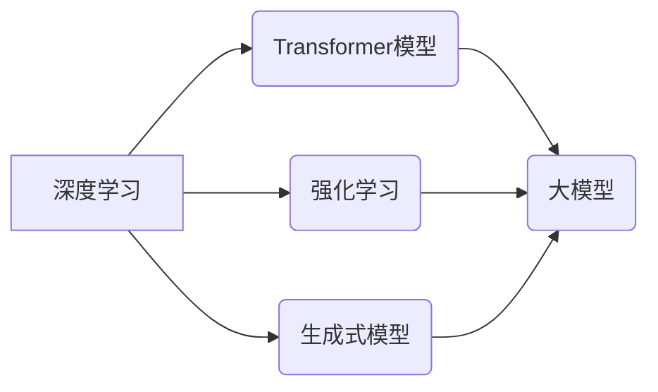

>  人工智能、深度学习、Transformer、自然语言处理、计算机视觉、强化学习、生成式模型、大模型、伦理

## 1. 背景介绍

人工智能（AI）技术近年来发展迅速，从最初的局限于特定领域的应用，逐渐发展到涵盖各个领域的广泛应用。新一代AI技术，以深度学习、Transformer模型、强化学习等为代表，展现出强大的学习能力和泛化能力，为我们带来了前所未有的机遇和挑战。

随着计算能力的提升、数据量的爆炸式增长以及算法的不断创新，新一代AI技术正在深刻地改变着我们的生活和工作方式。从智能语音助手、自动驾驶汽车到医疗诊断、金融风险控制，AI技术的应用场景日益广泛，其带来的社会影响也越来越深远。

## 2. 核心概念与联系

**2.1 深度学习**

深度学习是机器学习的一个子领域，它利用多层神经网络来模拟人类大脑的学习过程。通过对大量数据的训练，深度学习模型能够自动提取特征，并进行复杂的模式识别和预测。

**2.2 Transformer模型**

Transformer模型是一种新型的神经网络架构，它引入了注意力机制，能够有效地捕捉序列数据中的长距离依赖关系。Transformer模型在自然语言处理领域取得了突破性的进展，例如机器翻译、文本摘要、问答系统等。

**2.3 强化学习**

强化学习是一种基于奖励机制的机器学习方法，它通过不断与环境交互，学习最优的策略来最大化奖励。强化学习在机器人控制、游戏AI等领域有着广泛的应用。

**2.4 生成式模型**

生成式模型能够从已有的数据中学习，并生成新的数据，例如文本、图像、音频等。生成式模型在创意写作、图像合成、音乐创作等领域展现出巨大的潜力。

**2.5 大模型**

大模型是指参数量非常庞大的深度学习模型，它通常需要大量的计算资源和训练数据。大模型能够在多个任务上表现出强大的泛化能力，例如多模态理解、代码生成等。

**2.6 核心概念关系图**



## 3. 核心算法原理 & 具体操作步骤

### 3.1 算法原理概述

深度学习算法的核心是多层神经网络，它由多个神经元组成的层级结构组成。每个神经元接收来自上一层的输入，并通过激活函数进行处理，输出到下一层。通过对大量数据的训练，神经网络的权重参数会不断调整，最终能够学习到数据的特征和规律。

### 3.2 算法步骤详解

1. **数据预处理:** 将原始数据进行清洗、转换和特征工程，使其适合深度学习模型的训练。
2. **模型构建:** 根据具体的应用场景选择合适的深度学习模型架构，例如卷积神经网络（CNN）、循环神经网络（RNN）等。
3. **模型训练:** 使用训练数据对模型进行训练，通过反向传播算法调整模型的权重参数，使其能够准确地预测目标变量。
4. **模型评估:** 使用测试数据评估模型的性能，例如准确率、召回率、F1-score等。
5. **模型部署:** 将训练好的模型部署到实际应用场景中，用于进行预测或决策。

### 3.3 算法优缺点

**优点:**

* 强大的学习能力：深度学习模型能够自动提取特征，并学习复杂的模式。
* 泛化能力强：经过充分训练的深度学习模型能够在新的数据上表现出良好的泛化能力。
* 应用场景广泛：深度学习技术应用于各个领域，例如图像识别、语音识别、自然语言处理等。

**缺点:**

* 数据依赖性强：深度学习模型需要大量的训练数据才能达到良好的性能。
* 计算资源消耗大：训练大型深度学习模型需要大量的计算资源和时间。
* 可解释性差：深度学习模型的决策过程难以解释，这可能会导致模型的信任度降低。

### 3.4 算法应用领域

* **计算机视觉:** 图像识别、物体检测、图像分割、人脸识别等。
* **自然语言处理:** 机器翻译、文本摘要、问答系统、情感分析等。
* **语音识别:** 语音转文本、语音助手、语音搜索等。
* **推荐系统:** 商品推荐、内容推荐、用户画像等。
* **医疗诊断:** 病情诊断、影像分析、药物研发等。
* **金融风险控制:** 欺诈检测、信用评估、风险管理等。

## 4. 数学模型和公式 & 详细讲解 & 举例说明

### 4.1 数学模型构建

深度学习模型的数学基础是神经网络，它由多个层级结构组成，每个层级包含多个神经元。每个神经元接收来自上一层的输入，并通过激活函数进行处理，输出到下一层。

**4.1.1 神经网络结构**

一个简单的多层感知机（MLP）模型可以表示为：

```
y = f(W3 * a2 + b3)
a2 = f(W2 * a1 + b2)
a1 = f(W1 * x + b1)
```

其中：

* x 是输入向量
* a1, a2, a3 是隐藏层和输出层的激活值
* W1, W2, W3 是权重矩阵
* b1, b2, b3 是偏置向量
* f 是激活函数

**4.1.2 激活函数**

激活函数的作用是引入非线性，使神经网络能够学习复杂的模式。常见的激活函数包括：

* **ReLU (Rectified Linear Unit):** f(x) = max(0, x)
* **Sigmoid:** f(x) = 1 / (1 + exp(-x))
* **Tanh (Hyperbolic tangent):** f(x) = (exp(x) - exp(-x)) / (exp(x) + exp(-x))

### 4.2 公式推导过程

深度学习模型的训练过程是通过反向传播算法来进行的。反向传播算法的核心是计算模型输出与真实值的误差，并根据误差反向传播，调整模型的权重参数。

**4.2.1 损失函数**

损失函数用于衡量模型预测值与真实值的差异。常见的损失函数包括：

* **均方误差 (MSE):** L = (y - y_pred)^2
* **交叉熵损失 (Cross-entropy loss):** L = -sum(y_i * log(y_pred_i))

**4.2.2 反向传播算法**

反向传播算法的基本步骤如下：

1. 计算模型输出与真实值的误差。
2. 计算误差对模型权重参数的梯度。
3. 使用梯度下降算法更新模型的权重参数。

### 4.3 案例分析与讲解

**4.3.1 图像分类**

假设我们有一个图像分类任务，目标是将图像分类为不同的类别，例如猫、狗、鸟等。我们可以使用卷积神经网络（CNN）来解决这个问题。CNN模型能够自动学习图像特征，并进行分类。

**4.3.2 文本生成**

假设我们有一个文本生成任务，目标是根据给定的文本提示生成新的文本。我们可以使用Transformer模型来解决这个问题。Transformer模型能够捕捉文本中的长距离依赖关系，并生成流畅自然的文本。

## 5. 项目实践：代码实例和详细解释说明

### 5.1 开发环境搭建

* **操作系统:** Ubuntu 20.04
* **编程语言:** Python 3.8
* **深度学习框架:** TensorFlow 2.x

### 5.2 源代码详细实现

```python
import tensorflow as tf

# 定义模型结构
model = tf.keras.models.Sequential([
    tf.keras.layers.Dense(128, activation='relu', input_shape=(784,)),
    tf.keras.layers.Dense(10, activation='softmax')
])

# 编译模型
model.compile(optimizer='adam',
              loss='sparse_categorical_crossentropy',
              metrics=['accuracy'])

# 加载MNIST数据集
(x_train, y_train), (x_test, y_test) = tf.keras.datasets.mnist.load_data()

# 数据预处理
x_train = x_train.reshape(-1, 784).astype('float32') / 255
x_test = x_test.reshape(-1, 784).astype('float32') / 255

# 模型训练
model.fit(x_train, y_train, epochs=5)

# 模型评估
loss, accuracy = model.evaluate(x_test, y_test)
print('Test loss:', loss)
print('Test accuracy:', accuracy)
```

### 5.3 代码解读与分析

这段代码实现了简单的多层感知机模型，用于MNIST手写数字识别任务。

* **模型结构:** 模型由两层全连接层组成，第一层有128个神经元，第二层有10个神经元，对应MNIST数据集中的10个类别。
* **激活函数:** 使用ReLU激活函数，可以提高模型的学习能力。
* **损失函数:** 使用交叉熵损失函数，适合多分类问题。
* **优化器:** 使用Adam优化器，可以加速模型训练。
* **数据预处理:** 将图像数据扁平化，并进行归一化处理。
* **模型训练:** 使用训练数据训练模型，并设置训练轮数为5。
* **模型评估:** 使用测试数据评估模型的性能，并打印测试损失和准确率。

### 5.4 运行结果展示

运行这段代码后，可以得到模型的训练过程和测试结果。测试准确率通常在90%以上。

## 6. 实际应用场景

### 6.1 医疗诊断

* **疾病诊断:** 利用深度学习模型分析患者的影像数据（例如X光片、CT扫描）和临床数据，辅助医生诊断疾病。
* **药物研发:** 利用深度学习模型分析药物分子结构和生物活性数据，加速药物研发过程。

### 6.2 金融风险控制

* **欺诈检测:** 利用深度学习模型分析交易数据，识别异常交易行为，防止金融欺诈。
* **信用评估:** 利用深度学习模型分析客户的信用历史数据，评估客户的信用风险。

### 6.3 自动驾驶

* **目标检测:** 利用深度学习模型识别道路上的车辆、行人、交通信号灯等目标。
* **路径规划:** 利用深度学习模型规划车辆行驶路径，避免碰撞事故。

### 6.4 未来应用展望

新一代AI技术的应用场景还在不断扩展，未来将有更多新的应用场景出现，例如：

* **个性化教育:** 利用深度学习模型分析学生的学习情况，提供个性化的学习方案。
* **智能客服:** 利用自然语言处理技术，开发更智能的客服机器人，提供更便捷的客户服务。
* **虚拟现实和增强现实:** 利用深度学习模型生成更逼真的虚拟场景和增强现实体验。

## 7. 工具和资源推荐

### 7.1 学习资源推荐

* **在线课程:** Coursera、edX、Udacity等平台提供丰富的深度学习课程。
* **书籍:** 《深度学习》、《动手学深度学习》等书籍是深度学习学习的经典教材。
* **博客和论坛:** TensorFlow、PyTorch等深度学习框架的官方博客和论坛提供大量的学习资源和技术支持。

### 7.2 开发工具推荐

* **TensorFlow:** Google开发的开源深度学习框架，支持多种硬件平台和编程语言。
* **PyTorch:** Facebook开发的开源深度学习框架，以其灵活性和易用性而闻名。
* **Keras:** TensorFlow的高级API，提供更简洁的模型定义和训练接口。

### 7.3 相关论文推荐

* **Attention Is All You Need:** https://arxiv.org/abs/1706.03762
* **BERT: Pre-training of Deep Bidirectional Transformers for Language Understanding:**