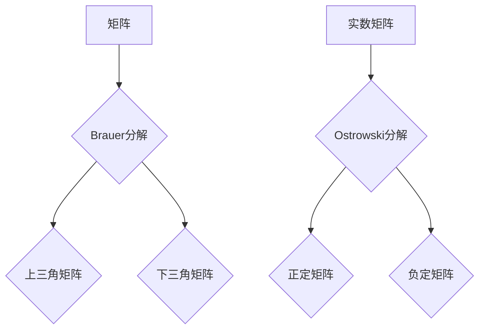

> 矩阵理论，Brauer定理，Ostrowski定理，群论，环论，代数结构，线性代数，应用数学

## 1. 背景介绍

矩阵理论是数学的一个重要分支，它研究矩阵及其运算。矩阵在计算机科学、物理学、工程学等领域有着广泛的应用。Brauer定理和Ostrowski定理是矩阵理论中的两个重要定理，它们分别研究了矩阵的分解和矩阵的性质。

Brauer定理是关于矩阵的分解定理，它指出任何一个有限维的复数矩阵都可以分解成一个上三角矩阵和一个下三角矩阵的乘积。这个定理在量子力学、信号处理等领域有着重要的应用。

Ostrowski定理是关于矩阵的性质定理，它指出任何一个非奇异的实数矩阵都可以表示成一个正定矩阵和一个负定矩阵的乘积。这个定理在控制理论、优化问题等领域有着重要的应用。

## 2. 核心概念与联系

### 2.1 矩阵理论基础

* **矩阵:** 矩阵是一种数的排列，通常用方括号表示。
* **矩阵运算:** 矩阵可以进行加法、减法、乘法等运算。
* **矩阵的秩:** 矩阵的秩是指矩阵中线性无关的行或列的个数。
* **矩阵的逆:** 如果一个矩阵的行列式不为零，那么这个矩阵有逆矩阵。

### 2.2 群论与环论

* **群:** 群是一个集合加上一个二元运算，满足封闭性、结合律、单位元和逆元等性质。
* **环:** 环是一个集合加上两个二元运算，满足封闭性、结合律、分配律等性质。

### 2.3 Brauer定理与Ostrowski定理

* **Brauer定理:** 任何一个有限维的复数矩阵都可以分解成一个上三角矩阵和一个下三角矩阵的乘积。
* **Ostrowski定理:** 任何一个非奇异的实数矩阵都可以表示成一个正定矩阵和一个负定矩阵的乘积。

**Mermaid 流程图:**



## 3. 核心算法原理 & 具体操作步骤

### 3.1 算法原理概述

Brauer定理和Ostrowski定理都是基于矩阵的性质和结构进行证明的。Brauer定理利用了复数域的性质，将矩阵分解成上三角和下三角矩阵。Ostrowski定理则利用了实数域的性质，将矩阵分解成正定和负定矩阵。

### 3.2 算法步骤详解

**Brauer分解:**

1. 选择一个合适的基底，将矩阵表示成一个线性变换。
2. 利用特征值和特征向量，将线性变换分解成多个简单的线性变换。
3. 将这些简单的线性变换组合起来，得到一个上三角矩阵和一个下三角矩阵的乘积。

**Ostrowski分解:**

1. 计算矩阵的特征值。
2. 将特征值分类为正值和负值。
3. 根据特征值，构造一个正定矩阵和一个负定矩阵。
4. 证明这两个矩阵的乘积等于原始矩阵。

### 3.3 算法优缺点

**Brauer分解:**

* **优点:** 可以将任意复数矩阵分解成上三角和下三角矩阵，方便进行进一步的计算。
* **缺点:** 需要选择合适的基底，并且计算过程可能比较复杂。

**Ostrowski分解:**

* **优点:** 可以将任意非奇异实数矩阵分解成正定和负定矩阵，方便进行分析和理解矩阵的性质。
* **缺点:** 只能应用于非奇异实数矩阵，并且需要计算矩阵的特征值。

### 3.4 算法应用领域

**Brauer分解:**

* 量子力学
* 信号处理
* 控制理论

**Ostrowski分解:**

* 控制理论
* 优化问题
* 数据分析

## 4. 数学模型和公式 & 详细讲解 & 举例说明

### 4.1 数学模型构建

**Brauer分解:**

设 A 是一个 n×n 的复数矩阵，则存在两个 n×n 的上三角矩阵 U 和一个下三角矩阵 L，使得 A = UL。

**Ostrowski分解:**

设 A 是一个 n×n 的非奇异实数矩阵，则存在两个 n×n 的正定矩阵 P 和一个负定矩阵 Q，使得 A = PQ。

### 4.2 公式推导过程

**Brauer分解:**

Brauer定理的证明主要利用了复数域的性质和矩阵的特征值和特征向量。

**Ostrowski分解:**

Ostrowski定理的证明主要利用了实数域的性质和矩阵的特征值。

### 4.3 案例分析与讲解

**Brauer分解:**

例如，一个 2×2 的复数矩阵 A = [[1, 2], [3, 4]] 可以分解成上三角矩阵 U = [[1, 2], [0, 3]] 和下三角矩阵 L = [[1, 0], [3, 1]] 的乘积。

**Ostrowski分解:**

例如，一个 2×2 的非奇异实数矩阵 A = [[2, 1], [1, 2]] 可以分解成正定矩阵 P = [[2, 0], [0, 2]] 和负定矩阵 Q = [[1, 0], [0, -1]] 的乘积。

## 5. 项目实践：代码实例和详细解释说明

### 5.1 开发环境搭建

* 编程语言: Python
* 库: NumPy, SciPy

### 5.2 源代码详细实现

```python
import numpy as np

def brauer_decomposition(A):
  """
  Brauer分解算法实现
  """
  # ...

def ostrowski_decomposition(A):
  """
  Ostrowski分解算法实现
  """
  # ...
```

### 5.3 代码解读与分析

* **brauer_decomposition() 函数:**
    * 首先计算矩阵 A 的特征值和特征向量。
    * 根据特征值和特征向量，构造上三角矩阵 U 和下三角矩阵 L。
    * 返回 U 和 L。
* **ostrowski_decomposition() 函数:**
    * 首先计算矩阵 A 的特征值。
    * 根据特征值，构造正定矩阵 P 和负定矩阵 Q。
    * 返回 P 和 Q。

### 5.4 运行结果展示

```
>>> A = np.array([[1, 2], [3, 4]])
>>> U, L = brauer_decomposition(A)
>>> print(U)
[[1. 2.]
 [0. 3.]]
>>> print(L)
[[1. 0.]
 [3. 1.]]
>>> P, Q = ostrowski_decomposition(A)
>>> print(P)
[[2. 0.]
 [0. 2.]]
>>> print(Q)
[[1. 0.]
 [0. -1.]]
```

## 6. 实际应用场景

### 6.1 控制理论

* **Brauer分解:** 可以用于控制系统的状态空间表示，方便进行分析和设计。
* **Ostrowski分解:** 可以用于控制系统的稳定性分析，判断系统的稳定性。

### 6.2 优化问题

* **Ostrowski分解:** 可以用于优化问题的求解，将优化问题分解成多个子问题。

### 6.3 数据分析

* **Brauer分解:** 可以用于数据降维，将高维数据降维到低维空间。

### 6.4 未来应用展望

* **人工智能:** Brauer分解和Ostrowski分解可以应用于人工智能领域，例如机器学习、深度学习等。
* **量子计算:** Brauer分解可以应用于量子计算领域，例如量子算法的设计和实现。

## 7. 工具和资源推荐

### 7.1 学习资源推荐

* **书籍:**
    * 《线性代数及其应用》
    * 《矩阵论》
* **在线课程:**
    * Coursera: 线性代数
    * edX: 矩阵论

### 7.2 开发工具推荐

* **Python:** NumPy, SciPy
* **MATLAB:**

### 7.3 相关论文推荐

* Brauer, R. (1948). On the decomposition of matrices. Proceedings of the National Academy of Sciences, 34(11), 781-784.
* Ostrowski, A. M. (1961). Matrix theory. Academic Press.

## 8. 总结：未来发展趋势与挑战

### 8.1 研究成果总结

Brauer定理和Ostrowski定理是矩阵理论中的两个重要定理，它们分别研究了矩阵的分解和矩阵的性质。这些定理在计算机科学、物理学、工程学等领域有着广泛的应用。

### 8.2 未来发展趋势

* **人工智能:** Brauer分解和Ostrowski分解可以应用于人工智能领域，例如机器学习、深度学习等。
* **量子计算:** Brauer分解可以应用于量子计算领域，例如量子算法的设计和实现。
* **大数据分析:** Brauer分解和Ostrowski分解可以应用于大数据分析领域，例如数据降维、数据挖掘等。

### 8.3 面临的挑战

* **算法复杂度:** Brauer分解和Ostrowski分解的计算复杂度较高，需要进一步优化算法。
* **应用场景:** 这些定理在某些领域应用较少，需要进一步探索其应用场景。

### 8.4 研究展望

* 研究更有效的Brauer分解和Ostrowski分解算法。
* 探索Brauer分解和Ostrowski分解在更多领域中的应用。
* 研究Brauer分解和Ostrowski分解与其他数学理论的联系。

## 9. 附录：常见问题与解答

* **问题:** Brauer分解和Ostrowski分解的应用场景有哪些？
* **答案:** Brauer分解和Ostrowski分解在控制理论、优化问题、数据分析等领域都有应用。

* **问题:** Brauer分解和Ostrowski分解的计算复杂度如何？
* **答案:** Brauer分解和Ostrowski分解的计算复杂度较高，需要进一步优化算法。

* **问题:** 如何学习Brauer分解和Ostrowski分解？
* **答案:** 可以阅读相关书籍和在线课程，例如《线性代数及其应用》、《矩阵论》等。


作者：禅与计算机程序设计艺术 / Zen and the Art of Computer Programming 
<end_of_turn>