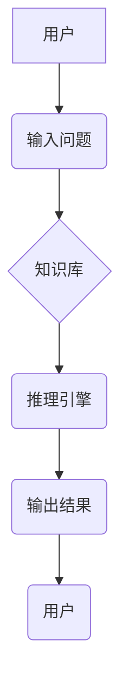

> 人工智能、机器学习、深度学习、专家系统、局限性、未来发展

## 1. 背景介绍

人工智能（Artificial Intelligence，AI）作为一项引领未来科技发展的核心领域，自诞生以来便吸引了无数学者的关注和探索。第一代人工智能，诞生于20世纪50年代至70年代，标志着人类迈出了探索智能的最初一步。这一阶段的人工智能主要集中在构建能够解决特定领域问题的专家系统上，其目标是模拟人类专家在特定领域内的知识和推理能力，并将其应用于实际问题解决。

## 2. 核心概念与联系

### 2.1 专家系统

专家系统是一种基于知识表示和推理机制的人工智能系统，旨在模拟人类专家的知识和经验，为特定领域问题提供解决方案。

**核心概念：**

* **知识库：** 存储专家系统所掌握的领域知识，通常以规则、事实或案例的形式表示。
* **推理引擎：** 负责根据知识库中的知识和用户输入，进行逻辑推理，得出结论或建议。
* **用户界面：** 提供用户与专家系统交互的平台，用于输入问题和接收结果。

**架构图：**



### 2.2 规则ベースシステム

规则ベースシステム是一种基于预先定义规则的推理系统，其核心是将知识表示为一系列规则，并通过规则匹配和应用来进行推理。

**核心概念：**

* **规则：** 以“如果-那么”的形式表示知识，描述了特定条件下应该采取的行动或结论。
* **匹配引擎：** 负责将用户输入或事件与规则进行匹配，找到符合条件的规则。
* **执行引擎：** 根据匹配到的规则，执行相应的动作或生成结论。

## 3. 核心算法原理 & 具体操作步骤

### 3.1 算法原理概述

第一代人工智能的核心算法主要包括：

* **符号逻辑推理：** 基于符号逻辑的推理规则，进行逻辑推导和知识表示。
* **规则匹配：** 将用户输入或事件与预定义规则进行匹配，找到符合条件的规则。
* **案例库检索：** 根据用户输入或问题，从案例库中检索相似案例，并利用案例知识进行推理。

### 3.2 算法步骤详解

**规则ベースシステム的推理过程：**

1. **获取用户输入：** 系统接收用户的问题或事件描述。
2. **规则匹配：** 将用户输入与知识库中的规则进行匹配，找到符合条件的规则。
3. **推理执行：** 根据匹配到的规则，执行相应的动作或生成结论。
4. **输出结果：** 将推理结果以文本或图形形式呈现给用户。

### 3.3 算法优缺点

**优点：**

* **可解释性强：** 规则清晰易懂，推理过程可追溯，易于理解和调试。
* **适用于特定领域：** 可以针对特定领域构建专门的知识库和规则，实现高精度和效率。

**缺点：**

* **知识工程成本高：** 需要大量的人工投入来构建和维护知识库和规则。
* **难以处理复杂问题：** 规则难以表达复杂的关系和逻辑，难以应对开放式问题和模糊性问题。

### 3.4 算法应用领域

* **医疗诊断：** 基于医学知识和病历信息，辅助医生进行诊断。
* **金融风险评估：** 分析客户信用信息和市场数据，评估贷款风险。
* **法律咨询：** 根据法律法规和案例，提供法律咨询和建议。

## 4. 数学模型和公式 & 详细讲解 & 举例说明

### 4.1 数学模型构建

**符号逻辑推理模型：**

* **命题逻辑：** 使用命题变量和逻辑连接符（如“与”、“或”、“非”）来表示知识。
* **谓词逻辑：** 使用谓词和量词来表示关系和集合，更灵活地表达知识。

**举例：**

* 命题逻辑：P ∧ Q (P与Q)
* 谓词逻辑：∀x (P(x) → Q(x)) (所有x，如果P(x)成立，则Q(x)成立)

### 4.2 公式推导过程

**推理规则：**

* ** Modus Ponens (MP)：** 如果 P → Q 和 P 成立，则 Q 也成立。
* ** Modus Tollens (MT)：** 如果 P → Q 和 ¬Q 成立，则 ¬P 也成立。

**举例：**

* P → Q (如果P成立，则Q成立)
* P (P成立)
* 因此，Q也成立 (Q成立)

### 4.3 案例分析与讲解

**案例：**

* 知识库：
    * 规则1：如果一个人是医生，则他/她会诊断疾病。
    * 规则2：张三是医生。
* 用户输入：张三会诊断疾病吗？

**推理过程：**

1. 匹配规则2：张三是医生。
2. 匹配规则1：如果一个人是医生，则他/她会诊断疾病。
3. 推理结果：张三会诊断疾病。

## 5. 项目实践：代码实例和详细解释说明

### 5.1 开发环境搭建

* 操作系统：Windows/Linux/macOS
* 编程语言：Python
* 工具：
    * Python 3.x
    * Jupyter Notebook

### 5.2 源代码详细实现

```python
# 规则库
rules = {
    "医生": ["诊断疾病"],
}

# 用户输入
user_input = "张三"

# 匹配规则
for role, actions in rules.items():
    if role in user_input:
        print(f"{user_input} 可以 {actions[0]}")
        break
```

### 5.3 代码解读与分析

* 规则库：存储了规则，例如“医生”可以“诊断疾病”。
* 用户输入：接收用户的输入，例如“张三”。
* 匹配规则：遍历规则库，找到与用户输入匹配的规则。
* 输出结果：根据匹配到的规则，输出相应的结论。

### 5.4 运行结果展示

```
张三 可以 诊断疾病
```

## 6. 实际应用场景

* **聊天机器人：** 基于规则匹配，实现简单的对话交互。
* **问答系统：** 根据知识库和规则，回答用户提出的问题。
* **自动化决策：** 在特定领域，根据规则和数据，自动做出决策。

### 6.4 未来应用展望

* **更智能的聊天机器人：** 利用深度学习技术，实现更自然、更智能的对话交互。
* **个性化推荐系统：** 基于用户行为和偏好，提供个性化的产品或服务推荐。
* **自动驾驶汽车：** 利用人工智能技术，实现自动驾驶功能。

## 7. 工具和资源推荐

### 7.1 学习资源推荐

* **书籍：**
    * 《人工智能：现代方法》
    * 《人工智能导论》
* **在线课程：**
    * Coursera: 人工智能
    * edX: 人工智能

### 7.2 开发工具推荐

* **Python：** 广泛应用于人工智能开发，拥有丰富的库和框架。
* **TensorFlow：** 深度学习框架，用于构建和训练神经网络模型。
* **PyTorch：** 深度学习框架，灵活易用，适合研究和开发。

### 7.3 相关论文推荐

* **《人工智能：一种新范式》**
* **《深度学习》**

## 8. 总结：未来发展趋势与挑战

### 8.1 研究成果总结

第一代人工智能取得了重要的成果，为人工智能的发展奠定了基础。

### 8.2 未来发展趋势

* **深度学习：** 利用深度神经网络，实现更强大的学习能力和泛化能力。
* **强化学习：** 通过试错学习，实现智能体在复杂环境中的自主决策。
* **迁移学习：** 利用已有的知识和经验，快速适应新的任务和领域。

### 8.3 面临的挑战

* **数据获取和处理：** 训练人工智能模型需要大量的数据，数据获取和处理是一个重要的挑战。
* **算法解释性和可解释性：** 深度学习模型的决策过程难以解释，缺乏透明度和可信度。
* **伦理和社会影响：** 人工智能的快速发展带来伦理和社会问题，需要认真思考和解决。

### 8.4 研究展望

未来人工智能研究将更加注重：

* **通用人工智能：** 构建能够像人类一样学习和解决各种问题的通用人工智能。
* **安全可靠性：** 确保人工智能系统安全可靠，避免潜在的风险和危害。
* **人机协作：** 探索人与人工智能的协作模式，实现人类和人工智能的互补和共赢。

## 9. 附录：常见问题与解答

* **什么是人工智能？** 人工智能是指模拟和扩展人类智能的计算机系统。
* **第一代人工智能的特点是什么？** 第一代人工智能主要集中在构建专家系统上，其目标是模拟人类专家的知识和推理能力。
* **第一代人工智能的局限性是什么？** 第一代人工智能难以处理复杂问题，知识工程成本高，可解释性较差。


作者：禅与计算机程序设计艺术 / Zen and the Art of Computer Programming 
<end_of_turn>