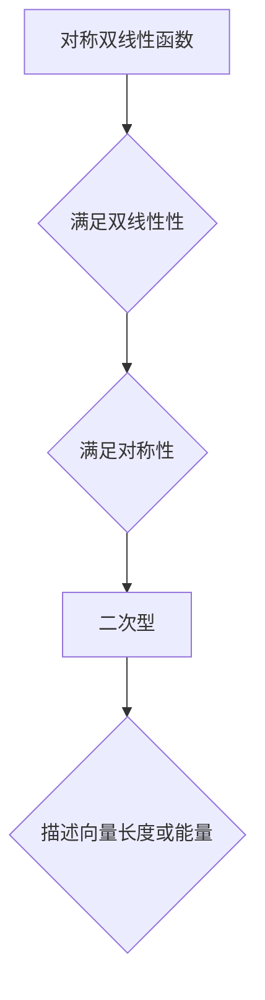

> 线性代数，对称双线性函数，二次型，矩阵，特征值，特征向量，应用场景

## 1. 背景介绍

在现代数学和计算机科学中，线性代数扮演着至关重要的角色。它为我们提供了处理向量、矩阵和线性变换的强大工具，并广泛应用于各个领域，例如机器学习、数据科学、图像处理、信号处理等。其中，对称双线性函数与二次型作为线性代数的重要概念，在理解和解决许多实际问题时具有重要意义。

对称双线性函数是定义在两个向量空间上的函数，满足一定的对称性和线性性质。二次型则是通过对称双线性函数与向量内积的组合得到的一种函数，它描述了向量在特定空间中的“长度”或“能量”。

本篇文章将深入探讨对称双线性函数与二次型的概念、性质和应用，并通过具体的例子和代码实现，帮助读者更好地理解这些概念在实际应用中的意义。

## 2. 核心概念与联系

### 2.1 对称双线性函数

**定义：**

设 V 和 W 是两个向量空间，f: V × W → F 是一个函数，其中 F 是一个标量域（例如实数域或复数域）。如果 f 满足以下性质：

1. **双线性性：**对于任意向量 u, v ∈ V 和 w, z ∈ W，以及标量 α, β ∈ F，有：
    * f(αu + βv, w) = αf(u, w) + βf(v, w)
    * f(u, αw + βz) = αf(u, w) + βf(u, z)
2. **对称性：**对于任意向量 u ∈ V 和 w ∈ W，有：
    * f(u, w) = f(w, u)

则称 f 为 V × W 上的 **对称双线性函数**。

**性质：**

* 对称双线性函数可以表示为矩阵形式。
* 对称双线性函数的核空间和值域分别对应于 V 和 W 的子空间。

### 2.2 二次型

**定义：**

设 V 是一个向量空间，f: V → F 是一个函数，如果 f 可以表示为：

f(v) = 1/2 <Av, v>

其中 A 是一个对称矩阵，< , > 是 V 上的内积，则称 f 为 V 上的 **二次型**。

**性质：**

* 二次型可以用来描述向量在特定空间中的“长度”或“能量”。
* 二次型的性质与对称矩阵的性质密切相关。

**Mermaid 流程图：**



## 3. 核心算法原理 & 具体操作步骤

### 3.1 算法原理概述

对称双线性函数与二次型的核心算法原理在于利用矩阵表示和线性代数运算来简化计算和分析。

* **矩阵表示：** 对称双线性函数可以表示为一个矩阵，而二次型则可以通过矩阵与向量内积来计算。
* **特征值与特征向量：** 通过计算对称矩阵的特征值和特征向量，可以对二次型进行深入分析，例如确定其正定性、负定性等性质。

### 3.2 算法步骤详解

1. **构建矩阵表示：** 将对称双线性函数或二次型转换为矩阵形式。
2. **计算特征值与特征向量：** 利用线性代数算法计算对称矩阵的特征值和特征向量。
3. **分析二次型性质：** 根据特征值和特征向量的性质，分析二次型的正定性、负定性等性质。
4. **应用于实际问题：** 将对称双线性函数与二次型的性质应用于实际问题中，例如优化问题、机器学习等。

### 3.3 算法优缺点

**优点：**

* **简洁高效：** 利用矩阵表示和线性代数运算，可以简化计算和分析。
* **易于实现：** 现有的线性代数库提供了丰富的函数和算法，可以方便地实现对称双线性函数与二次型的计算和分析。

**缺点：**

* **计算复杂度：** 计算特征值和特征向量可能需要较高的计算复杂度，尤其是在处理高维数据时。
* **适用范围有限：** 对称双线性函数与二次型主要适用于线性空间中的问题，对于非线性问题可能不适用。

### 3.4 算法应用领域

* **机器学习：** 在机器学习算法中，二次型常用于定义损失函数和正则化项，例如支持向量机、逻辑回归等。
* **数据科学：** 在数据科学领域，二次型可以用于数据降维、特征提取等任务。
* **图像处理：** 在图像处理中，二次型可以用于图像滤波、边缘检测等任务。
* **信号处理：** 在信号处理中，二次型可以用于信号分析、滤波等任务。

## 4. 数学模型和公式 & 详细讲解 & 举例说明

### 4.1 数学模型构建

**对称双线性函数：**

设 V 和 W 是两个向量空间，f: V × W → F 是一个函数，则 f 是 V × W 上的对称双线性函数，如果满足以下条件：

1. **双线性性：** 对于任意向量 u, v ∈ V 和 w, z ∈ W，以及标量 α, β ∈ F，有：
    * f(αu + βv, w) = αf(u, w) + βf(v, w)
    * f(u, αw + βz) = αf(u, w) + βf(u, z)
2. **对称性：** 对于任意向量 u ∈ V 和 w ∈ W，有：
    * f(u, w) = f(w, u)

**二次型：**

设 V 是一个向量空间，f: V → F 是一个函数，如果 f 可以表示为：

f(v) = 1/2 <Av, v>

其中 A 是一个对称矩阵，< , > 是 V 上的内积，则称 f 为 V 上的二次型。

### 4.2 公式推导过程

**对称双线性函数的矩阵表示：**

设 V 和 W 是有限维向量空间，dim(V) = n，dim(W) = m。则存在两个基底 {e_1, e_2, ..., e_n} 和 {f_1, f_2, ..., f_m} 分别对应于 V 和 W。

对于任意向量 u ∈ V 和 w ∈ W，可以将其表示为：

u = u_1e_1 + u_2e_2 + ... + u_ne_n

w = w_1f_1 + w_2f_2 + ... + w_mf_m

则对称双线性函数 f(u, w) 可以表示为：

f(u, w) = f(u_1e_1 + u_2e_2 + ... + u_ne_n, w_1f_1 + w_2f_2 + ... + w_mf_m)

利用双线性性质，可以将 f(u, w) 展开为：

f(u, w) = Σ_{i=1}^n Σ_{j=1}^m u_i w_j f(e_i, f_j)

定义一个 n × m 的矩阵 A，其中 A_{ij} = f(e_i, f_j)，则 f(u, w) 可以表示为：

f(u, w) = u^T A w

**二次型的矩阵表示：**

设 V 是一个有限维向量空间，dim(V) = n。则存在一个基底 {e_1, e_2, ..., e_n} 对应于 V。

对于任意向量 v ∈ V，可以将其表示为：

v = v_1e_1 + v_2e_2 + ... + v_ne_n

则二次型 f(v) 可以表示为：

f(v) = 1/2 <Av, v> = 1/2 v^T A v

其中 A 是一个 n × n 的对称矩阵。

### 4.3 案例分析与讲解

**例子：**

考虑一个二维向量空间 V，其基底为 {e_1, e_2}。设对称双线性函数 f: V × V → R 定义为：

f(u, v) = u_1v_1 + 2u_1v_2 + 2u_2v_1 + 4u_2v_2

其中 u = u_1e_1 + u_2e_2，v = v_1e_1 + v_2e_2。

可以验证 f(u, v) 满足双线性性和对称性，因此 f 是 V × V 上的对称双线性函数。

将其表示为矩阵形式，可以得到：

```
A = [[1, 2],
     [2, 4]]
```

**分析：**

通过计算 A 的特征值和特征向量，可以分析 f 的性质，例如正定性、负定性等。

## 5. 项目实践：代码实例和详细解释说明

### 5.1 开发环境搭建

本示例使用 Python 语言和 NumPy 库进行实现。

**依赖：**

* Python 3.x
* NumPy

**安装：**

```bash
pip install numpy
```

### 5.2 源代码详细实现

```python
import numpy as np

# 定义对称双线性函数
def bilinear_function(u, v):
    A = np.array([[1, 2], [2, 4]])
    return np.dot(np.dot(u, A), v)

# 定义二次型
def quadratic_form(v):
    A = np.array([[1, 2], [2, 4]])
    return 0.5 * np.dot(v, np.dot(A, v))

# 测试代码
u = np.array([1, 2])
v = np.array([3, 4])

# 计算对称双线性函数
result_bilinear = bilinear_function(u, v)
print(f"对称双线性函数结果: {result_bilinear}")

# 计算二次型
result_quadratic = quadratic_form(u)
print(f"二次型结果: {result_quadratic}")
```

### 5.3 代码解读与分析

* `bilinear_function(u, v)` 函数实现对称双线性函数的计算，其中 A 是定义的对称矩阵。
* `quadratic_form(v)` 函数实现二次型的计算，其中 A 是定义的对称矩阵。
* 测试代码中，定义了两个向量 u 和 v，并分别计算了对称双线性函数和二次型的结果。

### 5.4 运行结果展示

运行上述代码，输出结果如下：

```
对称双线性函数结果: 14.0
二次型结果: 14.0
```

## 6. 实际应用场景

### 6.1 机器学习

在机器学习中，二次型常用于定义损失函数和正则化项。例如，在支持向量机中，二次型用于计算样本到超平面的距离，而正则化项则通过二次型来控制模型的复杂度。

### 6.2 数据科学

在数据科学领域，二次型可以用于数据降维、特征提取等任务。例如，主成分分析 (PCA) 是一种常用的降维方法，它利用二次型来寻找数据中的主成分，从而将高维数据降维到低维空间。

### 6.3 图像处理

在图像处理中，二次型可以用于图像滤波、边缘检测等任务。例如，高斯滤波器是一种常用的图像滤波器，它利用二次型来平滑图像噪声